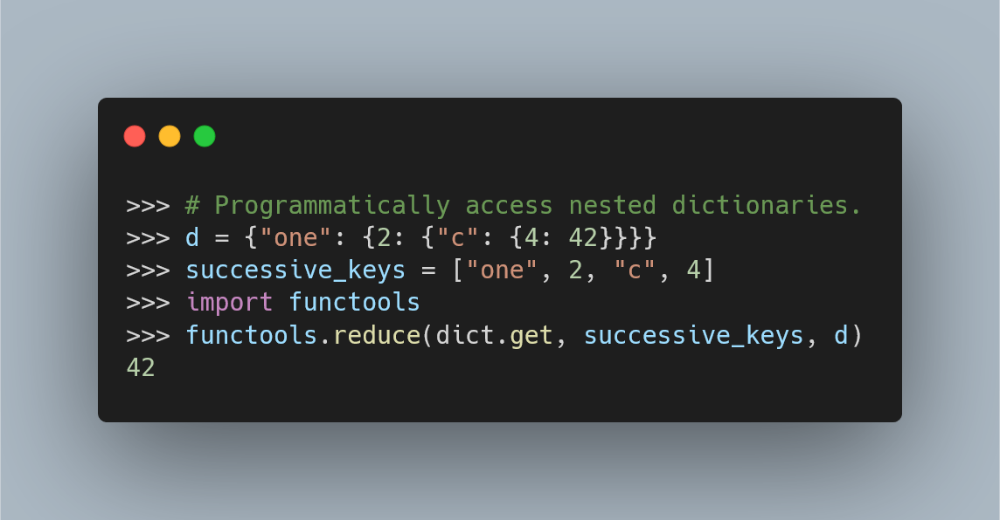

---
metadata:
    description: "Neste Pydon't debruçamo-nos sobre a função `reduce`, que já fez parte dos built-ins da linguagem e que com a versão 3 foi movido para a biblioteca `functools`."
show_call_to_action: false
title: " | Pydon't"
---

Neste Pydon't debruçamo-nos sobre a função `reduce`,
que já fez parte dos built-ins da linguagem e que,
com a versão 3, foi movido para a biblioteca `functools`.

===

(Se és novo aqui e não sabes o que é uma Pydon't, então talvez queiras começar por
ler a [Proclamação das Pydon'ts][manifesto].)

Infelizmente, para poupar algum tempo, ainda não traduzi este artigo para português...
Hei de o fazer eventualmente...
Se quiseres, deixa um comentário em baixo a pedir que eu traduza o artigo ASAP ou [submete um PR][pr] com a tua tradução.

[pr]: https://github.com/mathspp/mathspp/blob/master/pages/02.blog/04.pydonts/the-power-of-reduce/item.pt.md
[subscribe]: https://mathspp.com/subscribe
[manifesto]: /blog/pydonts/pydont-manifesto
