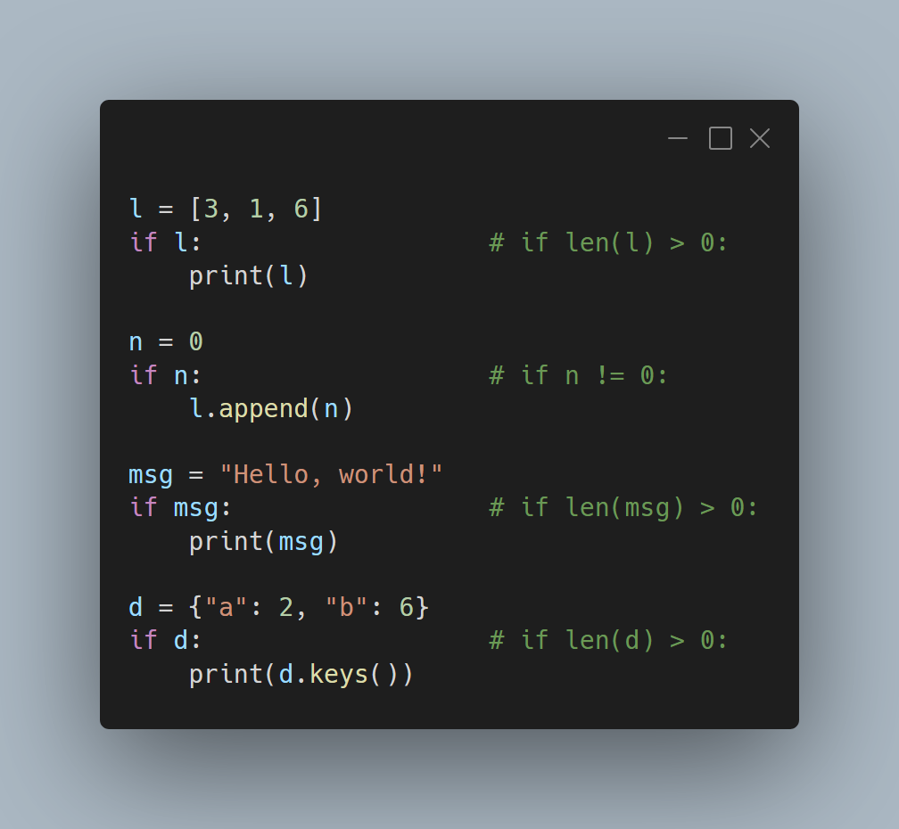

---
metadata:
    description: "Aprende o que é que em Python são os valores 'Truthy' e 'Falsy'."
title: "Truthy, Falsy e bool | Pydon't"
---

Todos os objetos em Python podem ser usados em expressões que deviam
resultar em valores Booleanos, tais como as condições de instruções
`if` ou `while`.
Há vários objetos que são Falsy (ou seja, que são interpretados
como `False`) quando estão “vazios” ou quando “não têm valor”,
e caso contrário são Truthy (interpretados como `True`).
Também podes definir este comportamento para os teus objetos
se implementares o método dunder `__bool__`.

===



(Se és novo aqui e não sabes o que é uma Pydon't, então talvez queiras começar por
ler a [Proclamação das Pydon'ts][manifesto].)


# “Truthy” e “Falsy”

Citando a documentação do Python (em inglês :/),

 > “Any object can be tested for truth value, for use in an if or while condition or as operand of the Boolean operations below [`or`, `and` and `not`].”

que se traduz mais ou menos como

 > “Qualquer objeto pode ser testado como um valor lógico, para ser
usado numa condição de um if ou while, ou como operando das operações
Booleanas em baixo [`or`, `and` e `not`].”

O que é que isto quer dizer?
Isto quer dizer que qualquer objeto em Python pode ser usado quando
esperamos um Booleano.
Os valores Booleanos (`True` e `False`) são usados em condições,
que aparecem quando usamos instruções `if` e `while`, be como nas
expressões que fazem uso dos operadores Booleanos `or`, `and` e `not`.

A título de exemplo, considera a seguinte sessão
retirada do meu REPL de Python:

```py
>>> if True:
...     print("Hello, World!")
...
Hello, World!
>>> if False:
...     print("Go away!")
...
>>>
```

Os resultados da sessão em cima não te deviam surpreender, já que
isto é Python básico:
um par de `if`s que usam valores Booleanos nas suas condições.
O nível de complexidade seguinte está em usar expressões cujo
resultado dá um valor Booleano:

```py
>>> 5 > 3
True
>>> if 5 > 3:
...     print("Hello, World!")
... 
Hello, World!
```

O *próximo* nível de complexidade está em usar um objeto que **não**
é um valor Booleano, que é o tema deste artigo:

```py
>>> l = [1, 2, 3]
>>> if l:
...     print(l)
... 
[1, 2, 3]
```

*Isto* é que talvez te surpreenda, se nunca tiveres encontrado
este tipo de código.
A razão pela qual este `if` está a ser executado é porque a lista
`[1, 2, 3]` é *Truthy* em Python, ou seja, a lista `[1, 2, 3]` pode
ser interpretada como `True` num contexto em que o Python precisava
de um valor Booleano.
Como é que podes saber que a lista vai ser interpretada como `True`?
A maneira mais simples é através da função `bool` que converte
qualquer objeto no Booleano respetivo:

```py
>>> bool(l)
True
```

O modo como isto funciona é bastante simples.
Há um par de regras que estabelecem que objetos são interpretados
como `True` e quais são interpretados como `False`, mas eu geralmente
penso neste assunto com uma heurística que também é simples:

 > “Um valor de um certo tipo de dados é Falsy quando está “vazio”
ou quando “não tem um valor útil”.”

Alguns exemplos de objetos que vêm com o Python por defeito e que
são Falsy incluem a lista vazia, o conjunto vazio, o tuplo vazio,
o dicionário vazio, o número `0`, `None` e a string vazia.
Por exemplo:

```py
>>> bool([])
False
>>> bool("")
False
```

Claro que “não tem um valor útil” depende do que se tenciona fazer
com o valor que temos em mãos, portanto eu tenho mesmo de partilhar
as regras objetivas contigo à mesma:

 - Por defeito, qualquer objeto é Truthy (ou seja, qualquer objeto
é interpretado como `True` por defeito).
 - Um objeto é Falsy (ou seja, é interpretado como `False`) se
chamar a função `len` com esse objeto como argumento devolver `0`.

Repara que a regra anterior nos diz que, em geral, tipos que são
contentores ou sequências (os tipos com os quais costuma fazer
sentido usar a função `len`) são Falsy quando estão vazios, i.e.,
quando o seu comprimento é zero.
Mas há um outro caso em que um objeto é Falsy:

# O método dunder `__bool__`

 - Um objeto é Falsy (ou seja, é interpretado como `False`) se
a função `__bool__` estiver definida e devolver `False`.

`__bool__` é um método *dunder* (do inglês, underscore duplo) que
podes usar para especificar se os teus objetos são Truthy ou Falsy
em contextos Booleanos, se o implementares nas tuas classes.
(Já falei um pouco de métodos dunder [noutro artigo][str-and-repr-pydont].)

! Se não estás confortável com os métodos dunder de Python,
! então talvez queiras [subscrever][subscribe] a newsletter, eu vou escrever mais
! sobre o assunto em breve.
! Até lá, talvez queiras [espreitar a documentação de Python](https://docs.python.org/3/reference/datamodel.html#data-model).

Aqui está um exemplo simples que mostra que um objeto é Truthy
por defeito:

```py
>>> class A:  
...     pass
... 
>>> a = A()
>>> if a:
...     print("Hello, World!")
... 
Hello, World!
```

Na ponta oposta do espetro, podemos definir um objeto que é sempre
Falsy:

```py
>>> class A:
...     def __bool__(self):
...             return False
...
>>> a = A()
>>> if a:
...     print("Go away!")
...
```

Em geral, o teu contexto será tal que o teu objeto há de ser Truthy
em certos casos e Falsy noutros.

Finalmente, é muito importante saberes por que ordem é que Python
aplica as suas regras para determinar se um objeto é Truthy ou Falsy!

! Dado um objeto arbitrário de Python que está a ser usado num
contexto Booleano, Python primeiro tenta usar a função `bool` nesse
objeto, numa tentativa de aceder ao seu método dunder `__bool__`.
! Se `__bool__` não estiver implementado, então Python tenta usar
a função `len` no objeto.
! Se isso também falhar, então Python toma o valor como sendo Truthy
por defeito.


# Notas

Vou partilhar agora um par de comentários breves sobre o funcionamento
destes valores Truthy e Falsy.

## Comentário sobre contentores com objetos que são Falsy

Tal como eu disse há pouco, objetos como a lista vazia, o zero
e o dicionário vazio são Falsy.
No entanto, objetos como uma lista de zeros ou um dicionário cujas
chaves e valores são zeros e listas vazias não são Falsy, porque
os contentores em si não estão vazios:

```py
>>> bool([])
False
>>> bool({})
False
>>> bool(0)
False
>>> bool([0, 0, 0]) # A list with zeroes is not an empty list.
True
>>> bool({0: []})   # A dict with a 0 key is not an empty dict.
True
```


## Um comentário sobre `None`

Tal como mencionei mais em cima, `None` é Falsy:

```py
>>> bool(None)
False
>>> if None:
...     print("Go away!")
...
```

O facto de nada ter sido impresso na consola bate certo com o facto
de que `None` é Falsy.

Imagina agora que tinhas de usar, no teu código, a seguinte função
que devolve a parte inteira da raíz quadrada do número que lhe
deres, e que devolve `None` se o número for negativo (porque
os números negativos não têm raíz quadrada no sentido usual):

```py
import math
def int_square_root(n):
    if n < 0:
        return None
    return math.floor(math.sqrt(n))
```

Quando usas a função, sabes que a função devolve `None` se algo
correr “mal”, e então decides usar o teu conhecimento adquirido
recentemente!
Vais tentar usar o valor Falsy de `None` para verificar se a função
funcionou bem ou não:

```py
n = int(input("Compute the integer square root of what? >> "))
int_sqrt = int_square_root(n)
if not int_sqrt:
    print("Negative numbers do not have an integer square root.")
```

Agora, o que é que acontece se `n` for `0` ou `0.5`?

```py
>>> n = 0.5
>>> int_sqrt = int_square_root(n)
>>> if not int_sqrt:
...     print("Negative numbers do not have an integer square root.")
... 
Negative numbers do not have an integer square root
```

A mensagem está errada! `0.5` é positivo!
Repara no valor de `int_sqrt`:

```py
>>> int_sqrt
0
```

O problema é que o valor devolvido pela função `int_square_root`
é relevante (na medida em que a função conseguiu fazer o cálculo
e não devolveu `None`), mas o valor devolvido pela função também
é Falsy.
Quando queres ver se uma função devolveu `None` ou não,
o melhor é verificares *explicitamente* se o valor devolvido é `None`
ou não:

```py
# Use                       # Avoid
if returned is None:        # if not returned:
    # ...                   #     # ...
if returned is not None:    # if returned:
    # ...                   #     # ...
```

Esta recomendação vai ajudar-te a evitar problemas como o que vimos
ainda agora.


# Exemplos em código

Agora vou mostrar alguns exemplos de situações em que usar os
valores Truthy e Falsy dos objetos de Python ajuda a escrever
código Python mais elegante.

## Ponto 2D

Vamos implementar uma classe simples que represente um ponto
num plano bidimensional (que pode ser uma imagem, um mapa, ...).
Se recuperarmos o que já fizemos [no artigo sobre os métodos
`__str__` e `__repr__`][str-and-repr-pydont], podemos adicionar
o método `__bool__` para que a origem (o ponto `Point2D(0, 0)`) seja
Falsy e todos os outros sejam Truthy:

```py
# Retrieved from https://mathspp.com/blog/pydonts/pydont-confuse-str-and-repr
class Point2D:
    """A class to represent points in a 2D space."""

    def __init__(self, x, y):
        self.x = x
        self.y = y

    def __str__(self):
        """Provide a good-looking representation of the object."""
        return f"({self.x}, {self.y})"

    def __repr__(self):
        """Provide an unambiguous way of rebuilding this object."""
        return f"Point2D({repr(self.x)}, {repr(self.y)})"

    def __bool__(self):
        """The origin is Falsy and all other points are Truthy."""
        return self.x or self.y

print(bool(Point2D(0, 1))) # True
print(bool(Point2D(0, 0))) # False
print(bool(Point2D(1, 0))) # True
print(bool(Point2D(4, 2))) # True
```

Repara que definimos o valor de Truthy/Falsy de um `Point2D` à custa
do valor de Truthy/Falsy das componentes `x` e `y` do objeto em si.
Queremos que um `Point2D` seja Falsy quando `self.x` é `0` e quando
`self.y` é `0`, logo um `Point2D` vai ser Truthy se `self.x` for
Truthy ou se `self.y` for Truthy: `self.x` e `self.y` são Truthy
quando são diferentes de `0`!

## Lidar com códigos de erro ou mensagens de erro

É muito comum verem-se funções que devolvem “códigos de erro”:
números inteiros que especificam o tipo de problema que uma função
pode ter encontrado enquanto corria, ou então a função pode devolver
uma string com uma eventual mensagem de erro.
Quando se usam estes códigos, geralmente o `0` e a string vazia `""`
indicam que não houve problema nenhum.

Quando usas uma destas funções, podes usar o valor Truthy das
strings ou dos inteiros para verificar se houve algum problema,
para que possas tomar a ação necessária.

O padrão genérico que estou a descrever é o seguinte:

```py
return_value, error_code = some_nice_function()
if error_code:
    # Something went wrong, act accordingly.

# Alternatively, something like:
return_value, error_msg = some_other_nice_function()
if error_msg:
    print(error_msg)
    # Something went wrong, act accordingly.
```

## Processar dados

Também é muito comum usar os valores de Truthy e Falsy para ver
se há dados que precisam de ser processados.

Por exemplo, [quando falei do operador morsa `:=`][walrus-pydont],
vimos um ciclo `while` semelhante a este:

```py
input_lines = []
while (s := input()):
    input_lines.append(s)
# No more lines to read.
print(len(input_lines))
```

O que este ciclo `while` faz é juntar linhas à lista `input_lines`
*enquanto* as linhas tiverem conteúdo (enquanto não forem a string
vazia `""`).
Assim que o utilizador insere dá como input a linha vazia,
o ciclo pára e o código imprime o número de linhas lidas:

```py
>>> input_lines = []
>>> while (s := input()):
...     input_lines.append(s)
... 
Line 1
Line 2

>>> print(len(input_lines))
2
```

Outro padrão comum surge quando temos uma lista que contém
dados para serem processados, e a lista com os dados é alterada
durante o processamento desses mesmos dados.

Repara no exemplo seguinte, que atravessa um diretório de ficheiros,
imprimindo o tamanho que cada ficheiro ocupa, e navegando
recursivamente para os subdiretórios encontrados:

```py
import pathlib

def print_file_sizes(dir):
    """Print file sizes in a directory, recursing into subdirectories."""

    paths_to_process = [dir]
    while paths_to_process:
        path, *paths_to_process = paths_to_process
        path_obj = pathlib.Path(path)
        if path_obj.is_file():
            print(path, path_obj.stat().st_size)
        else:
            paths_to_process += path_obj.glob("*")
```

Esta não é necessariamente a melhor maneira de resolver esta
tarefa em particular, *mas* repara que o ciclo `while`, que
controla todo o processo, só termina quando a lista fica vazia,
e repara que o `if: ... else: ...` que encontras no corpo da função,
ou imprime alguma coisa, ou aumenta a lista.

# Conclusões

 - Os valores de Truthy e Falsy em Python podem ser usados para
escrever condições de uma forma mais legível e elegante.
 - Podes implementar este tipo de comportamento nas tuas classes
se implementares o método dunder `__bool__`.
 - Deves ter cuidado ao usar o valor de Falsy de `None`, especialmente
se o que quiseres mesmo fazer é verificar se alguma variável é
`None` ou não.

Não te esqueças de deixar uma reação a este artigo se gostaste desta Pydon't e
partilha-a com amigos e outros colegas que programem em Python.

Já agora, [subscreve a newsletter][subscribe] para teres a certeza que não te escapa
nem uma única Pydon't!

# Referências (em inglês)

 - Python 3 Documentation, The Python Language Reference, Data model, __bool__, [https://docs.python.org/3/reference/datamodel.html#object.__bool__](https://docs.python.org/3/reference/datamodel.html#object.__bool__).
 - Python 3 Documentation, The Python Standard Library, Truth Value Testing, [https://docs.python.org/3/library/stdtypes.html#truth-value-testing](https://docs.python.org/3/library/stdtypes.html#truth-value-testing).
 - Python 3 Documentation, The Python Standard Library, Built-in Functions, `bool`, [https://docs.python.org/3/library/functions.html#bool](https://docs.python.org/3/library/functions.html#bool).
 - PEP 8 -- Style Guide for Python Code, [https://www.python.org/dev/peps/pep-0008/][pep8].
 - Python 3 Documentation, The Python Standard Library, File and Directory Access, `pathlib`, [https://docs.python.org/3/library/pathlib.html](https://docs.python.org/3/library/pathlib.html).
 - Stack Overflow, Listing of all files in directory?, [https://stackoverflow.com/a/40216619/2828287](https://stackoverflow.com/a/40216619/2828287).
 - Stack Overflow, How can I check file size in Python?, [https://stackoverflow.com/a/2104107/2828287](https://stackoverflow.com/a/2104107/2828287).
 - freeCodeCamp, Truthy and Falsy Values in Python: A Detailed Introduction, [https://www.freecodecamp.org/news/truthy-and-falsy-values-in-python/](https://www.freecodecamp.org/news/truthy-and-falsy-values-in-python/).

Consultadas pela última vez a 9 de fevereiro de 2021.

[subscribe]: https://mathspp.com/subscribe
[pep8]: https://www.python.org/dev/peps/pep-0008/
[manifesto]: /blog/pydonts/pydont-manifesto
[str-and-repr-pydont]: /blog/pydonts/pydont-confuse-str-and-repr
[walrus-pydont]: /blog/pydonts/pydont-abuse-the-walrus-operator
