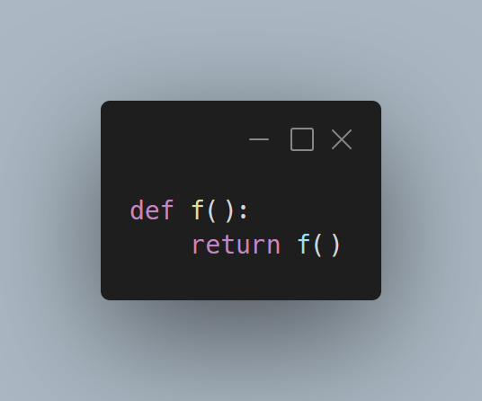

---
metadata:
    description: "Recursão pode ser um conceito muito poderoso, mas nesta Pydon't vamos falar sobre coisas com as quais temos de ter cuidado."
title: "Cuidado com a recursão | Pydon't"
---

Recursão é uma técnica que é útil para qualquer programador,
mas isso não significa que deves estar sempre a user recursão
quando escreves código Python.
Às vezes é melhor reescrever a recursão com ciclos,
ou às vezes até repensar a tua solução por completo.

===



(Se és novo aqui e não sabes o que é uma Pydon't, então talvez queiras começar por
ler a [Proclamação das Pydon'ts][manifesto].)

# Introdução

Nesta Pydon't vou escrever um pouco sobre quando e porque é que a recursão
pode não ser a melhor estratégia para resolver um determinado problema.
Esta discussão vai recair sobre algumas particularidades de Python,
mas também vai tocar aspetos transversais à maioria das linguagens de programação.
Depois desta breve discussão, vou mostrar alguns exemplos de código recursivo
em Python e versões não-recursivas desse mesmo código.

Apesar do objetivo desta Pydon't, há que salientar que o meu objetivo *não é*
que deixes de gostar de recursão ou que passes a achar que recursão não presta.
Pessoalmente, eu gosto *bastante* de recursão e acho que é um conceito muito elegante.


# Cuidado com a recursão

Agora que já sabes o objetivo desta Pydon't,
vou começar por listar algumas situações que fazem com que recursão possa não
ser a melhor ferramenta para concluir certos trabalhos.

## `RecursionError`

A primeira coisa que vamos discutir é o famoso limite de recursão que Python tem.

Se não fazes ideia do que é que estou a falar, então,
 - ou nunca escreveste uma função recursiva na vida, ou
 - és mesmo, *mesmo* bom programador e nunca fizeste um erro na definição das tuas
funções recursivas.

O limite de recursão é algo que faz com que o teu código gere um erro
`RecursionError` se fizeres demasiadas chamadas recursivas no teu código.
Para veres do que falo, basta replicares esta sessão interativa:

```py
>>> def f():
...     return f()
...
>>> f()
Traceback (most recent call last):
  File "<stdin>", line 1, in <module>
  File "<stdin>", line 2, in f
  File "<stdin>", line 2, in f
  File "<stdin>", line 2, in f
  [Previous line repeated 996 more times]
RecursionError: maximum recursion depth exceeded
>>>
```

Na maioria dos casos, este limite *ajuda-te*, porque é útil para controlar
funções recursivas para as quais o caso base foi mal definido.

No entanto, há situações em que o limite de $1000$ chamadas recursivas não é
suficiente para terminares a execução de uma função que não tem erros.
O exemplo clássico é o da definição recursiva de fatorial:

```py
>>> def fact(n):
...     if n == 0:
...             return 1
...     return n*fact(n-1)
... 
>>> fact(10) 
3628800
>>> fact(2000)
Traceback (most recent call last):
  File "<stdin>", line 1, in <module>
  File "<stdin>", line 5, in fact
  File "<stdin>", line 5, in fact
  File "<stdin>", line 5, in fact
  [Previous line repeated 995 more times]
  File "<stdin>", line 2, in fact
RecursionError: maximum recursion depth exceeded in comparison
```

A função está bem definida mas, mesmo assim, não conseguimos calcular o fatorial
de $2000$ porque isso precisaria de demasiadas chamadas recursivas.

Se tiver mesmo de ser, uma coisa que podes fazer é aumentar o limite:

```py
>>> import sys
>>> sys.setrecursionlimit(3000) 
>>> fact(2000)
33162... # (omitted for brevity)
>>> sys.getrecursionlimit()
3000
```

Mas sugiro que tenhas cuidado com isso.
Eu nunca tentei, mas não deve ser muito engraçado fazer com que o Python consuma
a memória toda do teu computador porque fizeste um número obsceno de chamadas
recursivas.

Assim, se te parece que a tua função recursiva vai estar sempre a tentar exceder o
limite de chamadas recursivas imposto pelo Python, talvez seja boa ideia considerares
outro método para resolveres o problema.

## Falta de otimização das chamadas recursivas de cauda

(Por “recursão de cauda” refiro-me a “tail recursion”, que me parece ser o termo
usado em Português, pelo que consegui aferir depois de uma pesquisa no Google.)

Em algumas linguagens de programação, a função fatorial de há pouco pode ser alterada
-- por forma a fazer recursão de cauda -- de tal modo que conseguíamos poupar memória:
chamadas de causa ocorrem quando a chamada recursiva é a *última* coisa que fazes dentro
da função, o que significa mais ou menos que não vai ser necessário guardar qualquer
tipo de informação sobre o contexto em que estamos quando fazemos recursão.

No exemplo em cima, depois de fazer a recursão com `fact(n-1)` ainda temos de fazer
uma multiplicação antes de devolvermos o resultado da função.
Se reescrevermos a função de modo a que o cálculo parcial do fatorial seja transportado
ao longo das chamadas recursivas, então podemos escrever uma versão do fatorial que
faça chamadas recursivas de cauda:

```py
>>> def fact(n, partial=1):
...     if n <= 1:
...             return partial
...     return fact(n-1, n*partial)
... 
>>> fact(10)
3628800
```

Como podes ver, a última coisa que se faz dentro da função `fact` é a chamada recursiva
para `fact`, logo Python poderia “esquecer tudo sobre o que o rodeia” quando faz a
chamada recursiva, e poupar memória no processo, pelo menos em teoria.

Na prática, Python não faz isto *propositadamente*.
Se quiseres perceber porquê, podes ler os dois artigos (em inglês) do blogue
[Neopythonic] do Guido van Rossum, cujos links estão nas referências deste artigo.

Converter uma função recursiva numa função recursiva que faz recursão de cauda nem
sempre é trivial e é um exercício bastante engraçado.
No entanto, fazê-lo não garante que ganhas alguma coisa com isso.
*Ainda assim*, é muito fácil pegar numa função recursiva de cauda e reescrevê-la sem
recursão nenhuma, tal como te vou mostrar [na secção dos exemplos](#mais-recursão-de-cauda).

## Sobreposição de chamadas recursivas

Outro aspeto a ter em consideração quando estás a pensar escrever uma solução
recursiva para um problema é:
será que as chamadas recursivas se vão sobrepor umas às outras?

Se a função recursiva faz várias chamadas recursivas *e* se essas chamadas recursivas
se sobrepuserem, na medida em que a função recursiva é chamada várias vezes com os
mesmos argumentos, então poderás estar a desperdiçar bastantes recursos
computacionais ao calculares repetidamente as mesmas coisas.
Geralmente, isto consegue ser controlado com alguma facilidade, mas só porque um
problema *provavelmente* tem uma solução fácil, não quer dizer que o possas ignorar.

Um exemplo clássico de uma função recursiva que calcula a mesma coisa várias vezes
é o da sequência de Fibonacci:

```py
def fibonacci(n):
    if n <= 1:
        return n
    return fibonacci(n-1) + fibonacci(n-2)
```

Uma pequena modificação permite-nos descobrir quantas vezes é que esta função foi
chamada recursivamente:

```py
call_count = 0
def fibonacci(n):
    global call_count
    call_count += 1
    if n <= 1:
        return n
    return fibonacci(n-1) + fibonacci(n-2)

print(fibonacci(10))
print(call_count)   # 177
```

Se a tua função for complicada/complexa, então o tempo que desperdiças em cálculos
repetidos pode ser demasiado grande.


## Busca em profundidade versus busca em largura

Outra distinção a ter em conta quando escreves uma função recursiva é que as soluções
puramente recursivas tendem a ser de uma natureza semelhante às dos algoritmos de busca
em profundidade, ao passo que o teu problema pode ser tal que uma solução que funcione
em largura seja melhor.

Esta distinção pode não ser muito importante, mas mostra que, por vezes, uma solução
recursiva pode ser muito fácil de conceber e, ao mesmo tempo, uma maneira má de resolver
o problema em questão.

Eu deparei-me com um exemplo muito bom disto quando
[tentei resolver a charada dos baldes de água][water-buckets]:
queria escrever código que resolvesse (uma versão mais geral d') o problema em que
temos um balde com capacidade para `A` litros e outro com capacidade para `B` litros,
e depois temos de mover a água de um balde para o outro até um dos baldes ter exatamente
`T` litros de água.
É muito fácil conceber uma solução que é naturalmente recursiva, mas cuja implementação
fica bastante melhor com um ciclo `while` e um algoritmo de pesquisa em largura.

Não sei se sabes o que isto significa, mas se não souberes, a melhor coisa a fazer é
pesquisar na Internet.
Por exemplo, podes querer ler as páginas da Wikipédia sobre
[pesquisa em profundidade](https://pt.wikipedia.org/wiki/Busca_em_profundidade) e
[pesquisa em largura](https://pt.wikipedia.org/wiki/Busca_em_largura).
Numa só frase pouco formal, pesquisa em profundidade significa que, quando atravessamos
uma estrutura, priviligiamos a exploração pelos últimos níveis (os mais “profundos”),
e só depois os níveis iniciais (os mais “superficiais”), ao passo que numa pesquisa
em largura começamos por explorar o que nos rodeia, e só depois é que nos aventuramos
nos níveis mais profundos.


# Exemplos em código

Agora vou mostrar exemplos de funções recursivas que podem revelar alguns dos problemas
mencionados anteriormente.
Também vou mostrar versões não recursivas dessas mesmas funções e que resolvem os
problemas que a recursão podia ter.

## Fatoriais

O exemplo do fatorial é um excelente exemplo porque pode ser reescrito de muitas
maneiras diferentes, e as ideias exploradas nessas implementações podem ser adaptadas
para funções recursivas mais complexas.

A principal característica da versão recursiva do fatorial é que é uma recursão
“linear”, em que a função faz sempre uma única chamada recursiva e em que a diferença
entre chamadas recursivas é constante.

Podemos começar com a versão recursiva mais simples:

```py
def factorial(n):
    if n <= 1:
        return 1
    return n * factorial(n-1)
```

Tal como já vimos no início, esta função pode usar um valor auxiliar para guardar
o cálculo parcial do fatorial, para que a função possa ser reescrita com
recursão de cauda:

```py
def factorial(n, partial=1):
    if n <= 1:
        return partial
    return factorial(n-1, n*partial)
```

Agora que esta função faz recursão de cauda, podemos reescrevê-la e remover a
recursão, se seguirmos uma receita simples:

```py
def factorial(n):
    partial = 1
    while n > 1:
        n, partial = n-1, n*partial
    return partial
```

Esta transformação é bastante genérica e pode ser usada para reescrever qualquer
função recursiva de cauda como uma função imperativa.
Podes encontrar mais exemplos [já de seguida](#mais-recursão-de-cauda).

Ainda no exemplo do fatorial, o facto de termos em mãos uma recursão linear
faz com que seja bastante simples de arranjar outras implementações razoáveis.
Vou partilhar apenas algumas (e vamos, obviamente, fingir que `math.factorial`
não existe).

```py
import math
def factorial(n):
    return math.prod(i for i in range(1, n+1))

import functools, operator
def factorial(n):
    return functools.reduce(operator.mul, [i for i in range(1, n+1)])

def factorial(n):
    fact = 1
    for i in range(1, n+1):
        fact *= i
    return fact
```

Se estiveres a resolver um problema e tiveres ideias para várias soluções diferentes,
não tenhas medo de as experimentar.

## Mais recursão de cauda

Agora vou partilhar um par de exemplos de funções recursivas.
Depois vou reescrevê-las para usarem recursão de cauda e depois vou mostrar
a transformação genérica de que falei, para que também tu possas transformar
qualquer função recursiva de cauda numa função imperativa.

### Soma de uma lista

Podes escrever a tua própria implementação da função `sum` de forma recursiva:

```py
def sum(l):
    if not l:
        return 0
    return l[0] + sum(l[1:])
```

Se usares uma variável auxiliar para transportar as somas parciais,
consegues reescrever isto como uma função que usa recursão de cauda:

```py
def sum(l, partial=0):
    if not l:
        return partial
    return sum(l[1:], l[0] + partial)
```

A partir desta implementação é muito fácil criar uma versão que usa um `while`:

```py
def sum(l):
    partial = 0
    while l:
        l, partial = l[1:], l[0] + partial
    return partial
```

Repara no que aconteceu:
 - o valor por defeito da variável auxiliar passou a ser a primeira instrução
da função;
 - escreveste um `while` cuja condição é o complementar da condição do caso base da
função recursiva;
 - dentro do `while` atualizas as tuas variáveis tal como fazias na versão recursiva;
 - depois do `while` devolves a variável auxiliar.

Claro que há maneiras mais simples de implementar a função `sum`, mas o ponto aqui
é que esta transformação é *genérica* e *funciona sempre*.

### Ordenar uma lista

Vou mostrar outro exemplo, desta vez com uma função que ordena uma lista
através da seleção sucessiva do menor elemento da parte da lista que ainda está por
ordenar.

```py
def selection_sort(l):
    if not l:
        return []
    m = min(l)
    idx = l.index(m)
    return [m] + selection_sort(l[:idx]+l[idx+1:])
```

Agora uma versão que usa recursão de cauda:

```py
def selection_sort(l, partial=None): # partial=[] is bad!
    if partial is None:
        partial = []
    if not l:
        return partial
    m = min(l)
    idx = l.index(m)
    selection_sort(l[:idx]+l[idx+1:], partial + [m])
```

Na função com recursão de cauda temos apenas de ter cuidado com um pequeno pormenor:
o valor por defeito de `partial` devia ser a lista vazia, mas é sempre preciso
ter cuidado com usar tipos mutáveis como valores por defeito de argumentos em
funções, por isso usamos antes `None`, e depois no início da função ajustamos
o valor inicial de `partial` caso tenhamos `None`.

Agora, podemos aplicar os quatro passos da receita em cima e eliminar a recursão:

```py
def selection_sort(l):
    partial = []
    while l:
        m = min(l)
        idx = l.index(m)
        l, partial = l[:idx]+l[idx+1:], partial + [m]
    return partial
```

## Percorrer (um diretório)

A distinção entre pesquisas em profundidade e em largura costuma aparecer quando
é preciso percorrer, ou atravessar, alguma estrutura.

Neste exemplo, vamos percorrer um diretório por completo, para podermos imprimir
os nomes e tamanhos dos vários ficheiros.
Apresento uma solução puramente recursiva:

```py
import pathlib

def print_file_sizes(path):
    """Print file sizes in a directory."""

    path_obj = pathlib.Path(path)
    if path_obj.is_file():
        print(path, path_obj.stat().st_size)
    else:
        for path in path_obj.glob("*"):
            print_file_sizes(path)
```

Se aplicarmos essa função a um diretório com esta estrutura,

```txt
 - ficheiro1.txt
 - subpasta1
 | - ficheiro2.txt
 | - subpasta2
   | - ficheiro3.txt
   | - subpasta3
     | - ultimo.txt
```

então o primeiro ficheiro que vamos ver a ser impresso na consola é o `ultimo.txt`,
porque a solução recursiva que escrevemos faz uma pesquisa em profundidade.
Se quiseres percorrer o diretório primeiro em largura, para que o primeiro ficheiro
encontrado seja o `ficheiro1.txt`, e depois o `ficheiro2.txt`, e por aí fora,
então podias reescrever a tua função do seguinte modo:

```py
import pathlib

def print_file_sizes(dir):
    """Print file sizes in a directory, recurse into subdirs."""

    paths_to_process = [dir]
    while paths_to_process:
        path, *paths_to_process = paths_to_process
        path_obj = pathlib.Path(path)
        if path_obj.is_file():
            print(path, path_obj.stat().st_size)
        else:
            paths_to_process += path_obj.glob("*")
```

Este exemplo, da minha Pydon't ["Truthy, Falsy e bool"][tfb-pydont], usa a lista
`paths_to_process` para manter um registo dos ficheiros/pastas que ainda temos
de processar.
É esta lista que emula a recursão, sem termos realmente de fazer chamadas recursivas.


## Gerir múltiplas chamadas recursivas

### Sobreposições

Quando a tua função recursiva faz múltiplas chamadas recursivas que se sobrepõem,
podes poupar algum esforço computacional se fores guardando os valores que já
calculaste.
Isto pode ser algo tão simples como guardares um dicionário com os valores que já
conheces e onde inseres o caso base.

! O nome desta técnica, em inglês, é “memoisation” e vou falar mais sobre ela
! numa próxima Pydon't, por isso [mantém-te atento][subscribe]!

```py
call_count = 0

fibonacci_values = {0: 0, 1: 1}
def fibonacci(n):
    global call_count
    call_count += 1

    try:
        return fibonacci_values[n]
    except KeyError:
        fib = fibonacci(n-1) + fibonacci(n-2)
        fibonacci_values[n] = fib
        return fib

print(fibonacci(10))
print(call_count)   # 19
```

Repara que agora o número de chamadas recursivas passou de 177 para 19.
Também podemos contar o número de vezes que temos de fazer contas:

```py
computation_count = 0

fibonacci_values = {0: 0, 1: 1}
def fibonacci(n):
    try:
        return fibonacci_values[n]
    except KeyError:
        global computation_count
        computation_count += 1
        fib = fibonacci(n-1) + fibonacci(n-2)
        fibonacci_values[n] = fib
        return fib

print(fibonacci(10))
print(computation_count)   # 9
```

Isto mostra que guardar resultados parciais pode valer mesmo a pena!

### Reescrever recursão múltipla com ciclos

Agora vamos ver um exemplo de uma função que faz múltiplas chamadas
recursivas e que vai ser reescrita para passar a ser uma função que usa ciclos `while`.
O exemplo concreto que vamos usar é o de outro algoritmo de ordenação chamado “merge
sort”:
para ordenar uma lista, começamos por ordenar a metade da frente e a metade de trás,
e depois juntamos as duas listas.

Uma implementação recursiva pode ter este aspeto:

```py
def merge(l1, l2):
    result = []
    while l1 and l2:
        if l1[0] < l2[0]:
            h, *l1 = l1
        else:
            h, *l2 = l2
        result.append(h)

    result.extend(l1)  # One of the two lists is empty,
    result.extend(l2)  # the other contains the larger elements.
    return result

def merge_sort(l):
    """Sort a list recursively with the merge sort algorithm."""

    # Base case.
    if len(l) <= 1:
        return l
    # Sort first and last halves.
    m = len(l)//2
    l1, l2 = merge_sort(l[:m]), merge_sort(l[m:])
    # Now put them together.
    return merge(l1, l2)
```

Pode não ser imediatamente claro, mas esta função vai fazer várias chamadas
recursivas, partindo cada lista ao meio sucessivamente, até que tenhamos em mãos
listas vazias ou com apenas um elemento.
Se não quiseres uma função recursiva, podes usar uma lista maior que guarde
todas as sublistas que têm de ser ordenadas, e todas as sublistas que já estão
ordenadas:

```py
def merge(l1, l2):
    """Merge two lists in order."""

    result = []
    while l1 and l2:
        if l1[0] < l2[0]:
            h, *l1 = l1
        else:
            h, *l2 = l2
        result.append(h)

    result.extend(l1)  # One of the two lists is empty,
    result.extend(l2)  # the other contains the larger elements.
    return result

def merge_sort(l):
    """Sort a list with the merge sort algorithm."""

    # Save all sorted sublists.
    already_sorted = []
    # Keep track of sublists that need sorting:
    to_sort = [l]
    while to_sort:
        # Pick a list to be sorted.
        lst, *to_sort = to_sort
        # Base case.
        if len(lst) <= 1:
            already_sorted.append(lst)
        else:
            # Split in halves to sort each half.
            m = len(lst) // 2
            to_sort.append(lst[:m])
            to_sort.append(lst[m:])

    # Merge all the sublists.
    while len(already_sorted) > 1:
        l1, l2, *already_sorted = already_sorted
        # Factored out the `merge` to keep this short.
        already_sorted.append(merge(l1, l2))

    return already_sorted[0]
```

! Se não fazes ideia o que é que `h, *l1 = l1`, `h, *l2 = l2`,
! `lst, *to_sort = to_sort` e `l1, l2, *already_sorted = already_sorted` fazem,
! então talvez queiras espreitar a minha
! [Pydon't sobre desempacotar com atribuições com asterisco][star-pydont].

Neste exemplo em particular, podemos ver que a minha tradução do algoritmo
de ordenação acabou por ficar bastante maior que a implementação recursiva.
Isto mostra que tens sempre de ter espírito crítico:
valeu a pena?
Será que há uma implementação imperativa melhor que esta tradução direta?
As respostas a estas perguntas dependerão sempre do programador que as está a fazer
e também do contexto desse programador.

Isto também mostra que o modo como *pensas* na solução tem um peso grande no resultado
final:
apesar desta última implementação ser imperativa, é uma tradução direta de uma
implementação recursiva e portanto não há de estar tão boa quanto podia estar!

# Conclusão

Se tivesse de resumir o artigo todo numa frase, seria esta:

 > “Pydon't faças recursão sem pensar no assunto!”

Esta Pydon't mostrou-te que:

 - Python impõe um limite no número de chamadas recursivas que podes fazer e lança
um erro `RecursionError` se excederes esse limite;
 - Python não otimiza funções recursivas de cauda, e provavelmente nunca o fará;
 - funções recursivas de cauda podem ser transformadas em funções imperativas com
relativa facilidade;
 - funções que fazem múltiplas chamadas recursivas podem desperdiçar bastantes
recursos computacionais se não se tomarem precauções;
 - percorrer uma estrutura com uma função puramente recursiva tende a gerar
algoritmos que funcionam em profundidade, que pode não ser ideal para o problema
em questão;
 - tradução direta de funções recursivas para funções imperativas, e vice-versa,
tende a produzir código sub-ótimo; o melhor é alinhar o pensamento com o tipo de
código que queremos escrever.


Não te esqueças de deixar uma reação a este artigo se gostaste desta Pydon't e
partilha-a com amigos e outros colegas que programem em Python.

Já agora, [subscreve a newsletter][subscribe] para teres a certeza que não te escapa
nem uma única Pydon't!

# Referências (em inglês)

 - Stack Overflow, “What is the maximum recursion depth in Python,
and how to increase it?”,
[https://stackoverflow.com/questions/3323001/what-is-the-maximum-recursion-depth-in-python-and-how-to-increase-it](https://stackoverflow.com/questions/3323001/what-is-the-maximum-recursion-depth-in-python-and-how-to-increase-it).
 - Stack Overflow, “Does Python optimize tail recursion?”, [https://stackoverflow.com/questions/13591970/does-python-optimize-tail-recursion](https://stackoverflow.com/questions/13591970/does-python-optimize-tail-recursion).
 - Neopythonic, Tail Recursion Elimination, [http://neopythonic.blogspot.com/2009/04/tail-recursion-elimination.html](http://neopythonic.blogspot.com/2009/04/tail-recursion-elimination.html).
 - Neopythonic, Final Words on Tail Calls, [http://neopythonic.blogspot.com/2009/04/final-words-on-tail-calls.html](http://neopythonic.blogspot.com/2009/04/final-words-on-tail-calls.html).
 - Documentation, The Python Standard Library, Functional Programming Modules, operator, [https://docs.python.org/3/library/operator.html](https://docs.python.org/3/library/operator.html).

Consultadas pela última vez a 16 de fevereiro de 2021.

[subscribe]: https://mathspp.com/subscribe
[manifesto]: /blog/pydonts/pydont-manifesto
[tfb-pydont]: /blog/pydonts/truthy-falsy-and-bool#processing-data
[star-pydont]: /blog/pydonts/unpacking-with-starred-assignments
[Neopythonic]: https://neopythonic.blogspot.com
[water-buckets]: /blog/water-buckets
