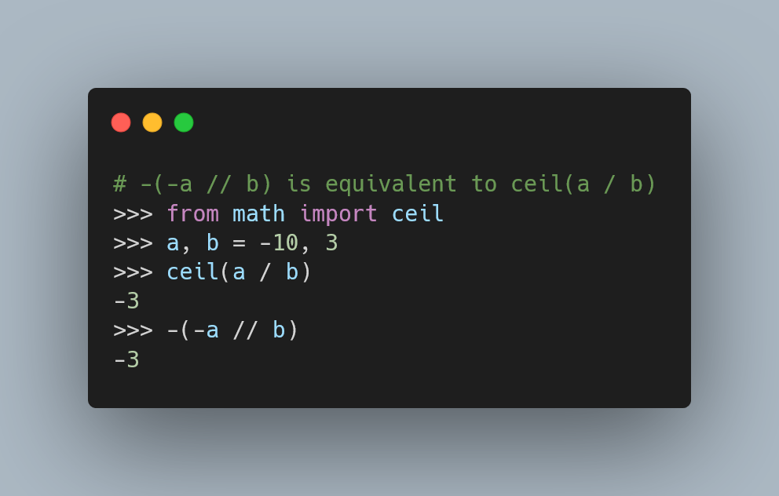

Today I learned how to do ceiling division in Python just with `//`.

===

<script async src="https://platform.twitter.com/widgets.js" charset="utf-8"></script>




## Floor division `//`

I recently published a tweet telling people about the floor division operator in Python, `//`:

<blockquote class="twitter-tweet"><p lang="en" dir="ltr">Are you familiar with the `//` operator in Python 🐍?<br><br>`//` is the “floor division” operation, which is equivalent to dividing and then rounding down.<br><br>`q = n // m` is always an integer, and the value of `q` is equivalent to `q = floor(n / m)`.<br><br>How many years fit in 10_000 days? <a href="https://t.co/ecRQoz3qkM">pic.twitter.com/ecRQoz3qkM</a></p>&mdash; Rodrigo 🐍📝 (@mathsppblog) <a href="https://twitter.com/mathsppblog/status/1437890406021206028?ref_src=twsrc%5Etfw">September 14, 2021</a></blockquote>


This operator is equivalent to doing regular division and then flooring down:

```py
>>> # How many years in 10_000 days?
>>> from math import floor; floor(10_000 / 365)
27
>>> 10_000 // 365
27
```

Then, someone asked if Python also had a built-in for ceiling division,
that is, an operator that divided the operands and then rounded up.

While there is no direct built-in operator for that,
someone replied saying that we can use a couple of minus signs and floor division to do that.

Ceiling division with `a` and `b` would be equivalent to `ceil(a / b)`.
And they showed that we can do it with `-(-a // b)`:

```py
>>> from math import ceil
>>> a, b = 10, 3
>>> ceil(a / b)
4
>>> -(-a // b)
4
```

Why does this work?

`floor` rounds down and `ceil` rounds up.
By using `-a` in the division, it's as if you flip `a` upside down,
so “its ceiling is now on the floor”, so you can use `-a // b`.
Then, you just need to put everything back in place,
using a final negation: `-(-a // b)`.

At first, I thought this would fail for some combination of positive/negative values for `a` and `b`,
but it most certainly doesn't.

For one, the explanation works regardless of the sign of `a` and/or `b`.
Secondly, one can always test it:

```py
>>> for a, b in [(10, 3), (10, -3), (-10, 3), (-10, -3)]:
...     assert ceil(a / b) == -(-a // b)
...
>>>
```

Here's the original tweet that taught me this:

<blockquote class="twitter-tweet"><p lang="en" dir="ltr">You can do ceiling division with &#39;//&#39; and some unary &#39;-&#39; signs, since &#39;//&#39; truncates to the next *lowest* number. If the divisor is negative, that means it goes to the next &quot;most-negative&quot; number, which, when negated, is actually &quot;truncating up&quot;. <a href="https://t.co/uAQmJJbYhw">pic.twitter.com/uAQmJJbYhw</a></p>&mdash; Paul McGuire - pyparsing guy (@ptmcguire) <a href="https://twitter.com/ptmcguire/status/1438128407791996934?ref_src=twsrc%5Etfw">September 15, 2021</a></blockquote>
