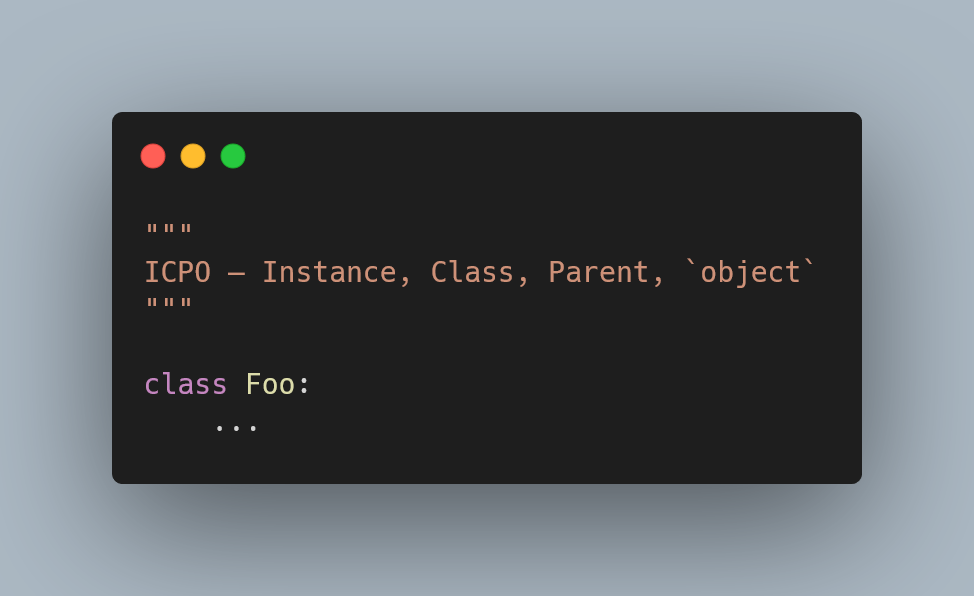

Today I learned about the ICPO rule for attribute lookup in Python.

===

<script async src="https://platform.twitter.com/widgets.js" charset="utf-8"></script>




# ICPO rule for attribute lookup

How does Python do attribute lookup when dealing with objects?

It uses the ICPO rule: it checks the instance, then its class,
then the parent(s), and finally the `object` object.

I was attending Reuven Lerner's [Advanced Python objects][reuven-class] class today,
and Reuven really nailed down the explanation for something that I had an intuitive understanding,
but that I had never seen laid out so cleanly.

This ICPO rule tells us where Python looks whenever we try to access
an attribute or a method of an object.

The I, standing for Instance, means that any object instance may have things that are its own.
Those things, that are unique to that instance, take precedence over everything else.

After that, comes the C, that stands for Class.
These are the things that are defined for the class – and this is what caught me off guard:
methods are generally looked up at this level!

Here's an example:

```py
class Person:
    def __init__(self, name):
        self.name = name

    def greet(self):
        return f"Hello, {self.name}."

p = Person("Rodrigo")
print(p.greet())
```

When Python finds the `p.greet()` piece of code, it realises it has to look up `greet`
in `p`.
First, it checks the instance for something called `greet`, and it finds nothing.

Then, it looks on `p`'s class, which is `Person`.
`Person` defines a `greet`, so that's what we run.
And this is what was wrong in my mind!
I thought the `greet` function that is being called belonged to the instance, but it doesn't.

To show you it doesn't, I'll add a `greet` method that _does_ belong to the instance:

```py
class Person:
    def __init__(self, name):
        self.name = name

    def greet(self):
        return f"Hello, {self.name}."

p = Person("Rodrigo")
p.greet = lambda: "Go away!"

print(p.greet())    # Go away!
del p.greet         # Deletes the instance's `greet`.
print(p.greet())    # Hello, Rodrigo.
```

As you can see, the `p.greet = lambda: ...` shadowed the class's `greet`!

Then the rule goes on to tell you that, after checking the class,
we check the parent classes: this is useful if there's inheritance going on.

Finally, we check the `object` object, from which all classes inherit.
(So, in a way, I guess `object` could be included in the “P” of the rule!
But I think it's nice to have it explicit here.)

In the `Person` example, the fact that we can go all the way up to `object`
when doing attribute lookup is useful when, for example,
we print our `Person` objects:

```py
print(p)    # <__main__.Person object at 0x0000012A5C9E7520>
```

Even though I [did not define the dunder methods `__str__` or `__repr__`][str-and-repr],
the `print` statement worked because `object` defines `__repr__` for me.
That's where Python went to get the representation of my `Person` instance.

I learned much more in Reuven's class,
but most of it is still being processed by my tired brain...
So, [stay tuned][subscribe] and I'll see you around!


[subscribe]: /subscribe
[reuven-class]: https://store.lerner.co.il/advanced-python-objects
[str-and-repr]: /blog/pydonts/str-and-repr
