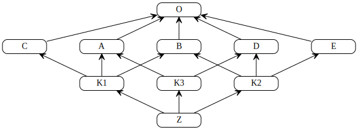

Today I learned about an algorithm that Python uses to sort out inheritance.

===




## C3 linearisation algorithm

Take the following piece of code,
which defines a series of classes where hierarchical dependencies
are represented in the diagram above,
where arrows indicate which classes inherit from which classes.

```py
class O:
    def __repr__(self):
        return "O"

class A(O):
    def __repr__(self):
        return "A"

class B(O):
    def __repr__(self):
        return "B"

class C(O):
    def __repr__(self):
        return "C"

class D(O):
    def __repr__(self):
        return "D"

class E(O):
    def __repr__(self):
        return "E"

class K1(A, B, C):
    def __repr__(self):
        return "K1"

class K2(D, B, E):
    def __repr__(self):
        return "K2"

class K3(D, A):
    def __repr__(self):
        return "K3"

class Z(K1, K2, K3):
    def __repr__(self):
        return "Z"

z = Z()
print(z)
```

What's the output of the code above?
If you guessed `"Z"`, you got it right!

Now, modify the class `Z` and remove its `__repr__` method, like so:

```py
class Z(K1, K2, K3): pass

z = Z()
print(z)
```

What's the output now?
When we print `z`, we try to look for a `__str__` or `__repr__` implementation
(read [this article][str-and-repr] to understand why),
and the class `Z` provides none.
So, in order to print `z`, we need to go up the hierarchy and look for a way to print `z`.
Next up in the inheritance hierarchy is `K1`, so the output is `K1`.

Modify `K1` as well, to remove its `__repr__`, like so:

```py
class K1(A, B, C): pass

class Z(K1, K2, K3): pass

z = Z()
print(z)
```

What's the output now?

It should be `K2`.

And we can keep going over this process of removing one `__repr__` at a time,
and this shows the hierarchy that Python builds for us,
when we have multiple inheritance at stake.

Of course, in order to check the full hierarchy,
we could keep doing this by hand,
or we could just ask Python for the linearised hierarchy:

```py
>>> Z.__mro__
(<class '__main__.Z'>, <class '__main__.K1'>, <class '__main__.K2'>, <class '__main__.K3'>, <class '__main__.D'>, <class '__main__.A'>, <class '__main__.B'>, <class '__main__.C'>, <class '__main__.E'>, <class '__main__.O'>, <class 'object'>)
```

This shows that we first look things up on `Z`, then on `K1`, then on `K2`, ...

This linearised hierarchy is built by a straightforward algorithm called the “C3 linearisation algorithm”,
that you can [find on Wikipedia][wiki].

The algorithm isn't that complicated (the description is in the link above)
and I might actually implement it in Python in the near future, just for fun.

This came to my attention as I was reading [this article][blog-article]
that was shared with me [on Twitter][twitter],
in a discussion related to [yesterday's TIL article][til003],
about the ICPO rule for attribute lookup.

That's it for now! [Stay tuned][subscribe] and I'll see you around!


[subscribe]: /subscribe
[til003]: /blog/til/003
[str-and-repr]: /blog/pydonts/str-and-repr
[wiki]: https://en.wikipedia.org/wiki/C3_linearization
[blog-article]: https://blog.peterlamut.com/2018/11/04/python-attribute-lookup-explained-in-detail
[twitter]: https://twitter.com/mathsppblog
