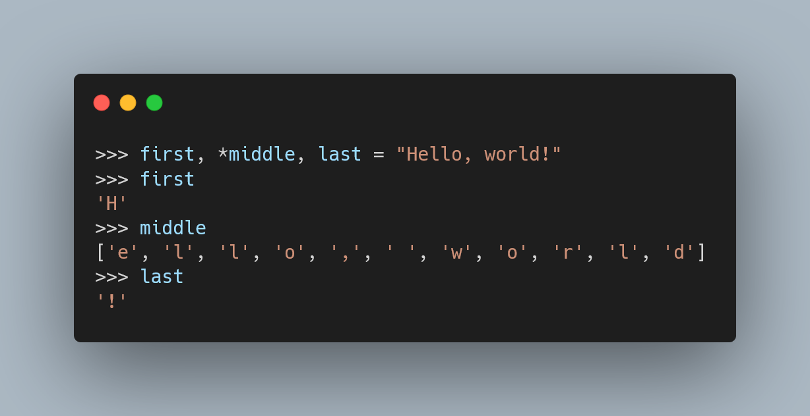

Today I learned strings can also be unpacked in Python.

===

<script async src="https://platform.twitter.com/widgets.js" charset="utf-8"></script>




## String unpacking

I've written a couple of Pydon't articles about unpacking before,
namely [one about unpacking with starred assignments][pydont-unpacking],
and [another one about deep (structural) unpacking][pydont-deep-unpacking].

Having said that, I have _no idea_ why I was so surprised, earlier today,
when I found out that strings can be unpacked in Python:

```py
>>> a, b = "Hi"
>>> a
'H'
>>> b
'i'
```

In hindsight, I already possessed all the knowledge to arrive at this conclusion...

And yet, when I saw it in my face, it baffled me!

Now, whether or not this is a helpful thing...
That's a whole different discussion!

But there you have it, something interesting about Python.

(Pssst, no one else is looking, check out this horror:

```py
>>> first, *middle, last = "Hello, world!"
>>> first
'H'
>>> middle
['e', 'l', 'l', 'o', ',', ' ', 'w', 'o', 'r', 'l', 'd']
>>> last
'!'
```

Would you get fired if you wrote things like this in production?)

Here's the tweet from where I learnt this:

<blockquote class="twitter-tweet"><p lang="en" dir="ltr">Why does Mypy complain about unpacking a string? i.e.<br><br>foo, bar, baz = &quot;foo&quot;<br><br>Not only that, but it complains it doesn&#39;t know what type foo, bar, and baz are.<br><br>*however* Mypy does like this:<br><br>foo, bar, baz = iter(&quot;foo&quot;)<br><br>And it correctly deduces the types of foo, bar, and baz. 🤔</p>&mdash; Will McGugan (@willmcgugan) <a href="https://twitter.com/willmcgugan/status/1440673445692391445?ref_src=twsrc%5Etfw">September 22, 2021</a></blockquote>

That's it for now! [Stay tuned][subscribe] and I'll see you around!


[subscribe]: /subscribe
[pydont-unpacking]: /blog/pydonts/unpacking-with-starred-assignments
[pydont-deep-unpacking]: /blog/pydonts/deep-unpacking
