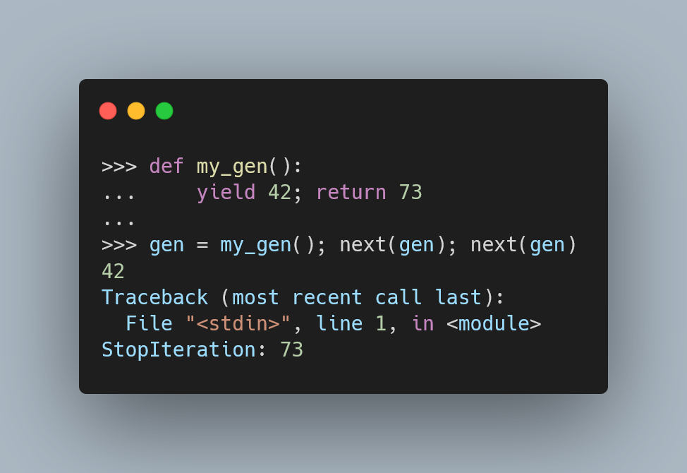

Today I learned that Python generators can return a value.

===

<script async src="https://platform.twitter.com/widgets.js" charset="utf-8"></script>




# Generators

Generators are interesting Python objects that produce a series of values,
but one by one.
In a way, they can be thought of as stateful functions.
(That is, functions with state.)

What I learned is that generators can also return something.
Here is the tweet that prompted this discovery:

<blockquote class="twitter-tweet"><p lang="en" dir="ltr"><a href="https://twitter.com/hashtag/Python?src=hash&amp;ref_src=twsrc%5Etfw">#Python</a> pop quiz: Is this code valid? If so, what does it do?<br><br>def f():<br> yield 10<br> return 20<br><br>g = f()<br>print(next(g))<br>print(next(g))</p>&mdash; Raymond Hettinger (@raymondh) <a href="https://twitter.com/raymondh/status/1446191250470735878?ref_src=twsrc%5Etfw">October 7, 2021</a></blockquote>


# Returning from a generator

When you use a `return` inside a generator,
the generator will have that returned information in its `StopIteration`
exception when it's done:

```py
>>> def f():
...     yield 10
...     return 20
...
>>> gen = f()
>>> next(gen)
10
>>> next(gen)
Traceback (most recent call last):
  File "<stdin>", line 1, in <module>
StopIteration: 20
```

If you want to get access to that value, you just need to catch the exception:

```py
>>> gen = f(); next(gen);
10
>>> try:
...     next(gen)
... except StopIteration as e:
...     val = e.value
...
>>> val
20
```

That's it for now! [Stay tuned][subscribe] and I'll see you around!


[subscribe]: /subscribe
