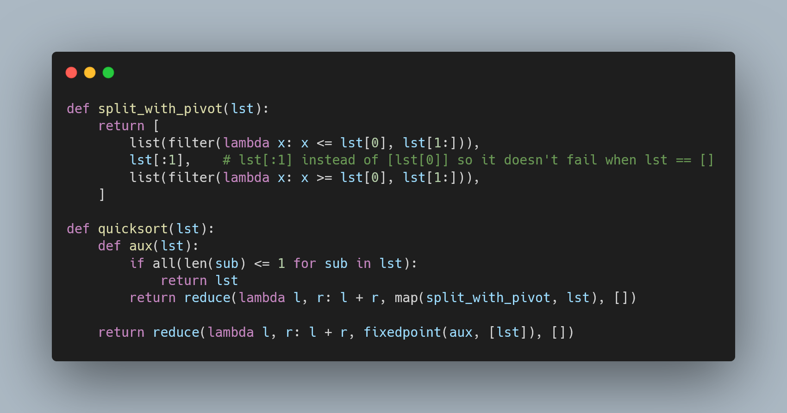

Today I learned how to write the Quicksort algorithm in a weird functional style.

===



## Functional programming (sort of)

Here is a short preamble:
in my local university, maths students are taught programming in Python.

On top of that, that course teaches recursion, functional programming,
imperative programming, etc.
Often, an exam will ask a very specific question, like “implement the Quicksort
algorithm in functional style”.

_However_, the requirement that the implementation be in a functional style
has some strings attached.
It's difficult to explain in writing,
but you are expected to make use of built-ins like `map`, `filter`, `functools.reduce`,
list comprehensions.
On the other hand, you are not expected to use variables, explicit loops, and similar constructs.

Oh, we are also expected to use constructs like `nest` and `fixedpoint`:

```py
def nest(f, n, x):
    """Call `f` repeatedly `n` times. `nest(f, 3, x)` is `f(f(f(x)))`."""
    for i in range(n):
        x = f(x)
    return x

def fixedpoint(f, x):
    """Applies `f` successively until the result doesn't change."""
    x_ = f(x)
    while x_ != x:
        x = x_
        x_ = f(x)
    return x_
```


So, for you, the reader, the task will be as follows:
using these arbitrary restrictions, can you implement Quicksort?


## Quicksort

[Quicksort][Quicksort] is a sorting algorithm that works as follows:

 > To sort a list, pick a value from the list (for example, the first element in the list)
 > and call it _pivot_.
 > Then, split the list in two: the elements smaller than the pivot and the elements larger than the pivot.
 > Sort both sublists, and put them together!

That's a recap of Quicksort, assuming you know it already.
(If you don't, check the [wiki link][Quicksort]).

In the context of this programming course I mentioned, you could expect people to implement Quicksort more or less like this:

```py
def quicksort(lst):
    if len(lst) <= 1:
        return lst

    pivot = lst[0]
    left = quicksort([val for val in lst[1:] if val <= pivot])
    right = quicksort([val for val in lst[1:] if val > pivot])
    return left + [pivot] + right


if __name__ == "__main__":
    import random
    random.seed(73)
    lst = [random.randint(-20, 20) for _ in range(20)]
    print(quicksort(lst))
    # [-19, -16, -13, -13, -9, -8, -4, -3, -1, 5, 6, 8, 9, 10, 11, 12, 12, 13, 16, 17]
```

So, the question is: how do we implement Quicksort in this funky functional style?

Well, I thought about it for a while, because a desperate student asked me to...


## How to implement Quicksort in functional programming?

Here is what I did to implement Quicksort in this funky functional style:

```py
from functools import reduce

## We need the `fixedpoint` definition:
def fixedpoint(f, x):
    """Applies `f` successively until the result doesn't change."""
    x_ = f(x)
    while x_ != x:
        x = x_
        x_ = f(x)
    return x_


def split_with_pivot(lst):
    return [
        list(filter(lambda x: x <= lst[0], lst[1:])),
        lst[:1],    # lst[:1] instead of [lst[0]] so it doesn't fail when lst == []
        list(filter(lambda x: x >= lst[0], lst[1:])),
    ]


def quicksort(lst):
    def aux(lst):
        if all(len(sub) <= 1 for sub in lst):
            return lst
        return reduce(lambda l, r: l + r, map(split_with_pivot, lst), [])

    return reduce(lambda l, r: l + r, fixedpoint(aux, [lst]), [])


if __name__ == "__main__":
    import random
    random.seed(73)
    lst = [random.randint(-20, 20) for _ in range(20)]
    print(quicksort(lst))
    # [-19, -16, -13, -13, -9, -8, -4, -3, -1, 5, 6, 8, 9, 10, 11, 12, 12, 13, 16, 17]
```

Quite interesting, isn't it?
A weird exercise, but interesting!


That's it for now! [Stay tuned][subscribe] and I'll see you around!


[subscribe]: /subscribe
[Quicksort]: https://en.wikipedia.org/wiki/Quicksort
