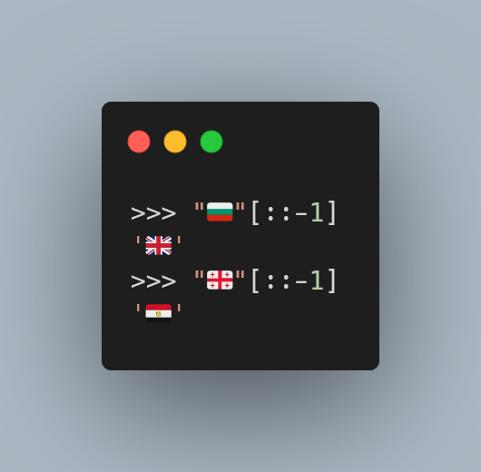
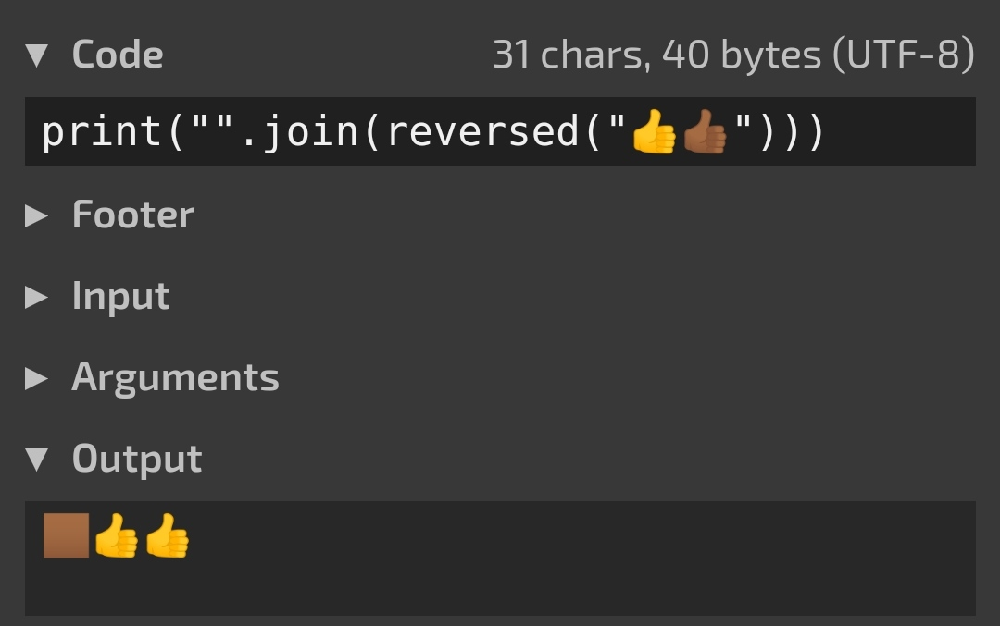

Today I learned that the reverse of some flag emoji are other flags!

===

<script async src="https://platform.twitter.com/widgets.js" charset="utf-8"></script>




## Reversing emoji

I'm used to getting nerd-sniped by Will McGugan on Twitter,
and recently he asked, on Twitter,
if we could come up with a string that could not be reversed with the appropriate methods:

```py
>>> "Python"[::-1]
'nohtyP'
>>> "".join(reversed("Python"))
'nohtyP'
```

Here is the original tweet:

<blockquote class="twitter-tweet"><p lang="en" dir="ltr">Can anyone give me an example of a string that can not be reversed like this? <a href="https://t.co/AwubAJyRRv">https://t.co/AwubAJyRRv</a></p>&mdash; Will McGugan (@willmcgugan) <a href="https://twitter.com/willmcgugan/status/1484295045603897347?ref_src=twsrc%5Etfw">January 20, 2022</a></blockquote>

Thankfully, for me, I am already used to getting nerd-sniped by Will and I managed to understand where this was going.

I managed to show that reversing doesn't work with coloured emoji,
because the colour is kind of defined by having the regular yellow emoji plus the colour.
So, when we reverse it, the colour and the hand change sides, and the colouring doesn't get applied:

```py
>>> "".join(reversed("👍👍🏾"))
'🏾👍👍'
```

This may not display properly, so here is a screenshot of [this online Python REPL](https://tio.run/##K6gsycjPM/7/v6AoM69EQ0lJLys/M0@jKLUstag4NUVD6cP8ib0Q3L9PSVNT8/9/AA):



Another way to show what is happening is by surrounding a coloured hand with two yellow ones.
Notice how the colour moves out of the middle hand:

```py
>>> "".join(reversed("👍👍🏾👍"))
'👍🏾👍👍'
```

## Flag emoji

Another person, replying to Will, figured out that the emoji flags were actually represented by a 2-letter country code.
So, when reversing, some flags would start spelling a 2-letter country code from _a different country_,
as shown in the picture at the beginning of this article, and below:

```py
>>> "🇧🇬"[::-1]
'🇬🇧'
>>> "🇬🇪"[::-1]
'🇪🇬'
```

Quite interesting, right?

Because it may be hard to play with emoji in your REPL,
you can also [try this online](https://tio.run/##K6gsycjPM/7/v6AoM69EQ@nD/PblQLxGKdrKStcwVpMLIb4GiFfBxP//BwA).

That's it for now! [Stay tuned][subscribe] and I'll see you around!

[subscribe]: /subscribe
[collections]: https://docs.python.org/3/library/collections
[namedtuple-docs]: https://docs.python.org/3/library/collections.html#collections.namedtuple
