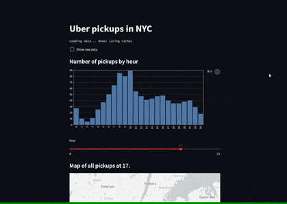

Today I learned that you can build web apps with Python using streamlit.

===


# Streamlit

[Streamlit][streamlit] is, according to their website,
“the fastest way to build and share data apps”.

I don't know if it is the _fastest_,
but I did go through their “getting started” guide in just a few minutes.

With just a bit of code:

```py
# uber.py

import streamlit as st
import pandas as pd
import numpy as np


DATE_COLUMN = "date/time"
DATA_URL = (
    "https://s3-us-west-2.amazonaws.com/" +
    "streamlit-demo-data/uber-raw-data-sep14.csv.gz"
)


@st.cache
def load_data(nrows):
    data = pd.read_csv(DATA_URL, nrows=nrows)
    data.rename(str.lower, axis="columns", inplace=True)
    data[DATE_COLUMN] = pd.to_datetime(data[DATE_COLUMN])
    return data


st.title("Uber pickups in NYC")

data_load_state = st.text("Loading data...")
data = load_data(1000)
data_load_state.text("Loading data... done! (using cache)")

if st.checkbox("Show raw data"):
    st.subheader("Raw data")
    st.write(data)

st.subheader("Number of pickups by hour")

hist_values = np.histogram(
    data[DATE_COLUMN].dt.hour, bins=24, range=(0,24)
)[0]
st.bar_chart(hist_values)

hour_to_filter = st.slider("hour", 0, 23, 17)  # min, max, default
filtered_data = data[data[DATE_COLUMN].dt.hour == hour_to_filter]
st.subheader(f"Map of all pickups at {hour_to_filter}.")
st.map(filtered_data)
```

I created a basic web app that loads pickup Uber data from New York City,
plots a histogram to show the activity per hour,
and lets me plot that data after filtering by the hour of that pickup.

To run the web app, first you need to [install `streamlit`][install].
This may (or may not) be as simple as

```bash
 > python -m pip install streamlit
```

If/when you have `streamlit` installed, just run the app with

```bash
 > python -m streamlit run uber.py
```

This is more or less what the app looks like:




That's it for now! [Stay tuned][subscribe] and I'll see you around!

[subscribe]: /subscribe
[streamlit]: https://streamlit.io
[install]: https://docs.streamlit.io/library/get-started/installation
