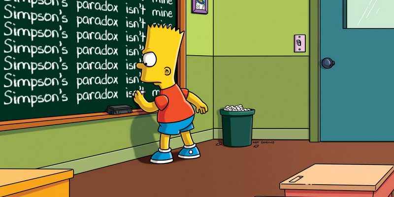

Today I learned about Simpson's paradox in statistics.

===

## What is the Simpson's paradox?

The Simpson's paradox arises when the trends shown by several groups of data disappear, or reverse!,
when the groups are combined.

## Example of Simpson's paradox

Let me show you a good example taken from [the Wikipedia][wiki-simpson-paradox-example].

The batting average is a statistic used in sports such as baseball, cricket, and softball.
I have no intention of offending players of any of these sports,
but for the sake of simplicity and brevity,
let's assume that “batting average” is the number of times a player hits the ball
divided by the number of times the player goes to bat.

With that out of the way, let me share some numbers with you:

| Batter vs Year | 1995 | 1996 | '95 & '96 |
| :- | :- | :- | :- |
| Derek Jeter | .250 | .314 | **.310** |
| David Justice | **.253** | **.321** | .270 |

The data shown in the table above is real:
it shows that David had a higher batting average than Derek in both 1995 and 1996.
_However_, if we combine the two years,
Derek's batting average is better than David's.

To understand why this is the case,
it is very important that I share the underlying data that allows one to compute the batting average:

| Batter vs Year | 1995 | 1996 | '95 & '96 |
| :- | :- | :- | :- |
| Derek Jeter | .250 (12/48) | .314 (183/582) | **.310** (195/630) |
| David Justice | **.253** (104/411) | **.321** (45/140) | .270 (149/551) |

As one can see,
Derek's superior overall batting average is explained by the fact that he batted at .314 in a year with a total of 582 opportunities,
which outweights the fact that David batted .321 in a year with only 140 opportunities.

Have you ever tripped up on Simpson's paradox before? Where?

That's it for now! [Stay tuned][subscribe] and I'll see you around!
(Thumbnail image with the Simpson's chalkboard gag courtesy of [this webpage][chalkboard-gag].)

[subscribe]: /subscribe

[chalkboard-gag]: https://www.ranzey.com/generators/bart/index.html
[wiki-simpson-paradox-example]: https://en.wikipedia.org/wiki/Simpson%27s_paradox#Batting_averages
