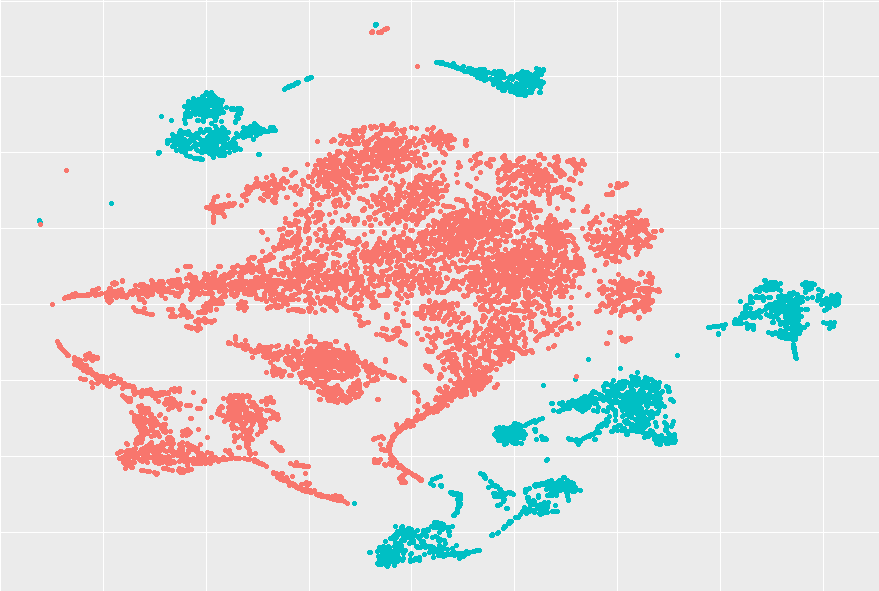

Today I learned about t-SNE for dimensionality reduction.

===

# t-SNE

t-SNE (t-distributed Stochastic Neighbourhood Embedding) is a nice statistical method
that can be used to visualise high-dimensional data in a smaller number of dimensions.

I guess I could say I learnt about this method in the context of my MSc thesis,
and even though I only used it once yet,
I found the results to be absolutely great!

I don't want to give too much detail
(and I don't think I could, if I wanted...)
but I was working with a space of 24 dimensions.
(If there are people who struggle with doing 3D visualisation in their heads,
imagine 24D!)
Despite the fact that the data had 24 dimensions,
I knew (from the context) that there were two main groups of datapoints,
with one of them accounting for roughly 25% of the data.

I applied t-SNE to that data,
roughly 10.000 datapoints of that 24D space,
and the results I got looked really great, to be honest.
Below, you can see the result I got with minimal effort,
and you can even see that it does a pretty decent job of separating the two groups of data:

I was really impressed by the results,
and I was also very curious about how hard it would be to implement this method.
From the paper referenced below,
the method doesn't seem hard to implement,
so I might give it a go...

(By the way, if you are into Python, you can [use t-SNE with the package `sklearn`][sklearn-tsne].

That's it for now! [Stay tuned][subscribe] and I'll see you around!

[subscribe]: /subscribe

[sklearn-tsne]: https://scikit-learn.org/stable/modules/generated/sklearn.manifold.TSNE.html
