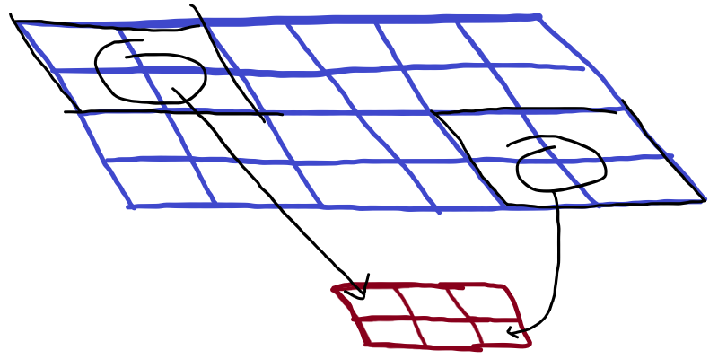
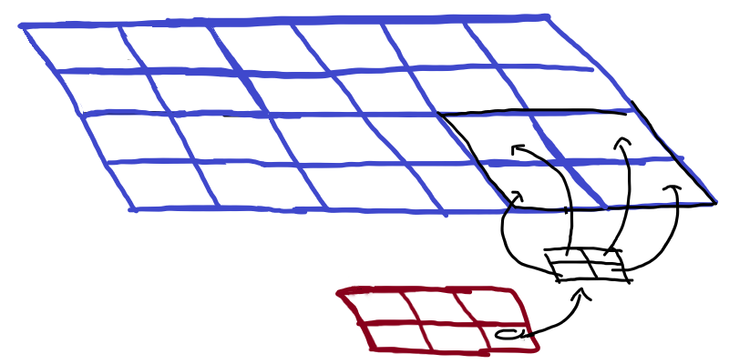

Today I learned about the transposed convolution transformation in CNNs.

===


# Transposed convolution

I am currently working on a project based off of the architecture of the u-net neural network of [this paper][unet-paper].
I struggled to understand how the upsampling was being done,
until I understood it was being done by a transposed convolution.

While I am not a master of transposed convolutions,
I was able to understand how the u-net upsamples with transposed convolutions.
In order to reach the enlightenment stage I'm at,
I used the two resources you can find below in the references.

To me,
it is easier to reason about the upsampling step if I think about the “reverse” downsampling step:
how would you use a 2 by 2 convolution to downsample an image into half its size?

Well, if you set your 2 by 2 convolution to have no padding and a stride of 2,
then downsampling is exactly what you get:



In the figure above, the top rectangle represents the input image and the bottom rectangle represents the output (downsampled) image.
The black squares on the top-left and bottom-right corners of the input image represent the kernel.
Because we have a stride of 2, no pixel from the input is used twice.

In order to go the other way around,
we see that each pixel from the bottom image should be able to generate a 2 by 2 region of the image above,
as represented in the next figure:



This pixel-becomes-2-by-2-region must involve the 2 by 2 kernel,
so the only sensible thing to do is to multiply each pixel of the bottom image by the kernel!
So, in other words, in this particular transposed convolution,
each 2 by 2 region of the top image is going to be the kernel times the corresponding element of the bottom image.

We can verify this, for example,
with the transposed convolution available with PyTorch,
an open-source machine learning framework for Python!

We start by creating a transposed convolution operator;
we set in and out channels to 1,
so that we can play with a single dimension,
set the kernel size to 2 by 2,
the stride to 2,
and use no bias so that we can see the effects of multiplication
like I described them above:

```py
>>> import torch.nn
>>> up = torch.nn.ConvTranspose2d(1, 1, (2, 2), stride=2, bias=False)
```

Up next, we create the corresponding of the bottom image,
a 2 by 3 tensor
(with leading dimensions 1 and 1 for the batch size and channels,
respectively, which we pretty much ignore):

```py
>>> inp = torch.randn((1, 1, 2, 3))
>>> inp
tensor([[[[-0.0564,  1.5080,  1.6263],
          [ 0.8452,  0.8627, -0.5019]]]])
```

Then, we make the input go through the upsampling:

```py
>>> out = up(inp)
```

Now, we can check that the top-left 2 by 2 region of the output is actually the kernel multiplied by the top left pixel of the input image:

```py
>>> out[0, 0, 0:2, 0:2] == up.weight * inp[0, 0, 0, 0]
tensor([[[[True, True],
          [True, True]]]])
```

(`up.weight` is the kernel.)

In fact, we can slide that 2 by 2 region across the output,
and verify that it always matches the multiplication of the whole kernel with a single element of the input image:

```py
>>> for x in range(2):
...     for y in range(3):
...         assert (out[0, 0, 2*x:2*(x+1), 2*y:2*(y+1)] == up.weight * inp[0, 0, x, y]).all()
...
>>>
```

Do you know what “no output” means?
It means we got it right!

So...


# How can you do upsampling with a transposed convolution?

If you want to do upsampling by an integer factor of `n`,
you can use a transposed convolution with a kernel size of `n` by `n`,
with stride `n`, and with no padding.


# Transposed convolution in APL

Just for the fun of it,
I even implemented a transposed convolution in APL.
Granted, it's not really efficient,
but conveys the intuitive idea of how upsampling with a transposed convolution works:

```APL
      ⎕← ker ← ¯1+2×?2 2⍴0   
 0.3459 ¯0.2987 
¯0.9396 ¯0.01321
      ⎕← inp ← ?2 3⍴0        
0.9064 0.4639 0.3109 
0.3791 0.2148 0.07558
      ker ⊂⍤×⍤2 0⊢inp         
┌─────────────────────────────┬─────────────────────────────┬───────────────────────────────┐
│ 0.3135292152 ¯0.2707504069  │ 0.1604726599 ¯0.1385773187  │ 0.1075419518 ¯0.09286862532   │
│¯0.8516202838 ¯0.01196955272 │¯0.4358820981 ¯0.006126338057│¯0.2921096442 ¯0.004105611215  │
├─────────────────────────────┼─────────────────────────────┼───────────────────────────────┤
│ 0.1311479097 ¯0.1132537199  │ 0.07430170451 ¯0.0641637709 │ 0.02614514593 ¯0.02257782866  │
│¯0.3562290678 ¯0.005006811944│¯0.201821188   ¯0.00283660382│¯0.07101646521 ¯0.0009981388897│
└─────────────────────────────┴─────────────────────────────┴───────────────────────────────┘
      ⊃,/⍪⌿ker ⊂⍤×⍤2 0⊢inp      
 0.3135 ¯0.2708    0.1605 ¯0.1386    0.1075  ¯0.09287  
¯0.8516 ¯0.01197  ¯0.4359 ¯0.006126 ¯0.2921  ¯0.004106 
 0.1311 ¯0.1133    0.0743 ¯0.06416   0.02615 ¯0.02258  
¯0.3562 ¯0.005007 ¯0.2018 ¯0.002837 ¯0.07102 ¯0.0009981
```

That's it for now! [Stay tuned][subscribe] and I'll see you around!

[subscribe]: /subscribe

[unet-paper]: https://arxiv.org/abs/1505.04597
