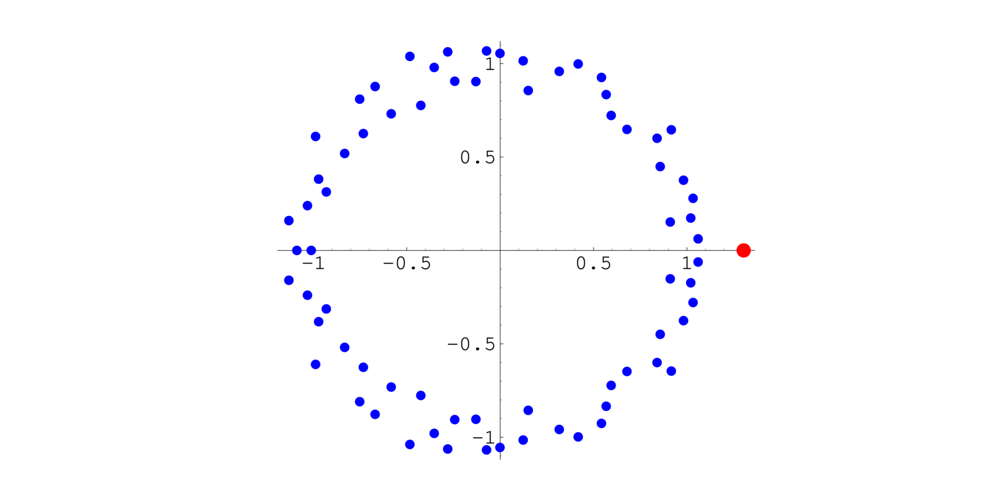

Today I learned that the length of the terms of the “look-and-say” sequence has a well-defined growth rate.

===

## What is the look-and-say sequence?

The look-and-say sequence is a numerical sequence that starts with `1`,
`11`, `21`, `1211`, `111221`.
Can you guess what the next term is?

Each consecutive term comes from “reading out” the contents of the previous term.
So, looking at `111221`, we can split it into groups: `111`, `22`, and `1`.
Then, we read out each group:

 - three `1`s;
 - two `2`s; and
 - one `1`.

So, the next term is `312211`.
And the next:

 - one `3`;
 - one `1`;
 - two `2`s; and
 - two `1`s.

So, the next term would be `13112221`.

## Conway's Constant

What I just learned is that the length of the next term is, on average,
$1.303577269\cdots$ times larger than the length of the previous term.
Rounding it down, it means that terms grow by about $30\%$ each iteration.

It was John Conway that proved that the ratio of the lengths of two consecutive terms converged to that value,
and that value is now called [Conway's Constant][cc].

If you are wondering where that number came from, it's the only positive real root of the following polynomial:

$$
\begin{alignat}{9}
 &+x^{71} & &-x^{69}  &-2 x^{68}  &-x^{67}  &+2 x^{66}  &+2 x^{65}  &+x^{64}  &-x^{63} \\
 &-x^{62} &-x^{61} &-x^{60}  &-x^{59}  &+2 x^{58}  &+5 x^{57}  &+3 x^{56}  &-2 x^{55}  &-10 x^{54} \\
 &-3 x^{53} &-2 x^{52} &+6 x^{51} &+6 x^{50} &+x^{49} &+9 x^{48} &-3 x^{47} &-7 x^{46} &-8 x^{45} \\
 &-8 x^{44} &+10 x^{43} &+6 x^{42} &+8 x^{41} &-5 x^{40} &-12 x^{39} &+7 x^{38} &-7 x^{37} &+7 x^{36} \\
 &+x^{35} &-3 x^{34} &+10 x^{33} &+x^{32} &-6 x^{31} &-2 x^{30} &-10 x^{29} &-3 x^{28} &+2 x^{27} \\
 &+9 x^{26} &-3 x^{25} &+14 x^{24} &-8 x^{23} & &-7 x^{21} &+9 x^{20} &+3 x^{19} &-4 x^{18} \\
 &-10 x^{17} &-7 x^{16} &+12 x^{15} &+7 x^{14} &+2 x^{13} &-12 x^{12} &-4 x^{11} &-2 x^{10} &+5 x^9 \\
  &&+x^7 &-7 x^6 &+7 x^5 &-4 x^4 &+12 x^3 &-6 x^2 &+3 x &-6
\end{alignat}
$$

Now, where does _that_ polynomial come from?
I have no idea!

What I find the most interesting is that we have this sequence that seems to be unrelated to maths,
given that the way in which you build the successive terms is through a word game,
this sequence does exhibit some nice behaviour that maths can explain!

Isn't that cool?!

You can read a bit more about this sequence and variations in [this article][look-and-say].

[cc]: https://mathworld.wolfram.com/ConwaysConstant.html
[look-and-say]: /blog/look-and-say-sequence

That's it for now! [Stay tuned][subscribe] and I'll see you around!

[subscribe]: /subscribe
