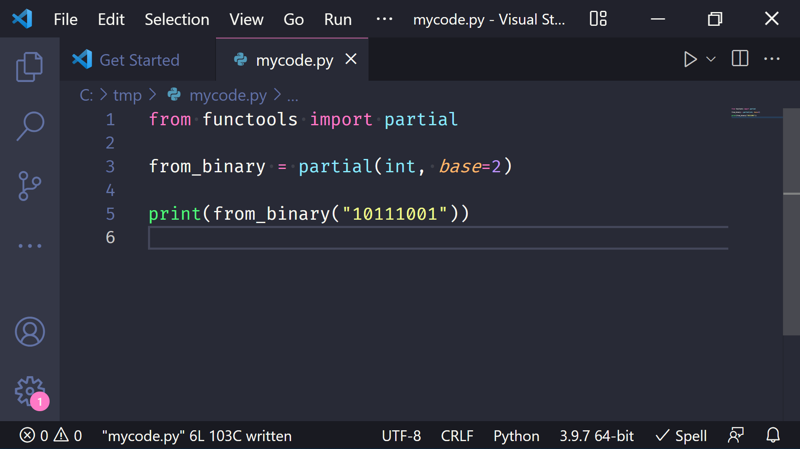
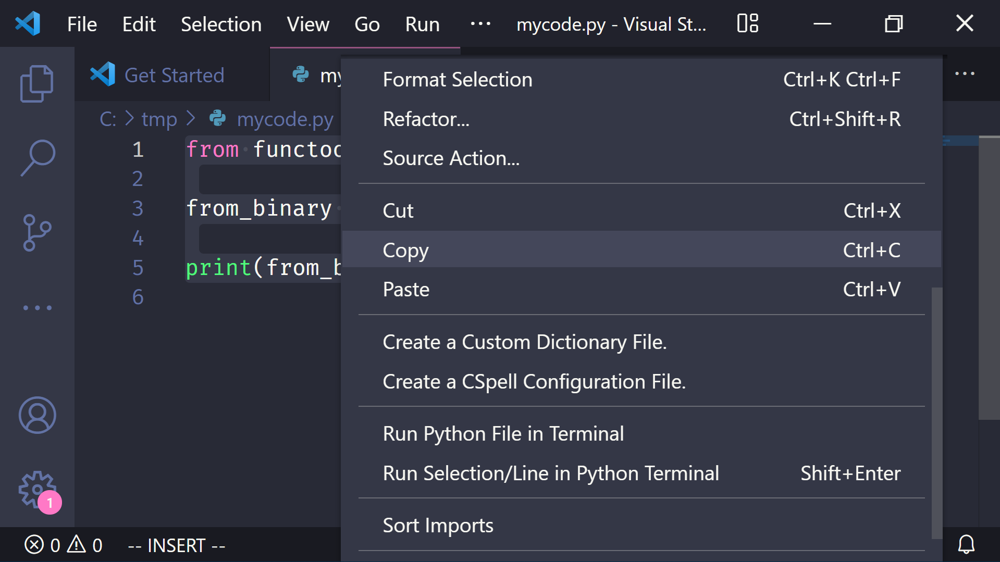
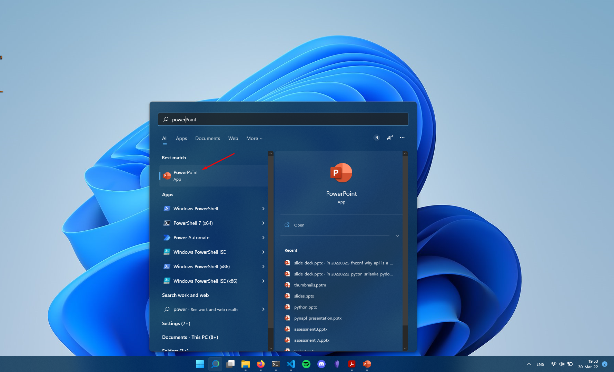
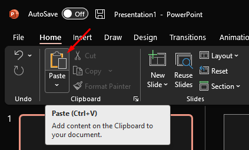
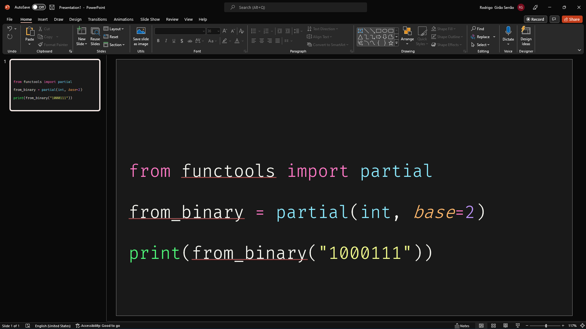
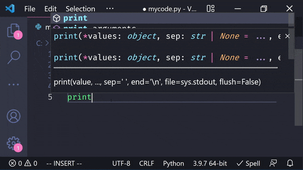

Learn how to do code syntax highlighting in PowerPoint!

===

# How to do code syntax highlighting in Microsoft PowerPoint

The basic technique I use to do syntax highlighting for my talk slides has two steps:

 1. open Visual Studio Code and write the code I want highlighted; and
 2. copy the code from Visual Studio Code directly to the PowerPoint slide.

I use this technique a lot when I'm preparing my talks!
For an example of a whole presentation built with this technique you can check [this slide deck][slide-deck].

# Step-by-step instructions

To make it easier to follow, you can find here the step-by-step instructions.
At the bottom of the page you'll also find an animated GIF showing you how I do this.

 1. Write some code in Visual Studio Code using the theme you already want:

 2. Select the code and copy it:

 3. Open PowerPoint (or the presentation you are working on):

 4. Paste the code into PowerPoint with the “Paste” menu button or with a keyboard shortcut:

 5. Your code should have syntax highlighting! Don't forget to change the font family, font size, among other things, if you need:

Pretty simple and saves you a LOT of trouble if you try to do syntax highlighting by hand...
Which I did! It was painful.
Finally, just because I can, here is the whole process in an animated GIF:

[slide-deck]: https://github.com/mathspp/talks/blob/main/20220325_fnconf_why_apl_is_a_language_worth_knowing/slide_deck.pdf

That's it for now! [Stay tuned][subscribe] and I'll see you around!

[subscribe]: /subscribe
