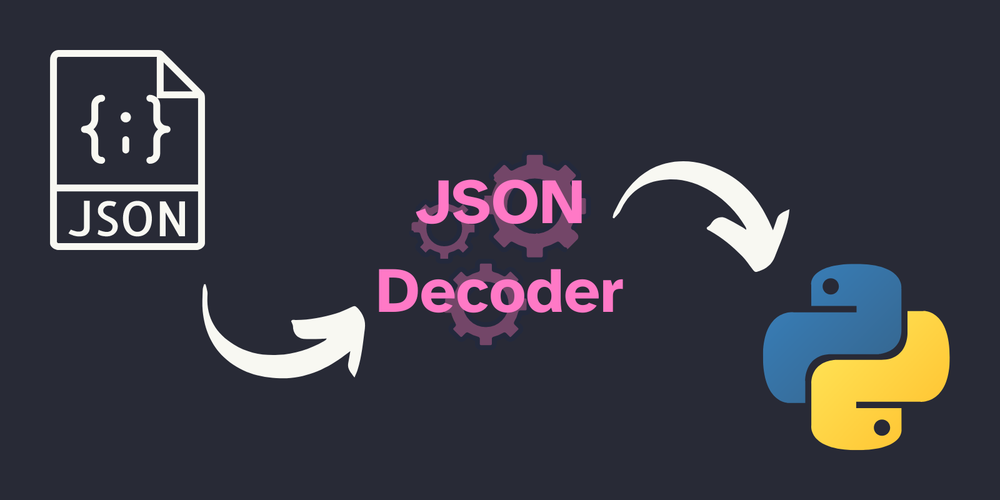

Today I finished learning how to use a custom JSON decoder to convert JSON to arbitrary Python objects.

===



## Asymmetry suggests other alternatives

In the two previous TIL articles,
I wrote briefly about how to [use a custom JSON encoder][til-json-encoder]
and how to [use a custom JSON decoder][til-json-decoder].
Looking at the two articles linked,
there is a noticeable asymmetry in the strategies used to do the encoding and the decoding.

We subclassed `json.JSONEncoder` in order to [implement custom JSON encoding for our Python objects][til-json-custom-encoder],
and then we passed that class to the methods `json.dump` and `json.dumps`.
However, in order to [implement custom JSON decoding into arbitrary Python objects][til-json-custom-decoding],
we just implemented a function that was then passed into `json.load` and `json.loads` as the parameter `object_hook`.

Reading the two previous sentences, even if I didn't know the module `json`,
I would expect one of the two to be true:

 - there is a class `json.JSONDecoder` that can be subclassed and then passed in to `json.load` and `json.loads`,
 which will also allow for custom JSON decoding; or
 - `json.dump` and `json.dumps` accept a parameter which should have a name similar to `encode_hook` or `encoder_hook`,
 which would allow us to implement just a function that would take care of the custom JSON encoding.

As it turns out, the former is true:
the module `json` has a class `JSONDecoder` that we can subclass – and then feed to `json.load` and `json.loads` –
which allows us to decode JSON into arbitrary Python objects.
Let us see how to do that.


## `json.JSONDecoder`

The documentation doesn't tell you much about [how to use `json.JSONDecoder`][json-JSONDecoder],
so I will share with you what I could piece together.

The functions `json.load` and `json.loads` accept a keyword argument `cls`,
which the documentation describes as behaving in the following way:

 > “To use a custom `JSONDecoder` subclass, specify it with the `cls` kwarg; otherwise `JSONDecoder` is used. Additional keyword arguments will be passed to the constructor of the class.”

Then, if you go and read the documentation on `JSONDecoder`,
you see that it accepts an `object_hook` upon initialisation,
which is what we have used to implement [custom JSON decoding][til-json-custom-decoding] in the previous article.

Thus, the obvious path forward seems to be to subclass `json.JSONDecoder` and make it so that,
by default, it uses a custom `object_hook` argument.

Something along the lines of this blueprint:

```py
import json


class MyJSONDecoder(json.JSONDecoder):
    def __init__(self, **kwargs):
        kwargs.setdefault("object_hook", my_custom_object_hook)
        # Just need to implement this ---^^^^^^^^^^^^^^^^^^^^^
        super().__init__(**kwargs)


my_object = json.loads(json_data, cls=MyJSONDecoder)
```


## Defining a custom decoder class

With the blueprint above in mind, let us go back to the example of decoding complex numbers.

Let us assume that a complex number is represented as a JSON dictionary with the following structure:

```json
{
    "real": 1.0,
    "imag": 2.0
}
```

Taking that into account, we can implement the object hook as follows:

```py
import json


class ComplexDecoder(json.JSONDecoder):
    def __init__(self, **kwargs):
        kwargs.setdefault("object_hook", self.object_hook)
        super().__init__(**kwargs)

    def object_hook(self, dict_):
        """Try to decode a complex number."""
        try:
            return complex(dict_["real"], dict_["imag"])
        except KeyError:
            return dict_


json_data = """{
    "real": 1.0,
    "imag": 2.0
}"""

c = json.loads(json_data, cls=ComplexDecoder)
print(c)  # (1+2j)
```


All in all, the main difference between this and the strategy outlined in the [previous article about custom JSON decoding][til-json-decoder] is that we wrap our object hook in a subclass of `json.JSONDecoder`.


## Conclusion

If you want to do custom JSON decoding, you will always need to implement a hook.
The easiest way is to implement an object hook that takes JSON dictionaries and tries to parse them into something else.

If you want a solution that is more symmetric with respect to how custom JSON encoding is done,
you can subclass `json.JSONDecoder` and plug the object hook as a default argument.

!!! You can read a follow-up article where I implement a system that allows you to [extend JSON through custom encoders and decoders][extend-json].


[til-json-encoder]: /blog/til/custom-json-encoder
[til-json-custom-encoder]: /blog/til/custom-json-encoder#custom-json-encoding-of-python-objects
[til-json-decoder]: /blog/til/custom-json-decoder
[til-json-custom-decoding]: /blog/til/custom-json-decoder#custom-json-decoding-into-arbitrary-python-objects
[extend-json]: /blog/custom-json-encoder-and-decoder

[json]: https://docs.python.org/3/library/json.html
[json-JSONDecoder]: https://docs.python.org/3/library/json.html#json.JSONDecoder

That's it for now! [Stay tuned][subscribe] and I'll see you around!

[subscribe]: /subscribe
