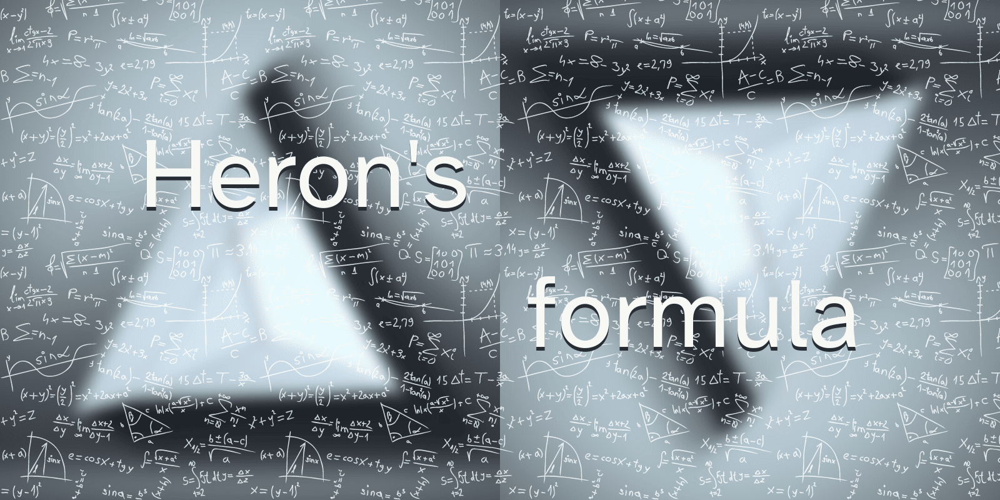

Today I (re)learned Heron's formula to compute the area of a triangle from its three sides.

===

## Heron's formula

Heron's formula is a formula that lets you compute the _area_ of a triangle from the lengths of its three sides $a$, $b$, and $c$:

$$
\sqrt{s \times (s - a) \times (s - b) \times (s - c)}
$$

The value $s$ is the semi-perimeter of the triangle, which is half the perimeter, $\frac{a + b + c}{2}$.

## Proof of Heron's formula

Heron's formula is not too hard to prove.
You can prove it algebraically by considering an arbitrary triangle that is subdivided into two smaller right triangles by the height of one side.
Then, you determine the side lengths of those two triangles with respect to the original lengths $a$, $b$, and $c$, and you massage the numbers around until the formula shows up.

If you would like a more detailed proof, you can always drop a comment below!

That's it for now! [Stay tuned][subscribe] and I'll see you around!

[subscribe]: /subscribe
