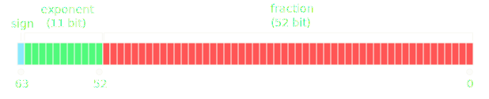

Today I learned what precision Python floats have.

===

# Precision of Python floats

Python floats are IEEE 754 double-precision binary floating-point numbers,
commonly referred to as “doubles”, and take up 64 bits.
Of those:

 - 1 is for the sign of the number;
 - 11 are for the exponent; and
 - 52 are for the fraction.



We can verify experimentally that Python floats use 52 bits to store the fraction.
The number `1 << 53` is an exact integer:

```py
>>> n = 1 << 53
>>> n
9007199254740992
```

In binary, this number is a `1` followed by 53 `0`:

```py
>>> bin(n)
'0b100000000000000000000000000000000000000000000000000000'
>>> bin(n)[2:]
'100000000000000000000000000000000000000000000000000000'
>>> bin(n)[2:].count("0")
53
```

Now, if you convert `n` to a float and add `1`, nothing happens;
whereas if you add `2`, you get the correct value:

```py
>>> float(n)
9007199254740992.0
>>> float(n) + 1
9007199254740992.0
>>> float(n) + 2
9007199254740994.0
```

Why?

Well, `n + 1` in binary starts and ends with `1` and has 52 zeroes in the middle:

```py
>>> bin(n + 1)
'0b100000000000000000000000000000000000000000000000000001'
```

Represented in scientific notation (in binary), this number would have 53 digits after the decimal point:

$$
1.00000000000000000000000000000000000000000000000000001_2 \times 2^{53}
$$

However, doubles only have 52 digits after the decimal point, so the final `1` is dropped and the number becomes

$$
1.0000000000000000000000000000000000000000000000000000_2 \times 2^{53}
$$

Which is exactly the same number.

However, if we add `2` instead of just `1`, the final result is

$$
1.00000000000000000000000000000000000000000000000000010_2 \times 2^{53}
$$

which looks like

$$
1.0000000000000000000000000000000000000000000000000001_2 \times 2^{53}
$$

if we only use 52 digits after the decimal point, which is the same as the correct result.

The fact that `n`, `n + 2`, `n + 4`, ... give the correct results,
and `n + 1`, `n + 3`, `n + 5`, ... don't,
together with the fact that this phenomenon started at `n = 1 << 53`
and not `n = 1 << 52` shows that Python floats use 52 bits to store the fraction of a number.


That's it for now! [Stay tuned][subscribe] and I'll see you around!

[subscribe]: /subscribe
