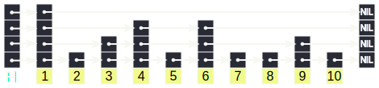
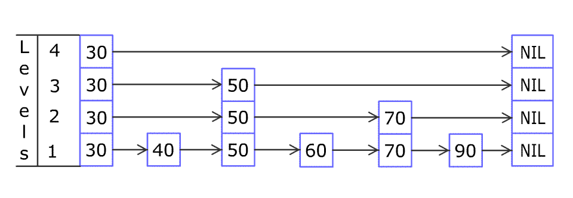

Today I learned about the skip list data structure.

===

# Skip list

The skip list is a data structure that is similar to a linked list with “skip lanes”.
These “skip lanes” are used to provide faster _average_ lookup and insertion times, which become $O(\log n)$ instead of $O(n)$, if you have a sorted linked list of $n$ elements.

The diagram below (taken from [the Wikipedia article on the skip list][source]) shows you a way of representing a skip list:



The diagram shows the head of the list, which stores information about the first node in each skip lane, and then the sequence of nodes with their links in the different skip lanes.


# Implementation of a skip list in Python

I found this a very cool data structure so I decided to implement it in Python.
The code below is a simple implementation that provides iteration over the list and provides adding elements to the list.

The code is heavily commented and it is not optimised.

The class `SLHead` implements the head of the skip list and the class `SkipList` implements a node of the skip list.
To get acquainted with the code:

 1. start by looking at the method `find_at_level` on `SLHead` and then on `SkipList`;
 2. look at the methods `SLHead._find` and `SLHead.find`; and
 3. try to understand how `SLHead.append` works.

The method `SLHead.append` implements node addition by using the skip lanes to find the node that comes immediately before the new node on each skip lane.
Then, it probabilistically determines in how many skip lanes the node should be inserted.

Here is the code:

```py
from __future__ import annotations

from dataclasses import dataclass, field
from math import ceil, log
import random
from typing import Generator


@dataclass
class SLHead:
    length: int = 0
    """Length of the linked list in number of nodes."""
    max_lanes: int = 1
    """Maximum number of lanes, including the base one for the full linked list."""
    skips: list[SkipList] = field(default_factory=list)
    """The first element of each skip lane.

    Lane 0 is the standard linked list.
    This list has length <= max_lanes.
    If len(skips) == max_lanes, then all skip lanes have at least one node.
    If len(skips) < max_lanes, that means there isn't a node at that skip lane yet.
    """

    def find_at_level(self, level: int, data: int) -> SkipList | None:
        """Find the node that is immediately before the given data at a given level.

        This function returns `None` if the given node should be the first node in this
        lane (either because there are no others or because it is smaller than all others.)
        """

        # If we don't have a skip lane at this level, there's no node immediately before.
        if level >= len(self.skips):
            return None
        else:
            return self.skips[level].find_at_level(level, data)

    def _find(self, data: int) -> Generator[SkipList | None, None, None]:
        """Yield the nodes that would come immediately before the given data.

        This uses the skip lanes to find the node that would come immediately before
        for all the lanes.
        The nodes yielded start from the fastest lane.

        For example, the **last** node yielded is the node in the linked list that
        should come immediately before a new node with the given data.

        A value of `None` for a given lane means that this data point should come before
        any other node in that given skip lane.
        """
        search_base: SLHead | SkipList = self

        for level in range(self.max_lanes - 1, -1, -1):
            found = search_base.find_at_level(level, data)
            yield found
            # If we found a concrete node, we can start the next lane search
            # in this node instead of having to start everything from scratch.
            if found is not None:
                search_base = found

    def find(self, data: int) -> list[SkipList | None]:
        """Find all nodes that should come immediately before this one in each lane.

        For example, the **first** node yielded is the node in the linked list that
        should come immediately before a new node with the given data.

        A value of `None` for a given lane means that this data point should come before
        any other node in that given skip lane.
        """
        return list(self._find(data))[::-1]

    def append(self, data: int) -> None:
        """Append a new piece of data to the skip list."""
        self.length += 1
        # Determine if the number of max lanes should expand.
        # We expand before finding because that means the result from finding will have
        # the correct length to allow adding this new node to _all_ the available lanes.
        self.max_lanes = ceil(log(self.length + 1))

        found = self.find(data)
        new_node = SkipList(data)
        # We traverse the found nodes and link them to this new node.
        # Each iteration goes up one skip lane.
        for level, prev_node in enumerate(found):
            # Should this node be the very first node in this lane?
            if prev_node is None:
                # Insert in the beginning and link to the old first one.
                if level < len(self.skips):
                    new_node.skips.append(self.skips[level])
                    self.skips[level] = new_node
                # This is the first and only node in this skip lane.
                else:
                    self.skips.append(new_node)

            # Is the previous node the _last_ node in its lane?
            elif level >= len(prev_node.skips):
                prev_node.skips.append(new_node)

            # The regular case is to insert in the middle of the lane.
            else:
                new_node.skips.append(prev_node.skips[level])
                prev_node.skips[level] = new_node

            # Coin toss; do we stop adding skip lanes to the new node?
            if random.random() < .5:
                break

    def __iter__(self) -> Generator[SkipList, None, None]:
        at: SLHead | SkipList = self
        while at.skips:
            yield (at := at.skips[0])

    def iter_data(self) -> Generator[int, None, None]:
        for node in self:
            yield node.data

    def __repr__(self) -> str:
        skips_to = [node.data for node in self.skips]
        whole_list = list(self)
        return f"{self.__class__.__name__}({self.length}, {self.max_lanes}, {skips_to}; {whole_list}"


@dataclass
class SkipList:
    data: int
    """The piece of data associated with this node."""
    skips: list[SkipList] = field(default_factory=list)
    """The element we are pointing to in each skip lane.

    If this list is empty, this is the last element of the linked list.
    The index 0 of this list is the regular linked list.
    The higher the index, the "faster" the skip lane is.
    """

    def find_at_level(self, level: int, data: int) -> SkipList | None:
        """Find the node that comes immediately before the given data at this level.

        We return `None` if this data should be in the first node, either because there
        are no nodes at this level or because all nodes should come after the data.
        """
        # If this is too big, go back.
        if data < self.data:
            return None

        # If this is the end of this lane, stop.
        if level >= len(self.skips):
            return self

        found = self.skips[level].find_at_level(level, data)
        if not found:  # If the next one is too big, `self`` is the correct answer.
            return self

        return found

    def __repr__(self) -> str:
        skips_to = [node.data for node in self.skips]
        return f"{self.__class__.__name__}({self.data}, skips={skips_to})"
```

To visualise how adding an element works, you can refer to this animation that is also available in the [Wikipedia article about the skip list][source]:



I also wrote some simple tests that helped me make sure the skip list was working.
Just copy and paste this code under the implementation and run your file:

```py
if __name__ == "__main__":
    # Manually build part of the list shown on Wikipedia: https://en.wikipedia.org/wiki/Skip_list
    node20 = SkipList(20)
    node30 = SkipList(30)
    node40 = SkipList(40)
    node45 = SkipList(45)
    node50 = SkipList(50)
    node60 = SkipList(60)
    node70 = SkipList(70)
    node90 = SkipList(90)

    node20.skips = [node30, node30]
    node30.skips = [node40, node50, node50]
    node40.skips = [node45]
    node45.skips = [node50]
    node50.skips = [node60, node70]
    node60.skips = [node70]
    node70.skips = [node90]

    skiplist = SLHead(8, 3, [node20, node20, node30])

    # Tests
    assert skiplist.find_at_level(2, 10) is None
    assert skiplist.find_at_level(1, 10) is None
    assert skiplist.find_at_level(0, 10) is None
    assert skiplist.find_at_level(2, 35).data == 30
    assert skiplist.find_at_level(2, 55).data == 50
    assert skiplist.find_at_level(1, 25).data == 20
    assert skiplist.find_at_level(1, 35).data == 30
    assert skiplist.find_at_level(1, 55).data == 50
    assert skiplist.find_at_level(1, 75).data == 70
    assert skiplist.find_at_level(0, 25).data == 20
    assert skiplist.find_at_level(0, 35).data == 30
    assert skiplist.find_at_level(0, 42).data == 40
    assert skiplist.find_at_level(0, 47).data == 45
    assert skiplist.find_at_level(0, 55).data == 50
    assert skiplist.find_at_level(0, 66).data == 60
    assert skiplist.find_at_level(0, 77).data == 70
    assert skiplist.find_at_level(0, 99).data == 90

    assert skiplist.find(10) == [None, None, None]
    assert skiplist.find(25) == [node20, node20, None]
    assert skiplist.find(43) == [node40, node30, node30]

    numbers = list(range(100))
    random.shuffle(numbers)
    sl = SLHead()
    for num in numbers:
        sl.append(num)
    assert sl.length == 100
    assert list(sl.iter_data()) == list(range(100))
```


[source]: https://en.wikipedia.org/wiki/Skip_list

That's it for now! [Stay tuned][subscribe] and I'll see you around!

[subscribe]: /subscribe
