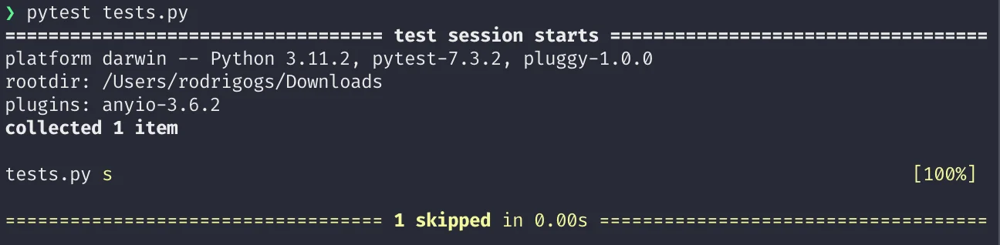

Today I learned how to skip tests on Microsoft Windows in `pytest`.

===

## `pytest.mark.skip`

In `pytest`, you can skip a specific test by using the decorator `pytest.mark.skip`.

For example, the test below will never run:

```py
import pytest

@pytest.mark.skip
def test_yeah():
    assert False
```

Instead of running the test, `pytest` shows it was skipped:



However, the decorator `pytest.mark.skip` will _always_ skip your test.
Sometimes, you only want to skip under certain circumstances.


## How to conditionally skip a test in `pytest`?

If you want to skip a `pytest` test conditionally, you need to use the decorator `pytest.mark.skipif`.

For example, the test below will only run if the current Python version is 3.7 or higher:

```py
import pytest
import sys

@pytest.mark.skipif(sys.version_info < (3, 7))
def test_foo():
    assert True
```

The decorators `skip` and `skipif` also accept a keyword argument `reason` that you can use to give more information as to why you are skipping a given test:

```py
import pytest
import sys

@pytest.mark.skip(reason="We skip because this always fails.")
def test_yeah():
    assert False

@pytest.mark.skipif(sys.version_info < (3, 7), reason="Only works on 3.7+.")
def test_foo():
    assert True
```

We can do a similar thing if we only want a test to run under Windows.
Or if we do _not_ want a test to run under Windows.


## How to skip a test on Microsoft Windows

If you want to skip a test if you are running on Windows, you would mark it with `skipif` and then you check if the platform is Windows.

For example, the test below will not run if the current operating system is Microsoft Windows:

```py
import pytest
import sys

@pytest.mark.skipif(
    sys.platform =="win32", reason="Windows doesn't have what it takes."
)
def test_something_not_on_windows():
    assert ...
```

## How to skip a whole test file

If you want to skip a whole test file, you can assign the result of `skipif` to the global variable `pytestmark`.
For example, the file below would only run its tests if you were running on Windows and specifically with Python 3.10:

```py
import pytest
import sys

pytestmark = pytest.mark.skipif(
    sys.platform == "win32" and sys.version_info == (3, 10)
)

def test_one():
    assert 1 == 1

def test_two():
    assert int("2") == 2

def test_three():
    assert str(3) == "3"
```


## Why would you skip some tests?

There are several plausible reasons why you'd want to skip a couple of tests in “real life”.

For example, you might want to skip some tests in certain versions of Python if you are trying to use functionality that was introduced in a later version of Python.
This could also apply to specific versions of certain dependencies.

Another example, and the reason that led to me learning this, was when working on [Textual](https://github.com/textualize/textual): I needed to skip a specific test if I was _not_ running under Microsoft Windows because I had to implement a function that would only be called under Windows and that would use Windows-specific APIs...
So, even if I wanted to run the test on other operating systems, the test could never pass because those operating systems don't provide the APIs I was using.

If you are curious, [this is the link to the PR](https://github.com/Textualize/textual/pull/2758) where I introduced that change.


That's it for now! [Stay tuned][subscribe] and I'll see you around!

[subscribe]: /subscribe
