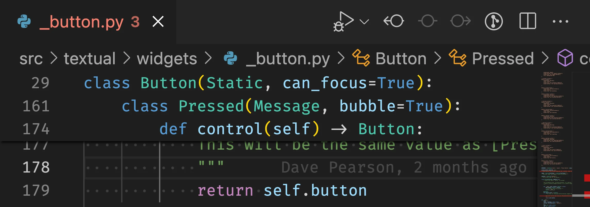

Today I learned how to use VS Code's sticky scroll feature.

===

## VS Code sticky scroll

VS Code's sticky scroll feature will stick the nested structure of your code to the top of your editor.

For example, in the screenshot above, we can see that the lines 29, 161, and 174, define the nesting inside which the code `return self.button` lies.
So, we conclude that `return self.button` is a return statement inside the method `def control(self) -> Button` that is a method of the `class Pressed(Message, bubble=True)`, which is a class that is nested inside `class Button(Static, can_focus=True)`.

To toggle this feature on/off, all you need to do is open your command palette (<kbd>Cmd</kbd>/<kbd>Ctrl</kbd> + <kbd>Shift</kbd> + <kbd>P</kbd>) and type “toggle sticky scroll”.

That's it for now! [Stay tuned][subscribe] and I'll see you around!

[subscribe]: /subscribe
