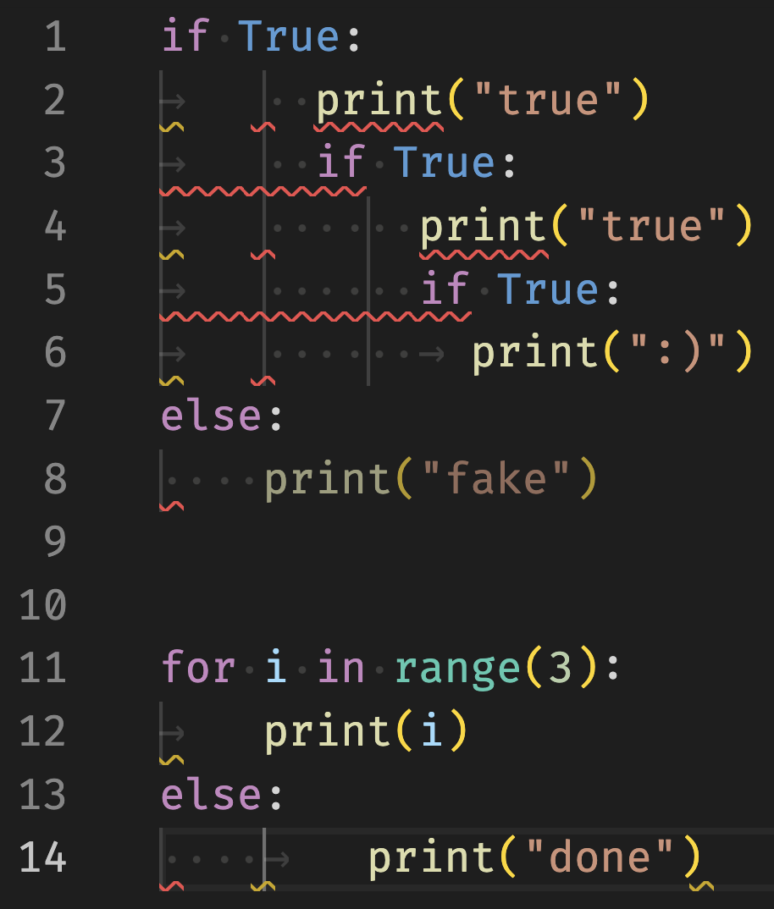

Today I learned that indentation in Python can be quite crazy.

===


# Python indentation

In Python, we use indentation to determine where code blocks start and end.
Turns out, Python is very lax about indentation.

This is a quick overview of the crazy things I found.

! I'm writing about things you can do.
! That doesn't mean you _should_ do them!


## How I thought indentation worked

I thought that, in Python, you had to be pretty consistent with your indentation.
I thought you needed to:

 - pick either tabs or spaces and use them consistently throughout your program; and
 - always use the same depth when indenting (for example, always use 4 spaces).

Oh, was I wrong...


## Inconsistent depth

First of all, it looks like your indentation depth can vary from block to block.
For example, if you paste the code below into a Python file and run it, it will work without any issues:

```py
if True:
    print("4")

if True:
        print("8")

if True:
            print("12")
```

What is more, you can change the size of the indent from one nested block to the other.
The code below shows varying levels of depth as I nest more and more `if` statements:

```py
if True:
 print("1")
 if True:
   print("2")
   if True:
       print("4")
       if True:
               print("8")
```

What is _EVEN WORSE_ is that the depth can also vary for blocks that are tightly coupled together.

For example, an `if` statement can have a certain indentation depth and the `else` can have a different indentation depth:

```py
if True:
    print("4")
else:
        print("8")
```

Then, I thought “surely that's only because the `if` and the `else` are mutually exclusive”.
Again, oh was I wrong!

Here is a piece of code that works perfectly well:

```py
for i in range(3):
    print(i)
else:
        print("done")
```

If you run the code, the output is

```py
0
1
2
done
```

This shows that both blocks run and they can have different levels.

The only thing you can't do is change the indentation level _inside_ a block.
Within that block, indentation must be consistent.

For example, the following code is illegal:

```py
if True:
    print("4")
  print("2")
      print("6")
```

I want to say that it gets worse, but this is pretty bad already.
Now, let me show you what we can do with tabs and spaces.


## Mixing tabs and spaces together

As it turns out, you can also mix tabs and spaces when indenting.
You can do whatever you want, as long as each single level is preserved throughout the block.

!!! Spaces and tabs are hard to distinguish visually.
!!! Some editors will show a faint indicator that lets you distinguish between spaces and tabs.

First, in case you want to try this for yourself and your IDE replaces tabs with spaces automatically, you can just copy the tab character from below:

```pycon
>>> tab = "	"
>>> len(tab)
1
>>> tab == "\t"
True
```

So, let me show you the horrible code you can write, using tabs and spaces all over the place:



Let us start by looking at the nested `if` statements.
How is line 2 indented?
Line 2 was indented by 1 tab followed by 2 spaces!
How terrible is that..?
Finally, the deeper `print(":)")` has an additional tab on top of that.
The corresponding `else` uses a different type of indentation altogether, and Python says nothing.

Again, we might try to believe that among all this craziness, Python only allows the discrepancy between the `if` and `else` because they are mutually exclusive.
But no, that's not it!

The `for ... else ...` shows that is not the case.

In case you want to try this for yourself, here is the code for you to copy and paste:

```py
if True:
	  print("true")
	  if True:
	      print("true")
	      if True:
	      	print(":)")
else:
    print("fake")


for i in range(3):
	print(i)
else:
    	print("done")
```

There you have it.
You can have crazy Python indentation.
Don't do it, though.
It's terrible!


That's it for now! [Stay tuned][subscribe] and I'll see you around!

[subscribe]: /subscribe
