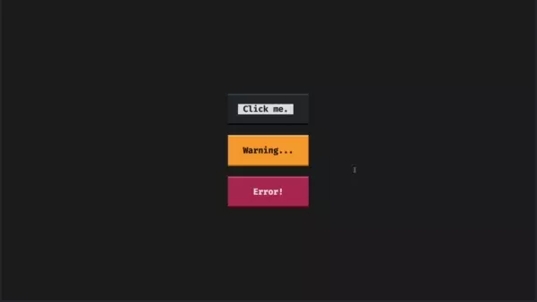

Today I learned how to create app notifications in Textual.

===


# Textual app notifications




[Textual] has added support for application notifications for a couple of versions and I haven't had the chance to play around with them, so this tiny blog article shows how to use them.

! This article was written for Textual version 0.35.1.
! Later versions of Textual may have (small) differences.

The video above shows Textual app notifications in action.
To create a notification, all you need to do is use the method `.notify` on a Textual app.

I created a small application that posts three different notifications when you press the three buttons.
Notifications in Textual can have one of three severity levels:

 1. "information" – the default;
 2. "warning"; and
 3. "error".

I paired each severity level with a different button and I also changed the timeout on the "information" notification so it lingers around for 10 seconds instead of the default (which I think is 2s, but I'm not sure).

The code for the app above is shown below:

```py
from textual import on
from textual.app import App, ComposeResult
from textual.containers import Center, Middle
from textual.widgets import Button


class NotificationsApp(App[None]):
    CSS = "Button { margin: 1; }"

    def compose(self) -> ComposeResult:
        with Middle():
            with Center():
                yield Button("Click me.", id="standard")
                yield Button.warning("Warning...", id="warning")
                yield Button.error("Error!", id="error")

    @on(Button.Pressed, "#standard")
    def standard_notification(self) -> None:
        self.notify("Standard button clicked.", timeout=10)

    @on(Button.Pressed, "#warning")
    def warning_notification(self) -> None:
        self.notify("Attention, this is a warning.", severity="warning")

    @on(Button.Pressed, "#error")
    def error_notification(self) -> None:
        self.notify("An error just occurred!", severity="error")


if __name__ == "__main__":
    NotificationsApp().run()
```

See [the documentation for the method `.notify`](https://textual.textualize.io/api/app/#textual.app.App.notify) to learn more!


[Textual]: https://github.com/textualize/textual
