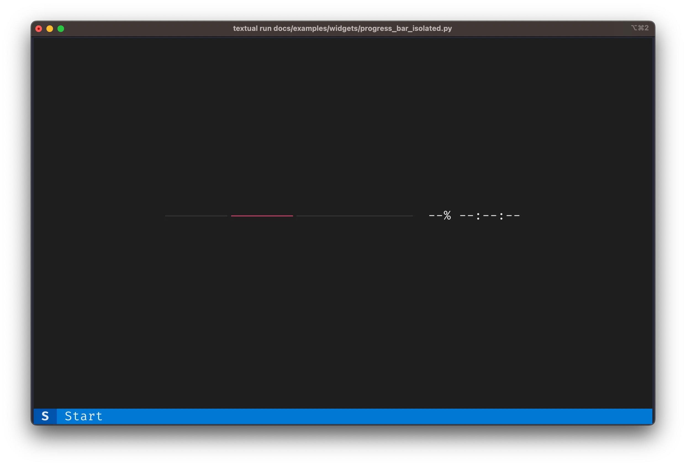

Today I learned how to create a sentinel value to use as a default argument in a way that respects Python typing.

===


## Sentinel value for default arguments

### Context

Today at work I had a problem.
I was working on a progress bar that [Textual] has:



The `ProgressBar` class has a method `update` that you can use to update the status of the progress bar.
The method `update` looked _roughly_ like this:

```py
class ProgressBar(...):
    ...

    def update(
        self,
        total: float | None = None,
        progress: float | None = None,
        advance: float | None = None,
    ) -> None:
        """Update the status of the progress bar."""
        if total is not None:
            self.total = total
        if progress is not None:
            self.progress = progress
        if advance is not None:
            self.progress += advance
```

By calling `update`, you can change the total “size” of the progress bar (`total`), you can change how far along you are with the progress (`progress`), and you can increment the current progress by a given amount (`advance`).

For example, if you create a progress bar `pb` and then call `pb.update(total=100, progress=30, advance=7)`, your progress bar ends up at 37% completion and it would look something like this:


What's the problem, then?


### Using another default value instead of `None`

The default value for `total` is `None`, but the truth is that I also want to be able to set `total` to `None`, because that turns the progress bar into its indeterminate/pulsing state.
So, how can I do this?

The answer is obvious: just use another default value!

That's right, but I can't use any random default value, because then the typing will look odd!
For example, I could use the string `"default"`, and modify the method to look like this:

```py
class ProgressBar(...):
    ...

    def update(
        self,
        total: float | str | None = "default",
        progress: float | None = None,
        advance: float | None = None,
    ) -> None:
        """Update the status of the progress bar."""
        if not isinstance(total, str):
            self.total = total
        if progress is not None:
            self.progress = progress
        if advance is not None:
            self.progress += advance
```

The problem with this, I argue, is that it looks really odd to have `total` accept values of the type `str`, when it really doesn't, it's just so that the typing matches the default value given...

In other words, if I just had

```py
...
total: float | None = "default",
...
```

then the typing would be wrong.
And I want to have the code typed correctly, if possible.

So, how do we solve this?


### Using `object` as the default value

My next thought went to using `object` as the default value.
So, something like this:

```py
_sentinel = object()

class ProgressBar(...):
    ...

    def update(
        self,
        total: float | None | object = _sentinel,
        progress: float | object = _sentinel,
        advance: float | object = _sentinel,
    ) -> None:
        """Update the status of the progress bar."""
        if total is not _sentinel:
            self.total = total
        if progress is not _sentinel:
            self.progress = progress
        if advance is not _sentinel:
            self.progress += advance
```

This looked promising, but there is another typing issue with this approach...
And that's that _anything_ you pass in to `update` will satisfy the type-checker!

For example, if you write something like

```py
pb.update(total="billions", progress=(1, 2), advance=True)
```

the type-checker will not complain, because all the parameters accept the type `object`, and everything in Python is an instance of `object`:

```pycon
>>> isinstance("billions", object)
True
>>> isinstance((1, 2), object)
True
>>> isinstance(True, object)
True
```

So, `object` isn't quite the answer we are looking for.

I thought some more and I ended up going down a rabbit hole that involved `TypeVar` and `TypeGuard`...
And I got it to work with a bit of help!
But it was way more complicated than the solution I'm about to present next.


### Create a sentinel class

A simple solution that satisfies the type-checker involves creating an empty sentinel class!
Then, you create an instance of that class and use it as the default value for the parameters.
Something like this:

```py
class UnusedParameter:
    pass

_sentinel = UnusedParameter()

class ProgressBar(...):
    ...

    def update(
        self,
        total: float | None | UnusedParameter = _sentinel,
        progress: float | UnusedParameter = _sentinel,
        advance: float | UnusedParameter = _sentinel,
    ) -> None:
        """Update the status of the progress bar."""
        if not isinstance(total, UnusedParameter):
            self.total = total
        if not isinstance(progress, UnusedParameter):
            self.progress = progress
        if not isinstance(advance, UnusedParameter):
            self.progress += advance
```

With this simple solution, we satisfy all requirements!
Quite nice, right?

I got this pattern from Will McGugan's `rich` library, where he pointed me to a [method `update` that does a similar thing](https://github.com/Textualize/rich/blob/720800e6930d85ad027b1e9bd0cbb96b5e994ce3/rich/console.py#L170-L182).
If all goes well, my [new version of the method `ProgressBar.update` will be merged soon](https://github.com/Textualize/textual/pull/3286/commits/65a7f1ed7159b615e2d6509846727d4214fa20f3)!


[textual]: https://github.com/textualize/textual
