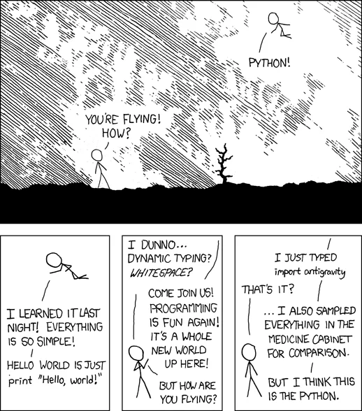
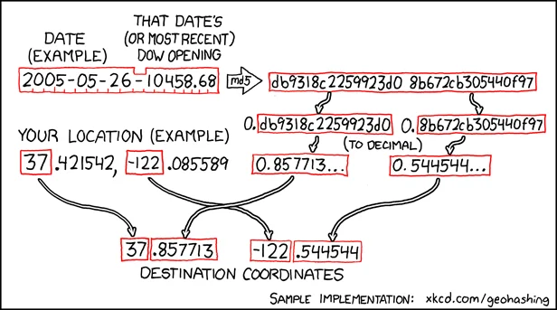

Today I learned that Python has nested Easter eggs in the standard library.

===


## Nested Easter eggs

If you open the Python REPL and type `import antigravity` or if you put that in a script and then run it, Python will open your browser and take you to <https://xkcd.com/353/>, where you can find the following comic:



According to a [blog article by Guido van Rossum](http://python-history.blogspot.com/2010/06/import-antigravity.html), this was added to Python 3 as an Easter egg _after_ the comic was created, which is quite cool if you think about it.

Randall Munroe, the author of the comic, joked about Python and his joke ended up materialising as a module.

But then, if you [inspect the source code for the module `antigravity` in Python 3.13](https://github.com/python/cpython/blob/b2ae23467230cce4249df20f2e947a6cf93578b0/Lib/antigravity.py), you will find _another_ Easter egg:

```py
import webbrowser
import hashlib

webbrowser.open("https://xkcd.com/353/")

def geohash(latitude, longitude, datedow):
    '''Compute geohash() using the Munroe algorithm.

    >>> geohash(37.421542, -122.085589, b'2005-05-26-10458.68')
    37.857713 -122.544543

    '''
    # https://xkcd.com/426/
    h = hashlib.md5(datedow, usedforsecurity=False).hexdigest()
    p, q = [('%f' % float.fromhex('0.' + x)) for x in (h[:16], h[16:32])]
    print('%d%s %d%s' % (latitude, p[1:], longitude, q[1:]))
```

The only function defined in that module is yet another reference to another xkcd comic, this time [comic 426](https://xkcd.com/426/):



I can't help but smile when I think about the fact that Python, a language used by so many corporations and that plays such an important role in our lives – whether we understand that or not — apparently has a sense of humour.
