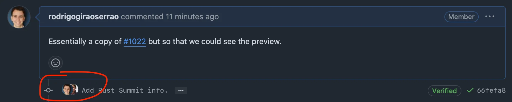

Today I learned how to create co-authored commits on GitHub.

===


# Co-authored commits

On GitHub, co-authored commits allow you to add two or more people as the authors of a commit, effectively marking that commit as a contribution done by multiple users.
When a commit has co-authors, GitHub displays those multiple authors next to the commit, as shown in the image below:




## Adding a co-author

To add co-authors to a commit, the extended commit message should end with a `Co-authored-by` line, that looks like this:

```txt
Co-authored-by: NAME <GITHUB EMAIL>
```

If you use the co-author's GitHub email, then the commit will count as a contribution by that author.
To find the author's GitHub email, either ask them, or figure the email out on your own.


## Finding a GitHub email

To find the email someone uses on GitHub, start by finding a commit they made (for example, open their repositories and open a random commit in one of their repositories).
That will give you a link that ends with a long commit hash.

For example, for the commit of the screenshot above, the URL is <https://github.com/EuroPython/website/pull/1023/commits/66fefa8d679f96eef658432e5425c19c13fbb030>.

Then, add `.patch` to that URL, which will open a very basic page with some info on that commit; most importantly, at the top is the information of the author of the commit.
As an example, if you add `.patch` to the URL I showed above, the top of the page will show this information:

```txt
From 66fefa8d679f96eef658432e5425c19c13fbb030 Mon Sep 17 00:00:00 2001
From: =?UTF-8?q?Rodrigo=20Gir=C3=A3o=20Serr=C3=A3o?=
 <5621605+rodrigogiraoserrao@users.noreply.github.com>
Date: Thu, 27 Feb 2025 16:54:26 +0000
Subject: [PATCH] Add Rust Summit info.
```

If you squint your eyes, you'll find the email I use on GitHub!
