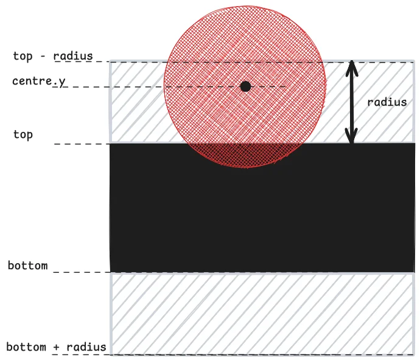

Today I learned how to detect collisions between circles and rectangles with 100% accuracy.

===

# Circle vs rectangle collision detection

In a [JavaScript tutorial I published recently](/blog/javascript-2d-scrolling-game-tutorial), the game that I presented included some very basic collision detection between a circle and a rectangle, and it used the circle's bounding box.
This meant that the collision detection sucked if the circle was close to the corners of the rectangle.

Today I sat down to think about it for a second and figured out how to implement pixel-perfect collision detection between a rectangle and a circle, as the demo below demonstrates:

<canvas id="mainCanvas1" style="background:var(--ui); margin: auto; display: block;"></canvas>

The first thing I implemented was pixel-perfect collision detection with the _corners_ of the rectangle.
This is easy to check because each corner is a single point and to check if a single point is inside a circle amounts to checking if the distance between the point and the centre of the circle is less than the radius of the circle:

$$
(p_x - c_x)^2 + (p_y - c_y)^2 \leq r^2\ ?
$$

In the demo below, try getting the circle close to the corners of the rectangle: that's when a collision is detected.

<canvas id="mainCanvas2" style="background:var(--ui); margin: auto; display: block;"></canvas>

The corners are the hardest part.
After taking care of that, it's easy to check if the circle is inside the rectangle or too close to its edges.
The diagram below helps to understand how to check if the rectangle is too close to the top or bottom edges of the rectangle: the coordinate $y$ of the rectangle needs to be below the value `top - radius` and above the value `bottom + radius`, while also being horizontally aligned: $left \leq c_x \leq right$.

