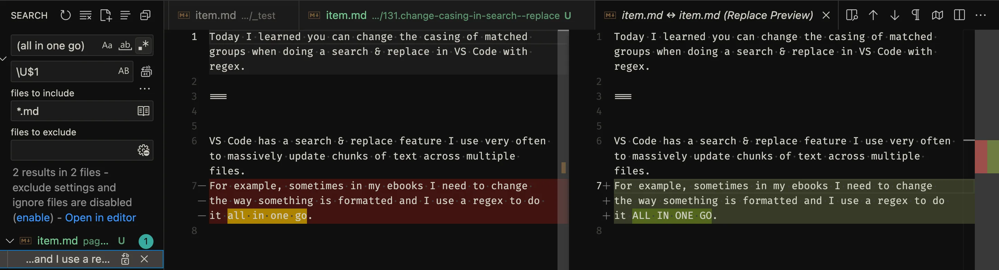

Today I learned you can change the casing of matched groups when doing a search & replace in VS Code with regex.

===


VS Code has a search & replace feature that lets you use regex to look for patterns and then reference groups in the replacement...
But it lets you do something else that's really cool.


## Changing casing with special sequences

When you are replacing groups, you can use special sequences to change the casing of the group you're inserting, according to the following table:

| Sequence | Effect |
| - | - |
| `\u` | Uppercase the first letter |
| `\U` | Uppercase the whole group |
| `\l` | Lowercase the first letter |
| `\L` | Lowercase the whole group |

The picture below shows an example of a search & replace operation where I looked for the text “all in one go”.
I enclosed that in a regex group and I'm replacing it with the pattern `\U$1`, which means the replacement would be the all-uppercase string “ALL IN ONE GO”:



Pretty nifty, right?


## The same thing in Python

The module `re` in Python supports searching and replacing with the function `re.sub` but it doesn't let you do the same case-changing operations with special sequences.
Instead, you have to use the fact that [`re.sub` supports dynamic string replacements](https://mathspp.com/blog/dynamic-string-replacements-with-regex) and then implement the logic yourself.

First, you can't use the string methods `upper` and `lower` directly for `\U` and `\L`; you have to grab the text from the object `Match`.
You also have to pick the string apart to implement the `\u` and `\l`:

```py
def all_upper(match):  # \U
    return match.group(0).upper()

def first_upper(match):  # \u
    s = match.group(0)
    return s[0].upper() + s[1:]

def all_lower(match):  # \L
    return match.group(0).lower()

def first_lower(match):  # \l
    s = match.group(0)
    return s[0].lower() + s[1:]
```

Here's an example:

```py
# E.g., same behaviour as \U$0 in VS Code:
re.sub(
    "all in one go",  # pattern to search for
    all_upper,  # dynamic replacement
    "... all in one go ...",  # source text
)  # -> '... ALL IN ONE GO ...'
```

| VS Code sequence | Python function |
| - | - |
| `\u` | `first_upper` |
| `\U` | `all_upper` |
| `\l` | `first_lower` |
| `\L` | `all_lower` |
