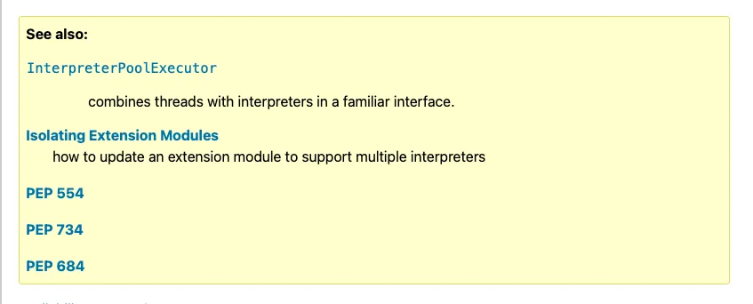

Today I learned how to build the Python documentation to preview changes I wanted to make.

===


If you're not on Windows, all it takes is to run `make -C Doc venv htmllive` to build the Python documentation locally and to preview it.
This command will build the documentation, start a local server to browse the docs, and also watch for changes in the documentation source files to live-reload while you edit!

I needed this because the Python 3.14 documentation for the module `concurrent.interpreters` had a terrible-looking “See also” callout with elements that were grossly misaligned:



However, since I don't know rST, only Markdown, the issue wasn't obvious to me:

```rst
.. seealso::

   :class:`~concurrent.futures.InterpreterPoolExecutor`
      combines threads with interpreters in a familiar interface.

    .. XXX Add references to the upcoming HOWTO docs in the seealso block.

   :ref:`isolating-extensions-howto`
       how to update an extension module to support multiple interpreters

   :pep:`554`

   :pep:`734`

   :pep:`684`
```

After some Googling, turns out the problem is the comment `.. XXX Add references...`.
Since it's indentend four spaces, it's being interpreted as a blockquote!
The fix was just deleting a single space from the left of `.. XXX ...`.

However, I did not stop there!
I went above and beyond, capitalising the sentences and adding a full stop to the one that didn't have it!

In the end, the “See also” callout was looking better:


