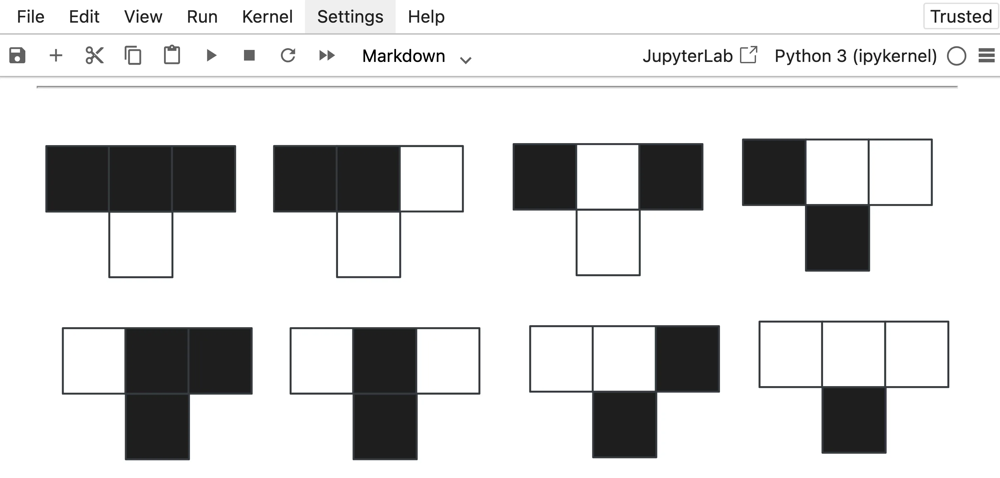

Today I learned how to inline SVGs in Jupyter notebooks in two simple steps.

===

Today I learned how to inline SVGs in Jupyter notebooks in two simple steps:

 1. URL-encode the SVG markup. If you have an SVG file, open it and copy the contents of the file starting from the `<svg>` tag all the way up to the closing `</svg>` and encode it so it's safe to use in a URL. You can use [this URL encoder tool I created](https://tools.mathspp.com/url-encode).
 2. Add an image using Markdown syntax with ``.

For any non-trivial SVG the URL-encoded string will look huge and nasty, as the image below shows:

But when I “execute” the cell to render the Markdown, the SVG displays neatly:

This was an interesting endeavour because I thought I could just paste the SVG markup in the notebook cell and it would be rendered; I was under the impression that you could write arbitrary HTML in those cells.
I was either wrong or I did it in the wrong way!
