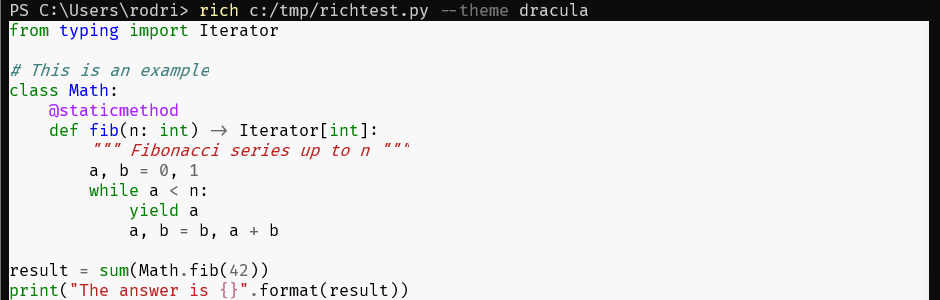
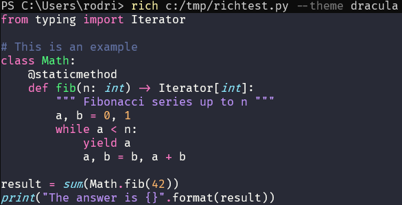

A cautionary tale of why you should use virtual environments in Python.

===

What are virtual environments?

Why should you care about using them with Python 🐍?

I'll answer these two questions...

And I'll do so by telling you how I screwed up by not using virtual envs.

👇🧵

A virtual environment is like a sandbox, a safe place.

In a virtual environment, the packages you install don't interact with the packages outside the env.

That's just it.

That's a virtual environment.

So, why would you care about it?

I can explain, and I'll do so by telling you something that happened to me the other day.

(I think it was on Monday..?)

Lately, I have been playing around with the new `rich-cli` that @willmcgugan published.

It's a neat tool that lets me, for example,
print code files to the terminal with syntax highlighting.

Installing it was easy enough:

`pip install rich-cli`

After installing it, I used it to highlight the syntax of a .py file I had.

I noticed there was an option to customise the syntax highlighting...

So, I picked the theme Dracula and ran it:

`rich c:/tmp/richtest.py --theme dracula`

Sadly, it didn't work:

That white background and those bright colours are not the Dracula theme.

I opened an issue on the GitHub page, and Will (the maintainer, nice chap) asked me to try to update `pygments`.

`pygments` is a Python package that does syntax highlighting, and `rich-cli` depends on it.

So, I tried updating `pygments`, and I managed to do so.

I had version 2.8.1 installed, and updated it to 2.11.2.

After updating, I ran the same command:

`rich c:/tmp/richtest.py --theme dracula`

And it worked!

So...

Why didn't `rich-cli` install the correct version of `pygments`?

When I installed `rich-cli`, I got this message:

“Requirement already satisfied: pygments<3.0.0,>=2.6.0”

That's because I already had `pygments` on my machine (version 2.8.1).

However, turns out that `rich-cli` needs a more recent version of `pygments`!

That's why _I_ had to upgrade `pygments`...

Even though I already had it, because some other package required it...

So, now that I upgraded `pygments`, did I break other package(s) that were using `pygments` v2.8.1..?

I have _no idea_!

I have no idea because I can't even _remember_ what package(s) required `pygments`!

I may very well have broken something in my system 😢

This is what virtual environments help protect against!

Imagine I had installed `rich-cli` in a virtual environment.

In doing so, I would have gotten a fresh install of `pygments` _just_ for `rich-cli`,
and everything would've worked from the get-go!

So that's _why_ you should care about virtual environments!

I hope this thread was helpful to you!
If it was, follow me @mathsppblog for more Python 🐍 content!

And FYI, you can find all my threads in blog form here 👉 https://mathspp.com/blog/twitter-threads

TL;DR:

 - Virtual environments create sandboxes for your package installations.
 - They help manage interdependencies by removing interactions between packages.
 - `rich-cli` is awesome and you should install it.

See you around! 👋
