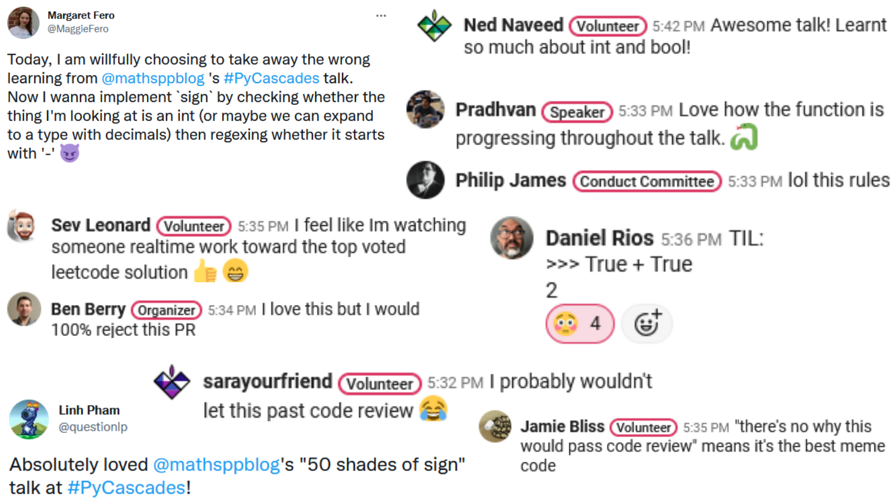

All the references and links regarding my PyCascades 2022 talk.

===

Today I gave a Python 🐍 talk at @pycascades.

I took the attendees through a journey of inspecting plenty of different (crazy) implementations of the simple `sign` function!

I had a blast 🥳

Here are the links to the talk slides, the written version of the talk, and more!

Huge shout-out to the @pycascades organisers for creating such a wonderful and inclusive conf for everyone!

Interacted quite a bit w/ @AetherUnbound and she was always very helpful!

Also, thanks to @MaggieFero, @questionlp, @gizm0_0, @bengerman13 & others for the feedback.

The written version of the talk can be found on my blog 👇

https://mathspp.com/blog/50-shades-of-sign

It doesn't match the talk 100%, but the overall flow is pretty much the same!

The talk slides are available on GitHub (https://github.com/mathspp/talks) and the recording will be put up on YouTube soon-ish.

Btw, the #1 question I get is regarding what I use to create my slide animations 😂
It's Power Point '19 + the slide transition called "morph".

The (free) Python 🐍 book that teaches you how to use some of the things I mention during the talk, like

 - Truthy and Falsy values; or
 - conditional expressions

can be found at https://gum.co/pydonts

Plus, all the article references for the talk:

 - https://mathspp.com/blog/pydonts/does-elegance-matter
 - https://mathspp.com/blog/pydonts/code-style-matters
 - https://mathspp.com/blog/pydonts/pydont-disrespect-the-zen-of-python
 - https://mathspp.com/blog/pydonts/truthy-falsy-and-bool
 - https://mathspp.com/blog/pydonts/conditiona-expressions
 - https://mathspp.com/blog/til/028
 - https://mathspp.com/blog/50-shades-of-sign
 - https://twitter.com/mathsppblog/status/1442042804398665732

I REALLY hope you enjoyed the talk... I know I love talking about Python!

If you know of any Python conferences or meetups looking for speakers, drop me a line! Either DM me here or send me an email to rodrigo at mathspp dot com!

Other than that, I'll see you around 😉

👋
