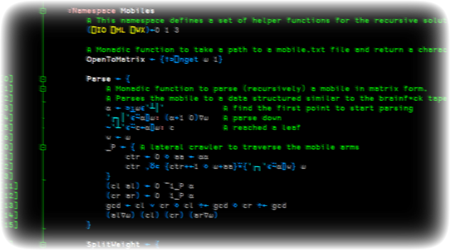

---
metadata:
    description: In this blog post I share my thoughts on and solution of the 2020 Dyalog APL student competition.
title: My two cents on the 2020 APL competition
---

The 2020 APL programming competition was tough! In this post I share a couple of thoughts and my solutions.

===



The [Dyalog APL competition][apl-comp] is an annual competition held by [Dyalog] for students from around the world to test their APL skills on two sets of problems.

In Phase $1$ of the competition we are given $10$ simpler problems that can be usually solved in one line of APL code and these we can solve directly in the browser. We submit our answers and the competition software rates your solutions as failing, passing with silver or passing with gold. You only get gold if you pass the tests for the edge cases, but that doesn't ensure your solution is $100\%$ correct, it just means it passed some preliminary test cases.

Phase $2$ of the competition is composed of a variable number of problems of varying difficulties; some are really easy and some are really hard. You can find the problem sets for all previous competitions [here][prob-sets].

I started learning APL around March of 2020 with the sole purpose of competing in the 2020 edition of the student competition. The submissions were due by the 31st of July (a week ago) and I am pleased to tell you - not that you care - that I submitted solutions to all problems and I feel I did a decent job. On the other hand, I am a very young APLer & I have _no_ idea who are the students from all around the world that competed so I wouldn't be surprised if I place poorly in the final ranking.

Regardless of that, I have found APL to be really enjoyable for various reasons, from the fact that I feel it is very maths oriented to it being so "weird" with its funny-looking primitive functions (e.g. `⍋` or `⍳`). Another thing that helped a lot was me having found APL through [codegolf], which led me to [The APL Orchard], where a bunch of friendly folks taught me pretty much everything I know about APL and array-oriented programming.

Next year I won't be a student but I will be looking forward to participating again!

### My solutions for Phase 1

Like I said above, Phase $1$ is supposed to be easier and these were my submissions:

<script src="https://gist.github.com/RojerGS/9ef6cd01f0f521d2b685425d69a85b0d.js"></script>

I should note that, even though I got golden trophies for all the $10$ submissions, I managed to get at least one of the solutions partially wrong! In fact, the problem statement of the tenth problem clearly states that my submission should behave like `{⎕←⍵}¨`, which applied to `'ab'` gives

```apl
      {⎕←⍵}¨ 'ab'
a
b
```

whereas my solution gives

```apl
      {↑⊃,/↓∘⍕¨⍵} 'ab'
ab
```

so there is that. I am also not very pleased with my `P4` and `P9` and I really like what I have done for `P2` and `P3`.

### My solutions for Phase 2

Phase $2$ was a tougher nut to crack, with some problems requiring a lot of thinking and experimenting. Even so, some of the tasks were really easy, like the `pv` (Task $2$ from problem $5$) and the `CheckDigit` (Task $1$ from problem $7$). All in all, a very pleasant experience.

Now I will share my solutions for the $9$ problems and comment a bit on some of them.

#### Problem 1

<script src="https://gist.github.com/RojerGS/6f8912674c5285a3d3dd98ad21680a76.js"></script>

I wrote a first solution for this problem that only worked for inputs of lengths $3$, $5$ or $7$ (like the problem statement guarantees) and I explicitly sorted the input scores with `⍵[⍋⍵]` but then I decided to try and not sort `⍵` explicitly and make it work for any odd-length input `⍵`. That is how I ended up with this solution.

#### Problem 2

<script src="https://gist.github.com/RojerGS/393a63a1af1b21c7edbd98491d5b3c70.js"></script>

For problem 2 it looked like I would be able to write the case `⍺ < 0` in terms of the `⍺ > 0` case... And for some time I thought I had done that, but then I noticed my code was failing for one of the test cases and I fell back to writing the `⍺ < 0` case explicitly.

#### Problem 3

<script src="https://gist.github.com/RojerGS/23c6da18edb0d66b9624a98f120e5225.js"></script>

This was a fairly standard problem and regexes do all the heavy lifting for me.

#### Problem 4

<script src="https://gist.github.com/RojerGS/aa060988925754356166d76904823c7b.js"></script>

Problem 4 had two tasks borrowed from the [Rosalind] website, a website with problems on bioinformatics. Even so, the two tasks aren't connected in any obvious way and the second task is just a simple problem in maths (althought I am not saying it doesn't matter for bioinformatics!).

For the first task I tried really hard to do it in an array-oriented way without using the each `¨` operator, which for me looks like a `for elem in iterable` loop in Python (and a loop I am very used to using). I still ended up using `⍤0 1` which to me looks a bit like the `¨`, but I was happy with what I had done so I let the `⍤` be.

The second task was _really_ easy and I just had to implement repeated squaring so as to make `PowerMod` an efficient function. Maybe part of the challenge of this problem was in figuring out that a set of $n$ elements has $2^n$ subsets but I have studied this in my degree so I did not have to spend any time thinking about that. For those of you who don't know the algorithm, repeated squaring is a really efficient way of computing $b^n$ for large $n$. Let's say we want to compute $2^857$.

We just have to note that

\[
    \begin{align}
    2^{857} &= 2^{1\times 1 + 0\times 2 + 0\times 4 + 1\times 8+ 1\times 16 + 0\times 32 + 1\times 64 + 0\times 128 + 1\times 256 + 1\times 512} \\
    &= 2^{1+8+16+64+256+512} \\
    &=  2^{1}\times2^{8}\times2^{16}\times2^{64}\times2^{256}\times 2^{512}
    \end{align}
\]

and because of the recurrence relation

\[
    2^{(2^{k+1})} = \left(2^{(2^k)} \right)^2
\]

we only need to compute $10$ powers, all of which are squares of the previously computed power (hence the name "repeated squaring"). Writing this algorithm in APL was funny and I didn't manage to avoid the usage of `⍣` to compute the squares... Now I feel dumb, I _just_ opened the interpreter as I was writing this and I could have gone with `*⍨\`, or maybe `{⍺←1 ⋄ m|⍺*⍵}\` so as to keep the modulo operations in every intermediate step... Oh boy, I hope this doesn't cost me too much!

#### Problem 5

<script src="https://gist.github.com/RojerGS/0ffe48f804f4f46c215c50a3d7fe4e44.js"></script>

I found problem $5$ to be _really_ enjoyable because it was so maths oriented. Solving the first task in an array-oriented way was a really fun challenge for me.

To solve this problem I just had to write down the recurrence relation to see how it really worked, from which I got (assuming `⎕IO←0`):

\[
    \begin{cases}
    r_1 = \alpha_0 \\
    r_2 = \alpha_1 + \alpha_0\omega_1 \\
    r_3 = \alpha_2 + \alpha_1\omega_2 + \alpha_0\omega_2\omega_1 \\
    r_4 = \alpha_3 + \alpha_2\omega_3 + \alpha_1\omega_3\omega_2 + \alpha_0\omega_3\omega_2\omega_1 \\
    \cdots
    \end{cases}
\]

so it became clear that I had to compute the cumulative rates that involved multiplying consecutive omegas, and then I just had to multiply every one of those products with the correct withdrawal/deposit, and add in the end.

I decided to write these partial results in matrices, where each row would contribute to one $r_i$:

\[
    rt = \begin{bmatrix}
    0 & 0 & 0 & 0 & \cdots & 0 \\
    \omega_1 & 0 & 0 & 0 & \cdots & 0 \\
    \omega_2 \omega_1 & \omega_2 & 0 & 0 & \cdots & 0 \\
    \omega_3 \omega_2 \omega_1 & \omega_3 \omega_2 & \omega_3 & 0 & \cdots & 0 \\
    & & \cdots & & &
    \end{bmatrix}
\]

and

\[
    a = \begin{bmatrix}
    \alpha_0 & 0 & 0 & 0 & \cdots & 0 \\
    \alpha_0 & \alpha_1 & 0 & 0 & \cdots & 0 \\
    \alpha_0 & \alpha_1 & \alpha_2 & 0 & \cdots & 0 \\
    \alpha_0 & \alpha_1 & \alpha_2 & \alpha_3 & \cdots & 0 \\
    &  & \cdots & & \ddots & \alpha_n
    \end{bmatrix}
\]

After the matrices are built we just multiply them component by component and perform addition over the rows.

The second task was particularly easy and a simple train solved it neatly (I think).

#### Problem 6

<script src="https://gist.github.com/RojerGS/ddc89dbebab4fd7a812ea83f517c6042.js"></script>

I didn't enjoy problem $6$ very much because I figured regular expressions would do the job fairly well and the other bit of work that we had to do was effectily offered to us in the problem statement in the problem notes. I tried making the most out of it by trying not to use `⎕nl`, which had me write something that looks like a `try ... except ...` block in Python. In the end I reverted back to the `⎕nl` solution because it looked more APLish.

#### Problem 7

<script src="https://gist.github.com/RojerGS/955db89c6ea6ddf96825fc78f3dce9a9.js"></script>

Problem $7$ was an interesting problem with three tasks; the first task, to write `CheckDigit`, was pretty much given to us in the problem statement. However, task $3$ really caught my attention.

For some reason, I find it elegant when a given function has a couple of "branches" and then I am able to write some of the branches in terms of the others, and I often do that by having the function call itself recursively with modified arguments. A silly example would be a function `f` that sums two numbers if the right argument is positive or $0$ and subtracts them otherwise. In this case, I could write

```apl
f ← {
    ⍵<0: ⍺∇-⍵
    ⍺ + ⍵
}
```

Because `ReadUPC` is supposed to accept barcodes read from left to right and from right to left, I spent some time trying to figure out how an elegant way for the function to recursively call itself if the barcode was read from right to left. In the end, because of all the input checking I was doing I thought that would just make the function inefficient and I ended up using some basic arithmetics (multiplying by $1$ and by $0$) to distinguish between the two directions the input barcode could be given in.

#### Problem 8

<script src="https://gist.github.com/RojerGS/99bbab8cd5728858608fd20502d59aba.js"></script>

The reason for which I found this problem easy was the same reason that led me to solve the `sset` with ease, because I have studied related topics in my maths degree. _However_, I have no idea if I did what was expected of a good solution. The problem statements says, and I quote,

 > "Understanding the nuances of the problem is the key to developing a good algorithm."

I did went online and looked up literature on subset sum problems... And I found nothing to looked suitable for this problem.

The point here is that my solution is pretty much brute-force... But it is really elegant (or at least, I think it is) in the sense that it is purely array-oriented; and because the problem statement guarantees a cap on the size of the input, it works really fast... So all in all, I am very happy with this solution of mine _but_ the judges of the competition may not!

#### Problem 9

This was, by far, my favourite problem of the competition. I wrote two solutions for this problem. I started out with a recursive solution because I wanted to be sure I solved all the problems of the competition. After the recursive solution was working, I decided to address the judges' remark on the problem:

 > "This is the most difficult problem in the competition and likely requires an iterative or recursive solution. (If you find an elegant, array-oriented solution, we'll be really impressed!)"

##### Recursive

<script src="https://gist.github.com/RojerGS/8845dc6a7191bc66cb9d2733e44261d5.js"></script>

My recursive solution started out way bigger than what it is now, given that with more thinking I realized several parts were unnecessary. The basic idea is to parse the character matrix with the mobile into a tree-like data structure similar to the one I found in [brainf*ck's workspace][bf].

I turn a mobile like

```txt
           ┌───────┴───────┐     
           │           ┌───┴───┐ 
           │           │       A 
       ┌───┴───────┐   │         
       │           B   │         
       │  ┌────────────┴───────┐ 
       │  C                    D 
 ┌─────┴───────┐                 
 E             F                 
```

into something like

```apl
┌───────────────┬─┬─┬────────────────┐
│┌───────┬─┬─┬─┐│1│1│┌────────┬─┬─┬─┐│
││E 3 4 F│1│2│B││ │ ││C 13 8 D│1│1│A││
│└───────┴─┴─┴─┘│ │ │└────────┴─┴─┴─┘│
└───────────────┴─┴─┴────────────────┘
```

Then I would traverse the tree structure and compute everything I want and need, from the total weight of the mobile, to the set of letters used by the mobile, to the weight of each particular letter. Except I don't need any of that. Even now, I could compute everything in one go instead of creating the intermediate representation I showed above, but I figured it would be slightly more elegant this way, assuming the hypothetical scenario in which you'd want to perform more operations on the mobile.

##### Array-oriented

When everything else was solved, I set out to solve this problem in an array-oriented way. I knew it was possible, I just had to figure out how to do it. I can say there was a week in which I did two $2$h walks and most of the time I was walking I was trying to figure out how to make this work.

In the end I managed to do it and I am really pleased with the end result; for an explanation of how it works, you can read the comments above the code:

<script src="https://gist.github.com/RojerGS/7f09c6314c3c6bdfab34e4594c728fc6.js"></script>

Another small thing I did that I take pride on was not assuming the end points of the mobile are upper case letters. For me, those end points can be any character that is not a blank space or any of `┐┴┌│─` as those are used for the structure of the mobile.

[apl-comp]: https://dyalogaplcompetition.com
[Dyalog]: https://dyalog.com
[prob-sets]: https://www.dyalog.com/student-competition.htm
[codegolf]: https://codegolf.stackexchange.com/users/75323/rgs
[The APL Orchard]: https://chat.stackexchange.com/rooms/52405/the-apl-orchard
[Rosalind]: http://rosalind.info
[bf]: https://dfns.dyalog.com/n_bf.htm
