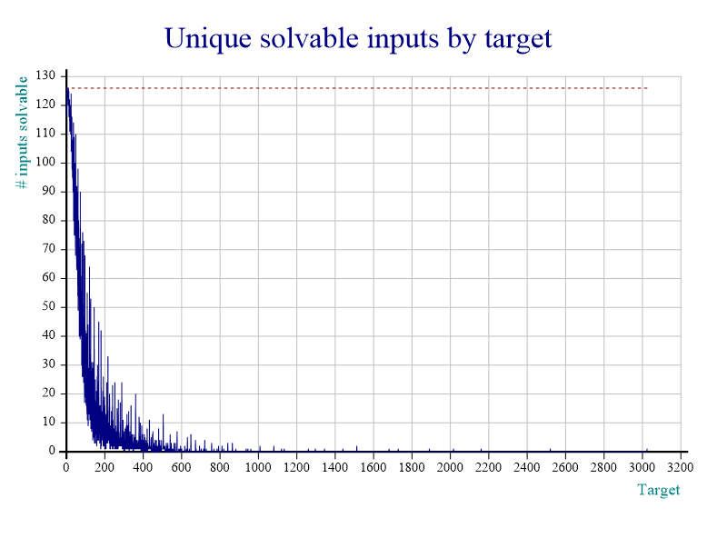

The [24 Game][24-game] is a well-known maths game that is played with kids in school to help them master the four basic arithmetic operations. In this blog post we will study the game in depth.

===

### The game

The "24 Game" is a simple game. You are given four numbers between $1$ and $9$ (for example $\{1, 2, 3, 4\}$) and your objective is to find an expression that evaluates to $24$. The rules are fairly simple:

 - each given number must be used exactly once;
 - the only operations available are addition, subtraction, multiplication and division;
 - operations may be used repeatedly or not at all;
 - operation precedence can be manipulated by the use of parentheses;
 - no "clever tricks" should be used, only simple arithmetics.


#### Examples

If the given numbers are $\{1, 2, 3, 4\}$, an answer could be

 - $1 \times 2 \times 3 \times 4$.

If the given numbers are $\{2, 5, 7, 8\}$, an answer could be

 - $(2\times 5 - 7)\times 8$.


### The motivation

I was talking to a friend who had just challenged me to make $24$ out of $\{3, 3, 8, 8\}$ ([give it a try yourself][P020]) and as we talked about the game, we asked each other "Why is $24$ the target value? Is $24$ special in any way?".

I had already written a computer program that solves instances of the game so we decided we could use said program to find out neat things about the game itself.

!!! To make my life easier writing this blog post, let's agree that when I talk about _input_ I mean the numbers you have to use to make $24$ and when I talk about the _target_ I mean the number you are trying to make, which is $24$ in the standard game.

### The code

The questions I will be asking in this blog post were answered with the help of some programming I did in [APL]. I defined a couple of useful functions that you can find at the end of this post; throughout the blog post I will be using those functions to answer the questions I will present.

The first question me and my friend asked was

#### Does $24$ work for any input?

As far as I know, the game is usually played by giving four distinct numbers as input, so $\{2, 3, 4, 5\}$ is a valid input but $\{3, 3, 4, 5\}$ is not.

Defining these types of inputs in APL is rather easy (note that I have `⎕IO ← 0`) and counting them is even easier:

```apl
      uinps ← all/⍨ {∧/2</⍵}¨ all ← 1+,⍳4⍴9  ⍝ inputs with unique digits
      ⎕← ≢uinps 
126
      nuinps ← all/⍨ {∧/2≤/⍵}¨ all  ⍝ digits may repeat
      ⎕← ≢nuinps
495
```

Turns out that $24$ does _not_ work for any input. In fact, out of the $126$ valid inputs, $24$ only works for $124$ of them, failing for

 - $\{1, 6, 7, 8\}$
 - $\{3, 4, 6, 7\}$

You can check this fact by trying to make $24$ with every possible input and verifying those for which it fails:

```apl
      r ← 24 IsEmpty⍤Solve¨ uinps
      uinps/⍨r    
┌───────┬───────┐
│1 6 7 8│3 4 6 7│
└───────┴───────┘
```

The fact that $24$ was not solvable for two of the inputs was "acceptable", we thought. It would be really incredible if $24$ worked for any input, but we could live with this solvability rate of $\approx 98.4\%$.

If we allow for inputs with repeated digits, then there are exactly $495$ valid inputs and $24$ works for $404$ of them, dropping its solvability rate to $\approx 81.6\%$.

This can be checked in a similar manner with

```apl
      r ← 24 IsEmpty⍤Solve¨ nuinps
      +/r
404
```

Having seen this, with $24$ not working for _all_ the $126$ unique inputs, we then asked ourselves

#### Is $24$ the optimal target?

What we mean by this is: out of all the small integers, is $24$ the one that is solvable for more inputs? A quick modification of my initial script (which only had the `Solve` and `Combine` functions) produced this graph:


You can produce the graph yourself by first copying in the necessary functions from `'sharpplot'` and then running the `StudySolvability` and `Plot` functions yourself:

```apl
      'InitCauseway' 'View' ⎕CY 'sharpplot'
      InitCauseway ⍬
      counts ← 0 StudySolvability 100
Starting the study.
Maximum attainable value is  3024
      126 Plot counts
```

The horizontal dotted line is at the $126$ mark, which is the total number of valid inputs. From this graph we can easily see that $24$ is _not_ the optimal target choice, as picking $2$, $3$, $4$, $6$, $10$ or $12$ would have been better. In fact, $2$, $3$, $4$ and $10$ can be solved with _any_ input, $6$ is only impossible for $\{6, 7, 8, 9\}$ and $12$ is only impossible for $\{1, 5, 7, 8\}$.

So we could say that $2$, $3$, $4$ and $10$ are the "perfect" targets.

It can also be interesting to look at the next graph below, which is similar to the one above except now we take every integer from $0$ to $3024$ as target ($3024 = 9 \times 8 \times 7 \times 6$ is the highest we can get with four unique digits as input):



This one can be produced with

```apl
      counts ← 0 StudySolvability 3024
      126 Plot counts
```

Having looked at the graph above, a new question arose naturally...

#### Are any of the "perfect" targets still perfect if the input digits are allowed to repeat?

Turns out the answer is _no_, but $2$ is quite close to remaining perfect! From the $495$ available inputs, $2$ is solvable for $492$ of them! The three which don't work are

 - $\{1, 1, 1, 7 \}$
 - $\{1, 1, 1, 8 \}$
 - $\{1, 1, 1, 9 \}$

This can be obtained by modifying slightly the code we already ran earlier:

```apl
      r ← 2 IsEmpty⍤Solve¨ nuinps
      nuinps/⍨r
┌───────┬───────┬───────┐
│1 1 1 7│1 1 1 8│1 1 1 9│
└───────┴───────┴───────┘
```

which means $2$ has an overall solvability rate of $\approx 99.4\%$.

The other perfect targets' solvability rates drop significantly when we include inputs with repeated digits, as we can see in this graph:


In order to study the solvability of inputs with possibly repeated digits we just set the left argument of `StudySolvability` to `1`:

```apl
      counts ← 1 StudySolvability 100
Starting the study.
Maximum attainable value is  6561
      495 Plot counts
```

Below I included a table with all the targets which have solvability rates higher than those of $24$.

| target | # inputs solvable with only unique digits | # inputs solvable allowing non-unique digits |
|-:|-:|-:|
|  0 | 116 | 485 |
|  1 | 121 | 470 |
|  2 | 126 | 492 |
|  3 | 126 | 472 |
|  4 | 126 | 464 |
|  5 | 123 | 462 |
|  6 | 125 | 469 |
|  7 | 122 | 461 |
|  8 | 120 | 455 |
|  9 | 120 | 453 |
| 10 | 126 | 447 |
| 11 | 120 | 417 |
| 12 | 125 | 444 |
| 14 | 118 | 410 |
| 15 | 120 | 416 |
| 16 | 122 | 425 |
| 18 | 120 | 405 |

Notice that when we only allow unique digits, $24$ is the seventh best input but when we allow repeated digits, it is only the eighteenth best target... Interesting!

You can produce this table yourself (in markdown notation) with:

```apl
      better ← (⍳13), 14, 15, 16, 18
      r ← Combine∘⊂¨ nuinps
      (reprs values) ← Unpack r
      counts ← +⌿ values ∘.= better
      (reprs uvalues) ← Unpack r/⍨ nuinps∊uinps
      ucounts ← +⌿ uvalues ∘.= better
      '|',(⍪better),'|',(⍕⍪ucounts),'|',(⍕⍪counts),'|'
|  0 | 116 | 485 |
|  1 | 121 | 470 |
|  2 | 126 | 492 |
|  3 | 126 | 472 |
|  4 | 126 | 464 |
|  5 | 123 | 462 |
|  6 | 125 | 469 |
|  7 | 122 | 461 |
|  8 | 120 | 455 |
|  9 | 120 | 453 |
| 10 | 126 | 447 |
| 11 | 120 | 417 |
| 12 | 125 | 444 |
| 14 | 118 | 410 |
| 15 | 120 | 416 |
| 16 | 122 | 425 |
| 18 | 120 | 405 |
```

### The algorithm & the code

The algorithm used to solve an instance of the game is really simple and brute-force in nature; the good thing is that it is completely general. For example, you can find how to get to $-0.475$ with $\{2, 3, 4, 5, 6\}$ by typing

```apl
      ¯0.475 GameOf24.Solve 2 3 4 5 6
┌──────────────────────────────────────────────────┬────────┐
│┌────────────────────────────────────────────────┐│┌──────┐│
││┌──────────────────────────────────────────────┐│││¯0.475││
│││÷-÷3    ×5 6 2          4                     │││└──────┘│
││└──────────────────────────────────────────────┘││        │
│└────────────────────────────────────────────────┘│        │
└──────────────────────────────────────────────────┴────────┘
```

which means $-0.475 = (3 \div (5\times 6) - 2) ÷ 4$.

The way the algorithm works is simple and all the work is done by the `Combine` function: the `Combine` dfn takes a vector of number vectors on the right and then iterates over them. For each number vector we go over all the allowed operations and try to combine any two elements of the vector to create several derived vectors with one element less. For example, with the vector `2 3 4` and using only addition, we create the derived vectors `5 4` ($2+3$), `6 3` ($2+4$) and `7 2` ($3+4$).

Because in the end we also want to know the expression that gave the given result, the left argument to `Combine` (which is used by the recursive calls) keeps track of a string representation of how we got to each number in [Polish Notation][PN]. With the example above, while we are dealing with the integer vector `2 3 4` we start with the representation `'2' '3' '4'` and then create the derived representations `'+ 2 3' '4'`, `'+ 2 4' '3'` and `'+ 3 4' '2'`.

The code for the `Solve`, `Combine`, `IsEmpty`, `StudySolvability` and `Plot` functions can be found in [this GitHub gist][gh-gist] which I also include at the end of the blog post.

Were you expecting that there were so many targets better than $24$? Let me know your thoughts in the comment section below.

See you next time!

<script src="https://gist.github.com/RodrigoGiraoSerrao/1a6543226fdd8d51dc4c669acabf76ad.js"></script>

[24-game]: https://en.wikipedia.org/wiki/24_Game
[P020]: /blog/problems/make-24-with-3-3-8-8
[P019]: /blog/problems/fold-the-alphabet
[apl]: /blog/lsbasi-apl-part1
[PN]: https://en.wikipedia.org/wiki/Polish_notation
[gh-gist]: https://gist.github.com/RodrigoGiraoSerrao/1a6543226fdd8d51dc4c669acabf76ad
