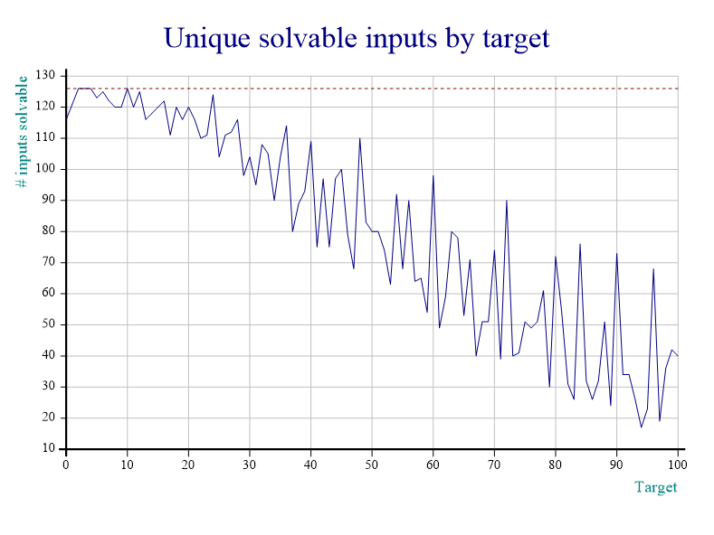
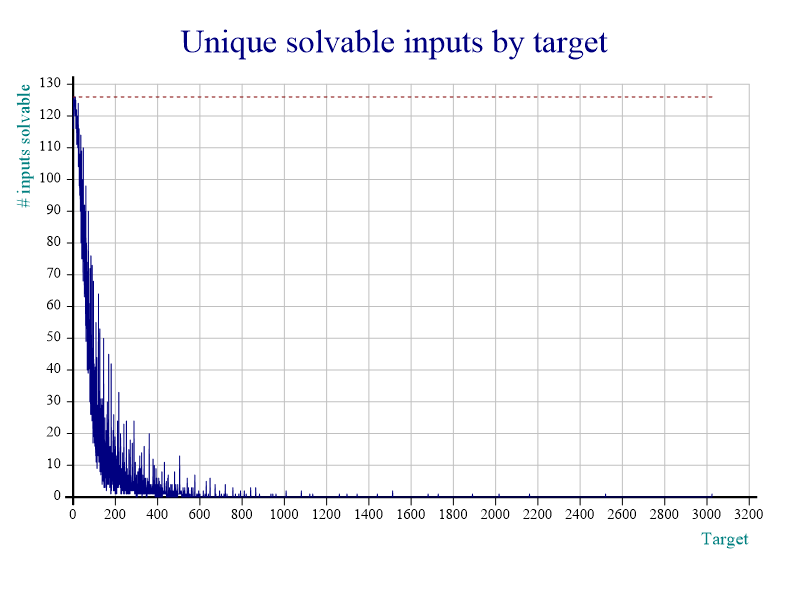
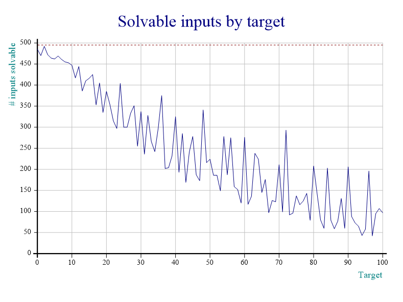

---
metadata:
    description: Neste artigo vamos explorar o "jogo do 24", um jogo matemático para
        crianças (e não só!)
title: Estudar o "jogo do 24"
---

O ["jogo do 24"][24-game] é um jogo matemático que costuma ser jogado nos primeiros anos de escola para ajudar os alunos a treinarem as quatro operações aritméticas básicas. Neste artigo vamos estudar algumas particularidades deste jogo.

===

### O jogo

O "jogo do 24" é um jogo simples. Dou-te quatro números entre $1$ e $9$ (por exemplo, $\{1, 2, 3, 4\}$) e o teu objetivo é encontrar uma expressão cujo valor seja $24$ (ou seja, tens de "fazer uma conta que dê $24$"). As regras que existem são simples:

 - cada número tem de ser usado exatamente uma vez;
 - as únicas operações disponíveis são a adição, a subtração, a multiplicação e a divisão;
 - qualquer operação pode ser usada qualquer número de vezes (inclusive nenhuma vez ou mais do que uma vez);
 - a precedência das operações pode ser manipulada através da utilização de parêntesis;
 - não é suposto usar "truques", só aritmética.


#### Exemplos

Se os números dados forem $\{1, 2, 3, 4\}$ então uma resposta poderá ser

 - $1 \times 2 \times 3 \times 4$

e se os números fossem $\{2, 5, 7, 8\}$, uma resposta poderia ser

 - $(2\times 5 - 7)\times 8$.


### A motivação

Eu estava a falar com um amigo que me desafiou para o "jogo do 24" com os números $\{3, 3, 8, 8\}$ ([tenta tu também!][P020]) e quando começámos a discutir o jogo perguntámo-nos "Porque é que este jogo é o jogo do _"24"_? O $24$ é especial?".

Quando estava a ter esta conversa eu já tinha um programa de computador que jogava ao "jogo do 24" portanto nós decidimos que íamos usar esse programa para estudar um pouco o jogo.

!!! Para facilitar a minha vida, sempre que eu falar de _alvo_, refiro-me ao número a que estamos a tentar chegar. No jogo clássico, o _alvo_ é $24$. Sempre que eu falar de _input_ estou a referir-me aos números que estamos a usar para tentar chegar ao alvo.

### O código

As questões que eu vou colocar neste artigo foram respondidas com um pouco de programação em [APL]. Eu defini algumas funções úteis e ao longo do artigo vou usá-las para responder às perguntas que eu colocar. Podem encontrar essas funções no fim do artigo.

A primeira questão que eu e o meu amigo fizémos foi

#### Será que $24$ funciona para qualquer input?

Tanto quanto eu sei, o "jogo do 24" costuma ser jogado com um input que tem quatro números distintos. Assim, $\{2, 3, 4, 5\}$ é um input válido mas $\{3, 3, 4, 5\}$ não.

Definir estes inputs em APL é bastante fácil (para quem for testar o código, atenção que eu uso `⎕IO ← 0`) e contar quantos inputs há de cada tipo é ainda mais fácil:

```apl
      uinps ← all/⍨ {∧/2</⍵}¨ all ← 1+,⍳4⍴9  ⍝ inputs with unique digits
      ⎕← ≢uinps 
126
      nuinps ← all/⍨ {∧/2≤/⍵}¨ all  ⍝ digits may repeat
      ⎕← ≢nuinps
495
```

No final de contas, $24$ _não_ funciona para qualquer input. Na verdade, de entre os $126$ inputs diferentes há dois com os quais não se consegue construir $24$:

 - $\{1, 6, 7, 8\}$
 - $\{3, 4, 6, 7\}$

Podem verificar isto com o código que escrevi, basta que tentem construir $24$ com todos os inputs possíveis e verem para quais é que o código falha:

```apl
      r ← 24 IsEmpty⍤Solve¨ uinps
      uinps/⍨r    
┌───────┬───────┐
│1 6 7 8│3 4 6 7│
└───────┴───────┘
```

Nós achámos que $24$ não ser alcançável com dois inputs era "aceitável". Teria sido incrível se conseguíssemos chegar a $24$ com qualquer input mas uma taxa de $\approx 98.4\%$ é bastante aceitável.

Se permitirmos que os números se repitam, então há $495$ inputs distintos e o $24$ é alcançável com $404$ desses $495$ inputs, o que significa que a percentagem de inputs solúveis cai para $\approx 81.6\%$.

Isto pode ser verificado de forma semelhante com

```apl
      r ← 24 IsEmpty⍤Solve¨ nuinps
      +/r
404
```

Tendo visto que $24$ não é alcançável por todos os $126$ inputs que se consideram geralmente, nós perguntámo-nos

#### Será que $24$ é o alvo ótimo?

O que isto quer dizer é: será que de entre todos os números inteiros pequenos, $24$ é que o é alcançável mais vezes? Uma modificação da versão inicial do meu código (que só tinha as funções `Solve` e `Combine`) permite produzir o gráfico que se segue:



Para produzires este gráfico, primeiro há que copiar as funções `InitCauseway` e `View` do `'sharpplot'` e depois basta usar as minhas funções:

```apl
      'InitCauseway' 'View' ⎕CY 'sharpplot'
      InitCauseway ⍬
      counts ← 0 StudySolvability 100
Starting the study.
Maximum attainable value is  3024
      126 Plot counts
```

A linha horizontal a tracejado está ao nível do $126$ porque esse é o número total de inputs válidos. Pelo gráfico vê-se facilmente que $24$ _não_ é o input ótimo, já que $2$, $3$, $4$, $6$, $10$ e $12$ são todos melhores escolhas. De facto, $2$, $3$, $4$ e $10$ são alcançáveis a partir de _todos_ os inputs, o alvo $6$ só não é alcançável a partir de $\{6, 7, 8, 9\}$ e $12$ só não é alcançável a partir de $\{1, 5, 7, 8\}$.

Podemos até dizer que $2$, $3$, $4$ e $10$ são alvos "perfeitos".

Também é interessante olhar para o gráfico de baixo, que é parecido com o anterior mas que considera todos os alvos desde $0$ até $3024$ ($3024 = 9 \times 8 \times 7 \times 6$ é o maior inteiro que conseguimos construir com quatro dígitos distintos):



Este gráfico pode ser produzido com

```apl
      counts ← 0 StudySolvability 3024
      126 Plot counts
```

Depois de olharmos para estes gráficos nós perguntámo-nos

#### Será que algum dos alvos "perfeitos" continua perfeito se permitirmos que os números sejam repetidos?

Mais uma vez a resposta é _não_, mas por pouco! O alvo $2$ é alcançável por $492$ dos $495$ inputs! Os únicos três inputs que não permitem chegar a $2$ são

 - $\{1, 1, 1, 7 \}$
 - $\{1, 1, 1, 8 \}$
 - $\{1, 1, 1, 9 \}$

E podemos verificar isto modificando ligeiramente uma linha de código que já foi corrida há pouco:

```apl
      r ← 2 IsEmpty⍤Solve¨ nuinps
      nuinps/⍨r
┌───────┬───────┬───────┐
│1 1 1 7│1 1 1 8│1 1 1 9│
└───────┴───────┴───────┘
```

Isto significa que $2$ é um alvo possível em $\approx 99.4\%$ dos casos.

As percentagens dos outros alvos "perfeitos" caem bastante quando passamos a considerar os $495$ inputs:

Para produzir este gráfico, e incluir inputs com dígitos repetidos na contagem da função `StudySolvability`, basta fornecer `1` como argumento esquerdo:

```apl
      counts ← 1 StudySolvability 100
Starting the study.
Maximum attainable value is  6561
      495 Plot counts
```

De seguida encontram uma tabela com todos os alvos que são melhores que o $24$.

| Alvo | N⁰ inputs solúveis sem repetições | N⁰ inputs solúveis com repetições |
|-:|-:|-:|
|  0 | 116 | 485 |
|  1 | 121 | 470 |
|  2 | 126 | 492 |
|  3 | 126 | 472 |
|  4 | 126 | 464 |
|  5 | 123 | 462 |
|  6 | 125 | 469 |
|  7 | 122 | 461 |
|  8 | 120 | 455 |
|  9 | 120 | 453 |
| 10 | 126 | 447 |
| 11 | 120 | 417 |
| 12 | 125 | 444 |
| 14 | 118 | 410 |
| 15 | 120 | 416 |
| 16 | 122 | 425 |
| 18 | 120 | 405 |


Note-se que na versão mais restrita do jogo, o $24$ é o sétimo melhor alvo... Mas se jogarmos a versão mais permissiva, em que os números do input podem repetir, então o $24$ passa a ser apenas o décimo oitavo melhor alvo! Curioso!

A tabela (em notação markdown) pode ser produzida com o código que se segue:

```apl
      better ← (⍳13), 14, 15, 16, 18
      r ← Combine∘⊂¨ nuinps
      (reprs values) ← Unpack r
      counts ← +⌿ values ∘.= better
      (reprs uvalues) ← Unpack r/⍨ nuinps∊uinps
      ucounts ← +⌿ uvalues ∘.= better
      '|',(⍪better),'|',(⍕⍪ucounts),'|',(⍕⍪counts),'|'
|  0 | 116 | 485 |
|  1 | 121 | 470 |
|  2 | 126 | 492 |
|  3 | 126 | 472 |
|  4 | 126 | 464 |
|  5 | 123 | 462 |
|  6 | 125 | 469 |
|  7 | 122 | 461 |
|  8 | 120 | 455 |
|  9 | 120 | 453 |
| 10 | 126 | 447 |
| 11 | 120 | 417 |
| 12 | 125 | 444 |
| 14 | 118 | 410 |
| 15 | 120 | 416 |
| 16 | 122 | 425 |
| 18 | 120 | 405 |
```

### O algoritmo & o código

O algoritmo que eu implementei é bastante simples e é um algoritmo de busca exaustiva, na sua essência. Para além disso, é completamente geral. Por exemplo, podemos descobrir como obter $-0.475$ a partir de $\{2, 3, 4, 5, 6\}$ com

```apl
      ¯0.475 GameOf24.Solve 2 3 4 5 6
┌──────────────────────────────────────────────────┬────────┐
│┌────────────────────────────────────────────────┐│┌──────┐│
││┌──────────────────────────────────────────────┐│││¯0.475││
│││÷-÷3    ×5 6 2          4                     │││└──────┘│
││└──────────────────────────────────────────────┘││        │
│└────────────────────────────────────────────────┘│        │
└──────────────────────────────────────────────────┴────────┘
```

que significa que $-0.475 = (3 \div (5\times 6) - 2) ÷ 4$.

O modo como o algoritmo funciona é simples e o trabalho pesado é todo feito pela função `Combine`: a função `Combine` está à espera de um vetor de vetores de números como argumento direito e vai iterar sobre eles. Para cada vetor de inteiros a que chego, tento pegar em todas as combinações de dois números e combino-os com todas as operações disponíveis, criando vetores que são mais pequenos por um elemento. Por exemplo, com o vetor `2 3 4` e usando apenas a adição, crio os vetores `5 4` ($2+3$), `6 3` ($2+4$) e `7 2` ($3+4$).

No fim de tudo eu também quero obter uma expressão que me permite saber como chegar ao alvo, portanto o argumento esquerdo da função `Combine` (que é usado pelas chamadas recursivas da função) serve para guardar as representações textuais das várias operações que têm de ser feitas e da sua ordem, usando [notação polaca][PN]. Tomando o exemplo de cima, a representação `'2' '3' '4'` desdobrar-se-ia em `'+ 2 3' '4'`, `'+ 2 4' '3'` e `'+ 3 4' '2'`.

O código das funções `Solve`, `Combine`, `IsEmpty`, `StudySolvability` e `Plot` encontra-se [neste link para o GitHub][gh-gist] e no fim deste artigo.

Estavam à espera que houvesse tantos alvos melhores que o $24$? Partilhem as vossas reflexões na secção de comentários em baixo!

Até à próxima.

<script src="https://gist.github.com/RodrigoGiraoSerrao/1a6543226fdd8d51dc4c669acabf76ad.js"></script>

[24-game]: https://en.wikipedia.org/wiki/24_Game
[P020]: /blog/problems/make-24-with-3-3-8-8
[P019]: /blog/problems/fold-the-alphabet
[apl]: /blog/lsbasi-apl-part1
[PN]: https://en.wikipedia.org/wiki/Polish_notation
[gh-gist]: https://gist.github.com/RodrigoGiraoSerrao/1a6543226fdd8d51dc4c669acabf76ad
