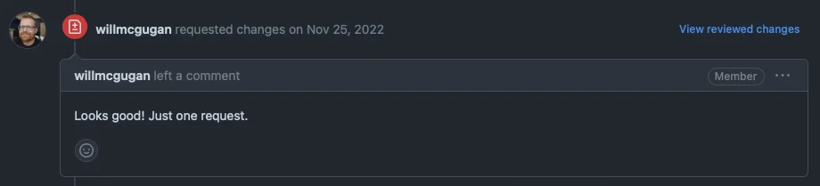
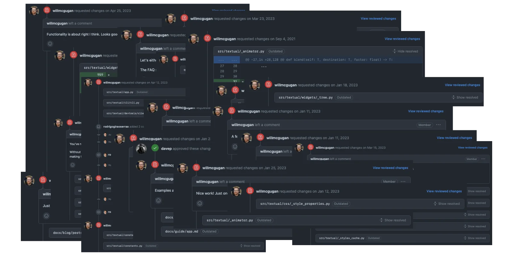
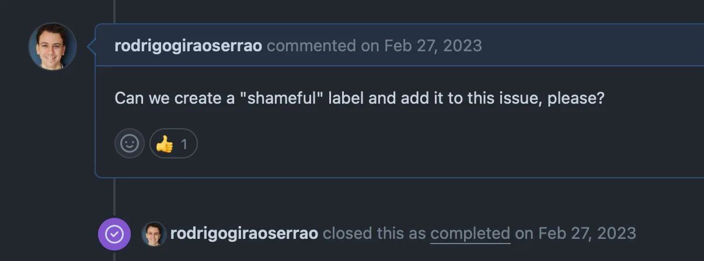
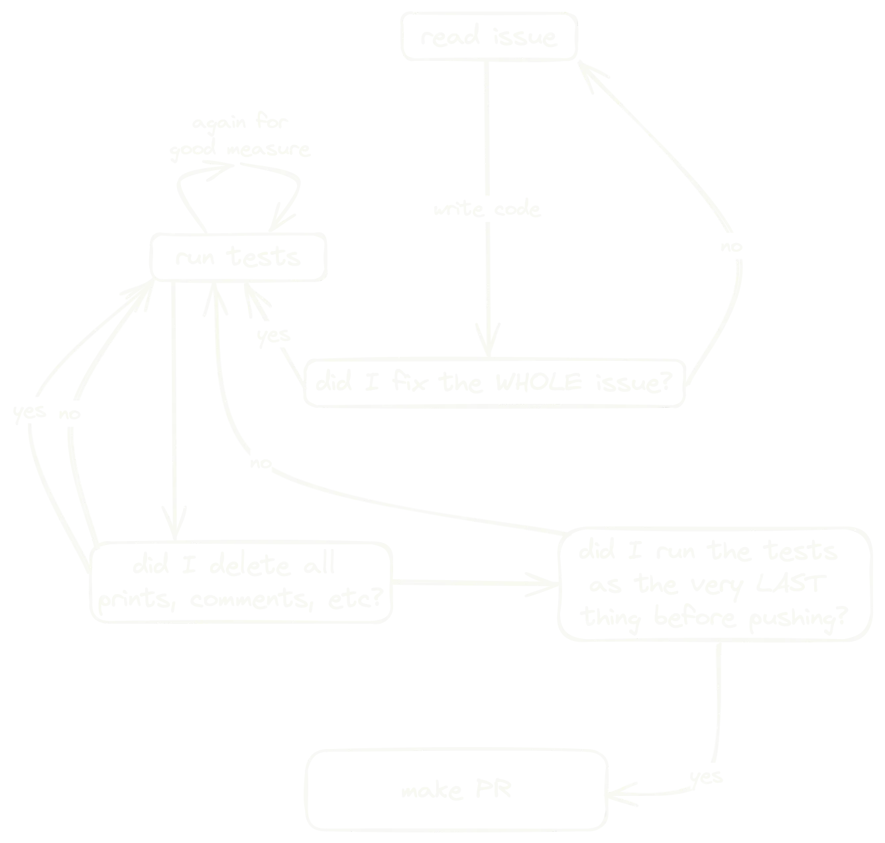

This article shares some of the lessons I learned from working full-time on a FOSS project for 503 days.

===

# 503 days working full-time on FOSS: lessons learned

From the 14th of November of 2022 to the 31st of March of 2024 I worked full-time on a FOSS project.
This article is an account of some of the things that I learned during those 503 days.

! I have much more time to devote to _**you**_ now that I don't have this full-time position.
! If you're looking for Python training, [reach out to me][email] or [browse for yourself][training].
! I'll also be investing my time in this blog and in [my books][books].

I joined Textualize, the company behind the popular FOSS Python packages [Rich] and [Textual], on the 14th of November of 2022.
When I joined to work remotely from sunny Portugal, I joined [Will](https://github.com/willmcgugan) (the creator of Rich & Textual, and my boss), [Darren](https://github.com/darrenburns), and [Dave](https://github.com/davep), all of whom worked together in Scotland.
For the first time in my professional life, I was the worst Python developer in the room[^1].
This means that my technical knowledge improved substantially over the course of these 503 days, namely in areas such as:

 - asynchronous code execution and Python's `asyncio`;
 - Python tipe hinting;
 - testing / `pytest`; and
 - software engineering best practices in general.

However, this article will focus on four non-technical lessons I learned during this 503-day experience:

 1. how my online presence led to a job offer;
 2. criticism must be embranced instead of letting it hurt my ego;
 3. interacting with users & contributors; and
 4. how to work on a huge codebase you don't know 100%.

Let's dive right in.


## Everything you do online works as a banner

One interesting thing that I learned even before starting my full-time position is that you can definitely find (job) opportunities in unconventional ways.
This has always been the case but the Internet makes it even easier to do so.

If you're looking for a job, you can submit your CV to a platform or fill out a form.
I've gotten job offers by going through that process.
But that's not how I got _this_ job nor how I got any of my previous jobs.
I'll tell you more or less how I ~~fooled Will into hiring me~~ got this job in the hope that you understand how powerful an online presence can be.

I met Will on X/Twitter, [where I actively post about Python][twitter].
Over the course of many months we'd interact sporadically.
Sometimes I commented on his posts and sometimes he commented on my posts.
I think Will enjoyed the Python tips I posted and the occasional link to an article of mine.

After many months of occasional Twitter interactions and a couple of informal video calls, Will messaged me asking if I was interested in working for Textualize.
Some months before, I had mentioned that I would see myself working with him further down the line.
But I wasn't trying to get a job when I said that.
In fact, I remember saying something like “I see myself working with you in **5 years**”.
Even still, a few months later I had Will's message on my inbox!
I agreed to go through the recruitment process and in the end Will made me an offer.

I was sad to leave my previous position, where I was enjoying myself working with / teaching APL, but I was also pretty ecstatic about working full-time on a Python FOSS project.

Getting this job offer was confirmation that everything you do online can act as a banner for you and your work.
In my case, that's my Python posts on social media, my blog articles, my books, etc.
For you, it could be something different.
But don't forget that _possibility_!


## Put your ego aside

Before joining Textualize I had always been the best Python developer in my team...
Because I was the _only_ Python developer in my team[^2]!

Being the best at something is great for your ego but it also means there's no one there to pull you up and to teach you new things...
And I wanted that!
I wanted to work with people who I looked up to for their technical skills and I realised Textualize would give me that.

I joined Textualize and I immediately understood that code reviews would be moments where I could learn a lot.
If you think about it, when you're writing code, it's not only about whether the code does what it's supposed to (fix a bug, implement a feature, etc.).
The actual code you wrote is also relevant and code reviews are when your coworkers get to comment on that.


### Ask ALL the questions

One thing I did and that I can recommend is that you use code reviews to ask questions.
It happened regularly that I would read someone's code and think “interesting, why didn't they do it with X, Y, and Z?”.
Whenever that was the case, I left a comment _asking_ that same question, even if the question sounded a bit basic.
Often, they would reply explaining their reasoning, and I would get to learn something new.
Some other times, it would turn out that they hadn't thought of the alternative I was considering and they took my suggestion.

I think the key points here are that

 1. you should ask the question(s) with the assumption that the person whose code your reviewing has a good reason for having done things differently from what you expected; and
 2. you shouldn't refrain from asking questions, regardless of how silly or basic they may seem.

Point 1. is important because you don't want the other person to be on the defensive and because you should understand the reasoning behind the author's decisions.
Point 2. is important because you want to learn as much as possible... And because some times people just forget about simpler alternatives (even senior developers).

I'm happy to report that I've fully embraced the mindset of asking questions, even when they may sound silly, so exposing my lack of knowledge in certain areas didn't hurt my ego too much...
But having my code reviewed was a whole new story.


### Embrace (code review) feedback

My pull requests were invariably flagged with the red X requesting changes in my work:



Going back to the reason code reviews are so interesting, it wasn't just about whether or not I was fixing the bug or implementing the feature.
It was also about the actual code that I wrote.
In the beginning it was tough to have all of my work scrutinised.
But if I wanted to improve my Python and software engineering skills, I'd have to embrace that scrutiny and the feedback I received whenever someone requested changes on my work.

I also got a lot of practice, because I got a lot of changes requested:



I learned to embrace the feedback and I recommend you do the same!
Assuming everyone is well-intentioned, it's one of the best things you can do.
Bonus points if you can get people to explain why they recommended a different approach.


### Everyone makes mistakes

Everyone has bad moments, bad days, bad weeks...
Some weeks I felt less productive or made more mistakes.
But so did everyone else!
If you're feeling like you're not at your best, tackle a couple of simpler tasks.
That's a reasonable thing to do.

It sucks to be in a less productive period, but that's also a good time to figure out if you're working with reasonable human beings or with jerks.
Picture this:

 - you make a pull request;
 - it goes through the usual review process and it gets merged;
 - the feature you implemented is released to the public; and
 - some days later users report “obvious” bugs in the feature you implemented.

How would that make you feel?
To me, it made me feel a bit silly.
I felt utterly responsible for the bug that was being reported!
After all, I implemented the feature in question and the bug wasn't about an obscure interaction...
It was just a blunder of mine...

Thankfully, my team reacted differently and they said “we don't play the blame game” when reacting to my feeling responsible.
We could argue that it was everyone's fault because the pull request did pass the review process, but as the author I still felt like I should've been able to predict that bug myself.
But I guess it all comes down to the age-old adage that I already wrote above:

 > “Everyone makes mistakes.”

When others make mistakes, be graceful and helpful, instead of judgemental and critical.
If you do that, you'll make it more likely that others will be graceful and helpful when if you make mistakes.

For comic relief, here is a screenshot of me feeling ashamed after opening a “bug report” that was fueled by a major lapse of judgement regarding the way Python works:




## Interacting with users and contributors

Working on a popular FOSS project brings with it an unexpected blessing _and_ curse: users.
Users are obviously a blessing.
It doesn't sound fun to pour your heart and soul into a project that no one uses.
But handling user interactions is surprisingly time consuming and difficult!
Let me share with you some of the things I learned while doing this.


### Create a contributing guide

No one will read it.
Or rather, no one will read it _before_ wasting a bit of your time.
But having the document there, with clear guidelines and helpful suggestions, will save you a LOT of time.

A contributing guide will also have your back in some situations.
More on that later!


### Simplify bug reporting as much as possible

One of the things I learned is that you have to hold the hand of your users if you want decent bug reports.
One thing that really helps is setting up an issue template for bug reports, which is an excellent feature that GitHub has.

As of writing this, our bug report template issue looks like this:

````
Have you checked closed issues? https://github.com/Textualize/textual/issues?q=is%3Aissue+is%3Aclosed

Please give a brief but clear explanation of the issue. If you can, include a complete working example that demonstrates the bug. **Check it can run without modifications.**

It will be helpful if you run the following command and paste the results:

```
textual diagnose
```

Feel free to add screenshots and / or videos. These can be very helpful!
````

Something we should probably change is to ask for a _**minimum reproducible example**_ instead of asking for a “complete working example”.
Sometimes, people report bugs without showing any code to back it up, which is upsetting.
But even more upsetting is when users post hundreds of lines of code!
I feel like it is reasonable to ask users to simplify the code that produces the bug as much as they can, so adding that to the issue template can be a huge time saver.

Depending on the nature of your project, you may need more specific information from the user.
One thing that turned out to be invaluable in our project was the `textual diagnose` command.
It prints a lot of useful information to the terminal like OS name and version, Python version and install location, and information about the settings of the terminal that was being used, which heavily influenced the way Textual behaved.
You may want to add project-specific instructions in your issue template and/or your [contributing guide](#create-a-contributing-guide).


### Be so kind it's annoying

In general, whenever you're interacting with someone else, you should be as kind as possible.
Every person is different and every situation is unique.
Often, there are nuances we're not even aware of and that would explain a certain behaviour that maybe we think is not reasonable.

 - Did a user sound rude or harsh?

Maybe English is not their first language and they can't express themselves well enough.
For example, in a certain PR review I ended up saying that the user should be ashamed of what they did because I mixed up an English word with a Portuguese word.

 - Did a user ask something that's already explained in the docs?

Assume they actually went through the docs and couldn't find the information or maybe they found it but they didn't understand.
Point them to the appropriate link(s) and ask whether something there was unclear or lacking detail.

This can be pretty tiring but I find it definitely worth the effort.
Interactions that start off seemingly unpleasant can turn out great if you don't escalate the situation.
That happened to me more more than once!


### Give a first reply quickly

One thing I think is very important is to give a first reply to an external user as quickly as possible.

If the user opened an issue, thank them for the report and let them know you'll look at it when you have the time.
If it's a bug report, take a look to see if it's missing a reproducible example or more information and ask for it right away.
If the user opened a pull request, thank them for their time and say you'll review it when you have the chance.

When a user interacts with your project, it's likely that _you_ have something to gain from that interaction.
This is obviously true for bug reports and pull requests.
So, I believe we shouldn't let the user go for days or weeks without a simple reply.

I'm not saying bug reports have to be fixed or pull requests need to be reviewed in 24 hours.
I'm saying we should strive to _say something_ to the user soon.
I came to this realisation after thinking about how I feel when I open an issue on another project and I go months without a reply!

If you're just very busy (which is fine and can definitely be the case) just set up an action that replies automatically with something friendly.
“I appreciate your pull request / bug report.
I am very busy at the moment and I will get back to you as soon as possible.”


### Handle external pull requests

Another challenge I faced and that I didn't expect was managing external pull requests.

Much like with bug reports, I found invaluable to have a pull request template with a checklist for external users (and often, for myself as well).
Mentioning things like runnnig tests and formatting the code with the appropriate formatter(s) can save everyone a lot of time.

Another thing I realised is helpful is to make sure that each pull request is associated to an issue.
Sometimes users will open pull requests that implement features without those features ever being discussed.
Chances are the user is trying to be helpful, but sometimes those features need a bit of discussion.
I find that those are the cases where an associated issue will be the most helpful.

If a user opens a pull request out of the blue with a non-trivial change, make sure you thank them for their time and ask them to create an issue that discusses the changes they made.
They probably wanted to implement a feature that is helpful for them (and possibly for others).
Point them to your [contributing guide](#create-a-contributing-guide).

Your guide has your back here because it makes it less likely that the user will see your request as a personal attack.
(Remember that Humans are animals, really...)

When it's time to review the code that the external contributors wrote, remember that if someone went out of their way to make a pull request, it's likely that they are well-intentioned.
As long as you're not an idiot, you'll likely be able to get them to comply with your requested changes!

If you're very peculiar about formatting, naming, design, and/or other things, my suggestion is that you mention those in the [contributing guide](#create-a-contributing-guide).
If there are tools that automate part of the process, mention them.
I personally find it easier to say “as per the contributing guide, we only use variable names that have exactly 5 consonants” – if it's in the guide it obviously applies to everyone and the whole project – versus saying “please use variable names with 5 consonants”, as the user might think you're just being picky with them.


### The dreadful story of when I rejected my first external PR

Most of what I'm writing in this section about interacting with users and contributors came as a realisation after one particular interaction that I had with one specific user.

One day, someone opened a pull request trying to improve a specific guide in the documentation.
These changes came “out of the blue” in the sense that there was not a previously opened issue asking that we improve that guide.

The changes were non-trivial and involved changing the order of some things, duplicating some information, and rewriting sentences.
We are sure the user was well-intentioned.
In particular, we had already interacted with that particular user.
And that well-intentioned pull request had some objectively great suggestions, but it also had other changes that were subjective.

In the end, I opened a second pull request where I committed the best parts of the original pull request.
I made sure to include the author of the first pull request as a co-author.
Then, we merged this second pull request.
However, the first pull request was closed.
When closing it, I made sure to thank the author for their time and I tried to explain why we were closing their pull request.
Thankfully, the user accepted my feedback very graciously!
However, if I had instructions about changing the documentation [in the contributing guide](#create-a-contributing-guide) maybe I could've saved this user some time...


## Working on a large project

Textual was the largest codebase I ever worked on for a sustained period of time.
I've made drive-by contributions to _larger_ projects, but a one-time contribution to a large project is much simpler to make than to work consistently on a large project.

When a codebase reaches a certain size, it becomes virtually impossible to fit all of it in your head at once.
For me, Textual was at this point.
With time, I grew more and more familiar with the codebase and the number of dark corners was getting smaller by the day, but there are still things I don't know exactly how they work and there are parts of the codebase that I never touched.

To make it easier for me to work on such a huge project, I developed three systems:

 1. a set of commandments or mantras that I kept in mind while working on larger features or bug fixes;
 2. a note-taking system for big tasks, difficult issues, and eventful situations; and
 3. a personal pull request checklist I went through before making a pull request.

Let me walk you through these three systems.


### 4 commandments for my work

I remember making a couple of bigger pull requests that didn't go very well on the first try.
I asked around for suggestions on how to handle these situations (when you're implementing a bigger feature or fixing a very difficult bug) and I ended up with four commandments considerations that I should always keep in mind when writing code.

 1. What's best for the developer? – When making design decisions, I should always think about what the people using my code will want and that's what should drive my decisions.

 2. Do due diligence. – Does the code do everything it _should_, or am I just addressing the things that are explicitly mentioned in the issue I'm solving? Following the _spirit_ of the issue, is there anything else I should do?

 3. I take the hit so that the dev doesn't. – I am the one who needs to handle all annoying or difficult edge cases and write the boring code so that the user doesn't have to.

 4. Am I preventing the user from doing something that they might want to do? – Do my design decisions prevent the user from doing things that are reasonable and that they _may_ want to do, even if it's not obvious to me _why_ they'd want to do it?

These four ideas are related and they're possibly self-evident.
In hindsight, they are obvious to me, too.
But it definitely helped me writing them down.


### Taking notes

Another thing that helped me was writing down notes about bigger issues I was tackling.
Whenever I was trying to fix a difficult bug, I'd jot down some notes about things I tried.
Conjectures I had about the source of the bug.
Attempts at fixing said bug.

Personally, the act of taking notes helped commit to memory some of the things I was learning along the way.
Strategies that did or did not work when trying to solve certain issues.


### Personal pull request checklist

Taking notes was helpful to me but I reckon my personal pull request checklist is likely to be generally more helpful to others.
Whenever I was working on an issue, I followed more or less the following flowchart:



If the flowchart above gives off the idea that I ran the tests obsessively, then that's not doing justice to _how often_ I ran the tests.

After a couple of mishaps and interesting adventures I realised there was no such thing as running the tests too often.
Over the course of these 503 days I managed to break the tests, or see someone else break the tests, in the most unexpected ways.
Things like fixing typos in code, removing unused imports, reformatting code, you name it.
Whenever I thought “this change is so trivial I don't need to run the tests”, I would break CI.

Whenever I made a PR, I always started by making it a draft PR and then I would review my own code.
For some reason, reviewing my own code on GitHub helped me catch things that sometimes I would miss when working locally.
I would only request someone else's review after reviewing my own code and making sure the tests were passing on CI.


## Conclusion

I learned a lot over the course of these 503 days working on Textual.
I'm sad to being let go, especially because of what it likely means for Textual, but I don't regret having joined this project.

Now, I will use my time to help _**you**_, your colleagues, and your team.
If you're looking for Python training, [reach out to me][email].
I will also be devoting more time to writing books and teaching Python online, so stay tuned for that!


[^1]: At the places I worked previously I was always the only Python developer, so I was technically also the worst Python developer there... But you get what I mean.
[^2]: See the previous footnote.

[Rich]: https://github.com/textualize/rich
[Textual]: https://github.com/textualize/textual
[email]: mailto:rodrigo@mathspp.com
[training]: /training
[books]: /books
[twitter]: https://x.com/mathsppblog
