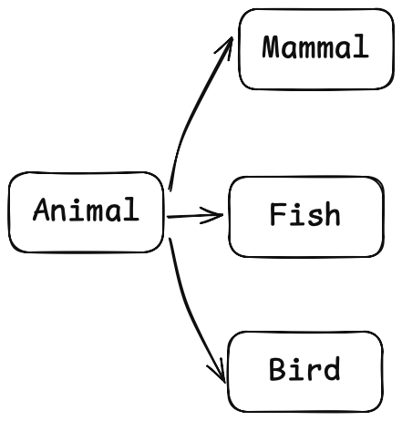
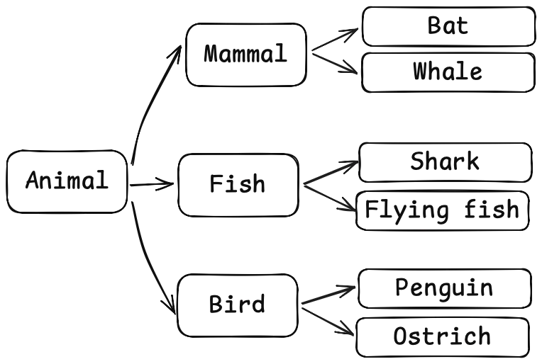

A generator, duck typing, and a branchless conditional walk into a bar.

===


## What's your favourite line of Python code?

My friend Aaron is quite a character.
One day, he was giving a talk and said that everyone must have their favourite line of code.
And he was absolutely sure of what he was saying.
His conviction is that everyone is so deep into their craft that they naturally feel strongly about some lines of code.
So much so that one of them is their personal favourite.

The caveat is that he was talking about APL, not about Python, and with that context in mind the idea of “everyone having a favourite line of code” makes much more sense, believe it or not.

But that got me thinking...
Do I have a favourite line of Python code?
What is it?


## I like generators

There are lots of things I like about the Python language, like the fact that it is very beginner-friendly, it has a very vibrant community, or that everything is an object and you can interact with the core language by implementing the right dunder methods.

One other thing I like in general, and that translates well into the world of Python, is laziness.
A pinch of laziness in a programmer is a good thing because it will force you to think about the best way of doing things, and Python has a category of objects that are inherently lazy, which are generators.

Generators are objects you can iterate over – so, they're objects you can use in `for` loops, for example – but that only _generate_ the values that you need on demand.
Kind of like the built-in `range`, if you think about it.


### `range` is lazy

If you run `range(10)`, that small expression runs in a tiny fraction of a second because it just instantiates an object called “range” and doesn't really compute the integers from 0 to 9, inclusive.
You can see that if you print the object:

```py
import time

start = time.perf_counter()

r = range(10)
print(r)  # range(0, 10)

end = time.perf_counter()
print(f"Done in {end - start:.4f}s.")  # Done in 0.0001s.
```

Creating a `range` with a gazillion integers is equally fast since, again, you're not computing the integers themselves.
You are just instantiating the class `range`:

```py
import time

start = time.perf_counter()

r = range(999_999_999_999_999_999)  # A gazillion.
print(r)  # range(0, 999999999999999999)

end = time.perf_counter()
print(f"Done in {end - start:.4f}s.")  # Done in 0.0001s.
```

The story becomes completely different if, instead of a `range`, you want a list with all those integers.
A list must hold its elements, so creating a larger list takes up more memory and more time:

```py
import time

start = time.perf_counter()

r = list(range(10))  # <-- list(...)
print(r)  # [0, 1, 2, 3, 4, 5, 6, 7, 8, 9]

end = time.perf_counter()
print(f"Done in {end - start:.4f}s.")  # Done in 0.0001s.
```

Creating a list with 10 elements seems to be quite fast, but what if you want a list with 10,000 elements?

```py
import time

start = time.perf_counter()

r = list(range(10_000))  # <-- list(...)
print(r)  # [0, 1, 2, 3, 4, ...]

end = time.perf_counter()
print(f"Done in {end - start:.4f}s.")  # Done in 0.0025s.
```

Creating a list with 10,000 elements was already 25 times slower, meaning our list with a gazillion elements would probably take a while to build...
Not to mention the fact that my computer doesn't have enough memory to create the whole list!

The example of lists versus ranges highlights the contrast between the eager and the lazy nature of these two objects.
And generators in Python are a way of creating objects that are lazy like `range`, since this laziness allows you to save a lot of time and memory.


### Lists versus generators in real life

The other day I was trying to find a really good explanation of generators that I had read in a book I own.
I couldn't remember what book it was in, so I had two choices:

 1. I could grab all my Python books from the bookshelves, pile them up, and go through them one at a time until I found that example; or
 2. I could grab one of the books, look for the example, and if I didn't find it, put that book back and grab the next one.

Grabbing all books preemptively and piling them is the eager approach that a list would follow.
This means that I _always_ have the work of grabbing _all_ books and piling them up, regardless of where I end up finding the example I was looking for.
The function `grab_all_books` would look like this:

```py
def grab_all_books():
    python_books = []
    for bookshelf in bookshelves:
        for book in bookshelf:
            if book.is_about_python():
                python_books.append(book)
    return python_books
```

Grabbing one book at a time is the lazy approach that `range` and generators would follow.
If I only grab the books one by one, that means that when I find the example, I can stop looking and I don't have to touch the books I didn't need.
This means I'm likely to save myself the trouble of grabbing and then putting back some of the books!

In the best case scenario, I find the example in the first book I grab and that means I only had to grab one book out of all the Python books I own.
In the worst case scenario, I find the example in the last book I grab, which means I ended up having to work with all the books I own...
But that's what I would do in the eager approach either way, so it's not that bad.

This is what a generator would do, and the generator version of the function `grab_one_book_at_a_time` would look like this:

```py
def grab_one_book_at_a_time():
    for bookshelf in bookshelves:
        for book in bookshelf:
            if book.is_about_python():
                yield book
```

Note how the list `python_books` disappeared completely and so did the keyword `return`.
Instead, the generator function uses the keyword `yield`.
The keyword `yield` is like a temporary `return` or a temporary function pause:
it allows the function `grab_one_book_at_a_time` to “return” one book to the caller while also remembering where in the function the execution was happening.

When you reach the `yield book`, the generator gives you that book and then pauses until you ask for the next book.
When you do, execution resumes and the function runs until it reaches another `yield`.

Here's a simpler version of the function `grab_one_book_at_a_time` that uses the keyword `yield`:

```py
def grab_one_book_at_a_time():
    yield "Pydon'ts"
    yield "Fluent Python"
    yield "Automate the Boring Stuff with Python"
```

You can use this function directly in a loop:

```py
for book in grab_one_book_at_a_time():
    print(book)
```
```
Pydon'ts
Fluent Python
Automate the Boring Stuff with Python
```

This shows that you can iterate over a generator but it doesn't show the books being produced one by one.
To see that, you must use the built-in `next`:

```py
books_generator = grab_one_book_at_a_time()
print(books_generator)  # <generator object grab_one_book_at_a_time at 0x...>
print(next(books_generator))  # Pydon'ts
print(next(books_generator))  # Fluent Python
print(next(books_generator))  # Automate the Boring Stuff with Python
```

The built-in `next` lets you fetch one book at a time and shows that, between calls to `print`, the function `grab_one_book_at_a_time` is effectively paused.

The snippet above also shows that the function `grab_one_book_at_a_time` isn't a regular function.
The function does not have a `return` and yet it returned something when you called it.
A function that has the keyword `yield` in it becomes a _generator function_ that produces a _generator object_ when it is called.
The generator object – called `books_generator` above – doesn't start producing values immediately; you have to use it in a loop or get the successive elements with the built-in `next`.


### Generator expressions

Python provides a second way of creating generators that is very convenient when you want to create a simple generator, and that's generator expressions.
A generator expression is very similar to [a list comprehension](/blog/pydonts/list-comprehensions-101) in its syntax, as the example below demonstrates:

```py
# 10 squares, list:
squares_list = [n ** 2 for n in range(10)]

# 10 squares, generator:
squares_gen = (n ** 2 for n in range(10))
```

A generator expression has the same syntax as a list comprehension _except_ for the square brackets that delimit the list, since a generator expression uses parentheses.

When being passed as an argument to a function, the generator expression doesn't need its surrounding parentheses:

```py
# Sum 10 squares with list comp:
print(sum([n ** 2 for n in range(10)]))  # 285
#         ^                         ^

# Sum 10 squares with generator expression:
print(sum( n ** 2 for n in range(10) ))  # 285
#         ^                         ^
```

The laziness of the generator is useful here again, although it may not be clear from looking at the code that the two snippets function differently.

By using a list comprehension, _first_ you have to build the full list, _then_ the built-in `sum` can start summing the values.
By using a generator expression, the built-in `sum` can start summing values _immediately_ since the generator produces the squares on demand.
In this case, you're not saving any time because the built-in `sum` will sum all the way through the end of the generator expression, but you're saving memory because you don't have to hold all values in memory upfront.

I like generators.


## I like duck typing

There are lots of things I like about the Python language, like the fact that it is very beginner-friendly, it has a very vibrant community, or that everything is an object and you can interact with the core language by implementing the right dunder methods.

One other thing I like is that well-known saying in the Python world:

 > “If it quacks like a duck and walks like a duck, it must be a duck”
 > — Guido van Rossum (just kidding, I have no idea)

I have heard this for almost as long as I remember knowing Python and yet I didn't fully understand it until a few months ago.
I kind of got it, but a few months ago this clicked and I am absolutely certain that I understand this concept 100% now.

But for me to help you understand this, I need to tell you about a project I was working on a few weeks ago.


### A hierarchy for the animal kingdom

I am working with some biologists and they need to model the animal kingdom in a class hierarchy.
Inspired by their own field of work, I started by creating a superclass `Animal` and then three subclasses: `Mammal`, `Fish`, and `Bird`:



After deciding on that hierarchy, I started writing down some methods that each class had, and I ended up with this:

 - `Mammal`: `.walk` and `.run`
 - `Fish`: `.swim` and `.dive`
 - `Bird`: `.take_off`, `.fly`, and `.land`

I was pretty happy about this for a whole 5 seconds because, as soon as I started thinking about specific animal species, things started breaking up.

Almost all birds can also walk and run despite not being mammals, and some birds like penguins can't even fly!
And there are mammals that don't walk at all, like whales!
As you can see, there are all sorts of inconsistencies here:



I was cursing Mother Nature when I realised it wasn't her problem.
I was trying to model animals in the wrong way!

The initial hierarchy with the superclass `Animal` and the three subclasses `Mammal`, `Fish`, and `Bird`, can work, as long as I don't treat them as abstract base classes where I define methods related to movement.
I can use that initial hierarchy in the same way it is used by biologists, as a taxonomy.
A way to classify the animals based on some traits they typically share.

But when it comes to their _behaviours_ and the way they move around, whether by walking, swimming, flying, or any combination of the three, I can't bake that into the hierarchy.
These behaviours are _independent_ of the class hierarchy, so they must be defined independently from the hierarchy.
And that's what protocols are for:


Instead of assuming all fish must swim and only fish can swim, I define a protocol for “swimmers”.
Any animal that _can_ swim _is_ a swimmer.
That sounds like a redundant statement, but that's what duck typing is about!

Suppose there is a function that shows a visitor an underwater scenic route:

```py
def underwater_scenic_route(visitor):
    visitor.dive(30)
    # Admire the corals
    visitor.swim("corals")
    # Check the shipwreck
    visitor.swim("shipwreck")
```

You don't think that `visitor` must be an instance of `Fish`.
You think that `visitor` must be a “swimmer”.
It can be an instance of `Mammal`, like the `Whale`, an instance of `Bird`, like the `Penguin`, or it can be something else entirely different that is defined by another person, like an instance of `Submarine`, as long as `Submarine` defines the two correct methods!


### More examples of duck typing

Duck typing is present all over Python, even if you don't notice it.
Think about the function `first`, shown below:

```py
def first(my_list):
    return my_list[0]
```

You can use it to get the first element of a list:

```py
my_list = [42, 73, 0, 16, 10]
print(first(my_list))  # 42
```

But you can also use it to get the first element of a tuple, a string, a `range`, and other objects:

```py
my_tuple = (42, 73, 0, 16, 10)
print(first(my_tuple))  # 42

my_string = "Hello, world!"
print(first(my_string))  # H

my_range = range(100, 156, 3)
print(first(my_range))  # 100
```

This is duck typing in action because there are a number of different classes that can be indexed with square brackets and an integer `...[n]`; this is a behaviour supported by many classes, not just lists.

Another common example of duck typing in action can be seen in the built-ins `enumerate` and `zip`, two useful loop helpers.
You can use `enumerate` to access the elements of a list and their corresponding positions:

```py
my_list = [42, 73, 0, 16, 10]

for pos, element in enumerate(my_list):
    print(pos, element)
```
```
0 42
1 73
2 0
3 16
4 10
```

However, `enumerate` isn't designed to work with lists.
The built-in `enumerate` accepts any _iterable_ argument, like strings or even generators!

```py
my_generator = (n ** 2 for n in range(10, 15))

for pos, element in enumerate(my_generator):
    print(pos, element)
```
```
0 100
1 121
2 144
3 169
4 196
```

The notion of being _iterable_ is a very common example of duck typing in Python.

Duck typing is great because it lets you focus on what matters – the set of behaviours that an object exhibits – without having to worry too much about a class hierarchy, which is often too rigid and can't model the real world well enough.

I like duck typing!


## I like branchless conditionals

There are lots of things I like about the Python language, like the fact that it is very beginner-friendly, it has a very vibrant community, or that everything is an object and you can interact with the core language by implementing the right dunder methods.

One other thing I like is the idea of branchless conditionals.


### Traditional conditionals with the `if` statement

The traditional way to use conditions to influence your programs is by using the `if` statement, which uses a Boolean expression – the condition – to determine whether the code inside the `if` statement should run or not.
You can also have a number of optional `elif` statements with their own conditions and a final `else` statement.

The `if`/`elif`/`else` statements represent branches: when your code is running, depending on the context, you might execute any one of those branches.
At a lower level, this even impacts the way your processor runs your code...
But let's stay at the high level that Python operates on.

Every time you encounter an `if`, your code can either enter it or not.
That means every `if` doubles the total number of paths your code might take to get to the end of your program.[^1]
With just a couple of `if` statements, you create so many possible execution paths that you can no longer keep track of all of them in your head at the same time.
Add a couple more, and testing all possible paths becomes infeasible...

It almost looks like I want you to think that getting rid of some `if` statements could be good...


### “Flat is better than nested”

The Zen of Python[^2] says “Flat is better than nested”, and that's what I want to advocate for here.
To reduce the cognitive burden of figuring out all the different paths that your code can take, you can just get rid of them altogether.
You can't always get rid of them, but in many situations there are ways of refactoring your code that remove the need for an `if` statement.

My favourite example is when you are counting the number of values of a given iterable that satisfy a certain condition.
The typical code would look like this:

```py
count = 0
for element in iterable:
    if predicate(element):
        count += 1
```

The snippet above assumes `predicate` is a function that returns `True`/`False`.

The `if` above doesn't have the complementary `else`, but it's implied:

```py
count = 0
for element in iterable:
    if predicate(element):
        count += 1
    else:
        count += 0
```

The key observation to make here is that the value you are summing corresponds to the value of `int(predicate(element))` inside each branch.
If `predicate(element)` is `True`, then you want to add 1 to `count`, which is also `int(predicate(element))`.
If `predicate(element)` is `False`, then you want to add 0 to `count`, which is also `int(predicate(element))`.
In other words, regardless of the branch you're in, you always want to add `int(predicate(element))`, so you could do just that:

```py
count = 0
for element in iterable:
    count += int(predicate(element))
```

This is the quintessential example of the idea of a branchless conditional, where the conditional behaviour (to sum 1 or not to sum) is baked into a calculation you perform.
In this case, just converting a Boolean value to an integer.

If you follow a strict interpretation of what a branchless conditional is, you can write lots of funky code.
But there is a looser interpretation that can be very useful in practice.


### EAFP versus LBYL

You will find yourself writing lots of `if` statements that are just instances of you “Looking Before You Leap”.
These are `if` statements you write to make sure the code you're about to run doesn't raise an error.
For example, in case you want to remove an item from a list but you're not 100% sure the element is there:

```py
if element in my_list:
    my_list.remove(element)
```

However, the idiomatic Python way of looking at this type of code is that it is “Easier to Ask for Forgiveness than Permission”, and thus you should instead just run the code and handle the exception if necessary:

```py
try:
    my_list.remove(element)
except ValueError:
    pass
```

This is a lot of ceremony in this case, though, so you may want to [improve it by using `contextlib.suppress`](/blog/ignoring-exceptions-with-contextlib-suppress):

```py
from contextlib import suppress

with suppress(ValueError):
    my_list.remove(element)
```

Another perfect example of this type of situation is when you're working with dictionaries and writing code like this:

```py
if "output_path" in config:
    output_path = config["output_path"]
else:
    output_path = DEFAULT_OUTPUT_PATH
```

Instead, use the method `.get` to do everything neatly in one go:

```py
output_path = config.get("output_path", DEFAULT_OUTPUT_PATH)
```


### Using identity elements

Another example of a situation where the idea of a branchless conditional might come in handy is when you can shift the condition from whether or not a given operation should run to the way in which the operation should run.
What do I mean?

Here's a function `oxford_comma` that turns a list of strings, like `["apple", "pear", "banana"]`, into a human-readable enumeration that uses the Oxford comma, like `"apple, pear, and banana"`:

```py
def oxford_comma(strings):
    result = ""
    if len(strings) > 1:
        result = ", ".join(strings[:-1])
    if len(strings) >= 3:
        result += ","  # the Oxford comma
    if len(strings) >= 2:
        result += " and "  # the final 'and'
    if strings:
        result += strings[-1]
    return result

print(oxford_comma(["apple"]))  # apple
print(oxford_comma(["apple", "pear"]))  # apple and pear
print(oxford_comma(["apple", "pear", "banana"]))  # apple, pear, and banana
```

This function uses `if` statements to determine when to concatenate other strings into the result.

I prefer a different version that always defines the final result as the concatenation of four smaller fragments.
It's up to the code to determine _what_ the fragments are, not _whether they're included_:

```py
def oxford_comma(strings):
    prefix = ", ".join(strings[:-1])
    ox_comma = "," if len(strings) >= 3 else ""
    and_ = " and " if len(strings) >= 2 else ""
    last = strings[-1:]
    return prefix + ox_comma + and_ + last
```

You can (correctly!) argue that I'm still using [two conditional expressions](/blog/pydonts/conditional-expressions), but they have a different behaviour.
I'm no longer trying to determine whether to concatenate strings or not.
I'm just computing the values of the fragments `ox_comma` and `and_`, and I can use the empty string as the identity element of string concatenation to indicate that those fragments are irrelevant when that's the case.

By looking at my code through the lens of the philosophy of branchless conditionals, and by making the best use possible of the tools that Python provides me with, I can often write code that is flatter and more direct, meaning I express my intent more clearly.
This, in turn, makes it easier for others to read my code.

I like branchless conditionals.


## This is my favourite line of Python code

My favourite line of code uses ideas from all these three topics we discussed:

 1. generators
 2. duck typing
 3. branchless conditionals

Are you ready?
I hope you're sitting down for this:

```py
sum(predicate(element) for element in iterable)
```

This idiom counts the number of elements in the given iterable that satisfy the condition defined by the function `predicate`.

As a concrete example, the snippet below counts the number of built-ins that have a name that only uses letters:

```py
import builtins

print(
    sum(name.isalpha() for name in dir(builtins))
)  # 150 (in Python 3.14)
```

This idiom uses a generator expression to go through the given iterable and apply the predicate to each element of the iterable.
I do this instead of using a list comprehension because this allows me to start summing immediately, without having to precompute the value of the function `predicate` for every element.

This idiom uses branchless conditionals because I am not using an `if` inside my generator expression to determine whether to count a given element or not based on the result of `predicate(element)`.
Instead, I'm using the result of `predicate(element)` directly to count as either `1` or `0`.
This keeps my generator expression flatter.

And finally, this idiom uses duck typing because the given iterable doesn't have to be a list, or a set, or a dictionary, or a tuple, or anything.
As long as it's iterable, it works.
Additionally, I'm using duck typing in the way that I am summing Boolean values.
Boolean values can be interpreted as integers (`True` is `1` and `False` is `0`) and that happens automatically in the context of a sum.

Well, actually...
The built-in type `bool` is a subclass of the built-in type `int`, so strictly speaking I'm not using duck typing.
I'm just using plain inheritance...
But since Boolean values are often seen as a completely separate type in Python, I'll claim that I'm using the _spirit_ of duck typing.


## My favourite line of code isn't the point

There are two types of people in this world.

Some of you will think that I'm a genius and are rushing to sign up to [one of my Python courses](/courses) to learn more from me.
The others will think that my favourite line of code is terrible and you're appalled that I actually _teach_ Python to others.

If you're in the first group, you're wrong in thinking that I'm a genius.
But I am onto something here...

The only way you'll get to a point where you are able to write good code is by first writing bad code.
You have to write lots of code to be able to figure out what's good code and what's bad code.
There's no way around it.

You see, both Shakespeare and I use the English language to communicate.
Shakespeare was a brilliant writer and I'm just an “okay” writer.
And the vocabulary available in the English language is fixed[^3] and limited.
So, Shakespeare's genius doesn't come from knowing more words than I do.

Shakespeare's genius comes from the way in which he knows how to combine the words to create idioms.
Shakespeare was able to express more ideas in more ways than I can and we're both using the same starting set of words.

It's the same thing with code.
Everyone has to follow the same syntax rules when writing Python.
Everyone is given the same set of built-ins to use when writing Python.
But those who experiment more and try to combine and compose different ideas learn more idioms and learn how to better express themselves through code.

Through lots of practice and experimentation, this leads to more idiomatic and expressive code.
That's code that is easier to test, understand, and maintain.

Now you know.
Next time you see a generator, duck typing, and a branchless conditional walk into a bar, follow them inside.
You might learn a new idiom or two.


[^1]: This isn't strictly true but it's a good-enough approximation.
[^2]: Run the code `import this` in the Python REPL if you don't know what I'm talking about.
[^3]: Yeah, I know the language evolves and new words pop up all the time. But this isn't enough to nullify the argument I'm about to make. Stop following my footnotes.
