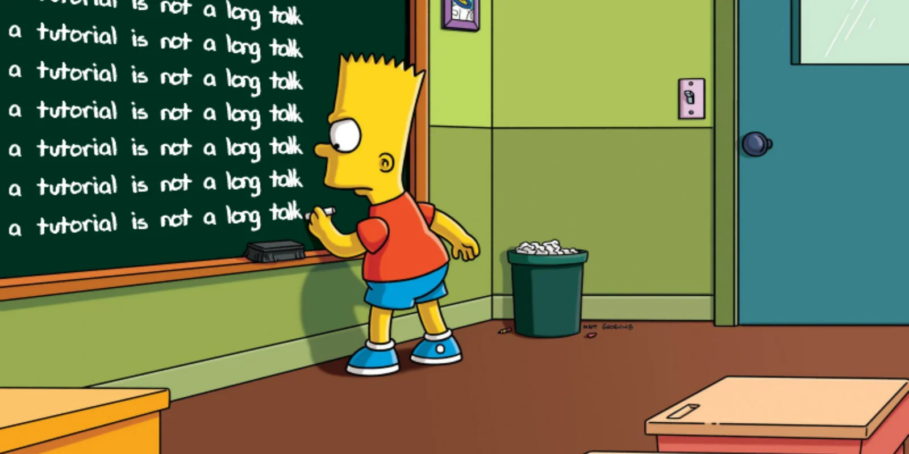

In this opinion piece the author expresses his views on what makes a good (Python) tutorial and how that differs from a long talk.

===

# A tutorial is not a long talk

The title of the article should say it all but I'll elaborate a bit on what I mean by “a tutorial is not a long talk” and I'll share what I think makes a good tutorial.

I've been to talks and tutorials at different conferences (mostly Python conferences) and I've attended great talks, great tutorials, terrible talks, and terrible tutorials.
I've seen it all.

Why do talk speakers sometimes ask questions to the audience?
Why do talk speakers sometimes make jokes during their talks?
Because they don't want their talk to be boring and they want to engage with the audience.

In tutorials, the levels of engagement _**cannot**_ be equal to this.

If you're giving a tutorial, you're not supposed to spend all of your time talking, showing slides, or shuffling code around.
It's also _not enough_ to do live coding.
For your tutorial to be a tutorial, the audience _must_ participate actively through:

 - writing code;
 - tackling challenges;
 - solving problems; or
 - something similar to this!

If the audience can sit through your presentation with their arms crossed, you're not presenting a tutorial.
You're presenting a (long) talk.
Please, don't do this.

If you're giving a tutorial, it's fine to show a couple of slides.
But the point of a tutorial is to give hands-on experience to the audience.

## FAQ

 1. Q: But my tutorial covers very advanced material that the audience won't be able to keep up with...
 A: Make it less complex. No one said giving a good tutorial is easy!

 2. Q: But I don't have a lot of time.
 A: Make it shorter. No one said giving a good tutorial is easy!

If you have any more questions, feel free to drop them below and I'll add them to this FAQ.
