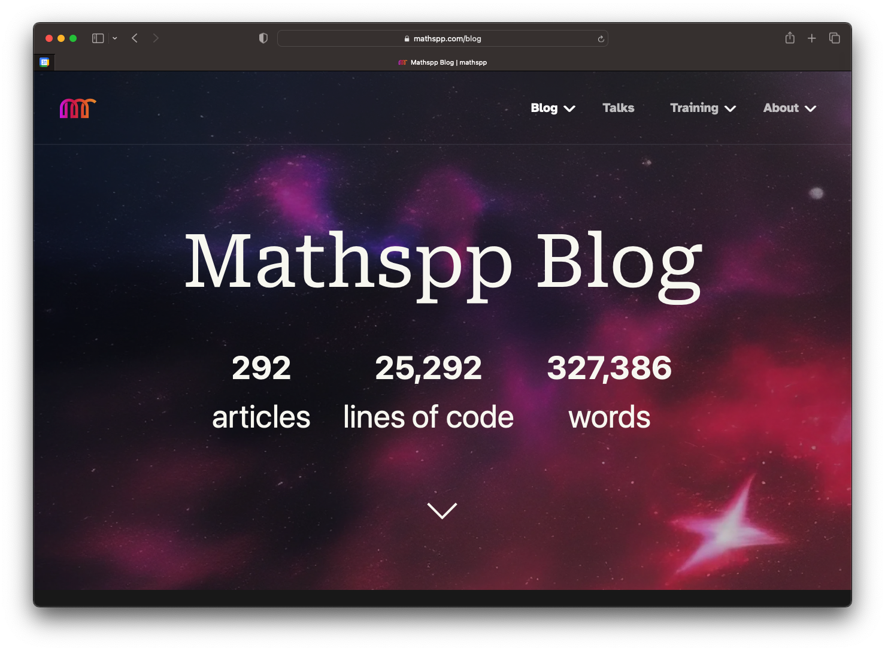

This explains how I added stats to my blog page.

===



# Adding stats to my blog

I recently added some basic statistics to my blog, as the image above shows.
These statistics include the total number of articles published, the number of lines of code written, and the number of words written.

I wrote a Python script to do this for me, naturally, and I wanted to go over it with you.


## Find blog articles

The first thing I did was write a function that finds all blog posts.
This function expects a folder location and it will find all Markdown files that look like blog posts.
In my blog, articles are files called `item.md` or `item.en.md` inside their respective folder, which may be nested arbitrarily, inside a folder where all blog articles reside.

Recursively finding files whose name matches a simple pattern can be done by the [module `pathlib`][pathlib] and [the method `rglob`][pathlib-rglob] that path objects have.
The final function looks like this:

```py
from pathlib import Path

def find_files(folder):
    yield from Path(folder).rglob("item*.md")
```

Thanks to `pathlib`, this is short enough!
I then opened a REPL inside [my blog directory structure][mathspp-github] and tested this function:

```pycon
>>> from stats import find_files
>>> next(find_files("."))
PosixPath('smoosh-all-the-things/item.md')
```

The function `find_files` can also be used to count how many articles I have:

```pycon
>>> len(list(find_files(".")))
293
```


## Remove optional frontmatter

The next thing I want to do is to get rid of metadata that blog articles might have.
Some of my articles will have an initial section that is delimited by three dashes `---`, and that section contains metadata about the article (for example, the title or the date it was published on) and I don't want to take that into account when computing stats for each article.

For example, an article might look like this:

```
---
date: 01-01-2023
title: Happy New Year
---

Hey there, in this article I wish you a happy new year!
```

So, my next step was to create a function that takes in the path to a Markdown article and returns its useful content, possibly stripping it from its frontmatter.
This is the function I wrote:

```py
# ...

def get_file_contents(filepath):
    contents = Path(filepath).read_text()
    if contents.startswith("---"):
        contents = contents.removeprefix("---")
        contents = contents[3 + contents.find("---") :]
    return contents
```

This function will slice out the frontmatter, in case its present, and it will return the useful contents of the article.


## Split code from prose

The next processing step is taking in the article and splitting the prose from the code snippets.
Code snippets are surrounded by triple backticks \`\`\`, so I can use a regular expression to look for those blocks.

The module `re` contains a function `sub` that lets me substitute text.
So, what I did was to find all the blocks that are surrounded by triple backticks and substitute them with the empty string `""`.
However, I also want to _extract_ the blocks, not just remove them from the prose.

In order to _extract_ the blocks, I used the fact that the function `re.sub` can accept a replacer function that accepts a regex match and computes the substitution value.

For example, below we substitute all sequences of As and Bs with the word `"oi"`:

```pycon
>>> import re
>>> string = "ABAABAB what's up ABBBBA?"
>>> re.sub("(A|B)+", "oi", string)
"oi what's up oi?"
```

The replacement `"oi"` is static.
Regardless of what was matched, it gets replaced with `"oi"`.
By using a replacer function, we get more freedom.

For example, we could look for the sequences of As and Bs and sort those letters out:

```pycon
>>> def sort_As_Bs(match):
...     return "".join(sorted(match.group(0)))
...
>>> re.sub("(A|B)+", sort_As_Bs, string)
"AAAABBB what's up AABBBB?"
```

To extract the code snippets and replace them with the empty string, I was a bit sneaky and used the replacer function to append the code snippet to a list with all the results while also replacing the code block with the empty string:

```py
# ...

def split_code_and_text(contents):
    """Split a file into its pure text and a list of code snippets."""
    code_snippets = []

    def regex_replacer(match):
        code_snippets.append(match.group(0))
        return ""

    contents = re.sub("```.*?```", regex_replacer, contents, flags=re.DOTALL)
    return contents, code_snippets
```

The function `split_code_and_text` returns the prose and a list of code snippets.


## Computing the statistics

The final step is to put everything together and to actually compute the statistics.
So, I wrote a function `main` that goes through each article and

 - finds the text and code snippets in that article;
 - counts how many lines of code are inside those code snippets; and
 - counts how many words the article has.

The function `main` looks like this:

```py
# ...

def main():
    articles = code_snippets = loc = words = 0
    for file in find_files((Path(__file__) / "..").resolve()):
        text, code = split_code_and_text(get_file_contents(file))
        articles += 1
        code_snippets += len(code)
        loc += sum(len(snippet.splitlines()) for snippet in code) - 2 * len(code)
        words += len(text.split())

    print(f"{articles = }, {words = }")
    print(f"{code_snippets = }, {loc = }")
```

The most interesting piece of code in this function is the trick `Path(__file__) / ".."` that lets me [find the folder the script is in](https://mathspp.com/blog/module-pathlib-overview#find-the-folder-a-script-is-in).
In my case, I put the file inside the blog folder, so that it makes it easier to compute the path where the blog articles are.

If you look closely, you will see that the way I cound lines of code and words is a bit simplistic, so that it gives me a great estimate of the total number of lines of code I've written in my articles and the total number of words, but it's likely that those numbers aren't 100% accurate.


## Limitations

The short script I wrote is great and it estimates the number of words and lines of code written, but there are some limitations to the simplistic approach I followed.

To illustrate some of these limitations, consider the following excerpt of a hypothetical blog article:

````
This is a [roulette wheel][wikipedia-roulette]:


[wikipedia-roulette]: https://wikipedia.org/some/path/here
````

This excerpt contains a 5-word sentence “This is a roulette wheel”, but my script would count a total of 8 words because it only looks at whitespace-delimited pieces of text, and so it won't understand that the `` is an image (not a word!) and it won't understand that `[wikipedia-roulette]: ...` is a link reference (not two words!).
Thus, a possible improvement to my stats script would be to _parse_ the Markdown of the article and only then count words.


[pathlib]: /blog/module-pathlib-overview
[pathlib-rglob]: /blog/module-pathlib-overview#searching-for-files
[mathspp-github]: https://github.com/mathspp/mathspp
