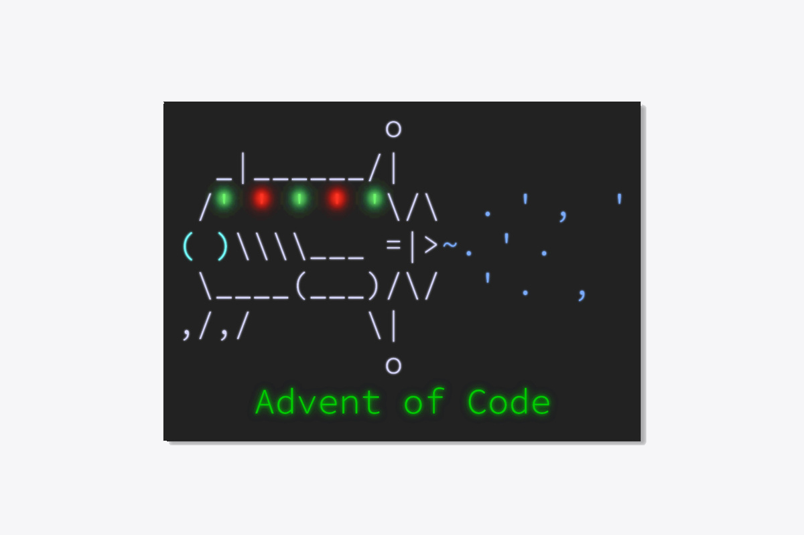

This article is an in-depth analysis of Python solutions to the “Sonar Sweep” problem, which is day 1 of Advent of Code 2021.

===



The analysis that follows pertains to the first day of the [Python Problem-Solving Bootcamp](https://mathspp.com/pythonbootcamp).
Follow [this link](https://mathspp.com/pythonbootcamp) if you'd like to participate in the bootcamp:

 - to be a part of a community of highly-motivated individuals solving Advent of Code together; and
 - to receive notebooks like these with the analysis of the problems tackled.

In the analysis that follows you may be confronted with code that you do not understand, especially as you reach the end of the explanation of each part.

If you find functions that you didn't know before, remember to [check the docs](https://docs.python.org/3/) for those functions and play around with them in the REPL.
This is written to be increasing in difficulty (within each part of the problem), so it is understandable if it gets harder as you keep reading.
That's perfectly fine, you don't have to understand everything _right now_, especially because I can't know for sure what _your level_ is.


## Part 1 problem statement

(Adapted from [here][aoc-day-1].)

You are given a report of depth measurements, like

```txt
199
200
208
210
200
207
240
269
260
263
```

The first order of business is to figure out how quickly the depth increases.

To do this, count **the number of times a depth measurement increases** from the previous measurement. (There is no measurement before the first measurement.)

In the example above, the changes are as follows:

```txt
199 (N/A - no previous measurement)
200 (increased)
208 (increased)
210 (increased)
200 (decreased)
207 (increased)
240 (increased)
269 (increased)
260 (decreased)
263 (increased)
```

In this example, there are 7 measurements that are larger than the previous measurement.

How many measurements are larger than the previous measurement in the input file `inputs/01_sonar_sweep.txt`?

_My code was supposed to arrive at the answer 1292.
You can get your own input from [here][aoc-day-1]._


```python
# IMPORTANT: Set this to the correct path for you!
INPUT_FILE = "inputs/01_sonar_sweep.txt"
```

## Solutions

### Baseline solution

The problem statement asks us to traverse the depth reports and to compare the current measurement with the previous one.

The underlying idea is that, when talking about a sequence (for example, a _list_ of measurements), a relationship of “previous” translates into subtracting 1 to the index at hands.
Similarly, a relationship of “next” translates into adding 1 to the index.

The only thing we need to be careful about is ensuring we stay within the boundaries of the sequence, so that doing `+1` or `-1` in an index still gives a valid index.

This translates directly into this solution:


```python
with open(INPUT_FILE, "r") as f:
    depths = f.readlines()

    count = 0
    for i in range(1, len(depths)):
        if int(depths[i - 1]) < int(depths[i]):    # Compare previous with the current
            count += 1
            
    print(count)
```

    1292
    

If we stick to the “compare with the previous” interpretation, then the indices that matter are `i - 1` (the previous item) and `i` (the current item); and, therefore, `i` must start at `1`.
This means we use `range(1, len(depths))`.

If we go with the “compare with the next” interpretation, then the indices that matter are `i` (the current item) and `i + 1` (the next item).
For that, our range needs to end earlier than `len(depths)`:


```python
with open(INPUT_FILE, "r") as f:
    depths = f.readlines()

    count = 0
    for i in range(len(depths) - 1):
        if int(depths[i]) < int(depths[i + 1]):    # Compare current with “the next”
            count += 1
            
    print(count)
```

### Free resources ASAP

When using a `with` statement to access a file, you know that your file is automatically closed when you leave the `with` statement.
You also know that the `with` statement is nice because it will still close the file if, for example, your code throws an error.
That's very convenient, and a lovely reason to use the `with` statement.

However, while you are inside the `with` statement, the file is opened and being used by the operating system.
In Python, it is a good practice to avoid nesting unnecessary things.
In particular, put as little code inside the `with` statement as possible.

In our case, because we use `.readlines` to read the whole file, we can leave the `with` statement immediately:


```python
with open(INPUT_FILE, "r") as f:
    depths = f.readlines()

count = 0
for i in range(len(depths) - 1):
    if int(depths[i]) < int(depths[i + 1]):
        count += 1

print(count)
```

    1292
    

Trying to keep the indentation level as low as possible (trying to keep your code flat, instead of nested) is something that is advocated for in the [“Zen of Python”](/blog/pydonts/pydont-disrespect-the-zen-of-python).
You can watch a clip of a talk of mine where I talk about this, and explain it, [here](https://youtu.be/s6dJab2qwkg?t=1031) (it's at minute 17:11 of the linked video).

### The range of the length

Another frequent anti-pattern in Python is the excerpt `for i in range(len(...))`.
_Most of the times_, that `for` loop isn't what you really wanted to use.
Python has very powerful `for` loops, and the `for i in range(len(...))` is a pattern that we inherited from languages like C.
In Python, we tend to use built-ins like [`enumerate`](/blog/pydonts/enumerate-me) and [`zip`](/blog/pydonts/zip-up).

Another hint at the fact that the loop we care about is not the `range(len(...))`, is that we don't really care about the indices.
Notice how `range(len(something))` gives you all the legal indices associated with `something`, but what we really care about are the elements.

A slight improvement would be to recognise the `enumerate` pattern:
`enumerate` is a good built-in to use if, in a `for` loop, you care about the current element _and_ about the current index you are using.
In our case, we care about the current index so that we can compute the index of the neighbouring element.
So, we could try writing something like this:


```python
with open(INPUT_FILE, "r") as f:
    depths = f.readlines()

count = 0
for i, num in enumerate(depths[:-1]):
    if int(num) < int(depths[i + 1]):
        count += 1

print(count)
```

    1292
    

In order to make this work, we are using a slice to ignore the last element from `depths`.
After all, the slice `[:-n]` means [“drop the last `n` elements”](/blog/pydonts/idiomatic-sequence-slicing#s-n-3).

Another interesting thought would be to try and simplify the `i + 1` part.
The built-in `enumerate` accepts a `start` argument that specifies where the argument starts counting:


```python
list(enumerate("code"))
```


    [(0, 'c'), (1, 'o'), (2, 'd'), (3, 'e')]


```python
list(enumerate("code", start=10))
```


    [(10, 'c'), (11, 'o'), (12, 'd'), (13, 'e')]


Therefore, one might think that we could set `start=1` to avoid having to perform the sum.
If we do so, then we must be very explicit about what index we are using:


```python
with open(INPUT_FILE, "r") as f:
    depths = f.readlines()

count = 0
for next_idx, num in enumerate(depths[:-1], start=1):
    if int(num) < int(depths[next_idx]):
        count += 1

print(count)
```

    1292
    

However, I personally don't like this.
There is something here that makes me look for a better solution, although some might say I'm just being paranoid.
But, the truth is, our `if` statement is very asymmetrical right now.

The solution lies elsewhere!
The built-in `zip` is more correct here, because `zip` is used to pair sequences up.
But what sequences do we want to pair up..?
After all, we have a single sequence at hands!

As it turns out, the both patterns of “this item & the next one” and “this item & the previous one” are easily written with `zip`.
We just have to remember that, if `seq` is a sequence, then `seq[1:]` means “drop the first element” and `seq[:-1]` means “drop the last element”:


```python
s = "coder"
print(s[:-1])
print(s[1:])
print(list(zip(s[:-1], s[1:])))
```

    code
    oder
    [('c', 'o'), ('o', 'd'), ('d', 'e'), ('e', 'r')]


With this, we can rewrite our solution to be:


```python
with open(INPUT_FILE, "r") as f:
    depths = f.readlines()

count = 0
for prev_, next_ in zip(depths[:-1], depths[1:]):
    if int(prev_) < int(next_):
        count += 1

print(count)
```

    1292
    

In the above, I wrote the name `next_` because `next` is a built-in function.
Then, I decided to use `prev_` instead of `prev` just for symmetry.
You can pick any other two names you prefer, or use `for prev, next_ in ...`.

To simplify things a bit, especially when doing a similar thing with three or more iterables, we can actually omit the slices that are cutting from the end, because `zip` stops as soon as one iterable stops.
In other words, we don't need to specify `depths[:-1]`:


With that in mind, we can remove the extra slice:


```python
with open(INPUT_FILE, "r") as f:
    depths = f.readlines()

count = 0
for prev_, next_ in zip(depths, depths[1:]):
    if int(prev_) < int(next_):
        count += 1

print(count)
```

    1292
    

### Repeated `int` conversions

If you look closely at the `for` loop we are writing, you will notice that most of the values in `depth` are going to be passed in to the built-in `int` twice.
While that's not a terrible thing, it's _double_ the work we need.
All we need is for each number to be converted once, right?

Therefore, we can do the `int` conversion a bit earlier in the process:


```python
with open(INPUT_FILE, "r") as f:
    depths = f.readlines()
depths = [int(d) for d in depths]

count = 0
for prev_, next_ in zip(depths, depths[1:]):
    if prev_ < next_:
        count += 1

print(count)
```

    1292
    

Of course, now we have another issue of repeated work: first, we go over the whole file to read the lines with `.readlines`, and then we go over the file contents to convert everything into an integer.
We can do everything at once, if we convert the lines to integers _while_ we read them:


```python
with open(INPUT_FILE, "r") as f:
    depths = [int(line) for line in f]

count = 0
for prev_, next_ in zip(depths, depths[1:]):
    if prev_ < next_:
        count += 1

print(count)
```

    1292
    

In case you didn't know, [you can iterate over a file](/blog/til/006), which allows you to iterate over the lines.
That's what allowed us to convert into integers all the lines.

On top of that, you might be interested in knowing that [`int` is forgiving](https://twitter.com/mathsppblog/status/1466190674030698499), in that it allows the integers to be surrounded by whitespace:


```python
13 == int("13\n") == int("       13        ") == int("\t\t\n13 \n\t ")
```


    True


### A really long input file

Like I mentioned earlier, we need to consider if our input file fits into memory or not.
Up to now, we have been reading the while file at once, but we don't need to!
We just saw we can iterate over `f` lazily, so we can leverage that for our own solution.

When we do that, notice that throughout our comparison loop we will need to be reading new values from the file.
Thus, if the file is large and we can't read all of it at once, we need to keep it open.
In other words, we have to indent our code again.

On top of that, because we are assuming the file is _very_ big, we can no longer create the list of `depths`!
Thus, we have two options:

 - we can write a _generator expression_ for `depths`; or
 - we can use a `map` with `map(int, f)`.

Using a generator expression entails converting the `[ ... ]` in the list comprehension to `( ... )`:


```python
with open(INPUT_FILE, "r") as f:
    depths = (int(line) for line in f)

    count = 0
    for prev_, next_ in zip(depths, depths[1:]):
        if prev_ < next_:
            count += 1

    print(count)
```


    ---------------------------------------------------------------------------

    TypeError                                 Traceback (most recent call last)

    ~\AppData\Local\Temp/ipykernel_15904/748196112.py in <module>
          3 
          4     count = 0
    ----> 5     for prev_, next_ in zip(depths, depths[1:]):
          6         if prev_ < next_:
          7             count += 1
    

    TypeError: 'generator' object is not subscriptable


However, as we do so, the `depths[1:]` stops working because generators are not indexable/sliceable.
This shows a weakness in our solution!

Thankfully, there are two good solutions!
Starting with Python 3.10, there is a function called `itertools.pairwise` that implements the exact `zip` pattern we wanted:


```python
from itertools import pairwise

with open(INPUT_FILE, "r") as f:
    depths = (int(line) for line in f)

    count = 0
    for prev_, next_ in pairwise(depths):
        if prev_ < next_:
            count += 1

    print(count)
```

    1292
    

If you don't have Python 3.10 (or older), you can define your own `pairwise` using `itertools.tee`.

This isn't beginner-level Python, so feel free to skip this bit:


```python
from itertools import tee

def pairwise(it):
    """Mock `itertools.pairwise` for Python versions below 3.10."""
    prev_, next_ = tee(it, 2)     # Split `it` into two iterables.
    next(next_)                   # Advance once.
    yield from zip(prev_, next_)  # Yield the pairs.
```


```python
with open(INPUT_FILE, "r") as f:
    depths = (int(line) for line in f)

    count = 0
    for prev_, next_ in pairwise(depths):
        if prev_ < next_:
            count += 1

    print(count)
```

    1292
    

### Counting by incrementing

In all of the solutions above we have been counting by incrementing the `count` variable only when the depth test passes.
However, there is a different approach to this, inspired by the languages where Boolean values are just 0s and 1s.
Instead of checking with an `if`, we just add the value of the condition to `count`:


```python
with open(INPUT_FILE, "r") as f:
    depths = (int(line) for line in f)

    count = 0
    for prev_, next_ in pairwise(depths):
        count += prev_ < next_

    print(count)
```

    1292
    

When `prev_ < next_` is `True` (and the `if` statement would pass the test, incrementing `count` by one), the statement `count += True` increments `count` by one.
When `prev_ < next_` is `False` (and the `if` statement would not increment `count`), the statement `count += False` increments `count` by zero.

After all, Boolean values can be treated as integers:


```python
1 + True
```


    2


```python
1 + False
```


    1


This has to be used with caution, though, and is not always advisable.

### Summing the conditions

However, moving the condition to the value that is being incremented gives rise to another implementation.

After all, the pattern

```py
accumulator = 0
for element in iterable:
    accumulator += foo(element)
```

is equivalent to

```py
sum(foo(element) for element in iterable)
```

Therefore, we can rewrite our solution to be a sum:


```python
with open(INPUT_FILE, "r") as f:
    depths = (int(line) for line in f)

    count = sum(prev_ < next_ for prev_, next_ in pairwise(depths))

    print(count)
```

    1292
    

### Using more `itertools`

If you want to study `itertools` a bit further, I leave you with the exercise of studying this terser solution:


```python
from itertools import pairwise, starmap
from operator import le

with open(INPUT_FILE, "r") as f:
    print(sum(starmap(le, pairwise(map(int, f)))))
```

    1292
    

**Hint**: start by understanding why this version works:


```python
with open(INPUT_FILE, "r") as f:
    depths = (int(line) for line in f)
    le = lambda l, r: l < r

    print(sum(le(*args) for args in pairwise(depths)))
```

    1292
    

## Part 2 problem statement

(Adapted from [here][aoc-day-1].)

Instead, consider sums of a three-measurement sliding window. Again considering the above example:

```txt
199  A      
200  A B    
208  A B C  
210    B C D
200      C D E
207        D E F
240          E F G
269            F G H
260              G H
263                H
```

Start by comparing the first and second three-measurement windows. The measurements in the first window are marked A (199, 200, 208); their sum is 199 + 200 + 208 = 607. The second window is marked B (200, 208, 210); its sum is 618. The sum of measurements in the second window is larger than the sum of the first, so this first comparison **increased**.

Your goal now is to count **the number of times the sum of measurements in this sliding window increases** from the previous sum. So, compare A with B, then compare B with C, then C with D, and so on. Stop when there aren't enough measurements left to create a new three-measurement sum.

In the above example, the sum of each three-measurement window is as follows:

A: 607 (N/A - no previous sum)
B: 618 (increased)
C: 618 (no change)
D: 617 (decreased)
E: 647 (increased)
F: 716 (increased)
G: 769 (increased)
H: 792 (increased)

In this example, there are 5 sums that are larger than the previous sum.

Consider sums of a three-measurement sliding window. How many sums are larger than the previous sum in the input file `inputs/01_sonar_sweep.txt`?

_My code was supposed to arrive at the answer 1262.
You can get your own input from [here][aoc-day-1]._

### Similar baseline solution

If we follow a train of thought similar to that employed for the first baseline solution, we might write something like this:


```python
with open(INPUT_FILE, "r") as f:
    depths = [int(line) for line in f]  # Everything as integers from the get-go

count = 0
for i in range(3, len(depths)):
    left = depths[i - 3] + depths[i - 2] + depths[i - 1]
    right = depths[i - 2] + depths[i - 1] + depths[i]
    if left < right:
        count += 1

print(count)
```

    1262
    

This solution works, but it is too much trouble to the programmer: we had to do six indexing operations!
Do you know what are the odds that you'll make a typo and get one index wrong?
For me, that's like 103%!

This is a test you can make to check if your code is “good”: look for numeric parameters in the problem set, and imagine they were much larger.
Would you still want to write your solution in the same way?

For example, the window size of 3 is a parameter of the problem statement.
What if it were a window of size 20?
Would you still write the sum of the indexing by hand?
Probably not!

Hence, you might want to change your code to something using slices:


```python
with open(INPUT_FILE, "r") as f:
    depths = [int(line) for line in f]

count = 0
for i in range(len(depths) - 3):
    # We sum the windows we build with slices:
    left, right = sum(depths[i:i + 3]), sum(depths[i + 1:i + 4])
    if left < right:
        count += 1

print(count)
```

    1262
    

This is one very reasonable train of thought.
Again, because it is using explicit slices, this wouldn't work if the input file were too large.

Thus, you might want to stay loyal to the `pairwise` solution we found earlier.
Maybe there is an `itertools` function for windows of a given size?

### Sum over a triplewise

Sadly, `itertools` does not have such a function.
You can take a look at the custom `pairwise` defined above, and try your hand at implementing a `triplewise` function, that returns three consecutive elements from an iterable.

Skip the definition, if you want, but look at the example usage:


```python
from itertools import tee

def triplewise(it):
    it1, it2, it3 = tee(it, 3)
    next(it2); next(it3); next(it3)
    yield from zip(it1, it2, it3)
```


```python
list(triplewise("coder"))
```


    [('c', 'o', 'd'), ('o', 'd', 'e'), ('d', 'e', 'r')]


With the function `triplewise` (which doesn't exist in `itertools`, but exists in [`more_itertools`](https://more-itertools.readthedocs.io/en/stable/), along with many other useful functions!), we could write a rudimentary function that keeps computing the value of the sum of the current window, and compares it to the previous sum:


```python
with open(INPUT_FILE, "r") as f:
    depths = [int(line) for line in f]

count = 0
sum_prev = float("+inf")
for triple in triplewise(depths):
    sum_ = sum(triple)
    if sum_prev < sum_:
        count += 1
    sum_prev = sum_

print(count)
```

    1262
    

This works, but now we have “regressed” in a way.

Part 1 and part 2 are very similar in structure.
However, for part 1 we didn't need to have an auxiliary variable that we kept updating, and now we do...

### Pairwise the triplewise

Part 1 and part 2 are exactly the same, except that part 1 had a window size of 1, and part 2 has a window size of 3.
So, part 2 should be solvable with code similar to that of part 1!
In part 1, we used a pairwise to compare the windows, so that's what we should be doing here:


```python
with open(INPUT_FILE, "r") as f:
    depths = [int(line) for line in f]

count = 0
sum_prev = float("+inf")
for triple_prev, triple_next in pairwise(triplewise(depths)):
    if sum(triple_prev) < sum(triple_next):
        count += 1

print(count)
```

    1262
    

Wait, is this getting too complicated?!

Good!
That's because we are overlooking something.

I suffer from this, but when we read a problem statement, we should spend a couple of minutes thinking about it...

Let's go back to the original problem statement and the example they showed:

```txt
199  A      
200  A B    
208  A B C  
210    B C D
200      C D E
207        D E F
240          E F G
269            F G H
260              G H
263                H
```

How do we compare the sliding window `A` with the sliding window `B`?
Notice how the windows `A` and `B` have a huge overlap!
They overlap in the numbers `200` and `208`; it's only the beginning of `A` and the end of `B` that change!

This is actually easy to spot in the baseline solution with indices.
Let me include it here again, but let me realign the assignments to `left` and `right`:


```python
with open(INPUT_FILE, "r") as f:
    depths = [int(line) for line in f]

count = 0
for i in range(3, len(depths)):
    left = depths[i - 3] + depths[i - 2] + depths[i - 1]
    right =                depths[i - 2] + depths[i - 1] + depths[i]
    if left < right:
        count += 1

print(count)
```

    1262
    

Or, better yet, let me copy & paste the additions directly into the `if` statement, removing the assignments altogether:


```python
with open(INPUT_FILE, "r") as f:
    depths = [int(line) for line in f]

count = 0
for i in range(3, len(depths)):
    if depths[i - 3] + depths[i - 2] + depths[i - 1] < depths[i - 2] + depths[i - 1] + depths[i]:
        count += 1

print(count)
```

    1262
    

Why did I do this?

Because, now, I want to think about the condition of the `if` statement like a mathematical inequality.
(Do you see where this is going?)
Let me just abbreviate `depths` as `d` because I'm lazy:

$$
\require{cancel}
\begin{align}
d[i - 3] + {d[i - 2]} + {d[i - 1]} &< {d[i - 2]} + {d[i - 1]} + d[i] \implies \\
d[i - 3] + \cancel{d[i - 2]} + \cancel{d[i - 1]} &< \cancel{d[i - 2]} + \cancel{d[i - 1]} + d[i] \implies \\
d[i - 3] &< d[i]
\end{align}
$$

So, in essence, we can omit most of the terms from the comparison because they don't matter!
They are being added to both sides of the scale (you can think of a `<` as a scale checking if the left side is lighter), and therefore they do not make a difference in the balance of the scale:


```python
with open(INPUT_FILE, "r") as f:
    depths = [int(line) for line in f]

count = 0
for i in range(3, len(depths)):
    if depths[i - 3] < depths[i]:
        count += 1

print(count)
```

    1262
    

This is a _pretty_ good solution.

### Parametrising the window size

One (tiny) thing that is very worth the mention is that with this version, it becomes trivial to parametrise the window size:


```python
WS = 3  # Window size.

with open(INPUT_FILE, "r") as f:
    depths = [int(line) for line in f]

count = 0
for i in range(WS, len(depths)):
    if depths[i - WS] < depths[i]:
        count += 1

print(count)
```

    1262
    

With the addition of the `WS` variable, the problem statement can change the window size to anything they'd like, that we can adjust our solution with the same ease.

In particular, if we change `WS` to 1, we get back the problem from part 1:


```python
WS = 1

with open(INPUT_FILE, "r") as f:
    depths = [int(line) for line in f]

count = 0
for i in range(WS, len(depths)):
    if depths[i - WS] < depths[i]:
        count += 1
print(count)  # The value from part 1.
```

    1292
    

### Handling big files lazily

The only thing left to mention is what we do if the file `f` can't be loaded to memory as a whole, because it's too big.
In that case, `depths` can't be defined as a list comprehension, and thus `depth` won't be indexable like in the `if` statement.

In that case, we need to do something similar to the `pairwise` that we did before.
Before, we did a `pairwise` because we wanted to compare each value to the one before it (index minus one).
Now, we want to compare each value with the one three places before it (index minus three).

Then, we can use two functions from `itertools`: `tee` and `islice`; or we can keep track of the window by hand.

To do this by hand, we will keep track of a list whose size is one plus the window size.
We start by filling this manual window, and then we keep comparing the two ends of the window:


```python
WS = 3

with open(INPUT_FILE, "r") as f:
    depths = (int(line) for line in f)  # Using a lazy generator now.

    # Start by putting `WS` elements inside `window`.
    window = [next(depths) for _ in range(WS)]

    count = 0
    # When we get here, `depths` is already missing some elements from the beginning,
    # so we can already start comparing depth values.
    for elem in depths:
        window.append(elem)
        if window[0] < window[-1]:
            count += 1
        window.pop(0)  # Get rid of the oldest element in the window.

    print(count)
```

    1262
    

This is a pretty decent solution.
The most confusing thing may be the way `window` is initialised, with the built-in `next`.
`next` is a function that accepts a lazy generator and just spits out the next value of the lazy generator.

Here is an example:


```python
gen_ints_to_10 = iter(range(10))
```


```python
next(gen_ints_to_10)
```


    0


```python
next(gen_ints_to_10)
```


    1


What's interesting about iterators is that, once you start going through them, you've “lost” the items you already saw.
For example, if you iterate over `gen_ints_to_10` with a `for` loop now, the `0` and the `1` will already be gone:


```python
for num in gen_ints_to_10:
    print(num, end=" ")
```

    2 3 4 5 6 7 8 9 

If you are comfortable with this solution, you may want to study this next solution:


```python
from itertools import islice, tee

WS = 3

with open(INPUT_FILE, "r") as f:
    depths = (int(line) for line in f)

    prev_it, it = tee(depths, 2)    # Split iterator in two.
    next_it = islice(it, WS, None)  # Skip WS elements from this iterator. 

    count = 0
    for prev_, next_ in zip(prev_it, next_it):
        if prev_ < next_:
            count += 1

    print(count)
```

    1262
    

## Conclusion

In one way or another, this problem showed that whenever we need to iterate over a sequence of values, we are likely to find useful tools in the `itertools` module.

We were careful to try and not do too much repeated work, and we also took a look at how our code would have to be different if the input data were too much to hold in memory at once.

If you have any questions, suggestions, remarks, recommendations, corrections, or anything else, you can reach out to me [on Twitter](https://twitter.com/mathsppblog) or via email to rodrigo at mathspp dot com.


[aoc-day-1]: https://adventofcode.com/2021/day/1
