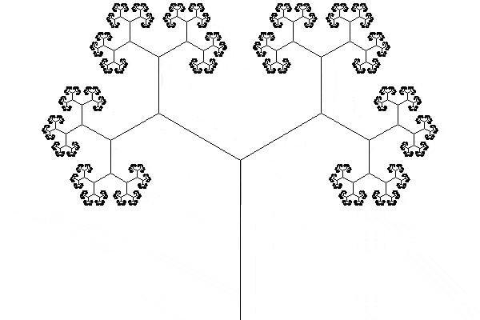
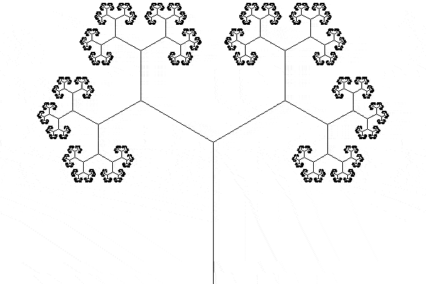

This article walks through the code used to animate a tree fractal.

===


# Animating a tree fractal

I really enjoy fractals and for the longest time I've been meaning to draw the classical tree fractal that starts with the main trunk which then successively splits into two branches, that themselves can be seen as the full tree.

Today I quickly put together the code to do this and then I animated the rotation of the tree to make sure it's easy to see the self-similarity of the tree.

This is the animated GIF that I produced:




## Drawing the tree

To draw the tree I wrote a recursive function (obviously!) that draws a trunk and then recursively draws the remainder of the tree.
To “recursively draw the remainder of the tree” I needed to compute the two trunks that stem from the trunk I just drew, so to do that I:

 - computed the direction of the trunk I just drew as a numpy vector;
 - rotated this vector by 60 degrees (clockwise and counter-clockwise);
 - scaled down this vector; and
 - used it to compute the two new trunks.

The recursive function looks like this:

```py
def tree(screen, start, to, depth=0):
    if depth >= 15:
        return
    sx, sy = start
    tx, ty = to
    pygame.draw.line(
        screen,
        BLACK,
        (WIDTH // 2 + sx, HEIGHT // 2 - sy),
        (WIDTH // 2 + tx, HEIGHT // 2 - ty),
        1,
    )
    direction = np.array([[tx - sx], [ty - sy]])
    for angle in [pi / 3, -pi / 3]:
        rot = np.array(
            [
                [cos(angle), -sin(angle)],
                [sin(angle), cos(angle)],
            ]
        )
        new_direction = ((rot @ ((direction) / 1.7))).reshape((2,))
        tree(screen, to, to + new_direction, depth + 1)
```

One important thing that I ended up doing, and that explains the weird calculations inside the call to `pygame.draw.line`, is that I decided to do all calculations as if the coordinate system were the standard one from maths class: the origin is at the centre of the pygame window and the values of the coordinate y increase by going up, not by going down.
Then, I need to convert from this sytem to the pygame system right before drawing, which is why I add `(WIDTH // 2, HEIGHT // 2)` to the points we're drawing and then for the y coordinate I need to use the symmetric value (`-y` instead of `y`) to compensate for the fact that the y axis is flipped.

The full script to draw the tree looks like this:

```py
from math import sin, cos, pi
import sys

import numpy as np
import pygame
import pygame.locals

WIDTH, HEIGHT = 600, 400

WHITE = (255, 255, 255)
BLACK = (0, 0, 0)

screen = pygame.display.set_mode((WIDTH, HEIGHT))


def tree(screen, start, to, depth=0):
    ...


def main() -> None:
    screen.fill(WHITE)
    tree(screen, np.array((0, -200)), np.array((0, 0)))
    pygame.display.flip()
    pygame.image.save(screen, "tree.png")

    while True:
        for event in pygame.event.get():
            if event.type == pygame.locals.QUIT:
                pygame.quit()
                sys.exit(0)


if __name__ == "__main__":
    main()
```

## Animating the tree

To make it easier to animate the tree I first started by splitting the function `tree` in two:

 1. a function is responsible for generating all the end points for all the line segments that make up the tree; and
 2. a second function iterates over those and draws them on the screen:

```py
def draw_tree(segments):
    """Draws tree segments on the screen."""
    for from_, to_ in segments:
        fx, fy = from_
        tx, ty = to_
        pygame.draw.line(
            screen,
            BLACK,
            (WIDTH // 2 + fx, HEIGHT // 2 - fy),
            (WIDTH // 2 + tx, HEIGHT // 2 - ty),
            1,
        )


def build_tree(screen, start, to, depth=0):
    """Generates all tree segments up to a given depth."""
    if depth >= 15:
        return
    yield start, to
    sx, sy = start
    tx, ty = to
    direction = np.array([[tx - sx], [ty - sy]])
    for angle in [pi / 3, -pi / 3]:
        rot = np.array(
            [
                [cos(angle), -sin(angle)],
                [sin(angle), cos(angle)],
            ]
        )
        new_direction = ((rot @ ((direction) / 1.7))).reshape((2,))
        yield from build_tree(screen, to, to + new_direction, depth + 1)
```

The next step was writing a function `animate` that takes those segments and a parameter `alpha` that controls the animation, and then computes the new positions of those segments.
The value `alpha` goes from 0 to 1 and you can think of it as the progress of the animation.

Since I want to rotate the first left trunk into the position of the original trunk, I need to rotate it by 60 degrees, I need to scale it back up, and then I need to push it down to the original position.
These three transformations (rotating, scaling, and translating) are done incrementally and controlled by the parameter `alpha`:

```py
def animate(segments, alpha):
    # The angle goes from 0 to 60 degrees
    angle = -pi / 3 * alpha
    # The rotation matrix:
    rot = np.array(
        [
            [cos(angle), -sin(angle)],
            [sin(angle), cos(angle)],
        ]
    )
    # Scaling goes from 1 to 1.7
    scaling = (1 + 0.7 * alpha)
    # Translation goes from (0, 0) to (0, -HEIGHT // 2)
    translation = np.array(
        [
            [0],
            [-HEIGHT // 2 * alpha],
        ]
    )
    for from_, to_ in segments:
        # Turn into column vectors for the matrix multiplication and then undo that.
        from_ = from_.reshape((2, 1))
        to_ = to_.reshape((2, 1))
        yield (
            (scaling * rot @ from_ + translation).reshape((2,)),
            (scaling * rot @ to_ + translation).reshape((2,)),
        )
```

Then, I made the value of `alpha` vary from 0 to 1 and I used pygame to save the rendering of the screen at every frame.
In the end, I used ffmpeg to turn the frames into an MP4 video and into a GIF.

Here is the full Python script:

```py
from math import sin, cos, pi

import numpy as np
import pygame
import pygame.locals

WIDTH, HEIGHT = 600, 400

WHITE = (255, 255, 255)
BLACK = (0, 0, 0)

screen = pygame.display.set_mode((WIDTH, HEIGHT))

def animate(segments, alpha):
    ...

def draw_tree(segments):
    ...

def build_tree(screen, start, to, depth=0):
    ...

def main() -> None:
    screen.fill(WHITE)
    original_segments = list(build_tree(screen, np.array((0, -200)), np.array((0, 0))))

    FRAMES = 240
    for tick in range(0, FRAMES + 1):
        screen.fill(WHITE)
        segments = animate(original_segments, tick / FRAMES)
        draw_tree(segments)
        pygame.display.flip()
        pygame.image.save(screen, f"tree/frame{tick:04}.png")

if __name__ == "__main__":
    main()
```

That's what created this amazing GIF:


I tried extending the animation so that the tree did two turns, but something at the halfway mark of the animation makes it look a bit janky and I haven't been able to fix this in the meantime:


