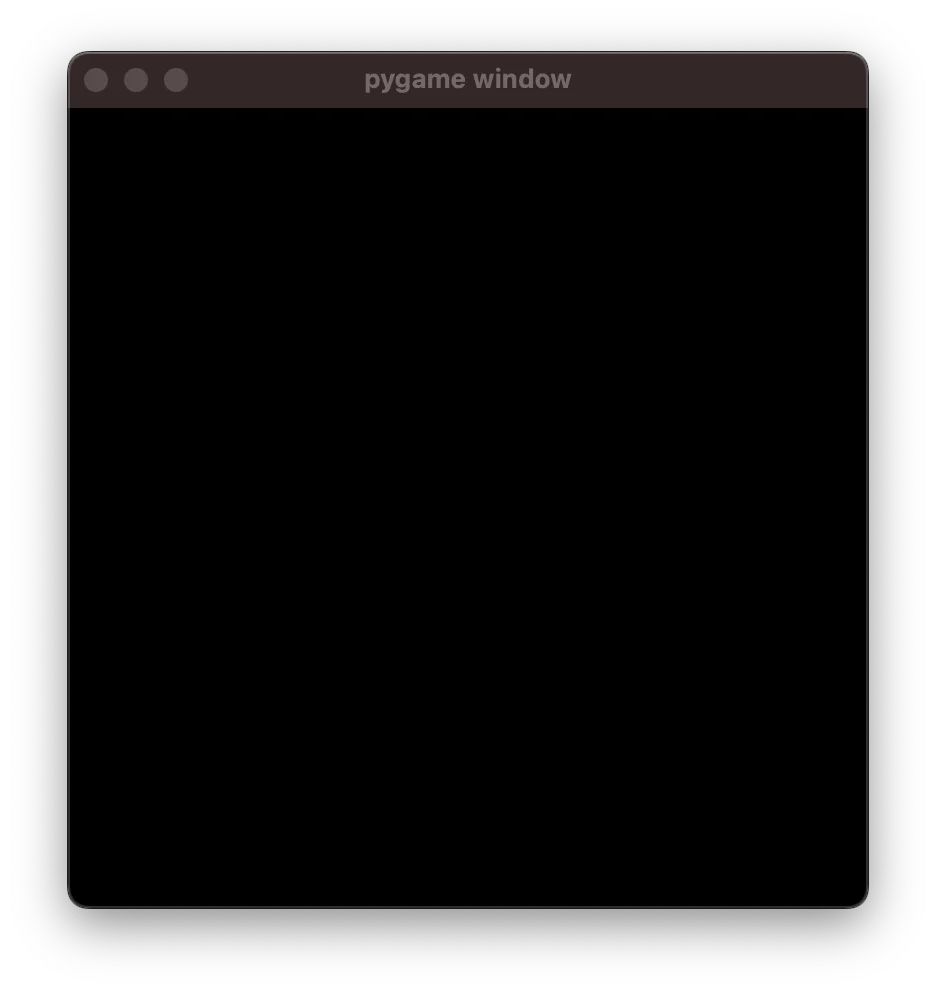
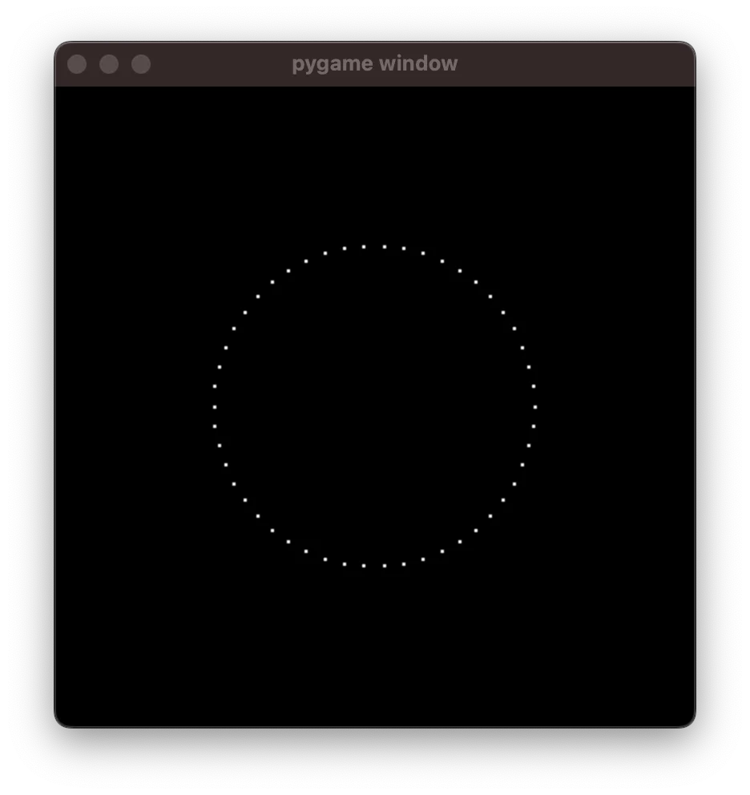

Create animations from first principles and morph between different figures with Python. In 5 minutes. Kind of.

===

<video width="400" height="400" poster="/blog/animations-from-first-principles-in-5-minutes/_morph.mp4.thumb.png" controls>
  <source src="/blog/animations-from-first-principles-in-5-minutes/_morph.mp4" type="video/mp4">
  A video animation of a colourful circle morphing into a figure eight and back, animated with a Python and pygame script.
</video>

Let me guide you through creating your first animation.
We'll be using Python and `pygame`, so make sure you install it in your preferred way, and make sure it was installed properly:

```pycon
>>> import pygame
pygame 2.5.1 (SDL 2.28.2, Python 3.11.4)
Hello from the pygame community. https://www.pygame.org/contribute.html
```

The code in this article was written with Python 3.11 and `pygame` 2.5.1.
However, it should run well on older versions of Python/`pygame` because we're only using fundamental features that have been around for a while and that are unlikely to go anywhere.


## In 5 minutes?

I have no idea if you can go through this in 5 minutes.
You surely can't if these ideas are new to you and you're typing the code yourself.
However, I did present most of this material in 5 minutes in [a lightning talk at PyCon Portugal](/talks).


## Creating the canvas to draw on

The first thing we need is a canvas to draw on, so we'll import `pygame`, create a small canvas, and fill it with black.
Since we'll be drawing in white, we can also set that up already:

```py
import pygame

WHITE = (255, 255, 255)
BLACK = (0, 0, 0)

WIDTH = 400
HEIGHT = 400

screen = pygame.display.set_mode((WIDTH, HEIGHT))
screen.fill(BLACK)


while True:
    pygame.display.flip()
```

The code above fills a 400 by 400 screen with black and then it refreshes it forever.
If you run this program, you'll see a black screen:



To close this, you'll need to interrupt _the Python shell where you ran your program_.


## Drawing a circle

We'll start by animating the drawing of a circle, so we need to be able to draw a circle.
In order to do this, we'll write a function `circle` that accepts a single argument `progress` that is a float between 0 and 1:

```py
def circle(progress):
    ...
```

This function `circle` will return a point – a tuple with two floats – that will represent a position on the screen that belongs to the circle...
But what position?

Think of yourself drawing a circle.
As the pen moves around the piece of paper, you can think of the "progress" you've made in drawing the circle.
If you have put the pen down on the paper, you've drawn 0% of the circle, so the progress is `0`.

After you've drawn half a circle, you've drawn 50% of the circle, so that's `progress=0.5`.
And as soon as you finish the circle, when your pen has gone around the paper and it touches the line you started drawing, at that time, your progress is `1`.

So, the function `circle` is supposed to return the position your pen was in when your drawing was at a given percentage of progress.

If you know some maths, or if you're willing to explore this a bit, we're essentially looking for a "parametrisation of the circle".
This is also the term you'd look for online if you want to draw non-trivial shapes.

So, our function `circle` will look like this:

```py
from math import cos, sin, pi

def circle(progress):
    return (
        WIDTH // 2 + WIDTH // 4 * cos(2 * pi * progress),
        WIDTH // 2 + WIDTH // 4 * sin(2 * pi * progress),
    )
```

Now, to draw the circle, what we do is we use a `for` loop and a big number of iterations, and we draw a tiny point for each pen position that the function `circle` gives us.
By creating a bunch of these small points, we can draw a circle without actually dragging a pen over a piece of paper:


The code that generated this circle is the following:

```py
from math import cos, sin, pi
import pygame

WHITE = (255, 255, 255)
BLACK = (0, 0, 0)

WIDTH = 400
HEIGHT = 400

screen = pygame.display.set_mode((WIDTH, HEIGHT))
screen.fill(BLACK)


def circle(progress):
    return (
        WIDTH // 2 + WIDTH // 4 * cos(2 * pi * progress),
        HEIGHT // 2 + HEIGHT // 4 * sin(2 * pi * progress),
    )


POINTS = 1000
for it in range(POINTS):
    progress = it / POINTS
    pygame.draw.circle(
        screen,
        WHITE,
        circle(progress),
        radius=1,
    )

while True:
    pygame.display.flip()
```

If you reduce the value of `POINTS` drastically, you'll be able to see that we're actually drawing a circle by just creating tiny points on the screen.
For example, if you set `POINTS = 50`, you get this:



In the image above, the points are barely visibly.
It's only when we create a big number of points and draw them all at once that our figure becomes visible.

Now, we'll animate the drawing of a circle.


## Animating the drawing of the circle

Right now, we're drawing the circle all in one go.
To _animate_ it, what we need to do is draw it slowly enough so that the user can see it, but fast enough so that the user doesn't have the perception that it's being drawn point by point.

To achieve this effect, we are going to pre-determine for how long we want the animation to run (3 seconds, for example) and the framerate at which it should happen.
Anything above 30 should look smooth, as in, it is not noticeable that we are drawing the circle point by point.

With a bit of mathematics, we can draw the circle in segments, inside the `while` loop, and use the `pygame` clock to control the framerate.
The code looks like this:

```py
from math import cos, sin, pi
import pygame

WHITE = (255, 255, 255)
BLACK = (0, 0, 0)

WIDTH = 400
HEIGHT = 400

screen = pygame.display.set_mode((WIDTH, HEIGHT))
screen.fill(BLACK)


def circle(progress):
    return (
        WIDTH // 2 + WIDTH // 4 * cos(2 * pi * progress),
        HEIGHT // 2 + HEIGHT // 4 * sin(2 * pi * progress),
    )


FPS = 60
DURATION = 3
FRAMES = FPS * DURATION

clock = pygame.time.Clock()
frame = 0
while frame <= FRAMES:
    clock.tick(FPS)

    # Draw 50 NEW points per frame.
    for i in range(50):
        progress = frame / FRAMES + i / 50 / FRAMES
        pygame.draw.circle(
            screen,
            WHITE,
            circle(progress),
            radius=1,
        )

    frame += 1
    pygame.display.flip()
```

Running it should look like this:


## Animating a figure eight

Now that we have the animating scaffolding in place, animating a circle is as easy as animating any other shape.
For example, we can animate a figure eight as long as we create a function `eight` that accepts a float that represents the drawing progress.

In other words, as long as we have a parametrisation of the figure eight, we can animate drawing it.

Just add `eight` to the code:

```py
def eight(progress):
    return (
        WIDTH // 2 + WIDTH // 4 * sin(4 * pi * progress),
        HEIGHT // 2 + HEIGHT // 4 * cos(2 * pi * progress),
    )
```

And change `circle` to `eight` in your loop:

```py
# ...
while frame <= FRAMES:
    clock.tick(FPS)

    # Draw 50 NEW points per frame.
    for i in range(50):
        progress = frame / FRAMES + i / 50 / FRAMES
        pygame.draw.circle(
            screen,
            WHITE,
            eight(progress),  # <<< Use `eight` here.
            radius=1,
        )

    # ...
```

With this simple change, we can generate this animation:


## Interim challenges

If you have the time, try to tackle these small challenges to make sure you're groking the gist of this:

 - Try fiddling with the magical constants inside the function `eight` to draw different figures.
 - Try slowing down or speeding up the animation.
 - Try to draw yet another figure; you can create your own parametrisation or you can look up a parametrisation of another curve online.


## Morphing between two figures

The next step is animating the morphing of two figures, instead of the process of drawing them.
So, instead of drawing a little bit of the figure in each frame, we are going to draw a complete figure in each frame.
However, instead of drawing a circle or a figure eight, we're going to draw something "in between" the two.

There are many different ways to morph between two figures but we are going to go with the simplest one.

We are going to create a function called `morph` that will have four parameters:

```py
def morph(fig1, fig2, progress, alpha):
    ...
```

The first two parameters (`fig1` and `fig2`) will be functions that draw two different figures.
The parameter `progress` will have the same meaning as before; it will represent the position of the pen in the process of drawing a figure.
The parameter `alpha` will also be a float between 0 and 1 and it will represent the progress of _morphing_ the two figures.

When the parameter `alpha` is `0`, we'll essentially draw the figure from `fig1`.
When the parameter `alpha` is `1`, we'll essentially draw the figure from `fig2`.
When the parameter `alpha` is somewhere between `0` and `1`, we draw something between `fig1` and `fig2`.

The (simple!) implementation is this:

```py
def morph(fig1, fig2, progress, alpha):
    x1, y1 = fig1(progress)
    x2, y2 = fig2(progress)
    return (
        x1 + (x2 - x1) * alpha,
        y1 + (y2 - y1) * alpha,
    )
```

Notice that we start by computing the points of figures 1 and 2 independently and then we use the parameter `alpha` to morph them.
(What we are actually doing is interpolating the two figures linearly.)

Now, to plug this into our code, we replace the `for` loop that draws a segment of our figure with a `for` loop that draws the totality of our figure.
The `for` loop will control the pen and it will make it draw the whole figure (go from `progress=0` to `progress=1`).
On the other hand, the iterations over the `while` loop (the frames) will control the parameter `alpha`.

This is what the new `while` loop looks like:

```py
while frame <= FRAMES:
    clock.tick(FPS)

    screen.fill(BLACK)  # Clear previous drawing.

    alpha = frame / FRAMES
    # Draw 1000 points over the morphed figure.
    for i in range(1000):
        progress = i / 1000
        pygame.draw.circle(
            screen,
            WHITE,
            morph(circle, eight, progress, alpha),  # <<<
            radius=1,
        )

    frame += 1
    pygame.display.flip()
```

Running this program should look like this:


## Adding colour

When you are drawing/animating your figures, you have two parameters to play with:

 1. `progress` determines how far along the figure you are (it keeps track of the "progress" of the "pen" that is drawing the figure); and
 2. `alpha` determines how far along the morphing you are.

You can use these two parameters to add colour to your animation, either by creating a gradient along the drawing or along the morphing.

For example, we can use the function `colour` below to use the parameter `progress` to add some colour along the figure:

```py
def colour(progress):
    return (
        int(201 + 50 * sin(2 * pi * progress)),
        int(51 - 50 * cos(2 * pi * progress)),
        int(51 - 50 * sin(2 * pi * progress)),
    )
```

Then, you modify your call to `pygame.draw.circle` so that it uses the function `colour` instead of using the pre-determined `WHITE`:

```py
while frame <= FRAMES:
    # ...

    for i in range(1000):
        progress = i / 1000
        pygame.draw.circle(
            screen,
            colour(progress),  # <<< Use `colour` here.
            morph(circle, eight, progress, alpha),
            radius=1,
        )

    # ...
```

This should create this animation:


Similarly, you can make the colour change _along_ the morphing by replacing `colour(progress)` with `colour(alpha)`, which creates this animation:


## Creating a video

Creating a video with your animation is simpler than you might imagine.
There are only two steps to it:

 1. save each frame as an image; and
 2. use a tool (like ffmpeg) to put the images together into a video.

After all, a video is just a sequence of images that are shown in quick succession, so that you don't realise they're images!

To save your frames as images, use the function `pygame.image.save`:

```py
while frame <= FRAMES:
    # ...

    pygame.image.save(screen, f"some_folder/frame{frame:03}.png")
    frame += 1
    pygame.display.flip()
```

Just make sure to create the folder `some_folder` before trying to save frames there because `pygame` will not create it for you.

Then, [after you install ffmpeg](https://ffmpeg.org), you can use some magic incantations to turn the animations into a video.

I used this magic incantation:

```bash
ffmpeg -framerate 60 -pattern_type glob -i 'some_folder/frame*.png' -c:v libx264 -pix_fmt yuv420p animation.mp4
```

There are parts of that command that I don't understand, so use it at your own risk! 😝


## Even more animations

If you want to create more animations, I have [a follow-up article][more-animations] where you'll create an animation of a recursive triangular structure that zooms in and rotates, like this:

<video width="400" height="400" poster="/blog/more-animations-from-first-principles-in-5-minutes/_zoom_triangle.mp4.thumb.png" controls>
  <source src="/blog/more-animations-from-first-principles-in-5-minutes/_zoom_triangle.mp4" type="video/mp4">
  You can't watch this video in your browser...
</video>

[more-animations]: /blog/more-animations-from-first-principles-in-5-minutes
