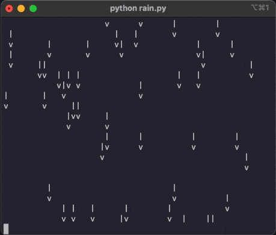

Using ASCII characters we can create a simple rain animation in the terminal.

===

# ASCII rain scroll art

“Scroll art” is a term I've heard used to refer to images or animations made out of ASCII characters.
In this short article we'll go over the code necessary to create this raining animation:



This animation runs on the terminal and only requires using the built-in `print`.


## Coding the animation

An animation is a series of images (frames) shown in quick succession.
In this case, each frame is composed of a series of printed lines in a loop, so it's the way in which we manage the lines that gives the impression of an animation.

We will print some lines to fill the screen, we will pause for a fraction of a second, and then we will repeat this process.

We will use a `deque` to hold all the lines that will fill the screen.
To create the animation of falling rain, for each frame we need to create a new line that gets printed at the top of the screen and we need to get rid of the line that was printed at the bottom of the screen in the previous frame.
A `deque` is a good data structure for this because we can use [the parameter `maxlen`](/blog/python-deque-tutorial#how-to-create-a-deque) to do this management automatically.

So, our animation code starts like this:

```py
from collections import deque
import shutil

TERMINAL_WIDTH, TERMINAL_HEIGHT = shutil.get_terminal_size()
RAIN_DENSITY = 0.05
EMPTY_LINE = " " * TERMINAL_WIDTH

lines = deque([EMPTY_LINE for _ in range(TERMINAL_HEIGHT)], maxlen=TERMINAL_HEIGHT)
```

At this point, if we print all of the lines inside `lines`, we clear the screen of the terminal.

What we will do next is write a short function `build_next_line` that accepts a line of the animation and creates a new random line that we can print at the top of the animation.
This happens in two passes:

 1. we put tails `|` on top of the drops `v` from the previous line; and
 2. we add drops `v` in some random positions.

Suppose the previous animation had this top line:

```
  |  vv  |v
```

In the first pass, we create this line:

```
     ||   |
  |  vv  |v
```

In the second pass, we add random drops (which might replace a previous tail):

```
vv   ||   v
  |  vv  |v
```

The function `build_next_line` looks like this:

```py
import random

def build_next_line(source):
    next_row = ["|" if char == "v" else " " for char in source]
    for idx, _ in enumerate(next_row):
        if random.random() < RAIN_DENSITY:
            next_row[idx] = "v"
    return "".join(next_row)
```

To run the animation, we need an infinite loop!
At each step, we build a new line with the function `build_next_line` and append it to the left of the `deque` (and its `maxlen` parameter will make sure that the oldest line gets thrown away automatically).
Then, we print all of the lines to the screen and pause the program for a bit:

```py
from time import sleep

while True:
    new_row = build_next_line(lines[0])
    lines.appendleft(new_row)
    for row in lines:
        print(row)
    sleep(0.05)
```


## Full code

The full code looks like this:

```py
from collections import deque
import random
import shutil
from time import sleep

TERMINAL_WIDTH, TERMINAL_HEIGHT = shutil.get_terminal_size()
RAIN_DENSITY = 0.05
EMPTY_LINE = " " * TERMINAL_WIDTH

lines = deque([EMPTY_LINE for _ in range(TERMINAL_HEIGHT)], maxlen=TERMINAL_HEIGHT)


def build_next_line(source):
    next_row = ["|" if char == "v" else " " for char in source]
    for idx, _ in enumerate(next_row):
        if random.random() < RAIN_DENSITY:
            next_row[idx] = "v"
    return "".join(next_row)


while True:
    new_row = build_next_line(lines[0])
    lines.appendleft(new_row)
    for row in lines:
        print(row)
    sleep(0.05)
```


## Further "reading"

If you enjoy this kind of thing, you might want to take a look at [The Scroll Art Museum](https://scrollart.org); it contains some other nice animations.
