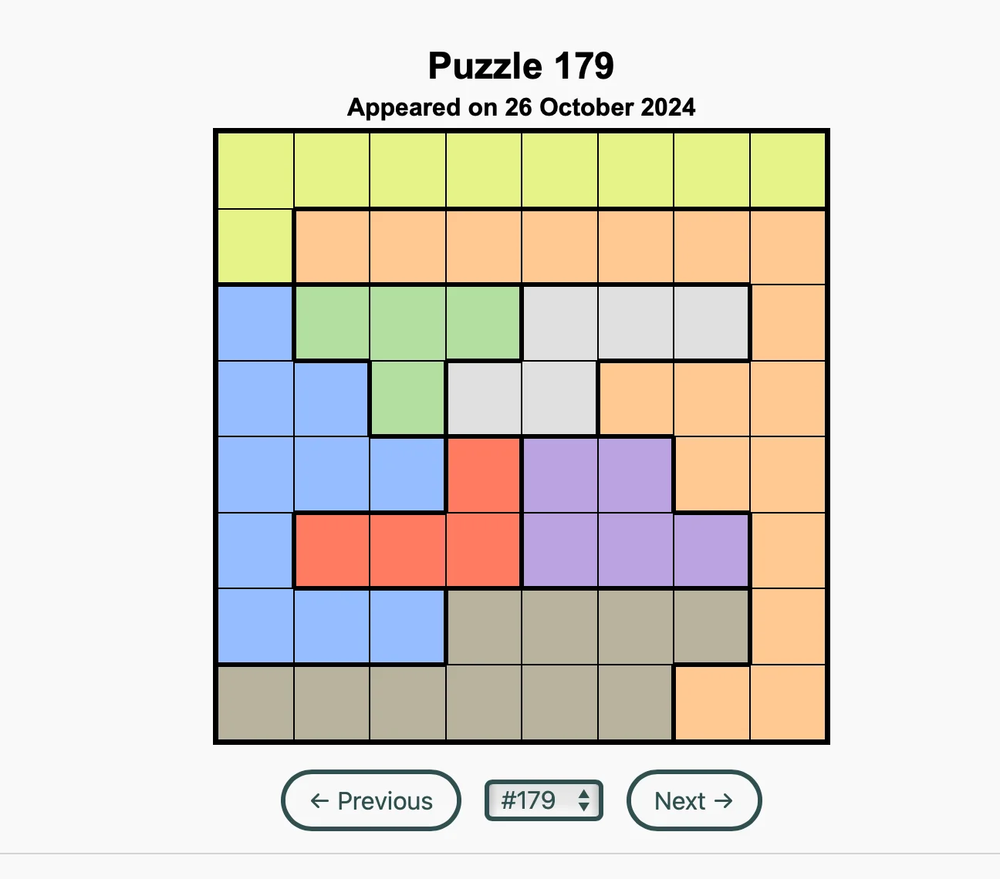
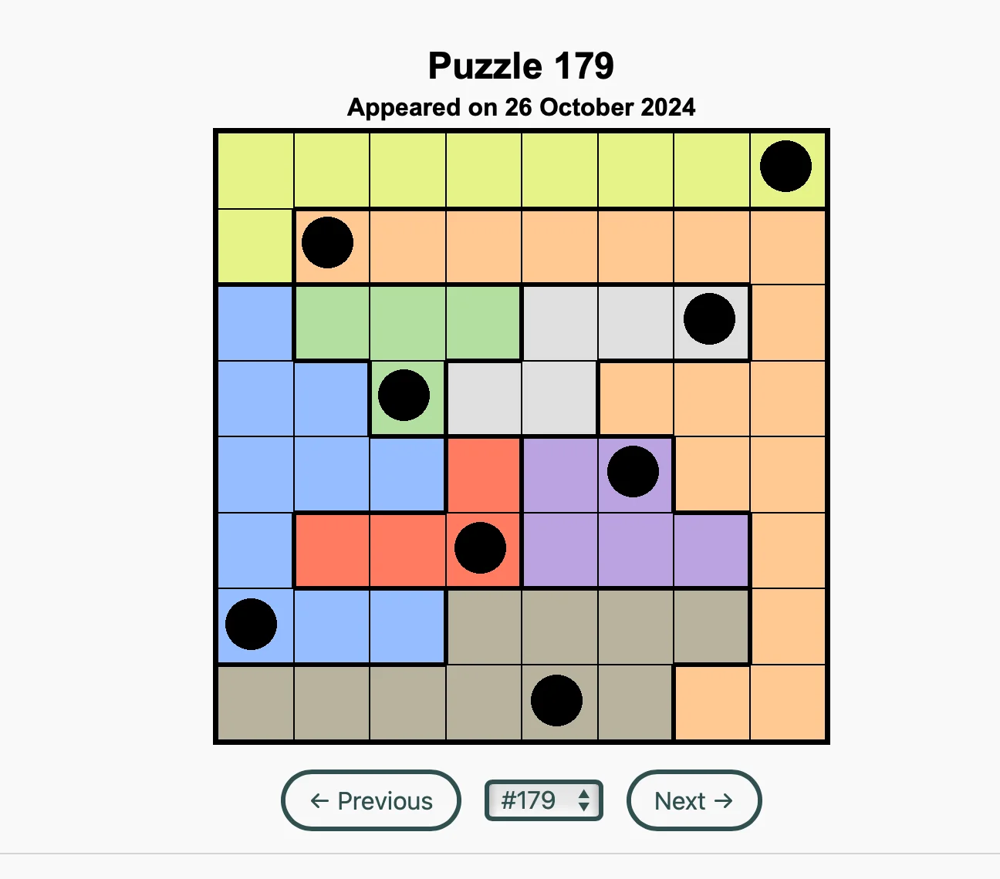
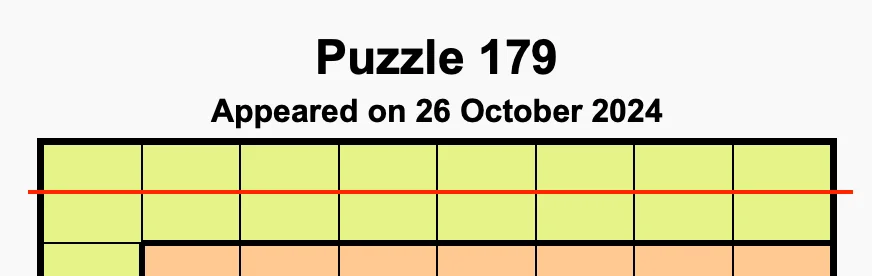

This is a short account of how I wrote a program that solves all LQueens puzzles from LinkedIn automatically with Python.

===


# Beating LinkedIn “Queens” with Python

About a year ago LinkedIn started publishing a daily logic puzzle called “Queens”.
This puzzle is a crossover between the [queen-placing puzzle from chess](/blog/problems/8-queens) and Sudoku, and takes place in a square grid with a number of heterogeneous coloured regions, as the image below demonstrates:




## Puzzle rules

The rules for the puzzle are quite simple.
You have to place one queen on each coloured region while also making sure that:

 - there is one and only one queen per row and column; and
 - queens cannot touch each other, not even diagonally.

See if you can solve the puzzle above, for example by visiting [this unofficial archive](https://www.archivedqueens.com).
(Make sure to select the same puzzle as I'm showing above, number 179.)


## Solving the puzzle

I write algorithms for things like this all the time – which is a bit of a weird thing to be experienced on, but oh well... –, so solving the puzzle in Python was actually quite straightforward.

I decided to represent the board as a list of sets, where each set contains the coordinates of the cells of a coloured region.
For example, puzzle 179 shown above would be represented as the following list of sets:

```py
[
    {(0, 1), (4, 0), (0, 0), (7, 0), (2, 0), (3, 0), ...},  # yellow
    {(7, 4), (7, 1), (2, 1), (7, 7), (3, 1), (6, 1), ...},  # orange
    {(2, 4), (0, 4), (0, 3), (1, 4), (0, 6), (0, 2), ...},  # blue
    {(2, 3), (3, 2), (1, 2), (2, 2)},                       # green
    {(6, 2), (4, 3), (4, 2), (3, 3), (5, 2)},               # gray
    {(2, 5), (3, 4), (3, 5), (1, 5)},                       # red
    {(4, 4), (5, 5), (6, 5), (5, 4), (4, 5)},               # purple
    {(0, 7), (2, 7), (3, 7), (4, 6), (5, 7), (1, 7), ...},  # brown
]
```

The good stuff lies in the function `solve`.
The function `solve` is a recursive function that accepts the list with coloured groups that don't have a queen yet and returns the list of positions where queens must go.

How does the function know it's done?
If it receives an empty list of coloured groups, then that means all groups received a queen, and we can start producing the list of queen positions:

```py
def solve(group_sets):
    if not group_sets:
        return []

    # ...
```

That's the best possible scenario, because that's when the function is already done.
But usually, the function has work to do.

If the list of coloured groups is not empty, then the function looks at the very first coloured group, which should be `group_sets[0]`, and traverses that set of positions, one position at a time:

```py
    for tx, ty in group_sets[0]:
```

The `tx` and `ty` and the x and y coordinates for the _tentative_ position of the queen of the current coloured group.
But let us assume, for a second, that we actually place a queen at the position `(tx, ty)`.
If that happens, a bunch of positions become illegal for new queens:

 - positions in the same column;
 - positions in the same row; and
 - positions touching the queen.

This means we need to update the positions of the coloured groups to exclude those invalid positions.
That's why we compute new coloured group sets:

```py
    for tx, ty in group_sets[0]:
        new_group_sets = [
            ...  # Remaining valid positions of the coloured group `gs`.
            for gs in group_sets[1:]
        ]
```

But how do we compute these new coloured groups?
We start by going through the positions that made up that group:

```py
    for tx, ty in group_sets[0]:
        new_group_sets = [
            {
                (x, y)
                for x, y in gs
            }
            for gs in group_sets[1:]
        ]
```

The problem is that this simply copies each coloured group.
We need to remove the positions that are now illegal because of the queen at `(tx, ty)`.
That's why we add a filter:

```py
    for tx, ty in group_sets[0]:
        new_group_sets = [
            {
                (x, y)
                for x, y in gs
                if (
                    x != tx  # Can't be in the same column.
                    and y != ty  # Can't be in the same row.
                    and abs(x - tx) + abs(y - ty) > 2  # Can't touch.
                )
            }
            for gs in group_sets[1:]
        ]
```

At this point, we have the coloured groups and all their valid positions.

The next step is making sure that the queen at `(tx, ty)` didn't invalidate any coloured groups.
In other words, we need to make sure that all groups still have valid positions within them.
If not, we can ignore the queen at `(tx, ty)` and attempt a different position for the current queen:

```py
    for tx, ty in group_sets[0]:
        new_group_sets = ...

        if not all(new_group_sets):  # 1+ empty group sets, skip this attempt.
            continue
```

If all coloured groups are still valid, then all is well and we try to place queens in the following groups.
How do we do this?
We do this by calling the function `solve` recursively:

```py
    for tx, ty in group_sets[0]:
        new_group_sets = ...

        if not all(new_group_sets):  # 1+ empty group sets, skip this attempt.
            continue

        result = solve(new_group_sets)
```

After that, one of two things happened:

 1. either the recursive call failed to place the queens and returned `None`; or
 2. the recursive call worked and returned a list of positions where you must place the queens in the coloured groups that were left.

If we're in the second case, it means we found a solution and the tentative position `(tx, ty)` is actually a good idea, so we add `(tx, ty)` to the list of queen positions and return it:

```py
    for tx, ty in group_sets[0]:
        new_group_sets = ...

        if not all(new_group_sets):  # 1+ empty group sets, skip this attempt.
            continue

        result = solve(new_group_sets)
        if result is not None:
            return [(tx, ty)] + result
```

If we're in the first case and the recursive call didn't work, then we just let the loop do its job and we attempt to place a new queen at a new tentative position.

In the end, the full code of the function `solve` is as follows:

```py
def solve(group_sets):
    """Recursive auxiliary function that brute-forces the solution.

    This function takes the first coloured group and tries to place a queen on each
    position of that group, then removes all positions from the following groups that
    would clash with this queen, and then tries to solve the remainder of the puzzle
    recursively by ignoring the first coloured group.

    If we reach an impossible position, the function returns None to indicate failure.
    Upon success, the function returns a list of all the positions where queens must go.
    """
    if not group_sets:
        return []

    # Try to put the next queen at all positions of the next group.
    for tx, ty in group_sets[0]:
        new_group_sets = [
            {
                (x, y)
                for x, y in gs
                if (
                    x != tx  # Can't be in the same column.
                    and y != ty  # Can't be in the same row.
                    and abs(x - tx) + abs(y - ty) > 2  # Can't touch.
                )
            }
            for gs in group_sets[1:]
        ]
        if not all(new_group_sets):  # 1+ empty group sets, skip this attempt.
            continue

        result = solve(new_group_sets)
        if result is not None:
            return [(tx, ty)] + result
```

This is enough to solve the puzzle, but creating the board representation by hand is tedious, so I decided to solve that issue with Python as well!


## Reading the puzzle from an image

The next thing I did was write more code (duh!) to read an image and parse the puzzle from it!

In broad strokes, this is what I did:

 1. look for something that looks like a sufficiently big, black square grid on the image;
 2. find the number of cells the grid contains (not all puzzles are played on a grid that is 8 by 8);
 3. build the board representation of the grid;
 4. use the function `solve` to solve the puzzle; and
 5. draw the solution on top of the puzzle image.

Given the puzzle 179 shown above, my program creates a solution image like the one I'm showing below:



Since I don't have any image processing knowledge, this was a pretty delicate process...
I'll walk you through it now, or you can [skip ahead to get the final code](#final-code).


### Finding the grid

To look for the grid, I start by looking for a black pixel that could be the top-left corner of the grid.
Then, I try to walk right from that black pixel, as far as I can, while always being on top of black pixels (this is an attempt to walk over the top edge of the puzzle grid).
Then, I try to do the same thing but walking down instead of right, while always being on top of black pixels (this is an attempt to walk over the left edge of the puzzle grid).

Once I've reached the end of what are possibly the top and left edges, I try to complete the grid and validate the bottom and right edges.
If the edges are there, I probably found a black square that could be the grid.

After trying to expand the grid by walking its edges, I check if the black square I found is big enough to be the grid.
For this, I assumed that the grid would always be at least 50 pixels wide, since I won't know the zoom level of the picture.
I also check if the width and height of the grid are roughly the same, to check if I found what looks like a square and to rule out other random rectangles.

If everything works out, then I have found the grid and I take note of the top-left and bottom-right corners of the grid.
This is the job of the function `calibrate`:

```py
def calibrate(img):
    """Find the grid in the puzzle image.

    Returns the top-left and bottom-right corners of the image."""
    width, height = img.size
    # Look for the top-left corner of the grid.
    for x, y in expanding_range(min(width, height) - 1):
        c = img.getpixel((x, y))
        if is_black(c):  # Is this the top-left corner of the grid?
            tl, _, br, _ = expand_grid(img, (x, y))
            if check_grid_size(tl, br):
                return tl, br

    raise RuntimeError("Can't find grid.")
```

The function `expand_grid` is the one that takes the black pixel and tries to find the black edges, like I mentioned.
Then, the function `check_grid_size` is the one that checks if the grid is large enough and if it looks square-ish.

The auxiliary generator `expanding_range`, that you see used in the outer loop, produces the candidate positions for the top-left corner of the grid.
Instead of traversing the image row by row, or column by column, I used a different pattern, because I'm assuming the top-left corner of the grid is going to be close to the top-left corner of the image that contains the puzzle.
So, `expanding_grid` starts by producing positions close to the top-left corner of the image and successively gets further away from there.

The code for the auxiliary functions `expanding_range`, `is_black`, `expand_grid`, and `check_grid_size`, can be seen below.

<details>
<summary>Source code for <code>expanding_range</code></summary>

<pre><code class="language-py">def expanding_range(max_size):
    """Produces all x, y values in a square of the given size ordered by Chebyshev
    distance to the point (0, 0).

    First, return points `p` for which `max(p) == 0`, then points for which
    `max(p) == 1`, then points for which `max(p) == 2`, etc.

    Example:
    >>> list(expanding_range(0))
    [(0, 0)]
    >>> list(expanding_range(1))
    [(0, 0), (1, 0), (1, 1), (0, 1)]
    >>> list(expanding_range(2))
    [(0, 0), (1, 0), (1, 1), (0, 1), (2, 0), (2, 1), (2, 2), (0, 2), (1, 2)]
    """
    for size in range(max_size + 1):
        for y in range(size + 1):
            yield (size, y)
        for x in range(size):
            yield (x, size)
</code></pre>

</details>


<details>
<summary>Source code for <code>is_black</code></summary>

<pre><code class="language-py">def is_black(c):
    """Is this colour essentially black?"""
    if c is None:
        return False
    if isinstance(c, float):
        return c <= 15 / 255
    if isinstance(c, int):
        return c <= 15
    # Ignore the alpha channel.
    return all(channel <= 15 for channel in c[:3])
</code></pre>

</details>

<details>
<summary>Source code for <code>expand_grid</code></summary>

<pre><code class="language-py">def expand_grid(img, tl):
    """Expand the grid in the image with the given top-left corner.

    Returns the 4 corners of the grid found, starting at the top-left and going
    clockwise.
    """
    width, height = img.size
    x, y = tl
    nx = x
    while nx < width and is_black(img.getpixel((nx, y))):
        nx += 1
    nx -= 1
    ny = y
    while ny < height and is_black(img.getpixel((x, ny))):
        ny += 1
    ny -= 1
    # (x, y) is the top-left corner, (nx, y) is the top-right,
    # (x, ny) is the bottom-left, and (nx, ny) SHOULD be the bottom-right.
    if not is_black(img.getpixel((nx, ny))):
        return (tl, tl, tl, tl)  # Grid of size 0.

    # Ensure the edges are also there and valid.
    for _x in range(x, nx + 1):
        if not is_black(img.getpixel((_x, ny))):
            return (tl, tl, tl, tl)
    for _y in range(y, ny + 1):
        if not is_black(img.getpixel((nx, _y))):
            return (tl, tl, tl, tl)

    return (
        (x, y),  # top-left
        (nx, y),  # top-right
        (nx, ny),  # bottom-right
        (x, ny),  # bottom-left
    )
</code></pre>

</details>

<details>
<summary>Source code for <code>check_grid_size</code></summary>


<pre><code class="language-py">def check_grid_size(tl, br):
    """Does the grid look approximately square of a large enough size?

    We don't check for an exact square because the border of the puzzle has some width
    and we need to account for a small error from the possibility that we didn't capture
    the exterior part of the border.
    """
    x1, y1 = tl
    x2, y2 = br
    width = abs(x1 - x2)
    height = abs(y1 - y2)
    return width >= 50 and height >= 50 and width * 0.95 <= height <= width * 1.05
</code></pre>


</details>


### Computing the number of grid cells

After finding the grid, I need to figure out how many cells there are.
I'm quite proud of the way I did this, actually!

The idea is simple: I find a point in the grid that is not black and I draw a horizontal line across that point.
That line should cross all columns of cells along with the black boundaries of the cells:



Going through that line, a full cell corresponds to a group of successive pixels that are not black, separated from other groups of pixels by some black pixels (the boundaries).
Using `itertools.groupby` I was able to count these groups of non-black pixels in a convenient way and I do it horizontally and vertically, just to make sure everything is ok.
If the numbers don't match, the program throws an error:


```py
from itertools import groupby

def compute_grid_n(img, tl, br):
    """Find how many cells the grid contains."""
    # Find a point that is not black.
    x1, y1 = tl
    x2, y2 = br
    width, height = abs(x2 - x1), abs(y2 - y1)
    size = min(width, height)
    delta = 0
    while delta < size:
        if not is_black(img.getpixel((x1 + delta, y1 + delta))):
            break
        delta += 1
    else:  # If we left the grid without finding a non-black pixel, error.
        raise RuntimeError("Can't find a non-black pixel in the grid!")

    # To count the number of cells along each direction we slice the image, determine
    # whether each pixel in the slice is black or not, and then use `groupby` to group
    # together sequences of black or non-black pixels.
    vertical_n = sum(
        not black  # The cells are groups that were not black.
        for black, _ in groupby(
            is_black(img.getpixel((x1 + delta, y))) for y in range(y1, y2 + 1)
        )
    )
    horizontal_n = sum(
        not black
        for black, _ in groupby(
            is_black(img.getpixel((x, y1 + delta))) for x in range(x1, x2 + 1)
        )
    )

    if vertical_n != horizontal_n:
        raise RuntimeError(f"{vertical_n = }, {horizontal_n = }")
    return vertical_n
```


### Extract the board from the image

Now that we know where the grid is and how many cells it contains, we can finally extract the board information.
First, we use a bit of maths to compute the position of the centre of each cell in the image (approximately):

```py
cell_locations = compute_cell_locations(tl, br, n)
```

<details markdown=1>
<summary>Source code for the function <code>compute_cell_locations</code></summary>

```py
from itertools import product

def compute_cell_locations(tl, br, n):
    """Compute the (approximate) centres of the grid cells."""
    left, top = tl
    dx = (br[0] - tl[0]) // n
    dy = (br[1] - tl[1]) // n
    cells = {
        (x, y): (
            left + x * dx + dx // 2,
            top + y * dy + dy // 2,
        )  # Corner + previous cells + centre offset
        for x, y in product(range(n), repeat=2)
    }
    return cells
```

</details>

Then, we extract the colours of those cell centres:

```py
cell_colours = {
    board_coords: img.getpixel(img_coords)
    for board_coords, img_coords in cell_locations.items()
}
```

After that, we check how many unique colours we extracted and make sure that matches what we expected:

```py
unique_colours = list(set(cell_colours.values()))
if (n_colours := len(unique_colours)) != n:
    raise RuntimeError(f"Found {n_colours} colours, expected {n}.")
```

Finally, we build the representation of the board that we showed in the beginning.
We create a list of sets, where each set represents a coloured region.
Each coloured region is a set that contains the coordinates of each cell in the grid.
(For example, the top-left cell is `(0, 0)` and the bottom-right cell is `(n - 1, n - 1)`.)

```py
colour_groups = [
    {coords for coords, colour in cell_colours.items() if colour == current_colour}
    for current_colour in unique_colours
]
```


### Solving the puzzle

Now that we have the board represented in a Python data structure, we can solve it with the function `solve` that was introduced in the beginning.
We just need to call `solve`.
That's it.


### Drawing the solution

After we get the solution from the function `solve`, we can draw the solution on top of the puzzle image and save that as a copy.
For that, we use the library `pillow` to draw circles on the grid, according to the positions determined by the function `solve`.
To map a grid coordinate like `(7, 2)` to the position in the original image we need to use the coordinates of the top-left corner of the grid, computed early in the process, and also the cell size that we can estimate based on the width of the grid and the number of cells along each axis.

This is the function that does the drawing:

```py
import PIL.ImageDraw

def draw_solutions(img, solution, tl, cell_size):
    """Draw the queens as black circles on the image."""
    drawable = PIL.ImageDraw.Draw(img)
    radius = cell_size // 3

    left, top = tl

    for x, y in solution:
        px = left + cell_size * x + cell_size // 2
        py = top + cell_size * y + cell_size // 2
        drawable.ellipse(
            [px - radius, py - radius, px + radius, py + radius], fill="black"
        )
```


### Putting everything together in a CLI

All the steps that I laid out above are coded in a function `solve_puzzle_image` that takes care of each step in turn and prints some intermediate messages:

```py
import PIL.Image

def solve_puzzle_image(filename):
    # Open image.
    img = PIL.Image.open(filename)
    # Find grid.
    tl, br = calibrate(img)
    print(f"Found grid corners at {tl} and {br}.")
    # Find grid length in number of cells.
    n = compute_grid_n(img, tl, br)
    print(f"Grid is {n} x {n}.")

    # Compute cell centres and extract coulours.
    cell_locations = compute_cell_locations(tl, br, n)
    cell_colours = {
        board_coords: img.getpixel(img_coords)
        for board_coords, img_coords in cell_locations.items()
    }

    # Check we found the correct number of colours.
    unique_colours = list(set(cell_colours.values()))
    if (n_colours := len(unique_colours)) != n:
        raise RuntimeError(f"Found {n_colours} colours, expected {n}.")

    # Build the board representation.
    colour_groups = [
        {coords for coords, colour in cell_colours.items() if colour == current_colour}
        for current_colour in unique_colours
    ]

    # Solve the puzzle.
    solution = solve(colour_groups)
    if solution is None:
        raise RuntimeError("Couldn't find solution!")
    print("Found solution. Generating image.")

    # Draw the queens at the correct locations.
    cell_size = (br[0] - tl[0]) // n
    draw_solutions(img, solution, tl, cell_size)

    # Save the drawn image as a copy of the original one.
    solved_filename = filename.with_stem(filename.stem + "_solved")
    img.save(solved_filename)
    print("Solution saved.")
```

To top it all off, I created a short `main` function that uses the module `click` to turn this into a command line tool that accepts the path to a puzzle image as the argument and builds a new image:

```py
from pathlib import Path
import click

@click.command()
@click.argument(
    "puzzle_path", type=click.Path(exists=True, readable=True, path_type=Path)
)
def main(puzzle_path):
    solve_puzzle_image(puzzle_path)


if __name__ == "__main__":
    main()
```


## Publishing the CLI as a package

The final step for me was to publish this as a package on PyPI, so that others can easily use this tool.
I setup a project using `uv` and then [published the CLI to PyPI](/blog/til/publishing-a-python-package-with-uv).
Now, the CLI lives in [the PyPI project `li_queens`](https://pypi.org/project/li_queens/) and you can run it with `uvx --from li_queens queens puzzle.png`.


## Final code

The full code for the program that solves a Queens puzzle given by an image can be found below.
The program depends on `click` (for the basic CLI) and `pillow` (to manipulate images).

<details markdown=1>
<summary>Full source code</summary>

<pre><code class="language-py">from itertools import groupby, product
from pathlib import Path

import click
import PIL.Image
from PIL.Image import Image
import PIL.ImageDraw


def expanding_range(max_size):
    """Produces all x, y values in a square of the given size ordered by Chebyshev
    distance to the point (0, 0).

    First, return points `p` for which `max(p) == 0`, then points for which
    `max(p) == 1`, then points for which `max(p) == 2`, etc.

    Example:
    >>> list(expanding_range(0))
    [(0, 0)]
    >>> list(expanding_range(1))
    [(0, 0), (1, 0), (1, 1), (0, 1)]
    >>> list(expanding_range(2))
    [(0, 0), (1, 0), (1, 1), (0, 1), (2, 0), (2, 1), (2, 2), (0, 2), (1, 2)]
    """
    for size in range(max_size + 1):
        for y in range(size + 1):
            yield (size, y)
        for x in range(size):
            yield (x, size)


def is_black(c):
    """Is this colour essentially black?"""
    if c is None:
        return False
    if isinstance(c, float):
        return c <= 15 / 255
    if isinstance(c, int):
        return c <= 15
    # Ignore the alpha channel.
    return all(channel <= 15 for channel in c[:3])


def expand_grid(img, tl):
    """Expand the grid in the image with the given top-left corner.

    Returns the 4 corners of the grid found, starting at the top-left and going
    clockwise.
    """
    width, height = img.size
    x, y = tl
    nx = x
    while nx < width and is_black(img.getpixel((nx, y))):
        nx += 1
    nx -= 1
    ny = y
    while ny < height and is_black(img.getpixel((x, ny))):
        ny += 1
    ny -= 1
    # (x, y) is the top-left corner, (nx, y) is the top-right,
    # (x, ny) is the bottom-left, and (nx, ny) SHOULD be the bottom-right.
    if not is_black(img.getpixel((nx, ny))):
        return (tl, tl, tl, tl)  # Grid of size 0.

    # Ensure the edges are also there and valid.
    for _x in range(x, nx + 1):
        if not is_black(img.getpixel((_x, ny))):
            return (tl, tl, tl, tl)
    for _y in range(y, ny + 1):
        if not is_black(img.getpixel((nx, _y))):
            return (tl, tl, tl, tl)

    return (
        (x, y),  # top-left
        (nx, y),  # top-right
        (nx, ny),  # bottom-right
        (x, ny),  # bottom-left
    )


def check_grid_size(tl, br):
    """Does the grid look approximately square of a large enough size?

    We don't check for an exact square because the border of the puzzle has some width
    and we need to account for a small error from the possibility that we didn't capture
    the exterior part of the border.
    """
    x1, y1 = tl
    x2, y2 = br
    width = abs(x1 - x2)
    height = abs(y1 - y2)
    return width >= 50 and height >= 50 and width * 0.95 <= height <= width * 1.05


def compute_grid_n(img, tl, br):
    """Find how many cells the grid contains."""
    # Find a point that is not black.
    x1, y1 = tl
    x2, y2 = br
    width, height = abs(x2 - x1), abs(y2 - y1)
    size = min(width, height)
    delta = 0
    while delta < size:
        if not is_black(img.getpixel((x1 + delta, y1 + delta))):
            break
        delta += 1
    else:  # If we left the grid without finding a non-black pixel, error.
        raise RuntimeError("Can't find a non-black pixel in the grid!")

    # To count the number of cells along each direction we slice the image, determine
    # whether each pixel in the slice is black or not, and then use `groupby` to group
    # together sequences of black or non-black pixels.
    vertical_n = sum(
        not black  # The cells are groups that were not black.
        for black, _ in groupby(
            is_black(img.getpixel((x1 + delta, y))) for y in range(y1, y2 + 1)
        )
    )
    horizontal_n = sum(
        not black
        for black, _ in groupby(
            is_black(img.getpixel((x, y1 + delta))) for x in range(x1, x2 + 1)
        )
    )

    if vertical_n != horizontal_n:
        raise RuntimeError(f"{vertical_n = }, {horizontal_n = }")
    return vertical_n


def calibrate(img):
    """Find the grid in the puzzle image.

    Returns the top-left and bottom-right corners of the image."""
    width, height = img.size
    # Look for the top-left corner of the grid.
    for x, y in expanding_range(min(width, height) - 1):
        c = img.getpixel((x, y))
        if is_black(c):  # Is this the top-left corner of the grid?
            tl, _, br, _ = expand_grid(img, (x, y))
            if check_grid_size(tl, br):
                return tl, br

    raise RuntimeError("Can't find grid.")


def compute_cell_locations(tl, br, n):
    """Compute the (approximate) centres of the grid cells."""
    left, top = tl
    dx = (br[0] - tl[0]) // n
    dy = (br[1] - tl[1]) // n
    cells = {
        (x, y): (
            left + x * dx + dx // 2,
            top + y * dy + dy // 2,
        )  # Corner + previous cells + centre offset
        for x, y in product(range(n), repeat=2)
    }
    return cells


def solve(group_sets: list[set[tuple[int, int]]]) -> list[tuple[int, int]] | None:
    """Recursive auxiliary function that brute-forces the solution.

    This function takes the first coloured group and tries to place a queen on each
    position of that group, then removes all positions from the following groups that
    would clash with this queen, and then tries to solve the remainder of the puzzle
    recursively by ignoring the first coloured group.

    If we reach an impossible position, the function returns None to indicate failure.
    Upon success, the function returns a list of all the positions where queens must go.
    """
    if not group_sets:
        return []

    # Try to put the next queen at all positions of the next group.
    for tx, ty in group_sets[0]:
        new_group_sets: list[set[tuple[int, int]]] = [
            {
                (x, y)
                for x, y in gs
                if (
                    x != tx  # Can't be in the same column.
                    and y != ty  # Can't be in the same row.
                    and abs(x - tx) + abs(y - ty) > 2  # Can't touch diagonally.
                )
            }
            for gs in group_sets[1:]
        ]
        if not all(new_group_sets):  # 1+ empty group sets, skip this attempt.
            continue

        result = solve(new_group_sets)
        if result is not None:
            return [(tx, ty)] + result


def draw_solutions(img, solution, tl, cell_size):
    """Draw the queens as black circles on the image."""
    drawable = PIL.ImageDraw.Draw(img)
    radius = cell_size // 3

    left, top = tl

    for x, y in solution:
        px = left + cell_size * x + cell_size // 2
        py = top + cell_size * y + cell_size // 2
        drawable.ellipse(
            [px - radius, py - radius, px + radius, py + radius], fill="black"
        )


def solve_puzzle_image(filename):
    img = PIL.Image.open(filename)
    tl, br = calibrate(img)
    print(f"Found grid corners at {tl} and {br}.")
    n = compute_grid_n(img, tl, br)
    print(f"Grid is {n} x {n}.")

    cell_locations = compute_cell_locations(tl, br, n)
    cell_colours = {
        board_coords: img.getpixel(img_coords)
        for board_coords, img_coords in cell_locations.items()
    }
    unique_colours = list(set(cell_colours.values()))

    if (n_colours := len(unique_colours)) != n:
        raise RuntimeError(f"Found {n_colours} colours, expected {n}.")

    colour_groups = [
        {coords for coords, colour in cell_colours.items() if colour == current_colour}
        for current_colour in unique_colours
    ]

    solution = solve(colour_groups)
    if solution is None:
        raise RuntimeError("Couldn't find solution!")
    print("Found solution. Generating image.")

    cell_size = (br[0] - tl[0]) // n
    draw_solutions(img, solution, tl, cell_size)
    solved_filename = filename.with_stem(filename.stem + "_solved")
    img.save(solved_filename)
    print("Solution saved.")


@click.command()
@click.argument(
    "puzzle_path", type=click.Path(exists=True, readable=True, path_type=Path)
)
def main(puzzle_path) -> None:
    solve_puzzle_image(puzzle_path)


if __name__ == "__main__":
    main()
</code></pre>

</details>
