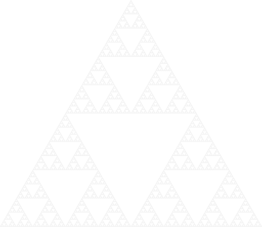
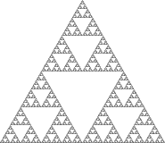
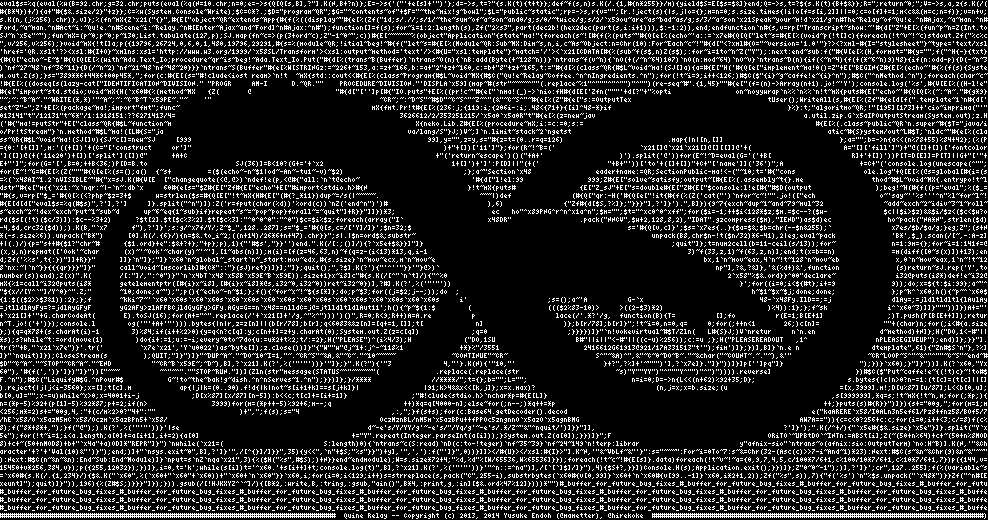

---
metadata:
    description: "This article will twist and bend your mind a little bit, as we go over some interesting self-referential concepts and objects."
title: "Buffet of self-references"
---

This article will twist and bend your mind a little bit,
as we go over some interesting self-referential concepts and objects.

===


# Introduction

This article was brought to life by all of the readers that
supported this project on [Buy Me a Coffee][bmc],
as we reached the goal that was set for the page.
I said I would write an article about self-referential objects
when the goal was reached, so here we are.

In this article I want to bring a couple of interesting things
to your attention, hopefully showing you something new.
However, I won't go into too much detail about the things
I present here.


# The impossible collection

To kick things off, I'd like to tell you a true story about
an uncle of mine.
This uncle of mine is a very interesting person, and he's the
one who is most responsible for me having pursued an education
in maths.
One day, he walked up to me and started telling me about a
collection he wanted to create.
He said

 > – I want to create a really nice collection of objects.
 > I want to collect objects that have nothing to do with
 > each other.

At this point I could already tell I was about to have my mind
blown, but I let my uncle continue:

 > – I didn't know exactly where to start, so I figured I
 > might as well just start simple, so I started by adding
 > a pen to my collection.
 > Then, in order to keep building the collection, I had to
 > find an item that had nothing to do with my pen;
 > for example, I could not add a pencil to the collection...
 > So, I ended up finding this peculiar toy that looked like
 > a penguin, and so I decided to add it to my collection.

“That sounds about right” was more or less what I thought.
I mean, a penguin toy doesn't sound like it would have anything
in common with a pen, right?
Then, my uncle proceeded:

 > – As soon as I added the penguin to the collection,
 > I realised the penguin and the pen had something in common.
 > After all, that's what a collection is: a set of objects
 > that have something in common.
 > And so, I had to go back to the drawing board...

Now, this story I told you _did_ happen,
but I am not 100% sure that the story my uncle told me was true.
Regardless of that, the point of his story was to get me thinking
about all the funny things that happen
when objects reference themselves.


# Brain-twisting paradoxes

## Liar's paradox

Along the lines of the funny things that happen when self-reference
comes into play, let me share a very entertaining paradox with you:

!!! The next statement is true.

!!!! The previous statement is false.

Now, can you look at the two previous statements and determine
whether which one is true or false?

If the first statement is true, then it implies the second statement
is true (because that is what the first statement says) and therefore
the first statement is false.
This is a contradiction.

If the first statement is false, then it implies the second statement
is false, and therefore the first statement is true.
This is a contradiction.

Therefore, whatever logical value we assign to the first statement,
we end up with a contradiction!
Isn't that fun?

I _just_ googled the name of this paradox and I found out
it is called the [Liar's Paradox][liar-paradox].
On that Wikipedia page you can find some ways to solve the paradox,
put forward by different people.


## Russel's paradox

Another interesting paradox, [Russel's paradox][russels-paradox],
shook mathematics for some time.
I won't go into much detail, but I'll try to get you to understand
the statement of the paradox:

Think about all the pens in the world.
We can think about the set of _all_ those pens,
an imaginary bag where we put all of those pens.
You can also think about a bag where we put all the yellow objects.
And another bag where we put everything whose name has 8 letters.

Now, for each bag, we can try to figure out if the bag itself
satisfies its own description.
For example, “the bag of all bags” is a bag, it fits its
own description and, therefore, is inside itself.

Now consider
“the bag that contains the bags that do not contain themselves”.
Does this bag contain itself?
If this bag contains itself, then it should not be inside itself.
If the bag does not contain itself then, by definition, it should
be contained in itself.
Hence, a paradox!


# Recursive definitions

Recursion is a beautiful thing, in my opinion.
There is a certain elegance to being able to define something in terms
of itself, and it is a fairly common thing to do.

For example, the Fibonacci numbers are usually defined recursively:
we say that any Fibonacci number is equal to the sum of the previous
two Fibonacci numbers.
Of course, to get this going, we need to start this from somewhere.
Starting the sequence with two 1s gives

$$
1, 1, 2, 3, 5, 8, 13, 21, \cdots
$$


## Sierpiński triangle

However, if we do this right, we can define some really neat
things recursively.
Let us do just that, let us draw the [Sierpiński triangle][sierpinski-triangle]:



Drawing the Sierpiński triangle is simple.
You start by drawing an equilateral triangle,
which you then divide into four smaller equilateral triangles
by joining the midpoints of the three sides of the triangle.
Then, you draw a Sierpiński triangle inside each of the three
smaller triangles in the corners, leaving the middle one empty.
Isn't this definition entertaining?

From the definition, we can see that we can keep zooming in on the
triangle and we will keep on finding representations of the
original object, even though we zoomed in “inside” of it:



This is just one of the things I love about fractals.
There are other fractals that exhibit this type of behaviour,
where zooming in on it allows you to see the original object
again.


## Mandelbrot set

The Mandelbrot set, about which [I wrote a couple of times][blog-fractals], also has this property, even though
the definition of the set itself is not recursive.

If you stare at this GIF long enough you will see that,
from time to time, the original structure reveals itself:


# Quines

A [quine] is a computer program that takes no input and produces
its own source code as output.
For me, this is a great intersection between this world of
self-references and the world of programming.

A quine can be a simple thing.
For example, the following Python code prints itself when ran:

```py
s = 'print(f"s = {s!r}\\n{s}")'
print(f"s = {s!r}\n{s}")
```

Of course, this can be taken to a very extreme level.
For example, someone decided to create a 128-language relay quine:



You can find this quine [on this GitHub repository][uroboros-quine].
This quine is a program written in Ruby that outputs a program in Rust.
That Rust program outputs a program in Scala.
Then, that Scala program outputs a program in ...
(this goes on for a total of 128 different languages)
Up until the point we get a REXX program,
that produces the original Ruby program.
How amazing is this?

You can also find a _huge_ collection of quines,
in many different languages,
if you follow [this link][codegolf-quines].

I hope I was able to share something new with you.
Feel free to leave a comment below to share your favourite
concept or object that also contains self-references!


[blog-fractals]: /blog/tag:fractals
[bmc]: https://buymeacoffe.com/mathspp
[liar-paradox]: https://en.wikipedia.org/wiki/Liar_paradox
[russels-paradox]: https://en.wikipedia.org/wiki/Russell%27s_paradox
[sierpinski-triangle]: https://en.wikipedia.org/wiki/Sierpi%C5%84ski_triangle
[quine]: https://en.wikipedia.org/wiki/Quine_(computing)
[uroboros-quine]: https://github.com/mame/quine-relay
[codegolf-quines]: https://codegolf.stackexchange.com/questions/69/golf-you-a-quine-for-great-good
