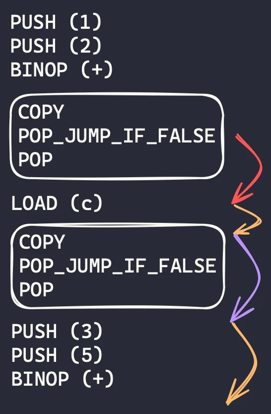

In the 9th part of [this series][series-link] of building a Python compiler and interpreter we will add support for Boolean operators and Boolean short-circuiting.

===


# Building a Python compiler and interpreter – 09 Boolean operators

This is the 9th article of the [“Building a Python compiler and interpreter” series][series-link], so make sure you've gone through the first eight articles before tackling this one!

The code that serves as a starting point for this article is [the tag v0.8.0 of the code in this GitHub repository](https://github.com/mathspp/building-a-python-compiler-and-interpreter/tree/v0.8.0).


## Objectives

The objectives for this article are:

 - to add support for the Boolean operators `and` and `or`; and
 - add support for [Boolean short-circuiting](/blog/pydonts/boolean-short-circuiting) when using them.

In the previous article, when we [added Boolean literals and the operator `not`](/blog/building-a-python-compiler-and-interpreter-08-booleans), we finished the article by saying it was a short article because this one would be tough...
I was so wrong!

Turns out that our work today won't be _that_ difficult after all.
It won't be trivial but it will be manageable.
Let's get into it.


## Researching how Python does it

Implementing the Boolean operators `and` and `or` didn't sound like an unmanageable challenge, but I wanted to get it right to prepare myself for the Boolean short-circuiting.
So, the first step before writing _any_ code was figuring out how Python currently does it.


### How Python parses Boolean operators

I started off by taking a look at how Python parses a simple conjunction with the operator `and`:

```pycon
>>> import ast
>>> ast.dump(ast.parse("a and b"))
"Module(
    body=[
        Expr(
            value=BoolOp(
                op=And(),
                values=[
                    Name(id='a', ctx=Load()),
                    Name(id='b', ctx=Load())
                ]
            )
        )
    ],
    type_ignores=[]
)"
```

That's a lot, but we can “zoom in” on the part that matters:

```py
BoolOp(op=And(), values=[...])
```

So, it looks like there is a tree node specifically for Boolean operators, and then all of the values are put together in a list `values`.
This was interesting, because I expected to find a tree node that was more similar to the `BinOp` node.
In fact, in the beginning I thought about using `BinOp` for the Boolean operators as well.

However, having a list of values is very helpful when we have three or more values:

```py
BoolOp(op=And(), values=[Name(id='a', ...), Name(id='b', ...), Name(id='c', ...)])
```

For now, it's not yet obvious why this will be so useful, but as soon as you are done implementing Boolean short-circuiting you will understand why.

So, we already know how we'll be parsing these operations.
But what about the compilation?


### How Python compiles Boolean operators

I did a similar type of research to see how Python compiles these Boolean operators and I was actually surprised!
Here is the bytecode for `a and b`:

```pycon
>>> dis.dis("a and b")
  0           0 RESUME                   0

  1           2 LOAD_NAME                0 (a)
              4 COPY                     1
              6 POP_JUMP_IF_FALSE        3 (to 14)
              8 POP_TOP
             10 LOAD_NAME                1 (b)
             12 RETURN_VALUE
        >>   14 RETURN_VALUE
```

What we can see is that the operator `and` uses the bytecode operation `POP_JUMP_IF_FALSE` to jump over the evaluation of the right hand side of the operator `and` if it doesn't need to.

Let us focus on these four bytecode operations:

```txt
2 LOAD_NAME                0 (a)
4 COPY                     1
6 POP_JUMP_IF_FALSE        3 (to 14)
8 POP_TOP
```

The first operation puts the value of `a` on the top of the stack.
Now, we want to check if that value is Truthy or Falsy.
If it's Truthy, we need to check the right-hand side of the operator `and`, but if it's Falsy we know that `a and b` will return `a` and we can skip evaluating `b` because of [Boolean short-circuiting](/blog/pydonts/boolean-short-circuiting).

So, in order to check the value of `a` and potentially return it as the final result, we need to use the operation `COPY` so we have two copies of the top value.
Then, we use the operation `POP_JUMP_IF_FALSE` to check if short-circuiting will kick-in.

If `a` is Falsy, short-circuiting kicks in and we jump straight to the end of the expression (where we'll return the value at the top of the stack, which is the other copy of `a`).
If `a` is Truthy, we don't jump.
At this point, we move to the instruction `POP_TOP`, which pops the extra copy of `a` that we had laying around, and we move on to evaluate the right hand side of the `and`.

Here's the bytecode operators for two consecutive Boolean operators `and`:

```pycon
>>> dis.dis("a and b and c")
  0           0 RESUME                   0

  1           2 LOAD_NAME                0 (a)
              4 COPY                     1
              6 POP_JUMP_IF_FALSE        8 (to 24)
              8 POP_TOP
             10 LOAD_NAME                1 (b)
             12 COPY                     1
             14 POP_JUMP_IF_FALSE        3 (to 22)
             16 POP_TOP
             18 LOAD_NAME                2 (c)
             20 RETURN_VALUE
        >>   22 RETURN_VALUE
        >>   24 RETURN_VALUE
```

Let us focus on this section:

```txt
 2 LOAD_NAME                0 (a)
 4 COPY                     1
 6 POP_JUMP_IF_FALSE        8 (to 24)
 8 POP_TOP
10 LOAD_NAME                1 (b)
12 COPY                     1
14 POP_JUMP_IF_FALSE        3 (to 22)
16 POP_TOP
18 LOAD_NAME                2 (c)
```

Notice the pattern where, for each load, we have three extra bytecode operators: `COPY`, `POP_JUMP_IF_FALSE`, and `POP_TOP`.
That sequence of three bytecode operations is responsible for implementing the short-circuiting logic.
For each `and`, there is one sequence of those three operators.
Or, in other words, there is a sequence of those three operators after each operand that is not the last one.

The expression `a and b and c and d` has 4 operands, so if we disassemble it we'll find 3 times the sequence of three operators:

```pycon
>>> dis.dis("a and b and c and d")
  0           0 RESUME                   0

  1           2 LOAD_NAME                0 (a)
              4 COPY                     1          # <-- 1
              6 POP_JUMP_IF_FALSE       13 (to 34)
              8 POP_TOP
             10 LOAD_NAME                1 (b)
             12 COPY                     1          # <-- 2
             14 POP_JUMP_IF_FALSE        8 (to 32)
             16 POP_TOP
             18 LOAD_NAME                2 (c)
             20 COPY                     1          # <-- 3
             22 POP_JUMP_IF_FALSE        3 (to 30)
             24 POP_TOP
             26 LOAD_NAME                3 (d)
# ...
```

One thing that's kind of left unexplained is the growing number of `RETURN_VALUE` that show up at the end.
These disappear if, instead of disassembling just the expression, you turn that expression into an assignment.
What I take away from this is that I just need to make sure that the jump operators point past the bytecode operators of the Boolean operator expression.
I won't worry too much about the multiple `RETURN_VALUE` that I can't explain right now.

For the operator `and` the short-circuiting logic uses the operation `POP_JUMP_IF_FALSE`, so can you guess what operation the operator `or` uses?
It's `POP_JUMP_IF_TRUE`, you are right!


## Parsing Boolean operators

The first step was making sure we can recognise and tokenize the words `and` and `or`:

```py
# tokenizer.py

class TokenType(StrEnum):
    # ...
    AND = auto()  # and
    OR = auto()  # or

# ...

KEYWORDS_AS_TOKENS: dict[str, TokenType] = {
    # ...
    "and": TokenType.AND,
    "or": TokenType.OR,
}
```

```py
# tests/test_tokenizer.py

@pytest.mark.parametrize(
    ["code", "token"],
    [
        # ...
        ("and", Token(TokenType.AND)),
        ("or", Token(TokenType.OR)),
    ],
)
def test_tokenizer_recognises_each_token(code: str, token: Token):
    assert Tokenizer(code).next_token() == token
```

Now, we need to create the tree node `BoolOp`, modify the grammar to account for the Boolean operators `and` and `or`, and then actually parse them.
Before this step I played a bit more with `ast.parse` to figure out exactly how they parse Boolean operators and I came to this updated grammar:

```txt
# ...

expr := alternative
alternative := conjunction ( OR conjunction )*
conjunction := negation ( AND negation ) *
negation := NOT negation | computation
# ...
```

This grammar is straightforward to translate into code and makes it easy to create the list of values that is associated with a given Boolean value, which in turn will simplify the generation of the Boolean short-circuiting logic in the compiler.

Here are the changes to the parser:

```py
# parser.py

@dataclass
class BoolOp(Expr):
    op: str
    values: list[Expr]

# ...

class Parser:
    # ...

    def parse_conjunction(self) -> Expr:  # <-- New method.
        """Parses a Boolean conjunction (and)."""
        values: list[Expr] = [self.parse_negation()]

        while self.peek() == TokenType.AND:
            self.eat(TokenType.AND)
            values.append(self.parse_negation())

        return values[0] if len(values) == 1 else BoolOp("and", values)

    def parse_alternative(self) -> Expr:  # <-- New method.
        """Parses a Boolean alternative (or)."""
        values: list[Expr] = [self.parse_conjunction()]

        while self.peek() == TokenType.OR:
            self.eat(TokenType.OR)
            values.append(self.parse_conjunction())

        return values[0] if len(values) == 1 else BoolOp("or", values)

    def parse_expr(self) -> Expr:
        """Parses a full expression."""
        return self.parse_alternative()  # <-- Changed.
```

Notice how the methods `Parser.parse_conjunction` and `Parser.parse_alternative` end with a [conditional expression](/blog/pydonts/conditional-expressions) that checks if we actually need the tree node `BoolOp` at all.
Otherwise, something as simple as `1 + 2` would be parsed as `BoolOp(op="or", values=[BoolOp(op="and", values=[BinOp(...)])])`.
(If you can't see what I'm talking about, play around the code until you convince yourself that I'm right or until you find an error in my logic!)

Now, we take this for a spin:

```bash
❯ python -m python.parser "a and b and c or c and d or e"
Program(
    statements=[
        ExprStatement(
            expr=BoolOp(
                op='or',
                values=[
                    BoolOp(
                        op='and',
                        values=[
                            Variable('a'),
                            Variable('b'),
                            Variable('c'),
                        ],
                    ),
                    BoolOp(
                        op='and',
                        values=[
                            Variable('c'),
                            Variable('d'),
                        ],
                    ),
                    Variable('e'),
                ],
            ),
        ),
    ],
)
```

The tree looks correct, so we can turn this into a test:

```py
# tests/test_parser.py

def test_parsing_boolean_operators():
    code = "a and b and c or c and d or e"
    tree = Parser(list(Tokenizer(code))).parse()
    assert tree == Program(...)  # The tree shown above.
```


## Implementing Boolean short-circuiting

We still have to update the compiler and the interpreter to handle the operators `and` and `or`, but what we are about to do is essentially implement [Boolean short-circuiting](/blog/pydonts/boolean-short-circuiting) directly.


### Compiling Boolean operators for short-circuiting

We need to do a tiny bit of housekeeping before implementing the compiler method that will implement the short-circuiting logic, and which probably represents our first _interesting_ compiler method.
So, the housekeeping imports `parser.BoolOp` so we can work with it and creates the bytecode operation `POP_JUMP_IF_TRUE` that we'll need for operations with `or`:

```py
# compiler.py

from .parser import (
    # ...
    BoolOp,
    # ...
)


class BytecodeType(StrEnum):
    # ...
    POP_JUMP_IF_TRUE = auto()
```

Now, we implement the method `Compiler.compile_BoolOp`.
The loop that you will see below is the one that benefits the most from the fact that the tree node `BoolOp` accepts a list of values instead of having a similar structure to the tree node `BinOp`, that has left and right children.

Here's the code:

```py
class Compiler:
    # ...

    def compile_BoolOp(self, tree: BoolOp) -> BytecodeGenerator:
        compiled_values = [list(self._compile(value)) for value in tree.values]
        compiled_lengths = [len(bytecode) for bytecode in compiled_values]
        jump_bytecode = (
            BytecodeType.POP_JUMP_IF_FALSE
            if tree.op == "and"
            else BytecodeType.POP_JUMP_IF_TRUE
        )

        for emitted, compiled_value in enumerate(compiled_values[:-1], start=1):
            yield from compiled_value
            jump_segments_missing = len(tree.values) - emitted - 1
            jump_location = (
                sum(compiled_lengths[emitted:]) + jump_segments_missing * 3 + 2
            )
            yield Bytecode(BytecodeType.COPY)
            yield Bytecode(jump_bytecode, jump_location)
            yield Bytecode(BytecodeType.POP)
        yield from compiled_values[-1]
```


### Understanding the jumps

I'll break the code up for you.
It looks like a lot of code because all compile methods so far were tiny, but this one isn't that big of a deal.

The first thing we do is make sure we compile all of the expressions for the values (the operands) of the Boolean operation.
We do this because when we create the bytecode operation `POP_JUMP_IF_X`, we need to know how many bytecode operations we have to jump over!
That's why we start by compiling the subexpressions for the values with this [list comprehension](/blog/pydonts/list-comprehensions-101):

```py
class Compiler:
    # ...

    def compile_BoolOp(self, tree: BoolOp) -> BytecodeGenerator:
        compiled_values = [list(self._compile(value)) for value in tree.values]
        # ...
```

Next, we go over the bytecode sequences for each subexpression and figure out how long each one of them is.
We need these lengths to compute jump locations.
We also determine if we'll be using the operations `POP_JUMP_IF_FALSE` or `POP_JUMP_IF_TRUE`, which depends solely on the operator of the tree node `BoolOp`.
These two things are done in the next two assignments:

```py
class Compiler:
    # ...

    def compile_BoolOp(self, tree: BoolOp) -> BytecodeGenerator:
        compiled_values = [list(self._compile(value)) for value in tree.values]
        compiled_lengths = [len(bytecode) for bytecode in compiled_values]
        jump_bytecode = (
            BytecodeType.POP_JUMP_IF_FALSE
            if tree.op == "and"
            else BytecodeType.POP_JUMP_IF_TRUE
        )
        # ...
```

Now, what's left is understanding the computations that are taking place inside the `for` loop that I wrote.
The objective of the `for` loop is to interweave the bytecode operations for the values with the 3-bytecode blocks that implement the short-circuiting logic.

Let us work through a specific example, like for the expression `1 + 2 and c and 3 + 5`.
The image below shows the bytecode operations we want to produce.



Consider the first block of 3 bytecode operations that implements the first instance of short-circuiting.
How long should the jump be?

The first arrow (the red one) shows that we need to make a jump of 2 to skip past the block that implements short-circuiting.
Then, the second and fourth arrows (the orange ones) show that we need to skip past the length of the compilation of the remaining values.
Finally, the third arrow (the purple one) shows that we also need to skip past the short-circuiting blocks that come after us.

I'll bring the code up again, with extra comments to connect to the diagram above.

```py
class Compiler:
    # ...

    def compile_BoolOp(self, tree: BoolOp) -> BytecodeGenerator:
        # ...
        # Produce bytecode for operands that are followed by short-circuiting logic.
        for emitted, compiled_value in enumerate(compiled_values[:-1], start=1):
            yield from compiled_value
            # How many purple arrows are there ahead of us?
            jump_segments_missing = len(tree.values) - emitted - 1
            jump_location = (
                sum(compiled_lengths[emitted:])  # Length of all orange arrows.
                + jump_segments_missing * 3      # All purple arrows * their length.
                + 2                              # The red arrow.
            )
            yield Bytecode(BytecodeType.COPY)
            yield Bytecode(jump_bytecode, jump_location)
            yield Bytecode(BytecodeType.POP)
        yield from compiled_values[-1]  # Yield bytecodes for final operand.
```

I hope this helps!


### Testing the compiled short-circuiting logic

To test the compiler, we can use the bytecode from above in the following fashion:

```py
# tests/test_compiler.py

import pytest

# ...

@pytest.mark.parametrize(
    ["op", "jump_type"],
    [
        ("and", BytecodeType.POP_JUMP_IF_FALSE),
        ("or", BytecodeType.POP_JUMP_IF_TRUE),
    ],
)
def test_compile_and_short_circuiting(op: str, jump_type: BytecodeType):
    tree = Program(
        statements=[
            ExprStatement(
                BoolOp(
                    op=op,
                    values=[
                        BinOp(
                            op="+",
                            left=Constant(1),
                            right=Constant(2),
                        ),
                        Variable("c"),
                        BinOp(
                            op="+",
                            left=Constant(3),
                            right=Constant(5),
                        ),
                    ],
                )
            )
        ]
    )
    bytecode = list(Compiler(tree).compile())
    assert bytecode == [
        Bytecode(BytecodeType.PUSH, 1),
        Bytecode(BytecodeType.PUSH, 2),
        Bytecode(BytecodeType.BINOP, "+"),
        Bytecode(BytecodeType.COPY),
        Bytecode(jump_type, 9),
        Bytecode(BytecodeType.POP),
        Bytecode(BytecodeType.LOAD, "c"),
        Bytecode(BytecodeType.COPY),
        Bytecode(jump_type, 5),
        Bytecode(BytecodeType.POP),
        Bytecode(BytecodeType.PUSH, 3),
        Bytecode(BytecodeType.PUSH, 5),
        Bytecode(BytecodeType.BINOP, "+"),
        Bytecode(BytecodeType.POP),
    ]
```


### Interpreting expressions

The final step is making sure we implement the interpreter method for the bytecode type `POP_JUMP_IF_TRUE`, which we added just now.
This is a 6-line addition to the class `Interpreter`:

```py
class Interpreter:
    # ...

    def interpret_pop_jump_if_true(self, bc: Bytecode) -> None:
        value = self.stack.pop()
        if value:
            self.ptr += bc.value
        else:
            self.ptr += 1  # Default behaviour is to move to the next bytecode.
```

We'll pair this 6-line addition with 36 new tests:

```py
# tests/test_interpreter.py

@pytest.mark.parametrize(
    ["code", "result"],
    [
        ("True and True", True),
        ("True and False", False),
        ("False and True", False),
        ("False and False", False),
        ("True or True", True),
        ("True or False", True),
        ("False or True", True),
        ("False or False", False),
        # for a, b, c in product([True, False], repeat=3): print(f'("{a} and {b} or {c}", {a and b or c}),')
        ("True and True or True", True),
        ("True and True or False", True),
        ("True and False or True", True),
        ("True and False or False", False),
        ("False and True or True", True),
        ("False and True or False", False),
        ("False and False or True", True),
        ("False and False or False", False),
        # for a, b, c in product([True, False], repeat=3): print(f'("{a} or {b} and {c}", {a or b and c}),')
        ("True or True and True", True),
        ("True or True and False", True),
        ("True or False and True", True),
        ("True or False and False", True),
        ("False or True and True", True),
        ("False or True and False", False),
        ("False or False and True", False),
        ("False or False and False", False),
    ],
)
def test_boolean_operators(code: str, result: bool):
    assert run_expr(code) == result


@pytest.mark.parametrize(
    ["code", "result"],
    [
        ("1 and 2", 2),
        ("0 and 2", 0),
        ("1 or 2", 1),
        ("0 or 2", 2),
        ("1 and 2 and 3", 3),
        ("1 and 2 and 0", 0),
        ("1 and 0 and 3", 0),
        ("0 and 2 and 3", 0),
        ("1 or 2 or 3", 1),
        ("0 or 2 or 3", 2),
        ("0 or 0 or 3", 3),
        ("0 or 0 or 0", 0),
    ],
)
def test_boolean_short_circuiting(code: str, result: int):
    assert run_expr(code) == result
```

And we're done!

See?
I told you that this turned out to be not that complicated, and definitely much simpler than what I anticipated.


## Recap

In this article we:

 - added support for the Boolean operators `and` and `or`;
 - used the modules `ast` and `dis` to help us figure out how to implement Boolean short-circuiting;
 - mimicked the behaviour of Python in parsing and compiling the operators `and` and `or`; and
 - we figured out the maths to make sure that short-circuiting works just fine.

You can get the code for this article at [tag v0.9.0 of this GitHub repository](https://github.com/mathspp/building-a-python-compiler-and-interpreter/tree/v0.9.0).


## Next steps

In the next articles we will be looking at adding support for the `else` and `elif` statements.
We'll also look at comparison operators and [their chaining](/blog/pydonts/chaining-comparison-operators).

There's also one thing that I'd really like to implement and which I've been dreading is functions: function definition, function calls, etc.
I still don't really know how I'll do that, so it's something you can look forward to.

[The exercises below](#exercises) will challenge you to try and implement a couple of features that we will implement eventually, so go ahead and take a look at those.


## Exercises

 - Try to implement the 6 comparison operators `==`, `!=`, `<`, `<=`, `>`, `>=`.
 - Try to implement [chained comparisons](/blog/pydonts/chaining-comparison-operators).
 - Can you add support for the `elif` and `else` statements?
 - What about [conditional expressions](/blog/pydonts/conditional-expressions)?
 - Try to add support for the `while` loop. (You can go crazy and also try to add the keywords `break` and `continue`.)


[series-link]: /blog/tag:bpci
