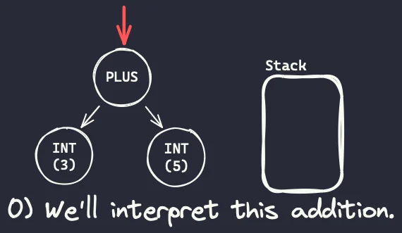
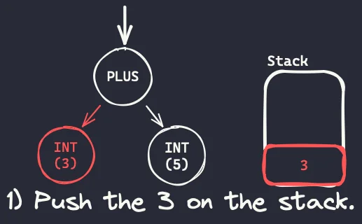
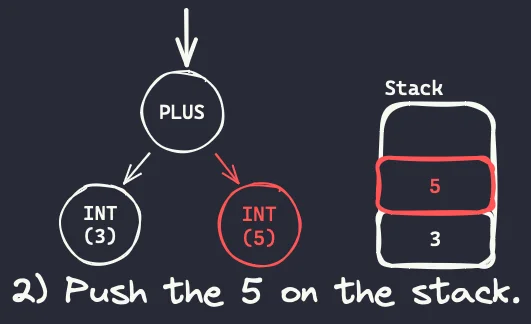

In this tutorial series we will build a Python compiler and interpreter from scratch. We start with simple arithmetic expressions.

===

# Implementing Python in Python

In this series of articles we will be implementing the Python programming language, from scratch, in Python.

The end goal of this series is to explore and play around with the concepts and algorithms that are needed to implement a programming language like Python.
To that end, we will create a programming language with a subset of the features that Python has and, along the way, we will play with tokenizers, parsers, compilers, and interpreters!

An important disclaimer is due: my role in this series is to take you with me in this exploratory journey as I dig into the workings of programming languages.
I am not an expert in these matters!


## Setup

! This series will be written in Python 3.12.
! If you're stuck in an older Python version, you should still be able to follow along as I won't be using many recent features.

The setup for this project is pretty minimal.
We can start by creating and activating a virtual environment:

```bash
❯ python -m venv .venv
❯ . .venv/bin/activate
```

Then, we can create a file `requirements.txt` with the following requirements:

```txt
mypy
black
pytest
```

And we can install the requirements with

```bash
❯ python -m pip install -r requirements.txt
```

Make sure everything was installed correctly with the following commands:

```bash
❯ mypy --version
mypy 1.6.1 (compiled: yes)

❯ black --version
black, 23.10.1 (compiled: no)
Python (CPython) 3.12.0

❯ pytest --version
pytest 7.4.2
```

You don't need to have the exact same versions as I do, but you should have a version that is either close to mine or more recent than mine.


## Structure of the program

### Is Python compiled or interpreted?

Yes.

The Python language has a compilation step and an interpretation step, and we will emulate that in our copy of Python.
If you've ever seen a folder `__pycache__` next to your Python code, that's a folder that contains compiled Python code.
However, Python code isn't compiled into machine code.
Rather, it's compiled into bytecode.


### Python bytecode and the module `dis`

Python bytecode is a set of simple instructions that Python code is compiled into.
Then, there is a program that reads those bytecode instructions sequentially and interprets them, which is why we often say that Python is an interpreted language.

During our explorations we will use the module `dis` a lot.
The module `dis` – which stands for disassemble – can let us peek at the bytecode behind many Python objects.

For example, one of the simplest things you can do is pass a function to `dis.dis` and take a look at the result:

```pycon
>>> import dis

>>> def f(a, b):
...     return a + b
...

>>> dis.dis(f)
  1           0 RESUME                   0

  2           2 LOAD_FAST                0 (a)
              4 LOAD_FAST                1 (b)
              6 BINARY_OP                0 (+)
             10 RETURN_VALUE
```

You don't need to understand all the output right now.
Instead, look at the centre column with the words `RESUME`, `LOAD_FAST`, `BINARY_OP`, and `RETURN_VALUE`.
These are the bytecode instructions that make up our function `f`.
For example, can you guess what the instruction `RETURN_VALUE` is responsible for?

So, knowing about bytecode and playing with the module `dis` will be key to our project.
But working with bytecode is just a part of what we'll be doing.

## The four parts of our program

Thankfully, our program has a linear structure that is composed of four parts.
We will take at each part in more detail in just a second, but I want you to have an overview of what's coming.

The diagram below shows that the four parts we will be working are a tokenizer, a parser, a compiler, and an interpreter.


As we can see, the four parts feed into each other sequentially:

 - the tokenizer takes source code as input and produces tokens;
 - the parser takes tokens as input and produces an AST;
 - the compiler takes an AST as input and produces bytecode; and
 - the interpreter takes bytecode as input and produces program results.

Just so you are not completely left in the dark, let me tell you very briefly what the four sentences above mean.

The tokenizer takes your source code and chunks it into “tokens”.
Tokens are just small pieces of source code that you can identify in isolation.
As examples, there will be tokens for numbers, mathematical operators, variable names, and keywords (like `if` or `for`).

The parser will take that linear sequence of tokens and essentially reshape them into a tree structure (that's what the T in AST stands for: Tree).
This tree is what gives meaning to your tokens, providing a nice structure that is easier to reason about and work on.

As soon as we have that tree structure, our compiler can go over the tree and figure out what bytecode instructions represent the code in the tree.
For example, if part of the tree represents a function, we may need a bytecode for the `return` statement of that function.

Finally, the interpreter takes those bytecode instructions and executes them, producing the results of our original program.

Our first prototype will compute additions and subtractions.
By the end of this article, you'll have a program (with a tokenizer, a parser, a compiler, and an interpreter) that computes the result of expressions like `3 + 5`, `6 - 3`, and `1 + 2 + 3 + 4 - 5 - 6 + 7 - 8`.


## The tokenizer

The tokenizer is the part of your program that accepts the source code and produces a linear sequence of tokens – bits of source code that you identify as being relevant.


### Token types

Because we want to support addition and subtraction of integers, we need three types of tokens:

 1. a token type to represent integers;
 2. a token type for the `+` operator; and
 3. a token type for the `-` operator.

We'll also need a final token to represent the end of the program, which we'll call EOF (which stands for end-of-file).
We'll use a `Token` dataclass to represent all tokens, and this class will have two attributes:

 1. the token type (which will be a `StrEnum`); and
 2. the value of the token (for example, an integer token can have the value `1` or `5`).

Here is the code that sets this up:

```py
from dataclasses import dataclass
from enum import StrEnum, auto
from typing import Any


class TokenType(StrEnum):
    INT = auto()
    PLUS = auto()
    MINUS = auto()
    EOF = auto()


@dataclass
class Token:
    type: TokenType
    value: Any = None
```

In case you don't know, [the `StrEnum` class from the module `enum`](http://docs.python.org/3/library/enum.html#enum.StrEnum) creates an enumeration where the values can be used as strings and the function `auto()` creates the values of the enumeration automatically, so that I don't have to write everything myself:

```py
class TokenType(StrEnum):
    INT = "INT"
    PLUS = "PLUS"
    MINUS = "MINUS"
    EOF = "EOF"
```


### Producing tokens

Now that we have defined our class `Token`, we want to be able to turn a string like

 - `"3 + 5"` into the stream `[Token(INT, 3), Token(PLUS), Token(INT, 5), Token(EOF)]`;
 - `"6 - 3"` into the stream `[Token(INT, 6), Token(MINUS), Token(INT, 3), Token(EOF)]`; and
 - `"1 + 2 + 3 + 4 - 5 - 6 + 7 - 8"` into the stream `[Token(INT, 1), Token(PLUS), Token(INT, 2), Token(PLUS), Token(INT, 3), Token(PLUS), Token(INT, 4), Token(MINUS), Token(INT, 5), Token(MINUS), Token(INT, 6), Token(PLUS), Token(INT, 7), Token(MINUS), Token(INT, 8), Token(EOF)]`.

In order to be able to create such streams, we'll create a class `Tokenizer` that accepts the code strings:

```py
class Tokenizer:
    def __init__(self, code: str) -> None:
        self.code = code
        self.ptr: int = 0
```

The attribute `ptr` will be used to keep track of the location we're at in the source code.
Now, to implement a method `next_token`, all we need to do is scroll `ptr` past whitespace and then figure out if we're pointing at a plus sign `+`, a minus sign `-`, or a digit:

```py
from string import digits


class Tokenizer:
    # ...

    def next_token(self) -> Token:
        while self.ptr < len(self.code) and self.code[self.ptr] == " ":
            self.ptr += 1

        if self.ptr == len(self.code):
            return Token(TokenType.EOF)

        char = self.code[self.ptr]
        self.ptr += 1
        if char == "+":
            return Token(TokenType.PLUS)
        elif char == "-":
            return Token(TokenType.MINUS)
        elif char in digits:
            return Token(TokenType.INT, int(char))
        else:
            raise RuntimeError(f"Can't tokenize {char!r}.")
```

This is enough to tokenize the expressions from above!

With a couple of extra lines of code, you can take an expression string and turn it into tokens:

```py
if __name__ == "__main__":
    code = "1 + 2 + 3 + 4 - 5 - 6 + 7 - 8"
    tokenizer = Tokenizer(code)
    print(code)
    while (tok := tokenizer.next_token()).type != TokenType.EOF:
        print(f"\t{tok.type}, {tok.value}")

"""
1 + 2 + 3 + 4 - 5 - 6 + 7 - 8
        int, 1
        plus, None
        int, 2
        plus, None
        int, 3
        plus, None
        int, 4
        minus, None
        # ...
"""
```

The code for the tokenizer should also highlight a key aspect of the tokenizer: the tokenizer doesn't care if your code is valid or not!
The tokenizer is equally happy with the code strings `"3 + 5"` or `"3 3 3 + 5 5 5 - - -"`:

```py
if __name__ == "__main__":
    code = "3 3 3 + 5 5 5 - - -"
    tokenizer = Tokenizer(code)
    print(code)
    while (tok := tokenizer.next_token()).type != TokenType.EOF:
        print(f"\t{tok.type}, {tok.value}")

"""
3 3 3 + 5 5 5 - - -
        int, 3
        int, 3
        int, 3
        plus, None
        int, 5
        int, 5
        int, 5
        minus, None
        minus, None
        minus, None
"""
```

This is OK.
The parser will be the one in charge of making sure the code makes sense.


### Making the tokenizer an iterable

Finally, just as a convenience, I'll turn the class `Tokenizer` into an iterable, so that we can just loop through the tokens of a piece of code directly:

```py
class Tokenizer:
    # ...

    def __iter__(self) -> Generator[Token, None, None]:
        while (token := self.next_token()).type != TokenType.EOF:
            yield token
        yield token  # Yield the EOF token too.
```

With this change, iterating over the tokens of some source code can be done with a `for` loop:

```py
if __name__ == "__main__":
    code = "1 + 2 + 3 + 4 - 5 - 6 + 7 - 8"
    tokenizer = Tokenizer(code)
    print(code)
    for tok in tokenizer:
        print(f"\t{tok.type}, {tok.value}")
```


### Testing the tokenizer

Now that the basic skeleton for the tokenizer is there, we can create a couple of short tests to give us some confidence that our code is working as we keep moving forward.

For that, I'll create a folder `tests` and create a file `test_tokenizer.py` inside.
Then, I'll write some tests: functions that call the tokenizer and then check that the results match a list of tokens I wrote down by hand.
Here are the first tests I wrote:

```py
from tokenizer import Token, Tokenizer, TokenType


def test_tokenizer_addition():
    tokens = list(Tokenizer("3 + 5"))
    assert tokens == [
        Token(TokenType.INT, 3),
        Token(TokenType.PLUS),
        Token(TokenType.INT, 5),
        Token(TokenType.EOF),
    ]


def test_tokenizer_subtraction():
    tokens = list(Tokenizer("3 - 6"))
    assert tokens == [
        Token(TokenType.INT, 3),
        Token(TokenType.MINUS),
        Token(TokenType.INT, 6),
        Token(TokenType.EOF),
    ]


def test_tokenizer_additions_and_subtractions():
    tokens = list(Tokenizer("1 + 2 + 3 + 4 - 5 - 6 + 7 - 8"))
    assert tokens == [
        Token(TokenType.INT, 1),
        Token(TokenType.PLUS),
        Token(TokenType.INT, 2),
        Token(TokenType.PLUS),
        Token(TokenType.INT, 3),
        Token(TokenType.PLUS),
        Token(TokenType.INT, 4),
        Token(TokenType.MINUS),
        Token(TokenType.INT, 5),
        Token(TokenType.MINUS),
        Token(TokenType.INT, 6),
        Token(TokenType.PLUS),
        Token(TokenType.INT, 7),
        Token(TokenType.MINUS),
        Token(TokenType.INT, 8),
        Token(TokenType.EOF),
    ]
```

Now, in order to run the tests, you need to use `pytest`.
`pytest` is a Python module that you can use for testing and if you run the command `pytest .`, it will look for folders/files whose name starts with `test_` and then will try running functions it finds that also start with `test_`.
That's why I created a file called `test_tokenizer.py` and that's why all functions above start with `test_`.

So, run the command `pytest .` to run your tests!
And you should get an error:

```
# ...
E   ModuleNotFoundError: No module named 'tokenizer'
========================= short test summary info ==========================
ERROR tests/test_tokenizer.py
!!!!!!!!!!!!!!!!!! Interrupted: 1 error during collection !!!!!!!!!!!!!!!!!!
============================= 1 error in 0.03s =============================
```

What's the matter?
The issue is that we haven't installed our project (in our virtual environment) and therefore Python cannot import the tokenizer because it doesn't know where to find it.
We could (and maybe _should_?) fix this by turning our project into a proper package, but I'll show you a hand-wavy way of making this work without too much of a hassle.

The first thing you'll want to do is create an _empty_ file `pyproject.toml` in your folder.
Then, run the command `pip install -e .`
The `.` in the command will install the code it finds in the local project (which at this point is just the file `tokenizer.py`) and the switch `-e` makes the installation editable, which means that you can edit the code and the changes will be reflected in the installed version.

If you follow the two steps above, you should be able to run pytest now:

```bash
❯ pytest .
======================== test session starts ========================
platform darwin -- Python 3.12.0, pytest-7.4.2, pluggy-1.3.0
rootdir: /Users/rodrigogs/Documents/python
collected 3 items                                                   

tests/test_tokenizer.py ...                                   [100%]

========================= 3 passed in 0.00s =========================
```

We'll also add three more tests.
One where we add a lot of irrelevant whitespace to the expression being parsed to make sure the tokenizer can work past that:

```py
def test_tokenizer_additions_and_subtractions_with_whitespace():
    tokens = list(Tokenizer("     1+       2   +3+4-5  -   6 + 7  - 8        "))
    assert tokens == [
        Token(TokenType.INT, 1),
        Token(TokenType.PLUS),
        Token(TokenType.INT, 2),
        Token(TokenType.PLUS),
        Token(TokenType.INT, 3),
        Token(TokenType.PLUS),
        Token(TokenType.INT, 4),
        Token(TokenType.MINUS),
        Token(TokenType.INT, 5),
        Token(TokenType.MINUS),
        Token(TokenType.INT, 6),
        Token(TokenType.PLUS),
        Token(TokenType.INT, 7),
        Token(TokenType.MINUS),
        Token(TokenType.INT, 8),
        Token(TokenType.EOF),
    ]
```

This is the same as the previous test, except that I fiddled with the whitespace inside the string.

The second test we'll add is to make sure that the tokenizer raises an error if it finds something that it doesn't know how to tokenize.
For this test, we'll just write some garbage and then use a tool from pytest that lets us say “hey, we _expect_ this code to raise an error”.
Then, if the code raises the error, the test passes.
If the code _doesn't_ raise the error, the test fails.
Here's how you do that with pytest:

```py
import pytest

def test_tokenizer_raises_error_on_garbage():
    with pytest.raises(RuntimeError):
        list(Tokenizer("$"))
```

The final test we'll add is to make sure that the tokenizer recognises each token type separately.
The tokenizer doesn't care about the structure of the code because it doesn't know how to distinguish garbage code from code that makes sense, which means we can test it with just strings that represent operators or integers, and the tokenizer will still know how to tokenize that.

So, these tests are perfectly valid:

```py
def test_tokenizer_knows_plus():
    tokens = list(Tokenizer("+"))
    assert tokens == [Token(TokenType.PLUS), Token(TokenType.EOF)]


def test_tokenizer_knows_minus():
    tokens = list(Tokenizer("-"))
    assert tokens == [Token(TokenType.MINUS), Token(TokenType.EOF)]


def test_tokenizer_knows_integer():
    tokens = list(Tokenizer("3"))
    assert tokens == [Token(TokenType.INT, 3), Token(TokenType.EOF)]
```

These tests are helpful because they'll make sure our tokenizer always recognises the tokens it should.
However, our tokenizer will grow a lot and we'll want to add tests for all the tokens we know, so we'll use another pytest tool to make writing these tests simpler.

We start by noticing that the three tests above look very similar, the only thing that changes is the piece of code that goes into the tokenizer and the first token before the EOF token.
So, we could rewrite the tests as such:

```py
def tokenizer_recognises_each_token(code: str, token: Token):
    tokens = list(Tokenizer(code))
    assert tokens == [token, Token(TokenType.EOF)]


def test_tokenizer_knows_plus():
    tokenizer_recognises_each_token("+", Token(TokenType.PLUS))


def test_tokenizer_knows_minus():
    tokenizer_recognises_each_token("-", Token(TokenType.MINUS))


def test_tokenizer_knows_integer():
    tokenizer_recognises_each_token("3", Token(TokenType.INT, 3))
```

Then, pytest provides a tool called `pytest.mark.parametrize` that lets us write this in a more convenient way, as a decorator around the function `tokenizer_recognises_each_token`, which now must start with `test_` because it becomes a test function:

```py
@pytest.mark.parametrize(
    ["code", "token"],
    [
        ("+", Token(TokenType.PLUS)),
        ("-", Token(TokenType.MINUS)),
        ("3", Token(TokenType.INT, 3)),
    ],
)
def test_tokenizer_recognises_each_token(code: str, token: Token):
    tokens = list(Tokenizer(code))
    assert tokens == [token, Token(TokenType.EOF)]
```

Running your tests now should result in 8 successes:

```bash
❯ pytest .
======================== test session starts ========================
platform darwin -- Python 3.12.0, pytest-7.4.2, pluggy-1.3.0
rootdir: /Users/rodrigogs/Documents/python
collected 3 items                                                   

tests/test_tokenizer.py ........                              [100%]

========================= 8 passed in 0.01s =========================
```


## The parser

The parser is the part of our program that accepts a stream of tokens and makes sure they make sense.

For example, in the previous section we've seen that the tokenizer is equally happy with the code strings `3 + 5` and `3 3 3 + 5 5 5 - - - `, but the same can't be said about the parser.
While the parser will look at the tokens for `3 + 5` and will recognise an addition of two integers, the parser will complain if it receives a stream of tokens representing the “code” `3 3 3 + 5 5 5 - - -`.


### The parser creates a tree

The parser does a bit more than that, though.
Not only does the parser make sure the sequence of tokens make sense, the parser also uses the tokens to build another representation of the code in the shape of a tree.

The diagrams below show a couple of examples.

If we pass the code `3 + 5` to the tokenizer, we get this stream of tokens:

```
Token(type=<TokenType.INT: 'int'>, value=3)
Token(type=<TokenType.PLUS: 'plus'>, value=None)
Token(type=<TokenType.INT: 'int'>, value=5)
Token(type=<TokenType.EOF: 'eof'>, value=None)
```

The parser will take those tokens and create a simple tree with three nodes where the addition connects the two other integer nodes:


Notice how the root node is the addition.
This is because the addition is an operation whereas the integers 3 and 5 are just the operands to the addition.
That's why the nodes 3 and 5 are under the node for addition.

What do you think will be the tree we get from the code `5 - 2`?
Sketch it in a piece of paper and then keep reading.

If we pass the code `5 - 2` to the tokenizer, we get this stream of tokens instead:

```
Token(type=<TokenType.INT: 'int'>, value=5)
Token(type=<TokenType.PLUS: 'minus'>, value=None)
Token(type=<TokenType.INT: 'int'>, value=2)
Token(type=<TokenType.EOF: 'eof'>, value=None)
```

The parser will take those tokens and create a simple tree with three nodes where the subtraction connects the two other integer nodes:


Again, notice how the operation (the subtraction) is the root node.
Operations will have their operands as child nodes.

The node that represents the subtraction has two children because a subtraction needs two numbers to operate.


### Abstract syntax tree

This tree we buidl is what we call an abstract syntax tree (AST).
It's an _abstract syntax_ tree because it is a tree representation that doesn't care about the original syntax we used to write the operation.
It only cares about the operations we are going to perform.

For example, we could determine that our language would use prefix notation, so that additions would now be represented as `+ a b` and subtractions would be represented as `- a b`.

The tokenizer would now be producing the tokens in a different order, but the parser would still build the same trees.
Why?
Because the parser only cares about _what_ the code does, not _how it was written_.


### Tree nodes

So, we've seen that we are going to use trees to represent code.
What we need, then, is a class for those nodes!
Here it is:

```py
from dataclasses import dataclass


@dataclass
class TreeNode:
    pass
```

What we'll do throughout this series is create subclasses of `TreeNode` for each type of node.
Right now, we'll create node types for binary operations (like addition and subtraction) and we'll create a node type for integers:

```py
@dataclass
class BinOp(TreeNode):
    op: str
    left: "Int"
    right: "Int"


@dataclass
class Int(TreeNode):
    value: int
```


### Defining the parser

To define our parser, we will make use of two helper methods called `eat` and `peek`:

```py
class Parser:
    def __init__(self, tokens: list[Token]) -> None:
        self.tokens = tokens
        self.next_token_index: int = 0
        """Points to the next token to be consumed."""

    def eat(self, expected_token_type: TokenType) -> Token:
        """Returns the next token if it is of the expected type.

        If the next token is not of the expected type, this raises an error.
        """
        next_token = self.tokens[self.next_token_index]
        self.next_token_index += 1
        if next_token.type != expected_token_type:
            raise RuntimeError(f"Expected {expected_token_type}, ate {next_token!r}.")
        return next_token

    def peek(self, skip: int = 0) -> TokenType | None:
        """Checks the type of an upcoming token without consuming it."""
        peek_at = self.next_token_index + skip
        return self.tokens[peek_at].type if peek_at < len(self.tokens) else None
```


The method `eat` accepts a token type as argument, makes sure that the next token we have lined up is of that type, and then returns that token.
(At the end of the day, the method `eat` will be the one that will check that our code makes sense.)

The method `peek` is a method we can use to peek at the type of an upcoming token without having to consume the token.
It's as if we look into the future, to see what's coming.

These two methods will make much more sense if you take a look at the method `parse`, that uses both:

```py
class Parser:
    # ...

    def parse(self) -> BinOp:
        """Parses the program."""
        left_op = self.eat(TokenType.INT)

        if self.peek() == TokenType.PLUS:
            op = "+"
            self.eat(TokenType.PLUS)
        else:
            op = "-"
            self.eat(TokenType.MINUS)

        right_op = self.eat(TokenType.INT)

        return BinOp(op, Int(left_op.value), Int(right_op.value))
```

Let's break it line by line.
First, the signature and the docstring of the method:

```py
def parse(self) -> BinOp:
    """Parses the program."""
```

The method `parse` doesn't need any arguments and it will return a `BinOp` node: the node for the addition or subtraction we'll parse.

The next line calls the method `eat`:

```py
left_op = self.eat(TokenType.INT)
```

If we're parsing additions and subtractions, we know that the first thing we need to see is an integer.
Thus, we call the method `eat` with the token type `INT`.
If the first token is _not_ an integer, the parser will complain.

Then, we need to figure out if we have an addition or a subtraction.
That's when the method `peek` kicks in:

```py
if self.peek() == TokenType.PLUS:
    op = "+"
    self.eat(TokenType.PLUS)
else:
    op = "-"
    self.eat(TokenType.MINUS)
```

We peek at the next token because we don't know if it will be a `PLUS` or a `MINUS`.
Notice that if it is a `PLUS`, we eat the token and set `op = "+"`.
If it is not a `PLUS`, we assume it must be a `MINUS` and just eat that token.
We don't need to peek to see if it is a `MINUS` token because, if it is not, then the method `eat` will complain for us.

After we have eaten the operation token, we can expect a new integer token:

```py
right_op = self.eat(TokenType.INT)
```

Finally, we need to take the tokens and their values to build the tree nodes that matter!
The values of the `left_op` and `right_op` tokens must be wrapped with the tree node `Int` and the operator itself must be wrapped in a `BinOp` node:

```py
return BinOp(op, Int(left_op.value), Int(right_op.value))
```


### Running the parser

Now that we have our simple parser set up, we can try to run it with a couple of code examples:

```py
if __name__ == "__main__":
    from tokenizer import Tokenizer

    code = "3 + 5"
    parser = Parser(list(Tokenizer(code)))
    print(parser.parse())

    # BinOp(op='+', left=Int(value=3), right=Int(value=5))
```

If we change `code` to something like `+ 5`, the parser will complain:

```py
RuntimeError: Expected int, ate Token(type=<TokenType.PLUS: 'plus'>, value=None).
```

We get this error message because we were expecting to eat an integer for the variable `left_op` and instead we found the plus sign.

What error will we get if we change `code` to `3 3`?

If you guessed that the parser will complain and say it wanted a minus, you're right:

```py
if __name__ == "__main__":
    from tokenizer import Tokenizer

    code = "3 3"
    parser = Parser(list(Tokenizer(code)))
    print(parser.parse())

    # RuntimeError: Expected minus, ate Token(type=<TokenType.INT: 'int'>, value=3).
```

Why does the parser say it wanted a minus, and not a plus or a minus?
Because, if you remember, inside the method `parse` we used `peek` to look for a plus.
When we didn't find it, we assumed we'd get a minus and tried to eat it.
When we found an integer, the parser complained.


### Parsing a full program

At this point in time, the parser only parses a single addition or subtraction.
However, the parser won't complain if you give it more tokens:

```py
if __name__ == "__main__":
    from tokenizer import Tokenizer

    code = "3 + 5 - 2"
    parser = Parser(list(Tokenizer(code)))
    print(parser.parse())
    # BinOp(op='+', left=Int(value=3), right=Int(value=5))
```

Generally, after we parse a complete program, we also want to make sure that we parsed the _whole_ program.
For now, we'll change the parser so that it expects the program to be comprised of a single addition or subtraction.
How do we do this, though..?

After parsing the addition or subtraction, we eat the EOF token!
Here's the updated method `parse`:

```py
class Parser:
    # ...

    def parse(self) -> BinOp:
        """Parses the program."""
        left_op = self.eat(TokenType.INT)

        if self.peek() == TokenType.PLUS:
            op = "+"
            self.eat(TokenType.PLUS)
        else:
            op = "-"
            self.eat(TokenType.MINUS)

        right_op = self.eat(TokenType.INT)

        self.eat(TokenType.EOF)

        return BinOp(op, Int(left_op.value), Int(right_op.value))
```


### Testing the parser

Much like with the tokenizer, we want to write some basic tests for the parser.
Here are two tests, one for an addition and another one for a subtraction:

```py
from parser import Parser
from parser import BinOp, Int

from tokenizer import Token, TokenType


def test_parsing_addition():
    tokens = [
        Token(TokenType.INT, 3),
        Token(TokenType.PLUS),
        Token(TokenType.INT, 5),
        Token(TokenType.EOF),
    ]
    tree = Parser(tokens).parse()
    assert tree == BinOp(
        "+",
        Int(3),
        Int(5),
    )


def test_parsing_subtraction():
    tokens = [
        Token(TokenType.INT, 5),
        Token(TokenType.MINUS),
        Token(TokenType.INT, 2),
        Token(TokenType.EOF),
    ]
    tree = Parser(tokens).parse()
    assert tree == BinOp(
        "-",
        Int(5),
        Int(2),
    )
```

Now, you can run your tests again with `pytest .`...
Except it doesn't work!

When you run your tests, you won't be able to import the parser into the test script:

```py
ModuleNotFoundError: No module named 'parser'
```

The issue is that the parser wasn't installed yet, so you can fix that by `pip`-installing the code again:

```bash
❯ pip install -e .
```

Except that that will _also_ error!
What's the problem, now?
The problem is that you have two files in the root of your directory (`tokenizer.py` and `parser.py`) and you haven't configured your project properly.

But hey, it's not _your_ fault.
I just didn't tell you what to do!


### The `src` folder structure

The simplest way to get out of this is by creating a folder `src/python` where we'll store all of our source code.
The directory structure should become this:

```
- src
  |- python
     |- parser.py
     |- tokenizer.py
- tests
  |- test_parser.py
  |- test_tokenizer.py
...
```

When you do this, you will also have to fix the imports.
Inside the source code itself, you can use relative imports like so:

```py
# parser.py
from dataclasses import dataclass

#    v notice the dot here.
from .tokenizer import Token, TokenType

# ...
```

Inside the tests you need to prefix the imports with `python.` because the tokenizer and the parser live inside that package:

```py
# test_tokenizer.py
import pytest

from python.tokenizer import Token, Tokenizer, TokenType
```

After you do this, you can install our `python` with `pip install -e .` and _then_ tests will run:

```bash
❯ pytest .
====================== test session starts =======================
platform darwin -- Python 3.12.0, pytest-7.4.2, pluggy-1.3.0
rootdir: /Users/rodrigogs/Documents/python
collected 10 items                                               

tests/test_parser.py ..                                    [ 20%]
tests/test_tokenizer.py ........                           [100%]

======================= 10 passed in 0.01s =======================
```

One thing to keep in mind, though, is that instead of `python tokenizer.py` or `python parser.py` to run the files `tokenizer.py` or `parser.py`, respectively, you should use the commands `python -m python.tokenizer` or `python -m python.parser`.


## Understanding the stack

Before we write our compiler, it is important that we understand what our ultimate goal is.
We want to compile our program into a sequence of bytecodes.
Bytecodes are just simple, atomic instructions that do one thing, and one thing only.

So, we know we want to convert our tree representation (from the parser) into a sequence of simple operations.

After we have our sequence of operations (bytecodes), we will “interpret” it.
To interpret the bytecode means that we go over the bytecode, sequence by sequence, and at each point we perform the simple operation that the bytecode tells us to perform.

Another thing we need to know is that we use a stack as the basis of our computation.
For example, a binary operation will operate on the top two values of the stack.

As a specific example of the binary operation case, in the expression `3 + 5`, we'd first push the values 3 and 5 on the stack, and then the operator `+` would take the top two values from the stack and operate on them.
The result (8, in this case) would be pushed on the stack, after the operation is concluded.

The diagram below illustrates roughly what happens with the stack as we interpret the expression `3 + 5`, which we still represent with its tree:

 - We want to interpret the addition `3 + 5` and, when we start out, the stack is empty:



 - To interpret a binary operation, we start by visiting the children nodes.
 The first one, the left node, contains a 3, so we push the value 3 to the stack.



 - After interpreting the left operand, we interpret the right operand.
 The right operand is the integer 5, so the value 5 is also pushed to the stack.



 - After interpreting all children nodes (all operands) and pushing them to the stack, we are ready to interpret the actual operation.
 We pop the operands from the stack, we add them, and then we push the result (8) back on the stack.


It may seem redundant to push two integers on a stack only to pop them right away, but that's because integer addition is a simple operation and integers are simple operands.
This simple computational model will become more useful as we deal with more complex operations.

In the diagrams above we had a tree and we interpreted it directly with the help of the stack.
However, that's not what we will be doing here.
Instead of interpreting the tree directly, we'll use a compiler to create an intermediate layer.


## The compiler

The compiler is the part of our program that will take a tree (an AST, to be more precise) and it will produce a sequence of instructions that are simple and easy to follow.

Using the example above once more, we'd want the compiler to produce a sequence of instructions that tells us exactly how to manipulate the stack:

 - push the 3;
 - push the 5;
 - add the top two elements of the stack; and
 - push the result (8) on the stack.

These small instructions that the compiler will produce are called bytecode operations.


### Bytecode operations

To start off, we can create a simple class for our bytecode operations.
Each bytecode is defined by two things:

 - the type of bytecode operation we're dealing with (e.g., pushing things on the stack or doing an operation); and
 - the data associated with that bytecode operation, which not all bytecode operations need.

With that in mind, we can define a simple class for the bytecode operations:

```py
# compiler.py
from dataclasses import dataclass
from typing import Any


@dataclass
class Bytecode:
    type: BytecodeType
    value: Any = None
```

As for the bytecode types, we only need two types to begin with:

 - a type for binary operations; and
 - a type to push values on the stack.

So, we can setup our bytecodes with the following code:

```py
from dataclasses import dataclass
from enum import auto, StrEnum
from typing import Any


class BytecodeType(StrEnum):
    BINOP = auto()
    PUSH = auto()


@dataclass
class Bytecode:
    type: BytecodeType
    value: Any = None
```

Again, our compiler is supposed to read a tree and produce a sequence of bytecodes.
For the expression `3 + 5`, we want to produce the following sequence of bytecodes:

```py
[
    Bytecode(BytecodeType.PUSH, 3),
    Bytecode(BytecodeType.PUSH, 5),
    Bytecode(BytecodeType.BINOP, "+"),
]
```

If you don't understand why that's what we're trying to produce, reread this section on [understanding the stack](#understanding-the-stack).


### Compiling a tree into bytecode

To write our compiler, we'll just create a class with a method `compile`.
The method `compile` will mimic the method `parse` in its structure.
However, the method `parse` produces tree nodes and the method `compile` will produce bytecode operations.

Here it is:

```py
class Compiler:
    def __init__(self, tree: BinOp) -> None:
        self.tree = tree

    def compile(self) -> Generator[Bytecode, None, None]:
        left = self.tree.left
        yield Bytecode(BytecodeType.PUSH, left.value)

        right = self.tree.right
        yield Bytecode(BytecodeType.PUSH, right.value)

        yield Bytecode(BytecodeType.BINOP, self.tree.op)
```


### Running the compiler

At this point we can already run the compiler and check that it's producing the correct bytecode.
Add this code to the bottom of your compiler file:

```py
if __name__ == "__main__":
    from .tokenizer import Tokenizer
    from .parser import Parser

    compiler = Compiler(Parser(list(Tokenizer("3 + 5"))).parse())
    for bc in compiler.compile():
        print(bc)
```

If you run this with `python -m python.compiler`, you get this output:

```py
Bytecode(type=<BytecodeType.PUSH: 'push'>, value=3)
Bytecode(type=<BytecodeType.PUSH: 'push'>, value=5)
Bytecode(type=<BytecodeType.BINOP: 'binop'>, value='+')
```

Everything is working correctly!


### Testing the compiler

Before moving on, we'll add a couple of tests to make sure the compiler knows how to compile additions and subtractions:

```py
from python.compiler import Bytecode, BytecodeType, Compiler
from python.parser import BinOp, Int


def test_compile_addition():
    tree = BinOp(
        "+",
        Int(3),
        Int(5),
    )
    bytecode = list(Compiler(tree).compile())
    assert bytecode == [
        Bytecode(BytecodeType.PUSH, 3),
        Bytecode(BytecodeType.PUSH, 5),
        Bytecode(BytecodeType.BINOP, "+"),
    ]


def test_compile_subtraction():
    tree = BinOp(
        "-",
        Int(5),
        Int(2),
    )
    bytecode = list(Compiler(tree).compile())
    assert bytecode == [
        Bytecode(BytecodeType.PUSH, 5),
        Bytecode(BytecodeType.PUSH, 2),
        Bytecode(BytecodeType.BINOP, "-"),
    ]
```

If you run your tests with `pytest .`, everything should be working nicely!


## The interpreter

The fourth and final component of this project is the interpreter.
The interpreter is the part of the program that is responsible for taking bytecode operations as input and using those to _actually run_ the source code you started off with.


### The stack

In a previous section about [understanding the stack](#understanding-the-stack) I mentioned that we'll need a stack to keep track of our calculations.
So, the first thing we can do, is implement a stack.

A Python list can be readily used as a stack because the methods `.append` and `.pop` can be used to add and remove items from the end of the list, respectively.
So, our stack implementation will be a thin wrapper around a Python list:

```py
class Stack:
    def __init__(self) -> None:
        self.stack: list[int] = []

    def push(self, item: int) -> None:
        self.stack.append(item)

    def pop(self) -> int:
        return self.stack.pop()

    def peek(self) -> int:
        return self.stack[-1]

    def __repr__(self) -> str:
        return f"Stack({self.stack})"
```

For now, we can only handle integers, so the attribute `stack` is typed as a list of integers.
We also modify [the dunder method `__repr__`](/blog/pydonts/str-and-repr#the-str-and-repr-dunder-methods) so that it is easy to see what's in the stack at any given point in time.


### Implementing the interpreter

The next step is to implement the actual interpreter.
The interpreter accepts a list of bytecode operations and its method `interpret` will go through the list of bytecodes, interpreting one at a time.

It will look like this:

```py
from .compiler import Bytecode

# ...

class Interpreter:
    def __init__(self, bytecode: list[Bytecode]) -> None:
        self.stack = Stack()
        self.bytecode = bytecode
        self.ptr: int = 0

    def interpret(self) -> None:
        for bc in self.bytecode:
            # Interpret this bytecode operator.
            pass
```

Now, all we need to do is check which bytecode we're looking at and then perform the operation it implements:

```py
from .compiler import Bytecode, BytecodeType

# ...

class Interpreter:
    # ...

    def interpret(self) -> None:
        for bc in self.bytecode:
            # Interpret this bytecode operator.
            if bc.type == BytecodeType.PUSH:
                self.stack.push(bc.value)
            elif bc.type == BytecodeType.BINOP:
                right = self.stack.pop()
                left = self.stack.pop()
                if bc.value == "+":
                    result = left + right
                elif bc.value == "-":
                    result = left - right
                else:
                    raise RuntimeError(f"Unknown operator {bc.value}.")
                self.stack.push(result)

        print("Done!")
        print(self.stack)
```


### Running the interpreter as a CLI

Now it is time to run the interpreter and see if it is behaving as expected!
We can add this code to the interpreter file:

```py
if __name__ == "__main__":
    import sys

    from .tokenizer import Tokenizer
    from .parser import Parser
    from .compiler import Compiler

    code = sys.argv[1]
    tokens = list(Tokenizer(code))
    tree = Parser(tokens).parse()
    bytecode = list(Compiler(tree).compile())
    Interpreter(bytecode).interpret()
```

This lets you run the following command:

```bash
❯ python -m python.interpreter "3 + 5"
Done!
Stack([8])

❯ python -m python.interpreter "5 - 2"
Done!
Stack([3])
```

It looks like it's working!
How exciting is this?!


### Testing the interpreter

We are _almost_ done here.
For now, let us just add a couple of tests for the interpreter:

```py
from python.tokenizer import Tokenizer
from python.parser import Parser
from python.compiler import Compiler
from python.interpreter import Interpreter

import pytest


@pytest.mark.parametrize(
    ["code", "result"],
    [
        ("3 + 5", 8),
        ("5 - 2", 3),
        ("1 + 2", 3),
        ("1 - 9", -8),
    ],
)
def test_simple_arithmetic(code: str, result: int):
    tokens = list(Tokenizer(code))
    tree = Parser(tokens).parse()
    bytecode = list(Compiler(tree).compile())
    interpreter = Interpreter(bytecode)
    interpreter.interpret()
    assert interpreter.stack.pop() == result
```

Run your tests with `pytest .` and make sure everything passes!


## Improving the project configuration

Before we conclude here, let us just improve the project configuration a little bit.

First, we can add some metadata to our configuration file `pyproject.toml`:

```toml
[project]
name = "python"
version = "0.1.0"

[tool.setuptools.packages.find]
where = ["src"]
include = ["src/python/py.typed"]
```

Feel free to add even more data if you want!

Finally, we are going to create two empty files inside `src/python`, namely `src/python/__init__.py` and `src/python/py.typed`.
The second one, which is referred to from within the configuration file `pyproject.toml`, tells tools like `mypy` that our project is typed.


## Recap

In this article you started implementing your own version of Python.
To do so, you needed to create four main components:

 1. a tokenizer:
   - accepts strings as input (supposedly, source code);
   - chunks the input into atomic pieces called tokens;
   - produces tokens regardless of their sequence making sense or not.
 2. a parser:
   - accepts tokens as input;
   - consumes the tokens one at a time, while making sense they come in an order that makes sense;
   - produces a tree that represents the syntax of the original code.
 3. a compiler:
   - accepts a tree as input;
   - traverses the tree to produce bytecode operations.
 4. an interpreter:
   - accepts bytecode as input;
   - traverses the bytecode and performs the operation that each one represents;
   - uses a stack to help with the computations.


## Next steps

Throughout the remainder of this series we will be working on the four components that you worked on in this article.
By improving and modifying these four components, we will be able to accomodate many more features.

For example, right now you can _only_ perform a single addition or subtraction, and both operands must be single digit integers...
That's a bit too restrictive, isn't it?

[The exercises below](#exercises) will challenge you to try and implement a couple of features that we will implement next, so go ahead and take a look at those.


## Exercises

 - Implement `__repr__` methods in `TokenType` and `BytecodeType` so that printing tokens and bytecodes is slightly shorter.
 - Write a function to print trees with indentation.
