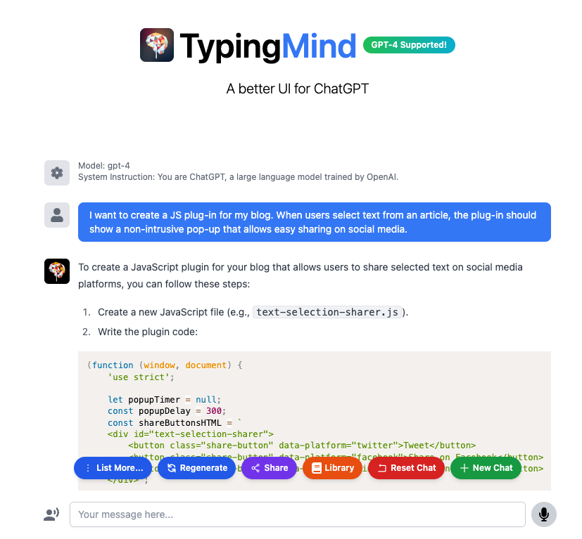
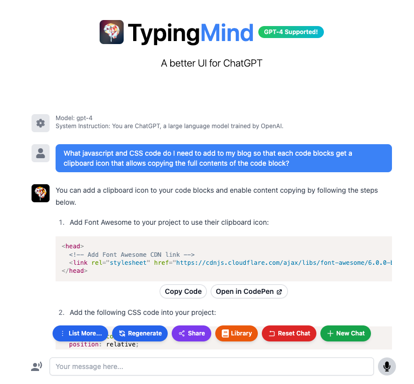

Learn how to use ChatGPT to quickly test and prototype programs.

===


<script>
(function (window, document) {
    'use strict';
    
    let popupTimer = null;
    const popupDelay = 300;
    const shareButtonsHTML = `
    <div id="text-selection-sharer">
        <button class="share-button" data-platform="twitter"><i class="fa fa-twitter"></i> Tweet this</button>
    </div>`;
    
    document.body.insertAdjacentHTML('beforeend', shareButtonsHTML);
    
    const sharePopup = document.getElementById('text-selection-sharer');
    
    const shareUrls = {
        twitter: (url, text) => `https://twitter.com/share?url=${encodeURIComponent(url)}&text=${encodeURIComponent(text)}`,
    };
    
    function positionPopup(selection) {
        const rect = selection.getRangeAt(0).getBoundingClientRect();
        sharePopup.style.left = `${rect.left}px`;
        sharePopup.style.top = `${rect.top - 20}px`;
    }
    
    function showPopup() {
        sharePopup.classList.add('visible');
    }
    
    function hidePopup() {
        if (popupTimer) {
            clearTimeout(popupTimer);
            popupTimer = null;
        }
        sharePopup.classList.remove('visible');
    }
    
    function onSelection(e) {
        const selection = window.getSelection();
        const selection_text = selection.toString().trim();
        if (selection_text.length > 0) {
            positionPopup(selection);
            showPopup();
            setTextToBeShared(selection_text);
        } else {
            if (!popupTimer) {
                popupTimer = setTimeout(hidePopup, popupDelay);
            }
        }
    }
    
    function setTextToBeShared(selectedText) {
        const currentUrl = window.location.href;

        document.querySelectorAll('.share-button').forEach(button => {
            const platform = button.getAttribute('data-platform');
            const shareUrl = platform === 'twitter' ? shareUrls[platform](currentUrl, selectedText) : shareUrls[platform](currentUrl);
            button.setAttribute('onclick', `window.open('${shareUrl}', '_blank', 'noopener')`);
        });
    }

    // Event listeners
    document.addEventListener('mouseup', onSelection);
    document.addEventListener('touchend', onSelection);
    document.addEventListener('mousedown', () => {
        if (popupTimer) {
            clearTimeout(popupTimer);
            popupTimer = null;
        }
    });

})(window, document);
</script>

<!--
<script>
document.addEventListener("DOMContentLoaded", function () {
  const codeBlocks = document.querySelectorAll("pre > code");

  // Loop over all code blocks
  codeBlocks.forEach((codeBlock) => {
    // Wrap the code block in a container div
    const container = document.createElement("div");
    container.classList.add("code-block-container");

    // Add a clipboard icon to the container
    const clipboard = document.createElement("i");
    clipboard.classList.add("clipboard-icon", "far", "fa-clipboard");
    clipboard.title = "Copy to clipboard";
    container.appendChild(clipboard);

    // Move the code block inside the container
    container.appendChild(codeBlock.cloneNode(true));
    codeBlock.parentElement.replaceChild(container, codeBlock);

    // Copy the code to the clipboard when user clicks the icon
    clipboard.addEventListener("click", () => {
      const range = document.createRange();
      range.selectNodeContents(codeBlock);

      navigator.clipboard.writeText(codeBlock.textContent);
      clipboard.title = "Copied!";
    });

    // Reset the tooltip on icon mouse leave
    clipboard.addEventListener("mouseleave", () => {
      clipboard.title = "Copy to clipboard";
    });
  });
});
</script>
-->
<script>
document.addEventListener("DOMContentLoaded", function() {
const codeBlocks = document.querySelectorAll("pre code");
const copyIcon = `<i class="fas fa-copy fa-lg" style="position:absolute; top:10px; right:5px; cursor:pointer"></i>`;

codeBlocks.forEach((block) => {
    const wrapper = document.createElement("div");
    wrapper.style.position = "relative";
    block.parentNode.insertBefore(wrapper, block);
    wrapper.appendChild(block);
    wrapper.insertAdjacentHTML("beforeend", copyIcon);
    const icon = wrapper.querySelector(".fa-copy");

    icon.addEventListener("click", () => {
        const tempText = document.createElement("textarea");
        document.body.appendChild(tempText);
        tempText.value = block.textContent;
        tempText.select();
        document.execCommand("copy");
        tempText.remove();

        icon.classList.replace("fa-copy", "fa-check");
        setTimeout(() => {
            icon.classList.replace("fa-check", "fa-copy");
        }, 2000);
    });

    icon.addEventListener("mouseover", () => {
        const tooltip = document.createElement("p");
        tooltip.textContent = "Copy to clipboard";
        tooltip.style.position = "absolute";
        tooltip.style.top = "30px";
        tooltip.style.right = "0";
        tooltip.style.padding = "5px";
        tooltip.style.border = "1px solid #ddd";
        wrapper.appendChild(tooltip);

        icon.addEventListener("mouseout", () => {
            tooltip.remove();
        });

        icon.addEventListener("click", () => {
            tooltip.textContent = "Copied!";
        });
    });
});
});
</script>


<style>
#text-selection-sharer {
    position: fixed;
    display: none;
    padding: 5px;
    background-color: #1DA1F2;
    border-radius: 5px;
    box-shadow: 0 0 10px rgba(0, 0, 0, 0.2);
    z-index: 1000;
}
#text-selection-sharer.visible {
    display: flex;
}
.share-button {
    cursor: pointer;
    background: none;
    border: none;
    font-size: 14px;
    padding: 5px 10px;
    color: #333;
}
.share-button:hover {
    background-color: #f9f9f9;
}

/* Clipboard code blocks styling. */
.code-block-container {
  position: relative;
}

.clipboard-icon {
  position: absolute;
  top: 5px;
  right: 5px;
  cursor: pointer;
  font-size: 20px;
  opacity: 0.7;
}

.clipboard-icon:hover {
  opacity: 1;
}
</style>


# Creating quick prototypes

[ChatGPT] is a large language model developed by OpenAI that has taken the world by storm.
I have been playing around with ChatGPT a lot and I can say, confidently, that it has made me much more productive.

The examples that follow will show two features that I prototyped quickly for my blog by interacting with ChatGPT-4.
I will share screenshots of my initial interactions with ChatGPT-4 over the [TypingMind](https://typingmind.com) interface.

The features can be tested out in this article but they will have issues!
As I said, these are just prototypes created with the help of ChatGPT!
If you find any issues with these features, feel free to reach out to me or to comment below.
Your help is much appreciated!


## Share on selection

As an example, go ahead and select a sentence in this article.
You should see a pop-up that invites you to share your selection over some social media platforms.
That pop-up is powered by some JavaScript code that ChatGPT prototyped for me!
Here is a screenshot of me using TypingMind to interact with ChatGPT-4:



Now, bear in mind that the code wasn't perfect and I needed to tweak it, but I have enough experience programming that the prototype I was given by ChatGPT was all I needed to get started.

Things that I needed to change included the way we compute the location of the pop-up and the colours used to style it.

The pop-up is still far from perfect, but I really appreciate the fact that now I have something that I can play with.


## Copy code in code blocks

Another feature I have wanted to add to my blog for a while is an icon in code blocks that allow copying and pasting the code inside them.

Again, a quick ChatGPT-4 interaction over TypingMind was all I needed to get me going:



To try this out, just try to copy the code in this code block:

```py
from functools import cache

@cache
def fibonacci(n):
    if n <= 1:
        return 1
    else:
        return fibonacci(n - 1) + fibonacci(n - 2)
```

This one is closer to the final state I would like, but I would still like to add some form of visual confirmation that the code was successfully copied.


# Tips for working with ChatGPT

I would like to share some brief tips on working with ChatGPT for prototyping:

 - Be specific about your needs: I found that I get better results when I ask for specific and concrete things.
 So, feel free to have a chat where you ask for ideas, but create a new chat when you want to build something specific.
 - Take it step-by-step: I have found greater success when I ask for ChatGPT to build something incrementally.
 This varies from prototype to prototype, but what seemed to work best for me was asking for ChatGPT to do a series of consecutive subtasks and then putting them all together.
 - Doubt everything it gives you: ChatGPT replies always with the same confidence, regardless of whether the information/code is right or wrong.
 Test everything out, read the output it gives you, and be prepared to fix things.

These are three simple tips that I hold in my mind whenever I am playing with ChatGPT.
If you have any more, feel free to let me know by commenting below!

[ChatGPT]: https://chat.openai.com

