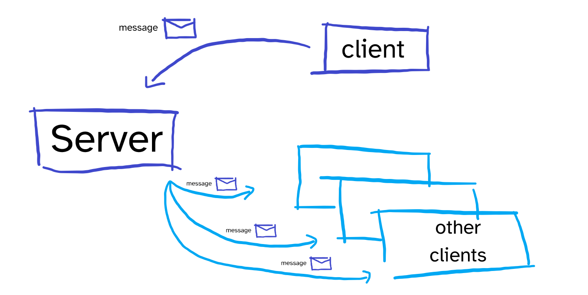
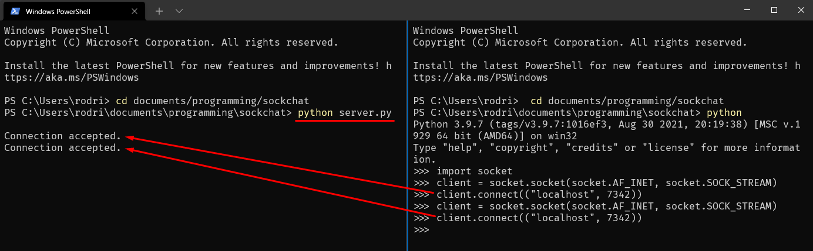
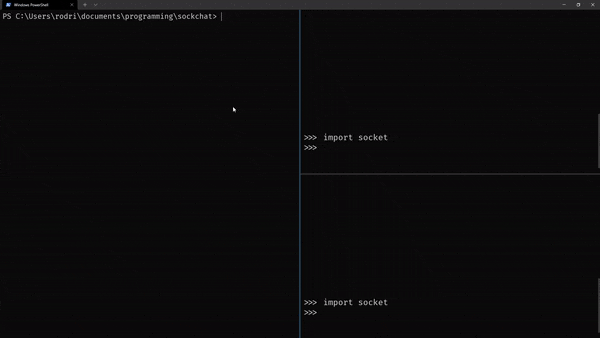
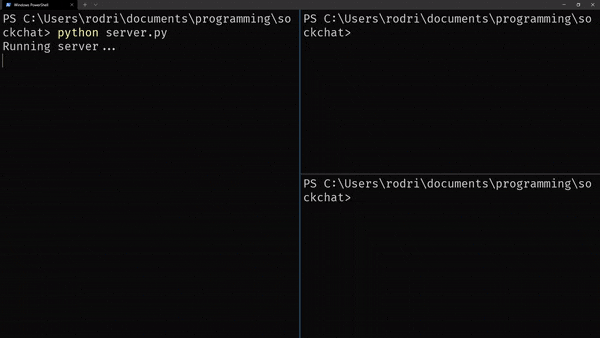
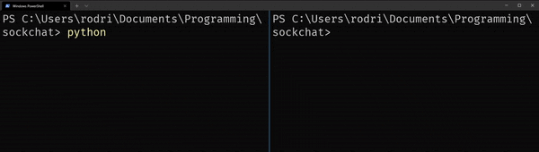
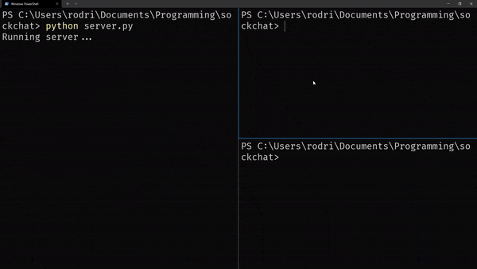
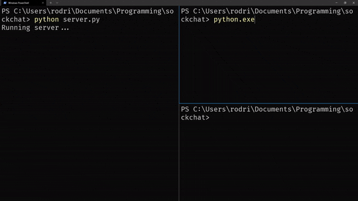

Create a simple chatroom server in Python by following along this tutorial series.

===


# Introduction

I started learning about sockets and network programming very recently,
and my knowledge is still very limited.
Because of that, I figured the best thing I could do was build _something_ that made use of my new knowledge.

I decided to build a simple chatroom server in Python,
and I will also write accompanying blog articles that will allow you to tag along
and build a simple chatroom server in Python with me.

The articles in this series are not intended to represent the best practices in the field,
nor do I claim that I am doing things in the best way possible.
I'm just exploring, trying to get things to work, and you are welcome to join me!

If you have suggestions, leave a comment below or [reach out to me directly][about]!

!!! The code lives in [this GitHub repository][sockchat-gh].


## Pre-requisites

The pre-requisites for following along this tutorial are a basic understanding of sockets,
how to use them in Python, and an intermediate knowledge of Python.

As far as the basic understanding of sockets goes,
you can get on my level by reading [this “Sockets for Dummies” article][sockets-for-dummies].
I wrote that article _while_ I was learning about sockets,
and in that article I share experiments that you can try that will help you understand sockets.

Throughout the series, I will be explaining new concepts and tools regarding socket programming.

If you find yourself struggling with something regarding the Python langauge itself,
you can always take a look at my [Pydon'ts series][pydonts].


## Roadmap

When I am preparing to build something, I always think of a high-level roadmap to follow.
Not only that, but I tend to do the plan in a very specific way:
I like to build my projects incrementally.
At every step of the way, I like to have something that I can play around with.
On the other hand, I don't like to have to write _all_ the code first,
and only then see the end result of what I created.

Before I can create the roadmap, first I have to figure out (more or less)
what the components of the project are.
For this chatroom server, we need two things:

 - a piece of code that manages the chatroom, all the messages people are sending, etc; and
 - a piece of code that allows users to connect to the chatroom, send messages, and read messages.

Because I want to use sockets for this purpose, I thought of this diagram:



This is the basic way in which I imagine the chatroom server will function:
whenever a user types a message, its client socket will send the message to the server.
The server is then responsible for taking that message and broadcasting it to all
other users/client sockets that are connected.

So, in a sense, the users never communicate directly with each other:
they always communicate with the server,
and it's the responsibility of the server to make it _look_ like the users are talking to each other.

This is the structure we want to build, so how will we build it?
Remember that the point of this is to break the project into small milestones,
each of which can be played with.

Here are a few steps I think make sense for the core functionality:

 1. create a server class that accepts multiple incoming connections;
 2. receive messages from all the clients that are connected;
 3. create a client class that connects to a server and sends messages; and
 4. enable the client to receive messages and the server to broadcast messages to other clients.

Let's complete these initial steps without worrying too much about doing everything the right way on the first try.
First, you and I will worry about getting the main functionality done, and _then_ we will polish everything we can.


# Creating the server class

The first thing we will do is create a `ChatServer` class that will represent the chatroom server.
We'll do this in a file called `server.py`, and this is the initial structure that this class will have:

```py
class ChatServer:
    def __init__(self, host, port):
        ...

    def _init_server(self):
        ...

    def run(self):
        ...
```

 - `__init__` just saves the host and port to set up the server socket later:

```py
class ChatServer:
    def __init__(self, host, port):
        """Initialise the server attributes."""
        self._host = host
        self._port = port
        self._socket = None
```

(By the way, if you are curious why I'm prefixing the attribute names with an underscore `_`,
[this section][pydont-underscores] explains it to you.)

 - `_init_server` initialises the server socket, connects to the correct address, etc:

```py
import socket


class ChatServer:
    # ...

    def _init_server(self):
        """Initialises the server socket."""
        self._socket = socket.socket(socket.AF_INET, socket.SOCK_STREAM)
        self._socket.bind((self._host, self._port))
        self._socket.listen()
```

 - and `run` runs the server, accepting incoming connections:

```py
class ChatServer:
    # ...

    def run(self):
        """Starts the server and accepts connections indefinitely."""
        self._init_server()
        while True:
            client, _ = self._socket.accept()
            print("Connection accepted.")
```

If we put this all together,
we can instantiate the class `ChatServer` and try to connect to it by hand,
to make sure it is working so far:

```py
import socket


class ChatServer:
    def __init__(self, host, port):
        """Initialise the server attributes."""
        self._host = host
        self._port = port
        self._socket = None

    def _init_server(self):
        """Initialises the server socket."""
        self._socket = socket.socket(socket.AF_INET, socket.SOCK_STREAM)
        self._socket.bind((self._host, self._port))
        self._socket.listen()

    def run(self):
        """Starts the server and accepts connections indefinitely."""
        self._init_server()
        while True:
            client, _ = self._socket.accept()
            print("Connection accepted.")


if __name__ == "__main__":
    cs = ChatServer("localhost", 7342)
    cs.run()
```

Run this script with `python server.py`.
The script should appear to hang: that's because you entered the infinite loop in the method `run`
that tries to accept connections from outside.

Go ahead and, in a separate REPL, connect to the server a couple of times by hand:

```py
>>> import socket
>>> c = socket.socket(socket.AF_INET, socket.SOCK_STREAM)
>>> c.connect(("localhost", 7342))
>>> c = socket.socket(socket.AF_INET, socket.SOCK_STREAM)
>>> c.connect(("localhost", 7342))
```

If you go back to the place where you ran the server,
you will find the message `Connection accepted.` as many times as sockets you connected by hand:



That's it, our very first step is done!

!!! This is the code at [v0.0.1 of the GitHub repository](https://github.com/mathspp/sockchat/tree/v0.0.1).


# Receiving messages from clients

Now that the server is up and running, we want clients to be able to send messages to the server.
For that to be possible, we need to figure out when each client is ready to be read from.

We can't just call the method `recv` on each client,
because that method will block if there is no message to read at the moment.
There are many ways to do this, namely:

 - using non-blocking sockets;
 - using a separate thread for each socket;
 - using the module `select` or the module `selectors`;
 - ...

My knowledge of sockets and networking is limited, so I have to stick to the tools I know,
even though I only know a little.
For that matter, I will be using the module `selectors`,
about which I wrote a bit in [this short article][selectors-til].

If you want to deal with the blocking nature of the `recv` calls, you are welcome to do so.
I'll be sticking with this one.


## Using `selectors` to manage multiple sockets

The rationale behind the module `selectors` is simple.
You take all sockets that you care about, and you put them in a bag.
Then, the module `selectors` gives you a method that you can call, called `select`.
When you call the method `select`,
you get back a list of all the sockets that are ready to be read from (or written to).

Sounds simple, right?
It's because it is!
Or, at least, as simple as it gets.

When you take a socket and put it inside that “bag” that I talked about,
you are actually registering the socket.
To create a “bag”, you instantiate the appropriate type of “bag” you want.
We are going to use the default one,
which lets the module pick the most efficient implementation for each platform.

We are going to “create a bag” in the method `__init__` of the server:

```py
import selectors


class ChatServer:
    def __init__(self, host, port):
        """Initialise the server attributes."""
        self._host = host
        self._port = port
        self._socket = None
        self._read_selector = selectors.DefaultSelector()  # < create a "bag"
```

Then, we need to put the server socket inside that bag.
For that, we use the method `register`.
We also need to specify what kind of things we want to be able to do with that socket.
For the server socket, we only need to accept incoming connections,
which is a “read event”:

```py
class ChatServer:
    # ...

    def _init_server(self):
        """Initialises the server socket."""
        self._socket = socket.socket(socket.AF_INET, socket.SOCK_STREAM)
        self._socket.bind((self._host, self._port))
        self._socket.listen()
        # Put the socket in the selector "bag":
        self._read_selector.register(self._socket, selectors.EVENT_READ)
        # Specify we care about "read events" - - - - - - - -^^^^^^^^^^
```

Now that the socket is in the correct place, we can change our main loop inside `run`,
because we no longer want to accept calls explicitly there.
Instead, we want to use the attribute `self._read_selector` to figure out when
the server socket is ready to be read from.
But why go through all this trouble..?

We do this because, as soon as we accept the first connection,
we have multiple sockets we need to be able to read from!
By making use of the `self._read_selector`,
we can register the client sockets as well,
and only read from them when needed.

In order to do all of this, we start by creating two function stubs:

```py
class ChatServer:
    # ...

    def _accept_connection(self, sock):
        ...

    def _receive_message(self, sock):
        ...
```

What are these functions for?

 - `_accept_connection` will be called when the server is ready to accept a new connection; and
 - `_receive_message` will be called when we are ready to receive a message from the client.

Thankfully, the module `selectors` (through the `self._read_selector` object we have)
makes it incredibly easy to call these functions when the appropriate sockets are ready!
As it turns out, when we call `self._read_selector.register`, we can pass it a third argument:
an arbitrary object with whatever data we care about.
Later on, when the selector says that a socket is ready,
it will also give us access to that data argument we passed in when we registered the socket.

Hence, here is how we really should register the server socket:

```py
class ChatServer:
    # ...

    def _accept_connection(self, sock):
        ...

    def _init_server(self):
        """Initialises the server socket."""

        self._socket = socket.socket(socket.AF_INET, socket.SOCK_STREAM)
        self._socket.bind((self._host, self._port))
        self._socket.listen()
        # Put the socket in the selector "bag":
        self._read_selector.register(
            self._socket,
            selectors.EVENT_READ,  # We care about read events.
            self._accept_connection,
            # ^ the function we want to call when the socket is ready to be read from.
        )
```

Now, what is left is replacing the loop in the function `run` to work with the selector.

First, we call the method `self._read_selector.select()` to ask for a list of all the sockets
that can be read from.
This gives a list of pairs `(key, mask)`:

 - `key` contains information about the socket we registered and the data we associated with the socket; and
 - `mask` tells us which event is ready for the given socket.

Because we will only care about read events, we can safely ignore the second value.

Here is the new implementation of `run`:

```py
class ChatServer:
    # ...

    def run(self):
        """Starts the server and accepts connections indefinitely."""

        self._init_server()
        print("Running server...")
        while True:
            for key, _ in self._read_selector.select():
                sock, callback = key.fileobj, key.data
                callback(sock)
```

We use a `for` loop to iterate over the pairs returned by the method call `self._read_selector.select`,
but we only care about the objects `key`.
Then, we get the socket and the callback function from the object `key`,
and then call the callback function with the socket.

In the beginning, the only socket registered is the server socket,
and its callback function is the method `_accept_connection`.
So, when that function is called, what should we do?

`_accept_connection` gets called when the selector determines that the server socket is ready to accept a new connection.
When that happens, we must accept that connection, and add the client socket to the selector:
after all, we will want to receive messages from that client as well.
Then, _when_ we register the client, we give it a callback as well,
which is the method `_receive_message`.

All in all, `_accept_connection` ends up looking like this:

```py
class ChatServer:
    # ...

    def _accept_connection(self, sock):
        """Callback function for when the server is ready to accept a connection."""
        client, _ = sock.accept()
        print("Registering client...")
        self._read_selector.register(client, selectors.EVENT_READ, self._receive_message)
```

It's _just_ that!
With this code, we accept new connections and register new clients to be read when needed.
We already register the clients together with the appropriate callback,
now we just need to implement the behaviour of that callback!
For now, when a client sends a message, let's just print it on the server side:

```py
class ChatServer:
    # ...

    def _receive_message(self, sock):
        """Callback function for when a client socket is ready to receive."""
        msg = sock.recv(1024)
        print(msg.decode("utf8"))
```

We are also assuming that messages are short (up to 1024 bytes in length)
and that the call to `recv` returns _all_ the message data.
(Later on,
we'll need to implement [a more robust mechanism to receive messages][sockets-for-dummies-send-receive-protocol].)

With our utopian assumptions in place, let's run the server with `python server.py`.
The code should hang but it shouldn't print anything.
Then, try creating different client sockets and sending messages to the server with the code

```py
import socket

client = socket.socket(socket.AF_INET, socket.SOCK_STREAM)
client.connect(("localhost", 7342))
client.send(b"Hello, world!")
```

Here is a short GIF showing the server printing the different incoming messages:



At this point, we have already finished two of the four bullet points of our roadmap!
How cool is that?

!!! This is the code at [v0.0.2 of the GitHub repository](https://github.com/mathspp/sockchat/tree/v0.0.2).


# Creating a client class to connect and send messages

Now that the server seems to be running decently enough,
we will create a class to represent the clients that connect to the chat server.
The rationale is that people connecting to your chatroom only need the client code,
while the server code can be ran by you or hosted somewhere.

This first iteration of the server client will be **very** basic:
it just needs to connect to the server and start a loop that asks for user input
and then sends the messages to the user.
We'll do this in a file called `client.py`.

In order to implement this behaviour,
we can get away with this structure:

```py
# client.py

class ChatClient:
    def __init__(self, host, port):
        ...

    def connect(self):
        ...
```

The method `__init__` will be very similar to the `ChatServer` one,
we just need to save the host and port data for later,
as well as create the socket that will be used:

```py
import socket


class ChatClient:
    def __init__(self, host, port):
        self._host = host
        self._port = port
        self._socket = socket.socket(socket.AF_INET, socket.SOCK_STREAM)
```

Now that the socket has been instantiated,
we can connect to the server and start a loop asking for input:

```py
class ChatClient:
    # ...

    def connect(self):
        self._socket.connect((self._host, self._port))
        while True:
            msg = input(">>> ")
            self._socket.send(msg.encode("utf8"))
```

This is enough to connect (multiple) clients to the server.
Let's just add a tiny piece of code at the end of the script,
so that directly running the script connects the client to a default server:

```py
import socket


class ChatClient:
    # ...


if __name__ == "__main__":
    client = ChatClient("localhost", 7342)
    client.connect()
```

That's it!
This should be enough to connect a couple of clients to the same server
and send messages from the clients to the server.
Here is a demonstration of just that:



This step was a short one, and that's how I like my projects to evolve:
small steps from one milestone to another,
letting me play with what I'm building at every step of the way.

!!! This is the code at [v0.0.3 of the GitHub repository](https://github.com/mathspp/sockchat/tree/v0.0.3).


# Broadcasting messages to other clients

The fourth and final milestone is upon us!
We need to enable actual communication between the several clients,
given that, right now, only the server receives all messages.

In short,
we will write a mechanism that allows clients to receive the messages that other clients sent.
So...
How do we do that?

First things first!
When the server receives a message, it should send it to all other sockets,
instead of just printing it.
Therefore, we will need to modify the method `_receive_message` of `ChatServer`:

```py
class ChatServer:
    # ...

    def _receive_message(self, sock):
        """Callback function for when a client socket is ready to receive."""
        msg = sock.recv(1024)
        print(msg.decode("utf8"))
```

We need to add some logic that takes the message in `msg` and sends it to the other sockets.
Right now,
we have a selector (`self._read_selectors`) that tells us from which sockets we can read.
What we can do is create a selector that holds the sockets we want to write to!
Those would be _all_ the sockets, except for the server socket itself.

Thus, we start by modifying the method `__init__` of the class `ChatServer`:

```py
class ChatServer:
    def __init__(self, host, port):
        """Initialise the server attributes."""
        self._host = host
        self._port = port
        self._socket = None
        self._read_selector = selectors.DefaultSelector()
        self._write_selector = selectors.DefaultSelector()  # <- new
```

After creating this selector that will hold all the sockets we can write to,
and will want to write to, we need to populate it.
Whenever we accept a new connection (in `_accept_connection`),
we need to register the client socket in the write selector:

```py
class ChatServer:
    # ...

    def _accept_connection(self, sock):
        """Callback function for when the server is ready to accept a connection."""
        client, _ = sock.accept()
        print("Registering client...")
        self._read_selector.register(client, selectors.EVENT_READ, self._receive_message)
        self._write_selector.register(client, selectors.EVENT_WRITE)  # <- new
```

This time, we don't need the third argument because we won't be needing a callback.
Again, the purpose of this `self._write_selector` object is to act as a bag that holds
all the client sockets together.
That's just it.

So, now that we have all the client sockets in a bag,
the server can go through those and broadcast the messages it receives:

```py
class ChatServer:
    # ...

    def _receive_message(self, sock):
        """Callback function for when a client socket is ready to receive."""
        msg = sock.recv(1024)
        print(msg.decode("utf8"))
        for key, _ in self._write_selector.select(0):
            sock = key.fileobj
            sock.send(msg)
```

We used the method `select` to ask for the sockets that are ready to be written to,
and the argument `0` is the timeout:
a timeout of `0` means that we only get the sockets to which we can write the new message _right now_.

For some reason I am yet to uncover, in ideal conditions,
we can expect the call to `select(0)` to return _all_ the client sockets:

 > “Actually, any reasonably healthy socket will return as writable [...]”
 > ― [Socket Programming HOWTO][sockets-howto]

Now, after we _send_ the message to all the clients,
we actually need to tell the clients to _receive_ the messages.
This is when it gets interesting.

On the client side, we have an infinite loop that asks for user input.
At the same time, we need to periodically check if the server sent us any messages...
So, how do we do that?

We could check if there are messages to be received after every time the user types a message...
But that won't work very well!
For that to work, the users would have to be typing their messages alternately,
and we know that's not how messaging works:
often, a single person will send multiple messages in a row;
or one of the participants in the conversation may just be reading,
and not actively participating.

Just to be clear, the main difficulty is that we have to _ask_ for user input,
typically by calling the function `input`.
But when we call the function `input`,
the program halts and waits for the user to type something.
However, _while_ that happens, we need to keep checking if there are new messages!

In order to do this, we will use threads:
the client class will create a separate thread whose only job is to receive the new messages.
This is one of the right tools for the job,
as you can see at the [top of the `threading` docs][threading-docs]:

 > “However, threading is [...] an appropriate model if you want to run multiple I/O-bound tasks simultaneously.”

The two things we want to do “simultaneously” are exactly I/O-bound tasks:

 - wait for _user input_; and
 - wait to _receive a message_ from the server.

So, how do we do this with threading?
One way to use the module `threading` is by creating the function we want to run on the separate thread –
imagine it's called `f` –
and then do

```py
import threading

threading.Thread(target=f).start()
```

Another possibility would be to create a subclass of `threading.Thread`.
Let's start with the single function, and we'll see if we need to evolve from there.

Let's make it so that waiting for user input is what happens in the separate thread,
so let's write a function that:

 - asks for user input; and
 - sends it to the server.

This is more or less what we have in the method `ChatClient.connect`:

```py
class ChatClient:
    # ...

    def _input_and_send_loop(self):
        while True:
            msg = input(">>> ")
            self._socket.send(msg.encode("utf8"))

    def connect(self):
        self._socket.connect((self._host, self._port))
        while True:
            pass
```

We just have to tie the method `_input_and_send_loop` together with the `while` loop in `connect`.
How?

Let's take a step back:

 - we need the client to receive messages from the server; and
 - we need the client to always be ready to receive input from the user.

So, when we call the method `connect`,
we need to use a thread to start the infinite loop of the method `_input_and_send_loop`.
Then, we start the infinite loop of the method `connect`,
where we should check continuously for messages to receive.

We may be tempted to write something like this:

```py
import threading
import socket


class ChatClient:
    # ...

    def connect(self):
        self._socket.connect((self._host, self._port))
        threading.Thread(target=self._input_and_send_loop)
        while True:
            msg = self._socket.recv(1024).decode("utf8")
            print(msg)
```

However, this doesn't work.
Why not?
I took, maybe, half an hour to find my mistake!
I never started the thread 🤣.

So, the fix is simple:

```py
import threading
import socket


class ChatClient:
    # ...

    def connect(self):
        self._socket.connect((self._host, self._port))
        threading.Thread(target=self._input_and_send_loop).start()
        # START THE THREAD -------------------------------^^^^^^^^
        while True:
            msg = self._socket.recv(1024).decode("utf8")
            print(msg)
```

At this point, we can already use our chat server, but it has some severe limitations, namely:

 - when a client sends a message, the same client gets that message back; and
 - when a client receives a message, it messes up the input prompt.

Here is a demo that shows both these issues,
that show up even when only one client is connected:



Let's focus on fixing these two issues.


## Echoing back to the same client

The first thing we will do is fix the issue where a client receives its own messages back.

In order to do that, we need to take a look at the server code that receives a message
and broadcasts it to others:

```py
class ChatServer:
    # ...

    def _receive_message(self, sock):
        """Callback function for when a client socket is ready to receive."""
        msg = sock.recv(1024)
        print(msg.decode("utf8"))
        for key, _ in self._write_selector.select(0):
            sock = key.fileobj
            sock.send(msg)
```

By looking at the `for` loop,
it should be clear why each client also receives its own messages back:
the loop goes over the sockets in the selector to broadcast the received message to them.
However, it doesn't do any checks to see if _that_ was the socket the message originally came from.

We can add an `if` statement to fix this:

```py
class ChatServer:
    # ...

    def _receive_message(self, sock):
        """Callback function for when a client socket is ready to receive."""
        msg = sock.recv(1024)
        print(msg.decode("utf8"))
        for key, _ in self._write_selector.select(0):
            if key.fileobj is not sock:
                key.fileobj.send(msg)
```

Now, we only send the message to the `key.fileobj` _if_ it _is not_ the socket from where it came from.

Having fixed this also means that the issue with the prompt now only occurs when there are two or more clients
connected to the same server:



Obviously, we want to fix this.


## Issues with the prompt

There are many ways in which we can fix this,
some will make for a better-looking interface than others.

The simplest fix I can come up with is getting rid of the input prompt altogether,
and then adding a simple marker to the left of the messages we receive.
Something like this:

```py
class ChatClient:
    # ...

    def _input_and_send_loop(self):
        while True:
            msg = input()  # <- no argument
            self._socket.send(msg.encode("utf8"))

    def connect(self):
        self._socket.connect((self._host, self._port))
        threading.Thread(target=self._input_and_send_loop).start()
        while True:
            msg = self._socket.recv(1024).decode("utf8")
            print(" < " + msg)  # <- added a prefix
```

With these two changes, the interactions become a bit cleaner:



That's it, the second major issue has been fixed!

!!! This is the code at [v0.0.4 of the GitHub repository](https://github.com/mathspp/sockchat/tree/v0.0.4).


# Follow-up challenges

We have finished the implementation of a _very basic_ chatroom server.
However, we cut a fair amount of corners:

 - the clients/servers always assume messages up to 1024 bytes;
 - the code assumes that sockets can send everything in one call to `send`, always;
 - the code assumes that sockets can receive everything in one call to `recv`, always; and
 - there is no way for the clients to disconnect from the server.

Then, there is a lot of functionality that we could add, and probably should:

 - each client connects with a user name;
 - the user names are used to identify who sends what messages;
 - set a limit to the maximum number of users that can be connected to a given server, at the same time;
 - turn the scripts `server.py` and `client.py` into CLIs,
 instead of hardcoding the host and port in the code after the statement `if __name__ == "__main__":`;
 - enable users to send multi-line messages;
 - ...

These were just some ideas I already thought of.
I'll work on them and publish a follow-up article with those changes.
Meanwhile, I challenge _you_ to take the code we wrote in this tutorial,
and try implementing the improvements I mentioned.
It's going to be a great way to solidify your knowledge.
The code lives in [this repository][sockchat-gh] and, in particular,
the tutorial went up to [this point](https://github.com/mathspp/sockchat/tree/v0.0.4).


[about]: /about
[sockets-for-dummies]: /blog/sockets-for-dummies
[sockets-for-dummies-send-receive-protocol]: /blog/sockets-for-dummies#protocol-to-send-receive-messages
[pydonts]: /blog/pydonts
[sockchat-gh]: https://github.com/mathspp/sockchat
[selectors-til]: /blog/til/022
[pydont-underscores]: /blog/pydonts/usages-of-underscore#single-underscore-as-prefix
[sockets-howto]: https://docs.python.org/3/howto/sockets.html
[threading-docs]: https://docs.python.org/3/library/threading.html
